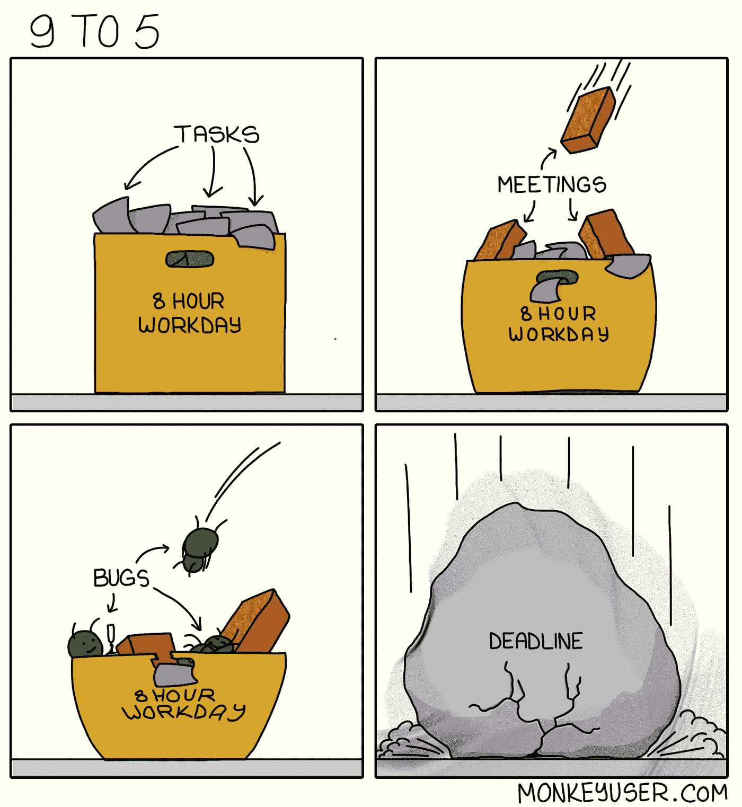
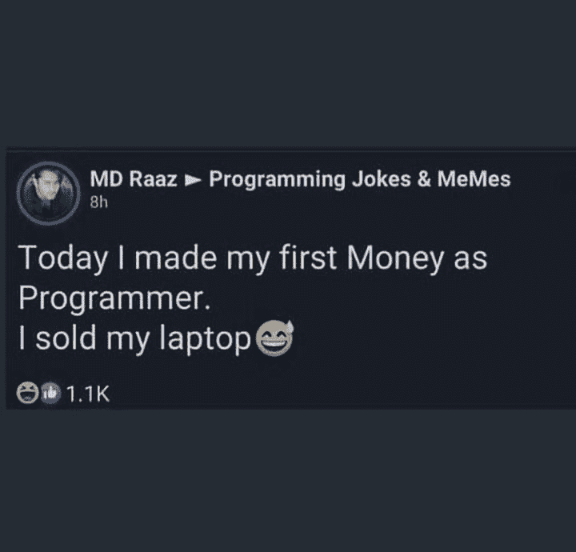
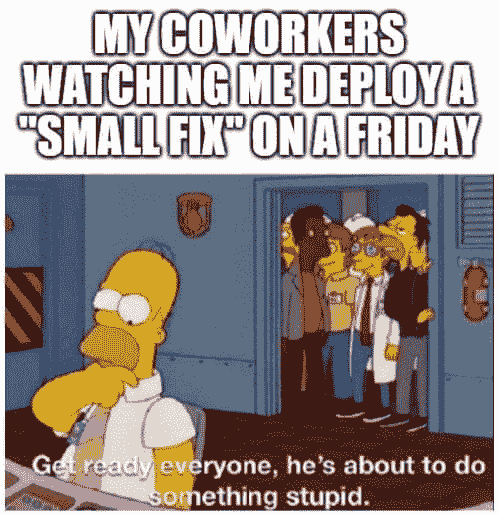

# 程序员能理解的笑话…

> 原文：<https://javascript.plainenglish.io/jokes-programmer-can-relate-to-99d690116ae1?source=collection_archive---------0----------------------->

## 最佳编程笑话汇编

Photo by [Brooke Cagle](https://unsplash.com/@brookecagle?utm_source=medium&utm_medium=referral) on [Unsplash](https://unsplash.com?utm_source=medium&utm_medium=referral)

***模因和快乐有什么联系吗？*** 如果你是我这种类型的人，那么你可能也爱在下班后查看手机。猜猜我在那里看到了什么？

我主要是在互联网上看到**视频、抖音和模因**。我不知道为什么，但这有助于我提神醒脑，减轻工作压力。这就是为什么我相信*笑是人类最好的刷新按钮。*

在这篇文章中，我收集了一些我喜欢的网络迷因。

# 你的愿望是什么？无 Bug 代码？抱歉 404:未找到

[https://www.facebook.com/techindustan/](https://www.facebook.com/techindustan/)

# 值得感谢你的隐藏，因为花了两天时间才找到你…

Picture Credit: [https://www.reddit.com/r/ProgrammerHumor/](https://www.reddit.com/r/ProgrammerHumor/)

# 自由职业者的生活…

Picture Credit: [https://www.reddit.com/r/ProgrammerHumor/](https://www.reddit.com/r/ProgrammerHumor/)

# 变更、修复或错误修复…仍然需要有意义的消息..呃…

Picture Credit: [https://www.reddit.com/r/ProgrammerHumor/](https://www.reddit.com/r/ProgrammerHumor/)

# 圣诞礼物…

Picture Credit: [https://www.reddit.com/r/ProgrammerHumor/](https://www.reddit.com/r/ProgrammerHumor/)

# 很难填满一个已经满了的杯子…

Picture Credit: [https://www.reddit.com/r/ProgrammerHumor/](https://www.reddit.com/r/ProgrammerHumor/)

# 浏览量每天都在增加，是的，人们好奇的看着，怎么会有人这么做呢？英雄联盟

[https://www.facebook.com/ProgrammersCreateLife/](https://www.facebook.com/ProgrammersCreateLife/)

# 这种情况经常发生…风扇会启动，声音会出现…

[https://www.quora.com/What-are-some-of-the-best-programmer-jokes-and-memes-out-there](https://www.quora.com/What-are-some-of-the-best-programmer-jokes-and-memes-out-there)

# 当教授理解了我们的工作…

[https://programmerhumor.io/](https://programmerhumor.io/)

# 每次我开始打字…

[https://programmerhumor.io/](https://programmerhumor.io/)

# 我生命中的每一天…

[https://programmerhumor.io/](https://programmerhumor.io/)

# 当你有很多东西在桶里的时候，没有时间工作…

Source:[https://www.monkeyuser.com/](https://www.monkeyuser.com/)

# 暴风雨前的寂静…

Source:[https://programmerhumor.io/](https://programmerhumor.io/)

# 当初级开发给出评估时…项目经理也有同样的感觉…

[https://www.facebook.com/javascriptJS/photos/1559356324201966](https://www.facebook.com/javascriptJS/photos/1559356324201966)

# 它将永远持续下去。

[https://programmerhumor.io/](https://programmerhumor.io/)

# 额外内容

# 我不需要你…让我放下你，伙计…

[https://www.reddit.com/r/ProgrammerHumor/comments/oo16aa/im_sorry_dear_data/](https://www.reddit.com/r/ProgrammerHumor/comments/oo16aa/im_sorry_dear_data/)

# 不要教我写了什么…哈哈

[https://www.reddit.com/r/ProgrammerHumor/comments/oo4ttu/perplexed_obama/](https://www.reddit.com/r/ProgrammerHumor/comments/oo4ttu/perplexed_obama/)

# 需要经历几个阶段？

[https://www.monkeyuser.com/2017/code-review-stages/?sc=true&dir=random](https://www.monkeyuser.com/2017/code-review-stages/?sc=true&dir=random)

# 希望我的周期到达那里…但是如何？

[https://www.monkeyuser.com/2017/testing-vs-prod-env/?sc=true&dir=random](https://www.monkeyuser.com/2017/testing-vs-prod-env/?sc=true&dir=random)

# 我靠编程挣钱…

[https://www.facebook.com/photo/?fbid=349251050087280&set=gm.1262598024177843](https://www.facebook.com/photo/?fbid=349251050087280&set=gm.1262598024177843)

# 一切皆有可能…

[https://www.facebook.com/techwithcodex/photos/a.137007467972178/331986501807606/](https://www.facebook.com/techwithcodex/photos/a.137007467972178/331986501807606/)

# 不要和我有眼神接触..我是最棒的…哈哈

[https://twitter.com/MayaShavin/status/1414659230833971205/photo/1](https://twitter.com/MayaShavin/status/1414659230833971205/photo/1)

# 没有布尔怎么有主见？

[https://twitter.com/realColinMac/status/1375360353442295811/photo/1](https://twitter.com/realColinMac/status/1375360353442295811/photo/1)

# 同辈压力？他会让我们的周末变得很糟糕…

[https://imgur.com/t/funny/Mk5F6E1](https://imgur.com/t/funny/Mk5F6E1)

# 希望你笑得很开心…

## 更多内容请访问 [PlainEnglish.io](https://plainenglish.io/) 。

*报名参加我们的* [***免费每周简讯***](http://newsletter.plainenglish.io/) *。关注我们关于* [***推特***](https://twitter.com/inPlainEngHQ) ， [***领英***](https://www.linkedin.com/company/inplainenglish/) ***，***[***YouTube***](https://www.youtube.com/channel/UCtipWUghju290NWcn8jhyAw)***，以及****[***不和***](https://discord.gg/GtDtUAvyhW) *

## *想扩大你的软件创业规模吗？检查[电路](https://circuit.ooo/?utm=publication-post-cta)。*