# 每个开发人员都能理解的笑话

> 原文：<https://javascript.plainenglish.io/jokes-that-every-developer-can-relate-to-3875fcc74d20?source=collection_archive---------1----------------------->

## 最佳编程笑话汇编 2022。

Photo by [Markus Winkler](https://unsplash.com/@markuswinkler?utm_source=medium&utm_medium=referral) on [Unsplash](https://unsplash.com?utm_source=medium&utm_medium=referral)

***模因和快乐有什么联系吗？*** 如果你是我这种类型的人，那么你可能也爱在下班后查看手机。猜猜我在那里看到了什么？

我主要是在互联网上看到**视频、抖音和模因**。我不知道为什么，但这有助于我提神醒脑，减轻工作压力。这就是为什么我相信*笑是人类最好的刷新按钮。*

在这篇文章中，我收集了一些我喜欢的网络迷因。

# 什么是调试？

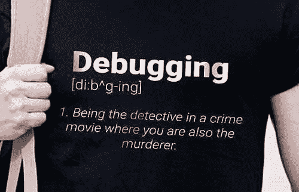

Picture Credit: [https://programmerhumor.io/](https://programmerhumor.io/)

# 当你编码后准备离开，但…

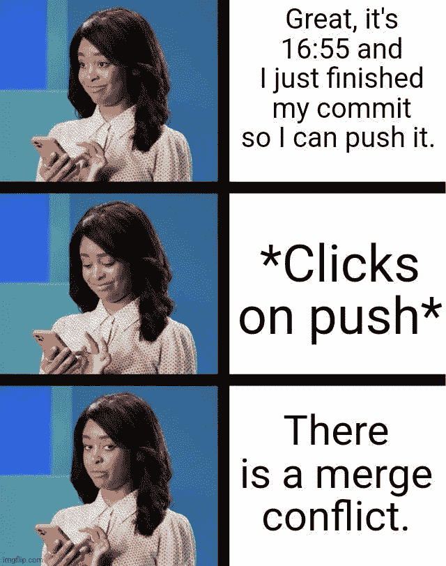

Picture Credit:[https://www.reddit.com/r/ProgrammerHumor/](https://www.reddit.com/r/ProgrammerHumor/)

# 是的，真实的事实。我们不知道。

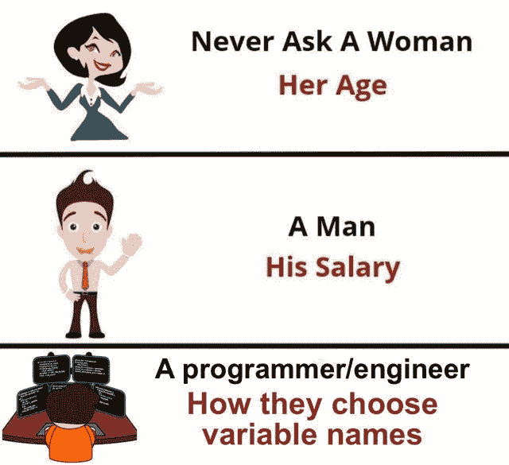

Picture Credit:[https://www.reddit.com/r/ProgrammerHumor/](https://www.reddit.com/r/ProgrammerHumor/)

# 当领导将前端任务交给后端开发人员时…

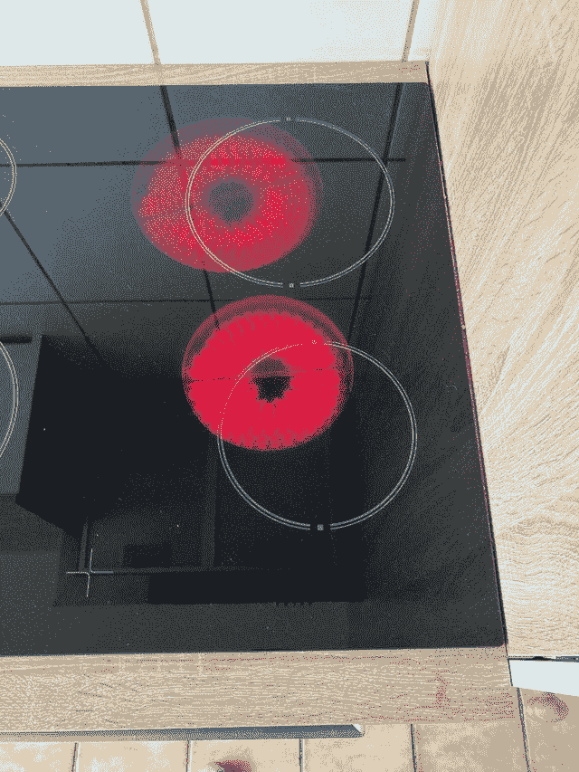

Picture Credit:[https://www.reddit.com/r/ProgrammerHumor/](https://www.reddit.com/r/ProgrammerHumor/)

# 25 岁有 10 年经验要求的时候。我一出生就开始编码…

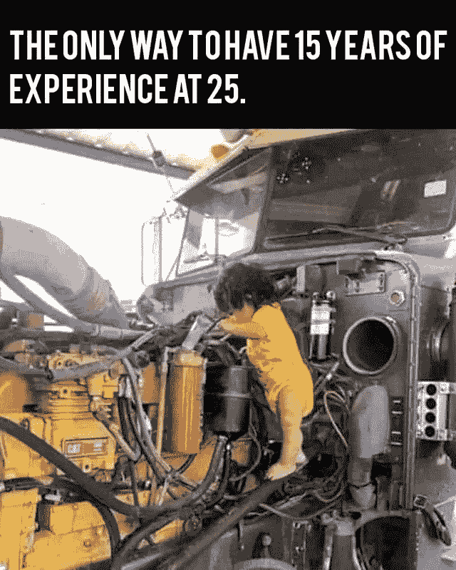

Picture Credit:[https://www.reddit.com/r/ProgrammerHumor/](https://www.reddit.com/r/ProgrammerHumor/)

# 有时候洗手间能激发出最好的想法。有人同意吗？

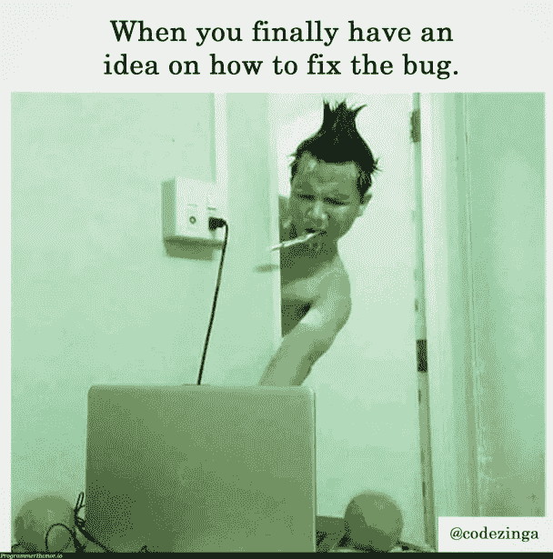

Picture Credit: [https://programmerhumor.io/](https://programmerhumor.io/)

# GIT 支持评论就像…不能修复就忽略…

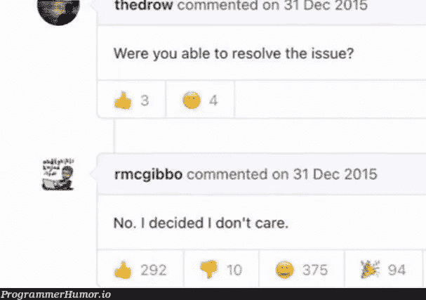

Picture Credit: [https://programmerhumor.io/](https://programmerhumor.io/)

# 在火灾的情况下，第一步是提交更改，但等待 git add 在哪里？

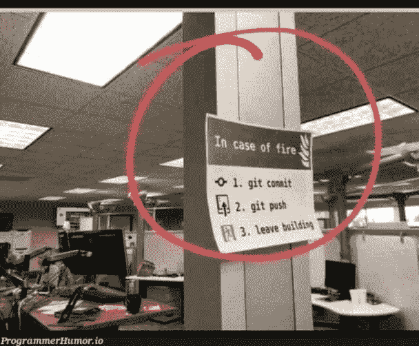

Picture Credit: [https://programmerhumor.io/](https://programmerhumor.io/)

# 我即将入睡时的想法:等等，你错过了什么。

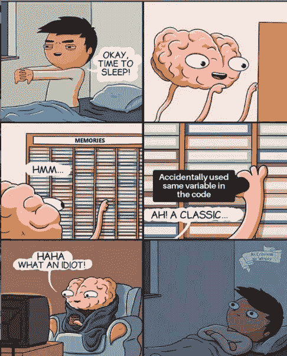

Picture Credit: [https://programmerhumor.io/](https://programmerhumor.io/)

# 当重构每次都被延迟时…

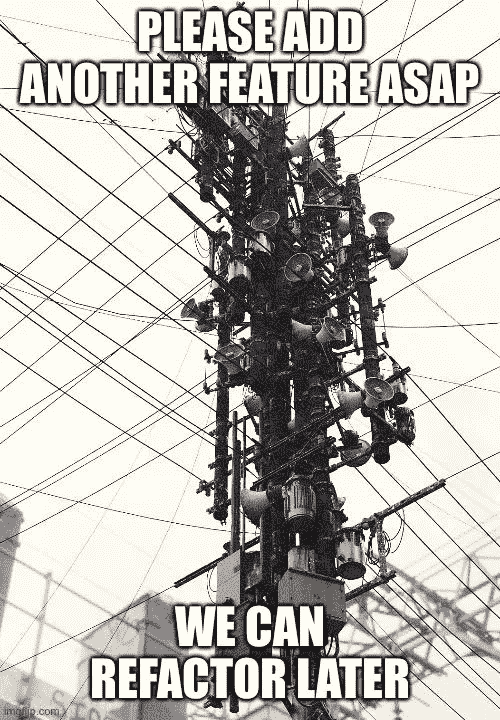

Picture Credit: [https://programmerhumor.io/](https://programmerhumor.io/)

# 当建筑师画出板子来解释特征时…

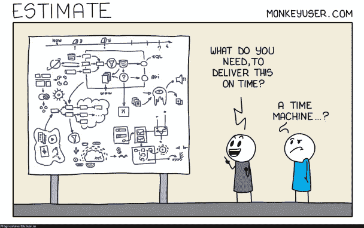

Picture Credit: monkeyuser.com

# 我做了什么？肯定有些变化…

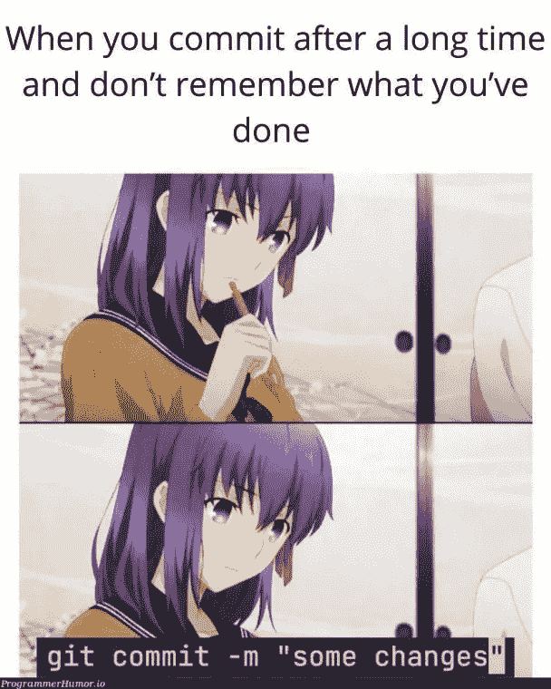

Picture Credit: [https://programmerhumor.io/](https://programmerhumor.io/)

# 大部分时间是晴天和多云，这也是我所知道的…

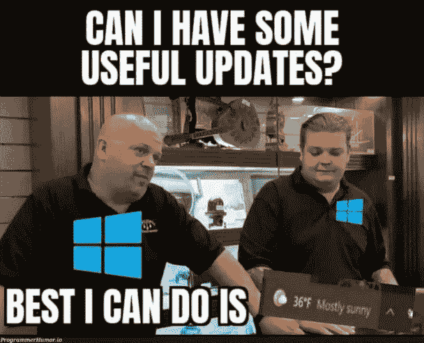

Picture Credit: [https://programmerhumor.io/](https://programmerhumor.io/)

# 更多笑话…

# 一系列按钮？奇怪…谁错过了测试或者谁错过了单元测试？

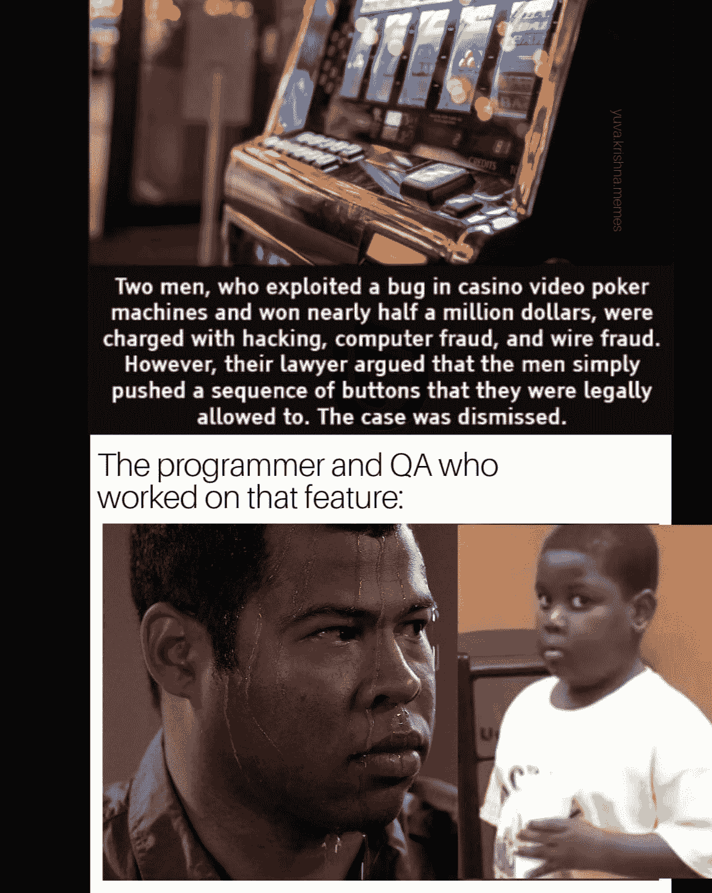

[https://www.facebook.com/yuva.krishna.memes/photos/a.105527467815845/398780625157193/](https://www.facebook.com/yuva.krishna.memes/photos/a.105527467815845/398780625157193/)

**来源:**[https://www.facebook.com/yuva.krishna.memes/](https://www.facebook.com/yuva.krishna.memes/photos/a.105527467815845/398780625157193/)

# 实际上，在改变搜索词 10-15 次之后，我应该使用哪个关键字来获得答案？

[https://www.facebook.com/yuva.krishna.memes/photos/a.105527467815845/398418748526714/](https://www.facebook.com/yuva.krishna.memes/photos/a.105527467815845/398418748526714/)

**来源:**[https://www.facebook.com/yuva.krishna.memes/](https://www.facebook.com/yuva.krishna.memes/photos/a.105527467815845/398418748526714/)

# 让我来帮助你们:为什么你们会有冲突？你不知道感受…(开发和质量保证)

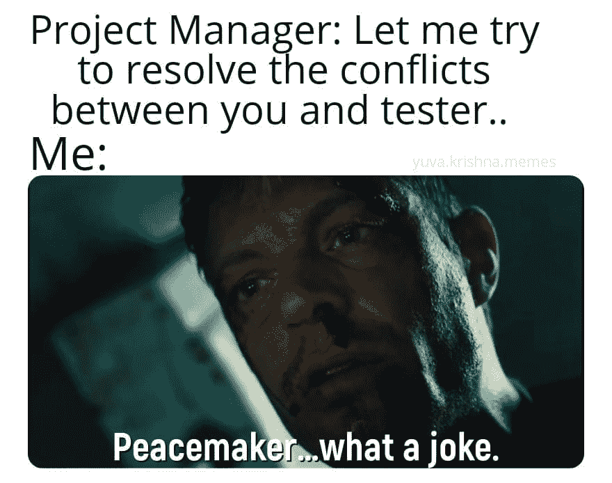

[https://www.facebook.com/yuva.krishna.memes/photos/a.105527467815845/398089741892948/](https://www.facebook.com/yuva.krishna.memes/photos/a.105527467815845/398089741892948/)

**来源:**[https://www.facebook.com/yuva.krishna.memes/](https://www.facebook.com/yuva.krishna.memes/photos/a.105527467815845/398418748526714/)

# 资深 dev 说重写逻辑也是这种感觉…

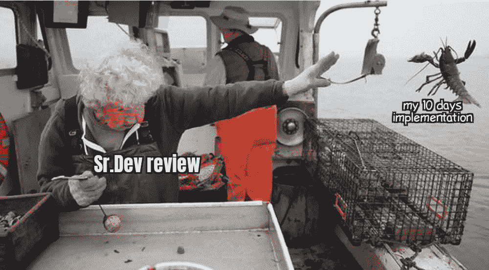

[https://www.facebook.com/yuva.krishna.memes/photos/a.105527467815845/398088485226407/](https://www.facebook.com/yuva.krishna.memes/photos/a.105527467815845/398088485226407/)

**来源:**[https://www.facebook.com/yuva.krishna.memes/](https://www.facebook.com/yuva.krishna.memes/photos/a.105527467815845/398418748526714/)

# 回忆…

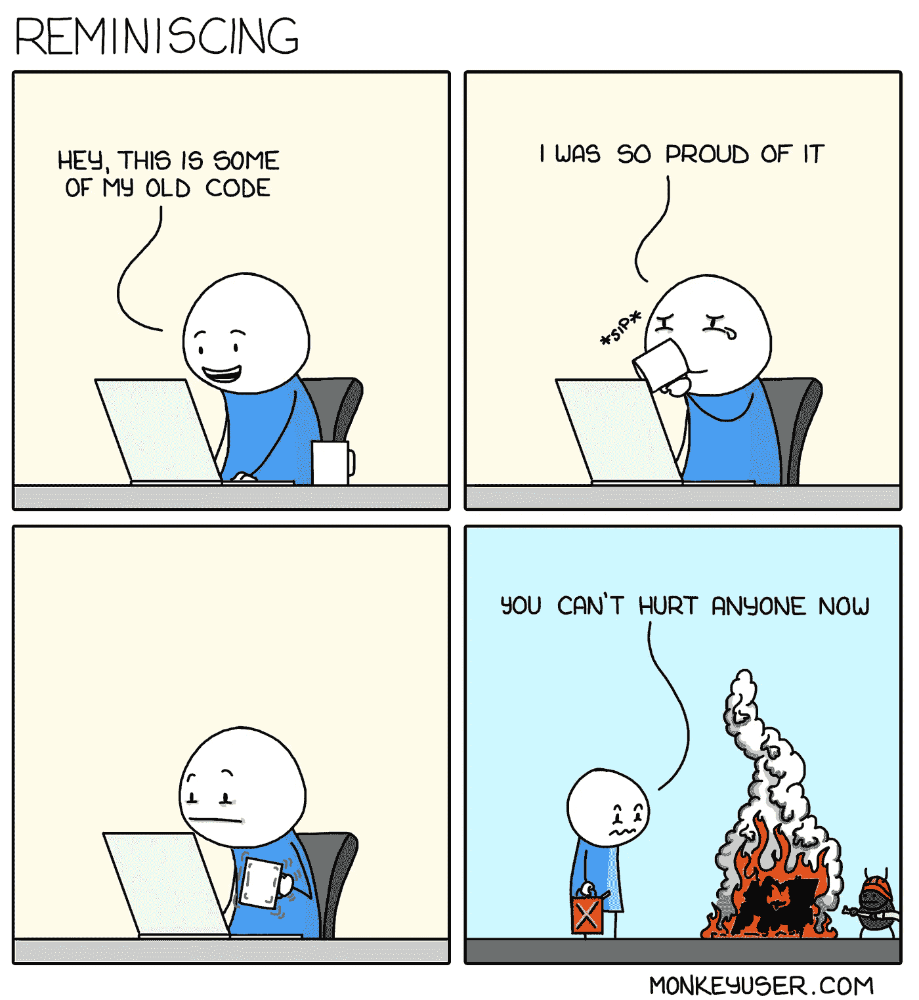

[https://www.monkeyuser.com/](https://www.monkeyuser.com/)

来源:[https://www.monkeyuser.com/](https://www.monkeyuser.com/)

# 是时候尝试一个新的库了…但是等等…

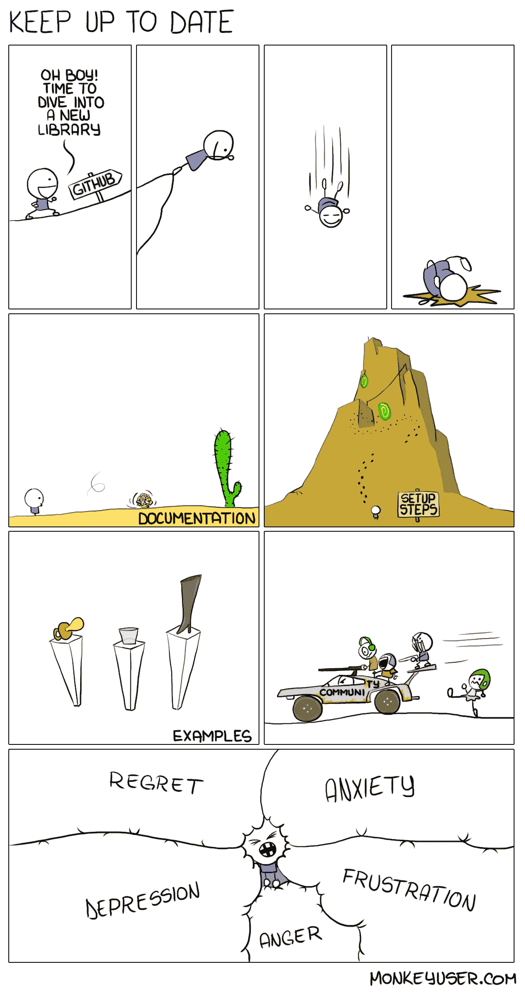

[https://www.monkeyuser.com/](https://www.monkeyuser.com/)

来源:https://www.monkeyuser.com/

# 我也会紧张…当有人站在我背后…

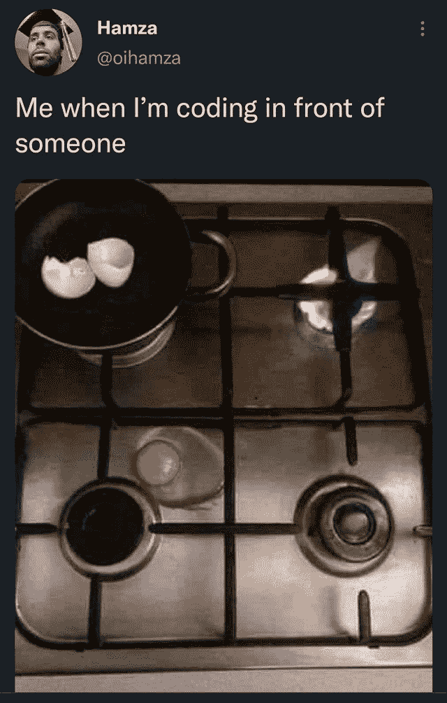

[https://www.reddit.com/r/ProgrammerHumor/comments/p9ucw8/backspacing_furiously/](https://www.reddit.com/r/ProgrammerHumor/comments/p9ucw8/backspacing_furiously/)

【https://www.reddit.com/r/ProgrammerHumor/】来源:

# 不同的语言看到对方…像这样…

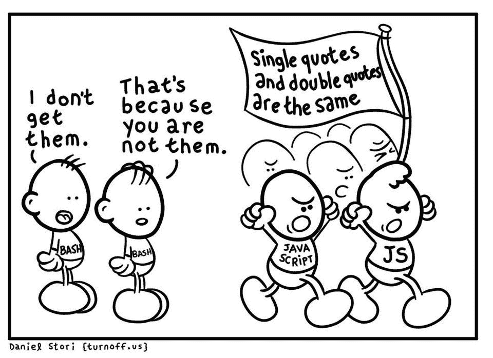

[https://www.reddit.com/r/ProgrammerHumor/comments/p9sx26/perspective/](https://www.reddit.com/r/ProgrammerHumor/comments/p9sx26/perspective/)

**来源:**[https://www.reddit.com/r/ProgrammerHumor/](https://www.reddit.com/r/ProgrammerHumor/comments/p9ucw8/backspacing_furiously/)

# 你在通过 QA 之前进行单元测试了吗？

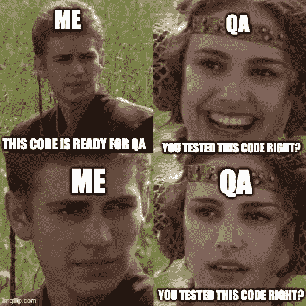

[https://programmerhumor.io/programming-memes/developers-not-testing-code-2/](https://programmerhumor.io/programming-memes/developers-not-testing-code-2/)

**来源:**[https://programmerhumor.io/programming-memes/](https://programmerhumor.io/programming-memes/developers-not-testing-code-2/)

# 感谢您的阅读，祝您度过愉快的一周。

*更多内容看* [***说白了就是***](https://plainenglish.io/) *。报名参加我们的* [***免费周报***](http://newsletter.plainenglish.io/) *。关注我们* [***推特***](https://twitter.com/inPlainEngHQ) *和*[***LinkedIn***](https://www.linkedin.com/company/inplainenglish/)*。查看我们的* [***社区不和谐***](https://discord.gg/GtDtUAvyhW) *加入我们的* [***人才集体***](https://inplainenglish.pallet.com/talent/welcome) *。*