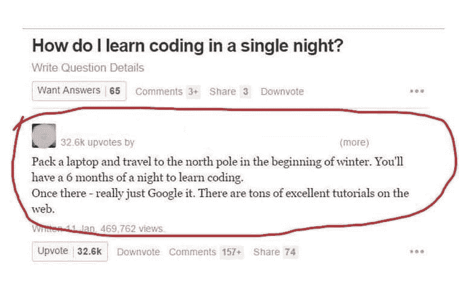

# 每个 IT 人都会讲的笑话

> 原文：<https://javascript.plainenglish.io/jokes-that-every-it-people-relate-to-597319ee13?source=collection_archive---------1----------------------->

## 最佳编程模因汇编 2022

Photo by [Amanda Sofia Pellenz](https://unsplash.com/@amanda_sofia_?utm_source=medium&utm_medium=referral) on [Unsplash](https://unsplash.com?utm_source=medium&utm_medium=referral)

***模因和快乐有什么联系吗？*** 如果你是我这种类型的人，那么你可能也爱在下班后查看手机。猜猜我在那里看到了什么？

我主要是在互联网上看到**视频、抖音和模因**。我不知道为什么，但这有助于我提神醒脑，减轻工作压力。这就是为什么我相信*笑是人类最好的刷新按钮。*

在这篇文章中，我收集了一些我喜欢的网络迷因。

# 当我需要发表意见来提高百分比时…

Picture Credit:[https://programmerhumor.io/](https://programmerhumor.io/)

# 每个程序员都经历过人生中的一个阶段…

Picture Credit:[https://programmerhumor.io/](https://programmerhumor.io/)

# 总觉得，我会从今天开始..但是没有运气…

Picture Credit:[https://programmerhumor.io/](https://programmerhumor.io/)

# 是的…我们有备份。

Picture Credit:[https://programmerhumor.io/](https://programmerhumor.io/)

# Stackoverflow 体验…

Picture Credit:[https://programmerhumor.io/](https://programmerhumor.io/)

# 需要再经历一遍所有的历史…

Picture Credit:[https://programmerhumor.io/](https://programmerhumor.io/)

# 年终薪资谈判…

Picture Credit:[https://programmerhumor.io/](https://programmerhumor.io/)

# 处理重要任务并让 windows 更新通知…

Picture Credit:[https://programmerhumor.io/](https://programmerhumor.io/)

# 你如何格式化你的代码？

Picture Credit:[https://programmerhumor.io/](https://programmerhumor.io/)

# 冒险正在进行中…

Picture Credit:[https://www.reddit.com/r/ProgrammerHumor/](https://www.reddit.com/r/ProgrammerHumor/)

# 有趣地学习 OOP

Picture Credit:[https://www.reddit.com/r/ProgrammerHumor/](https://www.reddit.com/r/ProgrammerHumor/)

# 编程 101

Picture Credit:[https://www.reddit.com/r/ProgrammerHumor/](https://www.reddit.com/r/ProgrammerHumor/)

# 视角变化..写哪些人能看懂…

Picture Credit: [https://programmerhumor.io/](https://programmerhumor.io/)

# 作为一名初级开发人员，我学到的第一件事是..不要碰工作正常的东西..它可以增加重新测试的努力，并可以打破其他东西…

[https://www.facebook.com/javascriptJS/photos/1861659490638313](https://www.facebook.com/javascriptJS/photos/1861659490638313)

# 有时候我的 Div 元素隐藏的方式让 z-index 也帮不上忙……:)

[https://www.facebook.com/javascriptJS/photos/1599789793491952](https://www.facebook.com/javascriptJS/photos/1599789793491952)

# 当你看到这段对话时，你有没有更深入地思考这个问题？也许电脑在向每个人询问它的家庭..谁知道…

[https://www.thecoderpedia.com/blog/programming-memes/](https://www.thecoderpedia.com/blog/programming-memes/)

# 如果一个常见的编码问题以这种方式问你会怎么样？

[https://www.facebook.com/DZoneInc/photos/10158915022879712](https://www.facebook.com/DZoneInc/photos/10158915022879712)

# 奖金

# 什么是递归？一个简单的答案。

[https://devrant.com/rants/1052316/this-is-how-recursive-functions-works](https://devrant.com/rants/1052316/this-is-how-recursive-functions-works)

# 其他人做的吗？

[https://www.facebook.com/photo/?fbid=2626573337649221&set=gm.2879879672279583](https://www.facebook.com/photo/?fbid=2626573337649221&set=gm.2879879672279583)

# 这是讽刺吗？是的…哈哈

[https://www.facebook.com/yuva.krishna.memes/photos/a.105527467815845/374844090884180/](https://www.facebook.com/yuva.krishna.memes/photos/a.105527467815845/374844090884180/)

# 一切皆有可能…什么都没有定义…一个晚上有几个小时？

[https://www.facebook.com/yuva.krishna.memes/photos/a.105527467815845/374439034258019/](https://www.facebook.com/yuva.krishna.memes/photos/a.105527467815845/374439034258019/)

# 我做了一些有用的事情，现在我可以把它添加到我的简历中

[https://www.facebook.com/jokesvala/photos/a.2330223400336101/6283529831672085/](https://www.facebook.com/jokesvala/photos/a.2330223400336101/6283529831672085/)

# 哇…这种感觉…

[https://www.facebook.com/photo/?fbid=10165386371885383&set=gm.837026157016641](https://www.facebook.com/photo/?fbid=10165386371885383&set=gm.837026157016641)

# 在 StackOverflow 上有人帮了你之后，世界是如此美好…

[https://www.facebook.com/jokesvala/photos/a.2330223400336101/6283493258342409/](https://www.facebook.com/jokesvala/photos/a.2330223400336101/6283493258342409/)

# 上传文件的物理方式是什么？

[https://www.facebook.com/Septatec/photos/a.3294457633926346/4250075005031266/](https://www.facebook.com/Septatec/photos/a.3294457633926346/4250075005031266/)

# 嗯…希望不会发生在任何人身上…如果是这样，这篇文章会对你有很大帮助…

[https://www.facebook.com/yuva.krishna.memes/photos/a.105527467815845/374823690886220/](https://www.facebook.com/yuva.krishna.memes/photos/a.105527467815845/374823690886220/)

# 谁干的？

[https://www.facebook.com/yuva.krishna.memes/photos/a.105527467815845/373596757675580/](https://www.facebook.com/yuva.krishna.memes/photos/a.105527467815845/373596757675580/)

# 调试就是以这样一种方式挤进去，缺陷会自己被注意到…

[https://www.facebook.com/yuva.krishna.memes/photos/a.105527467815845/373561211012468/](https://www.facebook.com/yuva.krishna.memes/photos/a.105527467815845/373561211012468/)

# 希望你笑得很开心…

*更多内容请看*[***plain English . io***](https://plainenglish.io/)*。报名参加我们的* [***免费周报***](http://newsletter.plainenglish.io/) *。关注我们关于*[***Twitter***](https://twitter.com/inPlainEngHQ)[***LinkedIn***](https://www.linkedin.com/company/inplainenglish/)*[***YouTube***](https://www.youtube.com/channel/UCtipWUghju290NWcn8jhyAw)*[***不和***](https://discord.gg/GtDtUAvyhW) ***。*****

*****对缩放您的软件启动感兴趣*** *？检查* [***电路***](https://circuit.ooo/?utm=publication-post-cta) *。***