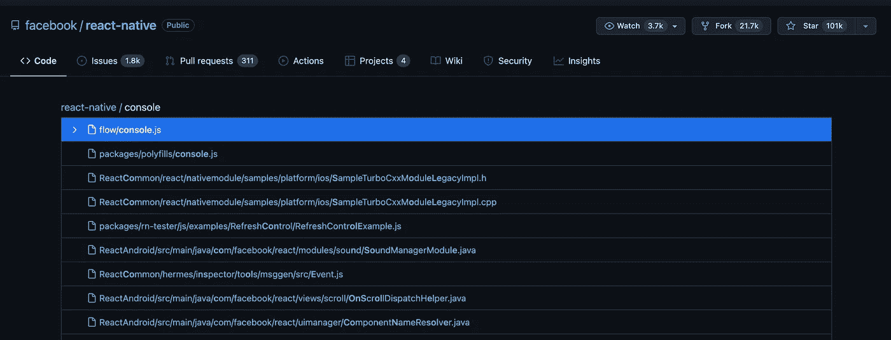
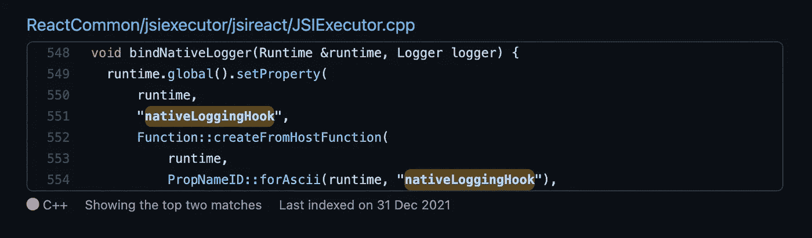
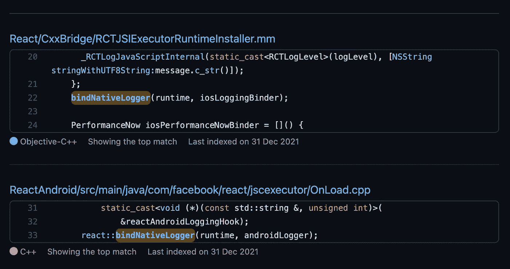
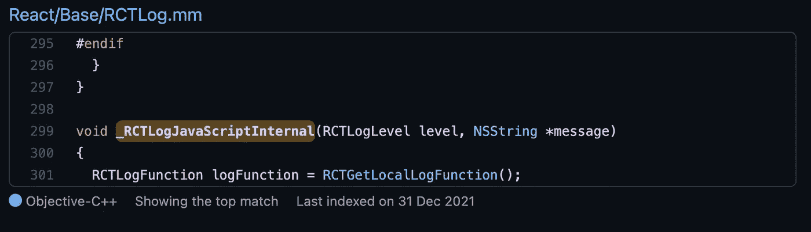
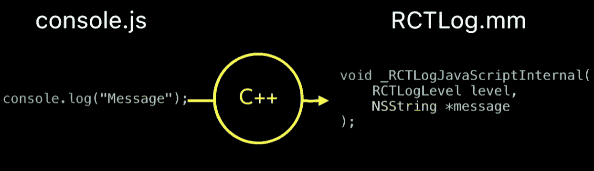

# 控制台之旅.登录 React Native

> 原文：<https://javascript.plainenglish.io/journey-of-a-console-log-in-react-native-6148b4627563?source=collection_archive---------6----------------------->

## React Native 新架构简介。

我已经开发用户界面很长时间了。在这个阶段，我学到了很多新东西，从 JavaScript 转到 TypeScript 一段时间，然后回到 JavaScript，使用 React 开发 web 应用程序，也使用 React Native 开发移动应用程序。

有一件事一直伴随着我，那就是对`console.log`的爱。今天，我使用不同的调试器和迷你器来调试我的代码，但是我不像信任 T1 那样信任任何人。

像大多数 JavaScript 初学者一样，我也在大部分时间里认为`console.log`是 JavaScript 提供给我们的。但是随着我对谷歌的 V8、JavaScript 引擎和 WebAPI 等术语越来越熟悉，它变得越来越清晰。但是就像一个有经验的 JavaScript 开发者所说的——事情没那么简单。

# 没那么简单

是的，它不是。有一次，我尝试在浏览器里打印`console.log`的值，得到一个函数说是原生代码。见下图。

Chrome in a normal environment

这非常符合我的期望，因为`console.log`无论如何是一个包含本地代码的 WebAPIs 函数。但是我在 react native 环境中尝试了类似的事情，这就是事情开始发生变化的地方。见下图。

Safari in React Native JSContext

那么，React Native 是如何让`console.log`从我们的 JavaScript 代码运行到原生 Android 和 iOS 设备的呢？我知道 React Native 的异步桥，以及它如何从 JavaScript 到原生 Android 和 iOS 序列化和反序列化东西。但这仅仅是这样吗？

# 让我们找出答案

终于登陆 React Native 的 Github 库，搜索`console`。见下图。

出现了两个`console.js`文件——第一个在`flow`中，包含模块的类型声明，第二个在`polyfills`中，似乎是开始研究的好地方。于是我打开文件，开始乱搞，读取函数，直到找到这个函数`getNativeLogFunction`。见下文。

function getNativeLogFunction inside `console.js` file

这个函数接受日志级别的参数，操作我们的字符串，最后调用全局对象上的`nativeLoggingHook`。但是浏览器中没有名称为`nativeLoggingHook`的功能。这让我很好奇，我进一步研究 React Native 是否提供了这个函数的实现。

所以现在我在回购中搜索`nativeLoggingHook`，有趣的是找到了一个文件。见下图。

在我的大部分开发生涯中，我一直是一名 JavaScript 开发人员，从未真正有机会从事 CPP 工作。但是我们内心都有一个好奇的孩子，我的孩子引导我打开文件，读了一下这个方法。

几分钟后，我意识到我在 CPP 方面有多糟糕，所以在陷入抑郁之前，我做了我在学习新东西时一直在做的事情——我假设我知道这个代码做什么，并继续调查`bindNativeLogger`在代码中是如何使用的。

我在资源库中搜索了`bindNativeLogger`，找到了两个文件。见下图。

这是事情最终开始有意义的地方。在上面的这两个文件中，`bindNativeLogger`是用 JavaScript 运行时和本地日志程序调用的——`RCTJSIExecutorRuntimeInstaller.mm`中的`iosLoggingBinder`和`OnLoad.cpp`中的`androidLogger`。

然后我打开了`RCTJSIExecutorRuntimeInstaller.mm`文件，在这里用 JavaScript 运行时和`iosLoggingBinder`调用了方法`bindNativeLogger`。参见下面第 15 行的代码。

再深入一点，我发现`iosLoggingBinder`是在`RCTLog.mm`中定义的一个函数`_RCTLogJavaScriptInternal`。见下图。

这就是`console.log`最终在 iOS 生态系统中被调用的地方。所以不知何故，我用 JavaScript 编写的控制台深入了一堆方法，最终在`RCTLog.mm`文件中调用了`_RCTLogJavaScriptInternal`方法。中间涉及到 CPP，但是作为一个 JavaScript 开发人员，我可以忽略它，至少在一段时间内。见下图。

Credit: YT video — Building React Native: Take a look at the internals — Parashuram N

所以在某种程度上，JavaScript 是在调用原生模块，而不是真正使用 React 原生桥。这甚至不是异步的，只是一个接一个的调用。这让我很好奇，我最终回到了我之前忽略的 CPP 代码。

我之前忽略的 CPP 代码是众所周知的 JavaScript 接口，也就是 JSI——新的 React 原生架构。JSI 是一种新的、标准化的方式，将本机模块中的本机 Java 或 Objective-C 对象展示给 JavaScript 世界。

# 奖金

这让我更加好奇，然后我开始了解 React Native 正在开发的新架构。这只是一个简短的介绍，以点燃您对 React Native 社区中正在酝酿的这一新的有趣事物的好奇心。

如果你一直在 React Native 上开发移动应用，那么请订阅这个博客，因为在下一部分中，我将更深入地研究这个新的架构，探索诸如 TurboModules、JSI、Fabric 和 CodeGen 之类的东西。

***让你内心的极客赢！***

*更多内容看* [***说白了就是***](http://plainenglish.io/) *。报名参加我们的* [***免费周报***](http://newsletter.plainenglish.io/) *。在我们的* [***社区获得独家访问写作机会和建议***](https://discord.gg/GtDtUAvyhW) *。*