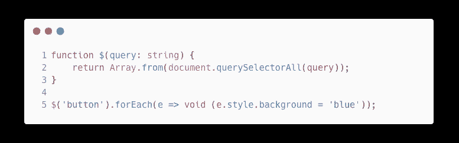
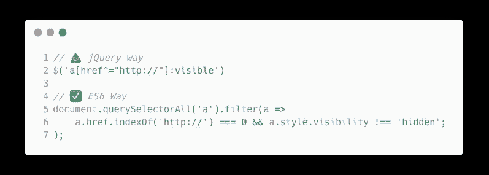
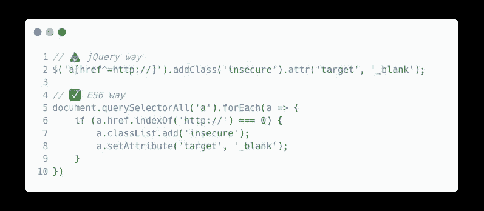

# jQuery 糟透了:停止使用它

> 原文：<https://javascript.plainenglish.io/jquery-sucks-stop-using-it-454f51fb398?source=collection_archive---------5----------------------->

## 以下是为什么停止使用 jQuery 是最好的选择。

Photo by [Nadine Shaabana](https://unsplash.com/@nadineshaabana?utm_source=medium&utm_medium=referral) on [Unsplash](https://unsplash.com?utm_source=medium&utm_medium=referral)

曾经有一段时间，jQuery 是每个 web 开发人员工具箱中必不可少的库。情况不再是这样了。使 jQuery 成为前端 JavaScript 开发的领先库的问题已经被 web 浏览器、JavaScript 和其他框架/库解决了。

# 为什么我们曾经使用过 jQuery？

jQuery 曾经是一个必不可少的库，但现在不再是了。这就是我们曾经需要它的原因。

> “约翰·瑞西格在 2005 年开发了 jQuery 的初始版本，并在 2006 年发布了它”——[LogRocket](https://blog.logrocket.com/the-history-and-legacy-of-jquery/)

**网络浏览器不一致。最初发布 JavaScript 是为了在第一款网络浏览器 [Netscape Navigator](https://www.wikiwand.com/en/Netscape_Navigator) 中增加网页的交互性。最终，其他组织创建了自己的 web 浏览器，每个浏览器都必须更新其 JavaScript 运行时。这意味着不同的浏览器缺少一些 JavaScript 特性(和 CSS 特性)。当组件在 web 浏览器之间不一致时，您有两种选择:为每个浏览器编写单独的代码或使用聚合填充。多填充是一种在不支持某些功能的浏览器中模拟这些功能的方式。jQuery 通过将这些聚合填充封装在简单的函数中来简化它们。**

**查询选择器。没有人想写一堆陈述或类似的替代方案。jQuery 中的查询选择器非常简单，您可以对多个元素应用相同的修饰符(都在一行中)。**

**HTTP 请求。** JavaScript 在改变 HTTP 请求的 API 方面有着悠久的历史。向 REST API 发出一个简单的请求也需要很多行代码。jQuery 公开了`$.get`和`$.post`方法，允许您使用查询和主体参数发出 HTTP 请求。

**动画。**曾几何时，CSS 缺乏对动画的支持。编写自定义动画函数会降低站点的响应速度，或者阻止其他 JavaScript 运行。jQuery 有高效的方法来制作网站元素的动画。

# 为什么 jQuery 过时了

浏览器变得更加一致。如今，网络浏览器有一致的 HTML、JavaScript 和 CSS 标准。不久前被杀的 Internet Explorer 显然不支持现代 web 浏览器中的大多数功能。尽管如此，Chrome、Firefox 和 Safari(以及基于它们的浏览器)都支持相同的功能。这意味着一个浏览器上的 JavaScript 和 CSS 在另一个浏览器上的工作方式是一样的。这要感谢 ECMAScript。只有几个例外适用。

> ECMAScript 是一种 JavaScript 标准，旨在确保网页在不同浏览器间的互操作性。它是由 Ecma 国际根据文件 ECMA-262 标准化的— [*【维基百科】*](https://www.wikiwand.com/en/ECMAScript)

**查询选择器。**你不再需要使用 jQuery 查询选择器了。JavaScript 提供了自己的查询选择器:`document.querySelector`和`document.querySelectorAll`。尽管 jQuery 允许开发人员链接他们的函数，但是有一种简单的方法可以用普通的 JavaScript 复制这一点。

JavaScript code for query selecting an element without jQuery

**HTTP 请求。ECMAScript 最终选定了一个好的 API 来执行 HTTP 请求。`[**fetch**](https://developer.mozilla.org/en-US/docs/Web/API/Fetch_API/Using_Fetch)` [API](https://developer.mozilla.org/en-US/docs/Web/API/Fetch_API/Using_Fetch) 可以轻松地向任何 REST API 发送请求。如果你不想使用`fetch` API，你可以安装另一个库，像 [Axios](https://axios-http.com/docs/intro) ，它甚至比 jQuery 更适合发出 HTTP 请求。**

**动画。动画变得更加轻松。JavaScript 在浏览器中是单线程的，只有一个主事件循环，因此将 JavaScript 用于动画并不是最好的主意——应该谨慎使用。相反，使用`transition`属性来创建奇特的动画。你也可以使用[关键帧](https://developer.mozilla.org/en-US/docs/Web/CSS/@keyframes)来完成完整的动画。**

# 我们仍然使用 jQuery 的 6 个原因

A 队写了一篇文章[*2021 年我们还在用 jQuery 的 6 个理由*](https://atypiccraft.com/insights/reasons-why-we-still-use-jquery) *。我想花点时间来回应他们的观点。*

**原因 1:** 用于选择 DOM 元素的扩展 CSS 选择器语法。

Query selecting using plain JavaScript

**原因二:**一行写多个任务。

这是真的。jQuery 仍然让这变得非常容易，允许开发人员将多个功能链接在一起。但是使用普通的 JavaScript 代码通常可以运行得更快，并且记住 jQuery 会显著增加项目的大小。

**原因 3:** 处理多个 DOM 元素。

Querying multiple DOM elements and performing actions on them

**原因四:**跨浏览器支持。

你知道还有什么是跨浏览器支持的吗？ES6。🤪

**原因五:**开发者生产力。

> *“正如我们在上面多次看到的，jQuery 确实减少了开发人员编写的代码量。当我们摆脱样板文件时，我们只剩下工作在项目特定的逻辑上。这增加了不间断的开发时间，并允许我们更有效地完成任务，同时保持干净的代码。俗话说，时间就是金钱，这种方法为我们的客户降低了成本。”*

jQuery 提高了生产率，因为它节省了开发人员编写样板代码的时间。但是就像我说过的，你可以编写比 jQuery 提供的更好的代码……而且你只需要写你需要的。

**原因六:**各种各样有用的插件。

常规 JavaScript 有更多种有用的插件——称为库。它们不依赖于 jQuery，所以通常比 jQuery 插件快得多。使用`npm`和`yarn`安装 JavaScript 包也更容易。

# 反应

如果您在项目中使用 React(或类似的框架)，jQuery 没有任何好处。React 将所有更改存储在虚拟 DOM 中，这是 jQuery 所不擅长的。不常见的 DOM 操作可以用普通的 JavaScript 或 TypeScript 来完成。

我希望您喜欢这篇文章，并停止使用 jQuery。几年前就不用了。

 [## 停止使用 For 循环，改用迭代器

### For 循环不再是 JavaScript 中迭代数组的最佳方式。相反，使用数组迭代器函数。这里…

javascript.plainenglish.io](/stop-using-for-loops-use-iterators-instead-javascript-62682c74427d)  [## 每个 JavaScript 开发人员都应该知道的 5 个一行程序

### 少即是多，少即是好。更少的代码更容易维护，更容易读/写。拿这 5 个 JavaScript 来说…

javascript.plainenglish.io](/5-one-liners-every-javascript-developer-should-know-5e37c42b99cf)  [## 请停止编写 Sh*t JavaScript

### 你做错了什么，以及如何弥补。

javascript.plainenglish.io](/please-stop-writing-sh-t-javascript-ba8fd4e1cd9e) 

*更多内容请看*[***plain English . io***](https://plainenglish.io/)*。报名参加我们的**[***免费周报***](http://newsletter.plainenglish.io/) *。关注我们关于*[***Twitter***](https://twitter.com/inPlainEngHQ)*和*[***LinkedIn***](https://www.linkedin.com/company/inplainenglish/)*。查看我们的* [***社区不和谐***](https://discord.gg/GtDtUAvyhW) *加入我们的* [***人才集体***](https://inplainenglish.pallet.com/talent/welcome) *。**