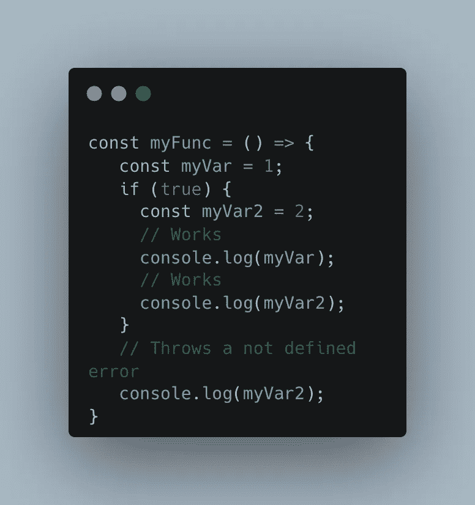
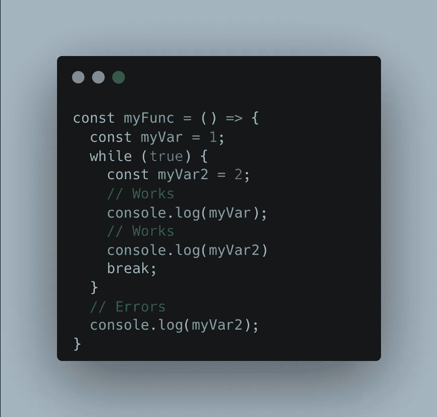
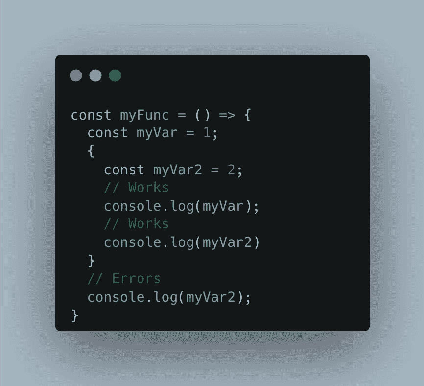
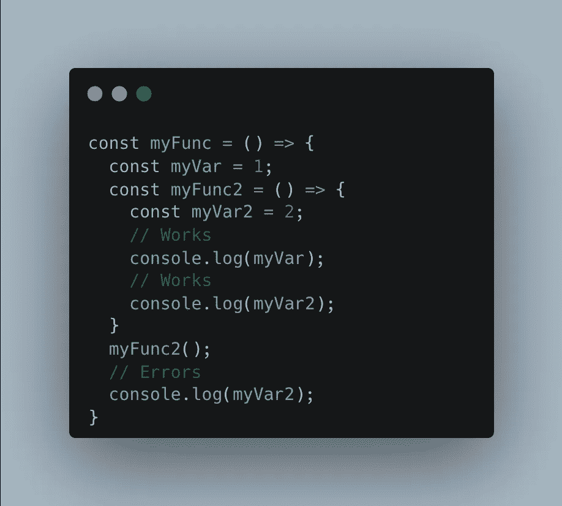
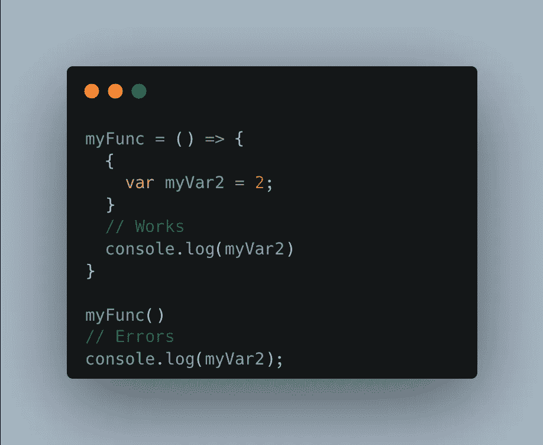

# JavaScript 基础:理解范围

> 原文：<https://javascript.plainenglish.io/js-basics-understand-the-scope-547c5d7ca1c7?source=collection_archive---------11----------------------->

## 用简单的例子掌握 JavaScript 的一个基本概念。

Photo by [Markus Spiske](https://www.pexels.com/@markusspiske?utm_content=attributionCopyText&utm_medium=referral&utm_source=pexels) from [Pexels](https://www.pexels.com/photo/a-laptop-screen-with-text-4439901/?utm_content=attributionCopyText&utm_medium=referral&utm_source=pexels)

如果你现在已经使用 JS 有一段时间了，你一定至少听说过一次 ***范围*** 这个词。

但是这个词到底是什么意思呢？

> 作用域是一组确定变量可访问性的规则。

在 JavaScript 中，我们有三个不同的范围:

*   块范围
*   功能范围
*   全球范围

来说说他们吧。

# 块范围

让我们从**最简单的**开始，块作用域。

块范围是仅在代码块内可访问的范围**。换句话说，**代码块是一段用花括号括起来的代码。****

> 函数不适合这种类型的范围(即使它们使用了括号),因为它们有自己的范围和规则集

我们有不同的方法来定义一个块，但是最简单的方法是在 if/else 语句或循环中。

> 对于本文的第一部分，我将只使用`const`来声明变量。请参考本文第二部分的**部分，了解`let/var`如何对范围产生影响**

## if/else

让我们从 if/else 语句开始吧！

这是我们的第一个例子。这里我们要关心两个变量:

*   `**myVar**`:在函数开始时声明
*   `**myVar2**`:在 if 块中声明

如果我们从`**myVar**`开始，我们可以看到我们正在 If 块中打印它**并且它正在工作**。原因是`**myVar**`在函数作用域内**(详见本文)，因此**可以被函数**内的所有东西访问。**

现在对于`**myVar2**`，就有点不一样了。变量在 if 程序块内创建**，而**属于该特定程序块**。**一旦我们离开这个程序块，我们就失去了对变量**的访问(因此在第二次打印时出现错误)**

## for/while 循环

现在我们来看看一个**循环**。`For`和`while`循环的工作方式相同，我们将只使用一个`while`循环。

我们不打算在这里花太多时间，因为它的工作方式与 `**if**` **语句**完全相同！我们是 c 语言**在** `**while**` **循环**和**里面创建一个块，一旦到了外面，访问** `**myVar2**` **就会触发错误**！

## 花括号块

现在，这一个，尽管它与前两个非常相似**，却非常有趣！你们中的一些人可能甚至不知道这是可能的。虽然我对那个没什么兴趣，还是来看看吧。**

如果你仔细看看这段代码，你会发现既没有条件也没有循环！我们只是把代码放在一些花括号里，JS 会创建一个新的作用域。

这里没什么要分析的了，我只是觉得你会喜欢看这个！

# 功能范围

现在，让我们进入**一个更高的范围**，并对**功能范围**感兴趣。

当谈到函数作用域时，我们考虑的是在函数作用域内声明的每个变量。如果我们看看前面的 3 个例子，`myVar`是在函数作用域内声明的，而**没有被包装到更低的作用域**中。

然而，在函数中声明的变量**只能在它所属的函数**和**中访问，每个额外的函数都在**中创建。

让我们看一个简单的例子来更好地理解这个问题:

所以我们先来描述这段代码。我们有两个功能，一个在另一个中。`**myFunc**`是**的第一个函数**，我们在其中声明变量`**myVar**`。然后这个函数中的**被声明为第二个函数**，名为`**myFunc2**`。在`**myFunc2**`内部，我们声明了变量`**myVar2**`。我们最终在打印`**myVar2**`之前调用`**myFunc2**`。

现在，如果你看一下注释，你会发现从`**myFunc2**`内部可以访问`**myVar**`。`**myVar2**`当然也可以访问，但是`**myVar2**`不能从 myFunc 访问。

# 全球范围

我希望你一切都好，你还没有得到一些扑热息痛。我们快到了！我保证！

我们现在将对**全局范围**感兴趣。使用关键字`**global**` (nodejs)或`**window**`(浏览器)或**可以从任何地方**访问全局范围**，只需使用变量名**就可以从同一个文件访问全局范围。

然而，全局作用域**无法访问从较低作用域**声明的任何变量！(功能或块)

# 结论

总而言之，我们可以说**作用域遵循某种从全局作用域到块作用域**的层次结构。

**块范围可以访问存在于它上面的所有东西**(函数和全局)

**函数作用域位于中间，只能访问更高级函数或全局作用域的变量。**

最后，**全局作用域不能访问任何更高的级别**(因为它已经是最高级别了)，并且**也不能访问更低的作用域**。

但是所有这些都有一个例外**！我们现在就来谈谈！**

# **var/let/const 对范围的影响**

**我说过了！有一个例外，关键字`**var**`的用法**

**快速提醒一下，`**const**`和`**let**` 与**对作用域**有着相同的影响。唯一不同的是`**const**`是**只读**而`let`可以被**重新分配**。**

**然而，`**var**` **也可以**重新分配，并且**几乎可以在每个范围**中访问！**

****

> **等等，但是那个代码没有意义？？？**

**这个例子基本上使用了 JS 的**两个不同的规则。本文所说的**范围**和**闭包**！****

**先说范围。正如我所说的，`**var**`声明了一个与作用域无关的变量，可以从任何作用域访问它。这解释了为什么第一个 console.log 可以工作。**

**但是，为什么第二个失败了？原因是函数内部的这段代码正在创建一个被称为闭包的**封闭范围。每个函数都在创建自己的作用域**，在它们内部发生的一切**都与其余的**相隔离！**

> **要了解更多关于 closure 的信息，请继续关注我的下一篇文章！**

**希望这篇文章有所帮助！不要犹豫，与其他可能需要它的开发人员分享它！**

***更多内容看* [***说白了就是***](https://plainenglish.io/) *。报名参加我们的* [***免费周报***](http://newsletter.plainenglish.io/) *。关注我们* [***推特***](https://twitter.com/inPlainEngHQ) ，[***LinkedIn***](https://www.linkedin.com/company/inplainenglish/)*，*[***YouTube***](https://www.youtube.com/channel/UCtipWUghju290NWcn8jhyAw)*，*[*不和*](https://discord.gg/GtDtUAvyhW) *。***