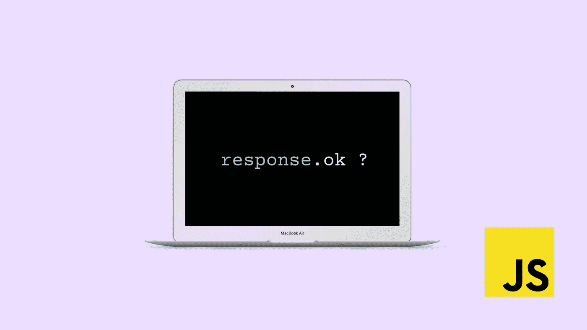
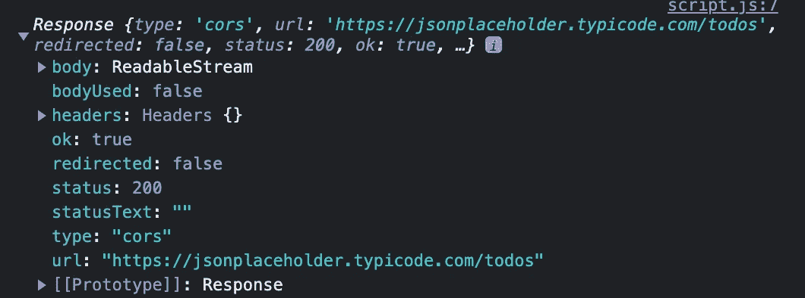

# JavaScript Fetch——您处理响应的方式正确吗？

> 原文：<https://javascript.plainenglish.io/js-fetch-are-you-handling-responses-correctly-1df3246b85af?source=collection_archive---------4----------------------->

## 很多开发者都没有意识到的。



每个 JavaScript 开发人员可能都知道 fetch API。它为向端点发出请求、获取或发布数据提供了一个简单的接口。然而，许多开发人员在使用 fetch 时并没有意识到一个常见的错误。

fetch 如此受欢迎的部分原因是它返回一个承诺。承诺的优点是可以用处理函数优雅地处理它:`then`、`catch`和`finally`。

当承诺得到解决时，将执行`then`函数，如果承诺被拒绝，将执行`catch`函数。很自然，人们会假设成功的响应在`then`函数中处理，不成功的响应在`catch`函数中处理。令人惊讶的是，事实并非如此。

# 棘手问题:*承诺什么时候会兑现？*

每当 HTTP 响应状态代码为 200–299 时都是这样吗？

没有。好吧，不同的问题。什么时候承诺会被拒绝？

是每当 HTTP 响应状态代码为 400–499 还是 500–599 时(客户端或服务器错误)？

没有。

## 让我们弄清楚这件事

如果服务器以 400–499 错误拒绝您的请求，承诺不是被**拒绝**而是被**解决**。例如，常见的 401-未授权响应代码，将导致**解决**承诺。

即使您试图从中获取数据的服务器当前遇到了问题，并且返回了 500 内部服务器错误，promise 仍然会解析并调用`then`处理程序。不是`catch`处理器。

只要服务器返回一个响应，任何响应，承诺都会解决。只有当服务器根本无法对您的请求做出响应时，承诺才会被拒绝。这可能会发生，例如，由于网络错误或如果服务器着火(戏剧性的，我知道)。

# 这对使用 fetch 的开发人员来说意味着什么

这意味着您不能只在`then`处理程序中处理成功的响应(响应代码== 2xx)。您还必须处理不成功的响应(响应代码！= 2xx)。

识别响应是否成功的最简单方法是使用响应对象的`ok`属性。



Response object returned from the jsonplaceholder.typicode API. Screenshot from Chrome browser console.

响应对象包含属性`ok`，这是一个布尔值。如果响应状态代码在成功(2xx)范围内，则`Response.ok`为真。这就是为什么一些开发人员检查状态代码是否在 200 和 299 之间，但是检查 Response.ok 实际上会做完全相同的事情，只是更短。

如果`response.ok`为真，我们继续一些逻辑，但是如果**，**为假，响应不成功，我们需要处理错误。一种常见的方法是抛出一个错误，这将导致调用`catch`处理程序。通过这种方式，成功和不成功响应的处理可以通过处理程序函数分开，并且`catch`处理程序可以一起处理不成功响应和拒绝承诺。

```
fetch("https://jsonplaceholder.typicode.com/todos")
.then(response => {
    if (response.ok) {
        console.log(response); // do something with successful response
    }
    else {
        throw new Error(`HTTP error, status = ${response.status}`);
    }
})
.catch(error => {
    console.error(error);
})
```

实际上，这是可行的，因为`then`方法本身也返回一个承诺。抛出一个错误会导致该承诺被拒绝，并导致`catch`被调用。关于承诺和错误处理的更多细节，请查看这个有用的[资源](https://javascript.info/promise-error-handling)。

# 外卖

重要的一点是，在执行假设成功响应的代码之前，总是检查`then`处理程序中的`response.ok`。如果您想在 catch 语句中进一步处理不成功的响应，抛出一个错误也很有帮助。

感谢阅读！如何处理来自 fetch api 的不成功响应？请在评论中告诉我。如果你学到了一些新的东西，请关注我的媒体来获取更多的网站开发内容。

*更多内容请看*[***plain English . io***](https://plainenglish.io/)*。报名参加我们的* [***免费周报***](http://newsletter.plainenglish.io/) *。关注我们关于*[***Twitter***](https://twitter.com/inPlainEngHQ)[***LinkedIn***](https://www.linkedin.com/company/inplainenglish/)*[***YouTube***](https://www.youtube.com/channel/UCtipWUghju290NWcn8jhyAw)*[***不和***](https://discord.gg/GtDtUAvyhW) *。***