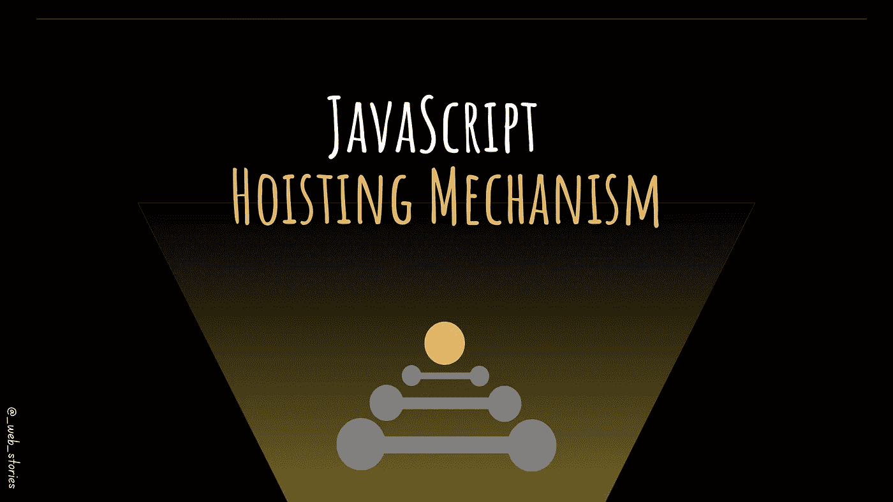
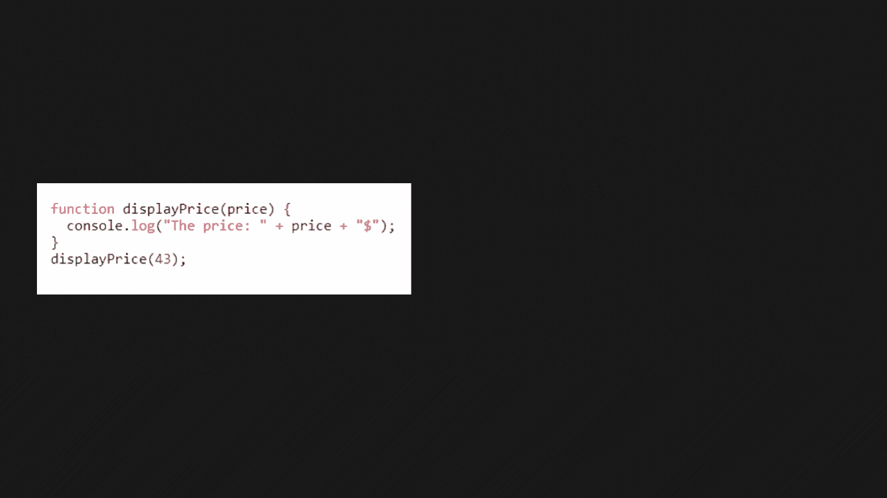

# 你应该知道的 JavaScript 机制！

> 原文：<https://javascript.plainenglish.io/js-mechanism-you-should-know-12431e094103?source=collection_archive---------9----------------------->

## 理解 JavaScript 中的范围和提升

By FAM

## 你好👋

JS 需要理解的基本概念之一是提升。但是，在了解它是什么之前，我们需要先了解 JavaScript 中的作用域。

# JavaScript 中的作用域是什么？

**作用域**决定了 JavaScript 脚本中变量的可访问性。

一个 JavaScript 程序中有不同的作用域:

*   全球范围
*   功能范围
*   块范围

💡**全局范围**

全局范围被称为**全局变量**和**函数**。全局变量或函数可以在整个 JS 脚本中访问和使用。

💡**功能范围**

函数作用域就是函数内部声明的变量。在这种情况下，您可以使用/操作该变量的范围或区域只在函数内部，而不在函数外部。这些变量称为局部变量。

💡**封锁范围**

有点像函数作用域，但是在块作用域中，变量是在块`{}`中声明的。这些变量在块外部是不可访问的:

`{ // declared here? then accessible only here}`

示例:

# 现在，吊装？

有点混乱，不容易马上理解。但是有了一个例子，你就能描绘出它的样子，并在脑海中描绘出它的一生。让我们比较以下两个例子:

🆚以下代码:

## 这些例子中哪一个有效？

两者都工作得很好，没有错误。那么第一个例子，当我们在函数声明之前调用它，它是如何工作的呢？嗯，多亏了提升机构，这才成为可能。

在编译阶段，在代码执行之前，函数的声明被移动到其作用域的顶部。

*JS 脚本声明(函数和变量)在编译阶段(顶层)被放入内存中，但是停留在您在代码中键入它们的地方。*

By FAM

## 起重工作也有变数

在声明或初始化变量之前，可以在代码中使用变量。以下代码没有错误:

然而下面的代码抛出了一个错误，因为`myVariable`从未在脚本中的任何地方声明过:

用`**let**` 或`**const**` 关键字声明的变量以未初始化状态存储在内存中。

下一次，您将学习 JavaScript 操作符。

今天就到这里，看阿雅🙋

如果您有任何问题或反馈，请点击评论或通过 LinkedIn 联系我— **我洗耳恭听！**

[**想请我喝杯咖啡吗？☕️**](https://www.buymeacoffee.com/fatimaamzil)

> 让我们为 2022 年打造一个更好的‘我们’！

## 了解有关 2022 年网络快车计划的更多信息:

我- [网络常识](https://medium.com/geekculture/2022-web-program-chapter-n-1-is-done-499fb0707220?source=your_stories_page----------------------------------------)

[II-网页框架:HTML](https://famzil.medium.com/your-html-essentials-69d9b2349355?source=your_stories_page----------------------------------------)

[III-网页样式:CSS](https://medium.com/geekculture/recap-of-the-css-chapter-ae388d51e564?source=your_stories_page----------------------------------------)

## IV- Web 交互:JavaScript

*   [异步代码](/can-the-web-live-without-asynchronous-code-7f61fe2e862e?source=your_stories_page----------------------------------------)
*   [这个](https://medium.com/geekculture/this-for-developers-5dc91d499677?source=your_stories_page----------------------------------------)
*   [变量](https://famzil.medium.com/js-variables-what-you-need-to-know-fb8994ed9d0d?source=your_stories_page----------------------------------------)

**范围&吊装**

*   经营者
*   关闭
*   …

 [## 2022 网络计划启动！

### 改变来自心态和习惯

medium.com](https://medium.com/geekculture/2022-web-program-is-launched-f38a3280af1a) 

与想成为 web 开发人员的人分享该程序！这将有助于保持进步，并在旅途中互相帮助。

*如果你喜欢我的文章，* [***订阅***](https://famzil.medium.com/subscribe) *获取我的最新文章。如果你自己喜欢体验媒介，可以考虑通过**[***报名成为会员***](https://famzil.medium.com/membership) *来支持我和其他几千个作家。它每月只需花费***5 美元，它支持我们，作家，你也有机会用你的作品* *赚钱。当然，你可以随时取消会员资格。通过报名* [*这个环节*](https://famzil.medium.com/membership) *，你直接用你的一部分费用来支持我，不会多花你钱。如果你这样做了，万分感谢！***

**让我们在 [**上**取得联系****](https://medium.com/@famzil/)**[**Linkedin**](https://www.linkedin.com/in/fatima-amzil-9031ba95/)**[**脸书**](https://www.facebook.com/The-Front-End-World)**[**insta gram**](https://www.instagram.com/the_frontend_world/)**[**YouTube**](https://www.youtube.com/channel/UCaxr-f9r6P1u7Y7SKFHi12g)**或************

******** [## 通过我的推荐链接——FAM 加入 Medium

### 作为一个媒体会员，你的会员费的一部分会给你阅读的作家，你可以完全接触到每一个故事…

famzil.medium.com](https://famzil.medium.com/membership) 

*更多内容看* [***说白了就是***](https://plainenglish.io/) *。报名参加我们的* [***免费周报***](http://newsletter.plainenglish.io/) *。关注我们关于*[***Twitter***](https://twitter.com/inPlainEngHQ)*和*[***LinkedIn***](https://www.linkedin.com/company/inplainenglish/)*。加入我们的* [***社区不和谐***](https://discord.gg/GtDtUAvyhW) *。*********