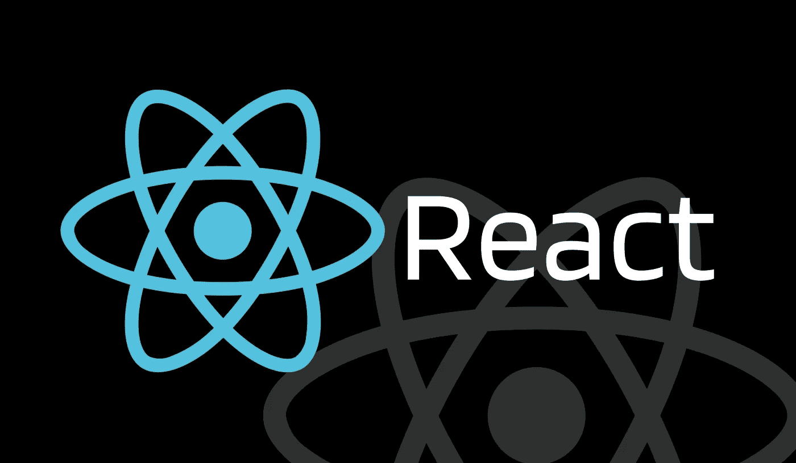

# JSX 表达式必须只有一个父元素——为什么？

> 原文：<https://javascript.plainenglish.io/jsx-expressions-must-have-only-one-parent-element-why-6521e9eb9e1c?source=collection_archive---------11----------------------->

## 用例子理解 JSX 这种行为背后的原因。还要学习 React 片段，这是这个常见错误的解决方案。



Image created by the author on Canva

# 什么是 JSX？它是如何工作的？

JavaScript XML (JSX)是 JavaScript 的语法扩展。它允许我们用 JavaScript 编写 HTML。因此，JSX 使得在 React 中编写和添加 HTML 变得更加容易。实际上，JSX 在幕后将 HTML 标签转换成 React 元素。我们不需要使用 JSX，但是在创建 React 应用程序时使用它确实很有帮助。

看下面一个简单的例子。它描述了在 DOM 上显示 React 元素的两种不同方式，使用 JSX 和不使用 JSX。

## 使用 JSX

```
const element = <h1 className="title">I am using JSX.</h1>;

const root = ReactDOM.createRoot(document.getElementById('root'));
root.render(element);
```

## 不使用 JSX

```
const element = React.createElement(
    'h1',
    {className: 'title'},
    'I do not use JSX.'
);

const root = ReactDOM.createRoot(document.getElementById('root'));
root.render(element);
```

正如您所看到的，在 React DOM 上创建和显示元素的两种方式几乎是相同的。JSX 允许我们不用写 React.createElement()就能创建一个元素，但是，在后台它会把我们的代码转换成它。React.createElement()帮助我们检查和编写无错误的代码，它创建了这样一个对象:

```
const element = {
  type: 'h1',
  props: {
    className: 'title'
  },
  children: 'I do not use JSX.'
};
```

# 为什么 JSX 只支持一个父元素？

到目前为止，我们简单了解了 JSX 幕后的基本运作，也了解了 JSX 的好处。这些基本概念将有助于理解文章的真正主题。让我们了解一下在使用 React 时经常遇到的一个常见错误背后的原因:

*   ***【JSX】表达式必须只有一个父元素或者***
*   ***相邻的 JSX 元素必须用封闭标签*** 包围

当我们试图创建一个具有多个根元素的 React 组件时，通常会出现这样的错误。例如:

```
function Example() {
    return (
        <div> This is my first div. </div>
        <div> This is my second div. </div>
    );
}
```

正如我们前面讨论的，JSX 是 React.createElement()方法的语法糖。我还解释了这个方法类似于其他 JavaScript 方法，语法如下:`React.createElement(element, props, ...children)`这意味着该方法接受元素类型、元素的道具和元素的子元素。元素的子元素也是用 *createElement* 方法创建的，它们也可以有自己的子元素。

当我们在 React 中编写 JSX 时，React 会在后台将它转换为 createElement 方法。我已经提到了上面的代码，但是，看看下面的 React 函数组件来了解后台进程。

## 我们编写的代码:

```
function Example() {
    return (
        <div>
            <h1>Heading</h1>
            <div>
                <p>Body</p>
            </div>
        </div>
    );
}
```

## 通过 React 进行背景转换:

```
function Example() {
    return React.createElement(
        'div',
        null,
        React.createElement('h1', null, 'Heading'),
        React.createElement(
            'div',
            null,
            React.createElement('p', null, 'Body')
        )
    );
}
```

从例子中，我们可以清楚地理解，它从一个根元素开始，然后它可以有许多子元素，这些子元素也可以有自己的子元素，以此类推。现在理解导致错误的代码。查看下面的代码，并查看 React 转换后的代码:

## 具有多个根元素的代码:

```
function Example() {
    return (
        <div>
            <h1>Heading</h1>
        </div>
        <div>
            <p>Heading<p>
        </div>
    )
}
```

## React 对上述代码的转换:

如果我们在 React 组件中编写上面的代码，那么它将被翻译成下面的代码:

```
function Example() {
    return React.createElement(
        'div',
        null,
        React.createElement('h1', null, 'Heading')
    )
    React.createElement(
        'div',
        null,
        React.createElement('p', null, 'Body')
    );
}
```

这个转换后的代码是错误的，因为一个 JavaScript 函数一次只能返回一个东西。

因此，我们可以只声明一个根/父元素，并声明任意多个子元素。然而，在某些情况下，我们不希望额外的“div”作为根父节点。对于那个场景，我们已经介绍过 ***做出反应的片段*** 。React Fragment 是一个空标签，我们可以将它用作根元素，它不会向 React DOM 添加任何内容。让我们使用 React 片段来纠正我们之前犯的错误。请看下面的代码:

```
function Example() {
    return (
        <>
            <div>
                <h1>Heading</h1>
            </div>
            <div>
                <p>Heading<p>
            </div>
        </>
    )
}
```

# 结论

本文的主要目的是理解错误的原因—‘JSX 表达式必须只有一个父元素’。本文还解释了 React 片段，这些片段是我们在使用 React 应用程序时经常遇到的错误的解决方案。我希望这篇文章能帮助你清楚地理解它的目的。请关注我，阅读更多像这样有趣的文章，保持更新。

[](https://medium.com/@kardaniyagnik/membership) [## 通过我的推荐链接加入 Medium-Yagnik Kardani

### 阅读雅格尼克·卡尔达尼(以及媒体上成千上万的其他作家)的每一个故事。如果你喜欢我的文章，请用我的…

medium.com](https://medium.com/@kardaniyagnik/membership) [](https://www.buymeacoffee.com/kardaniyagnik) [## Yagnik Kardani 正在创建帮助他人成长的技术学习材料。

### 你好👋，我是一名媒体方面的技术作家。我喜欢学习并帮助他人在软件开发和云计算方面成长…

www.buymeacoffee.com](https://www.buymeacoffee.com/kardaniyagnik) 

*更多内容看* [***说白了。报名参加我们的***](https://plainenglish.io/) **[***免费周报***](http://newsletter.plainenglish.io/) *。关注我们* [***推特***](https://twitter.com/inPlainEngHQ)**和*[***LinkedIn***](https://www.linkedin.com/company/inplainenglish/)*。查看我们的* [***社区不和谐***](https://discord.gg/GtDtUAvyhW) *加入我们的* [***人才集体***](https://inplainenglish.pallet.com/talent/welcome) *。****