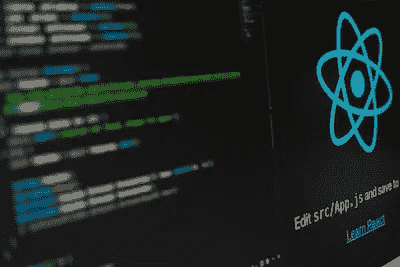

# 反应中的 JSX

> 原文：<https://javascript.plainenglish.io/jsx-in-reactjs-767225e7ac27?source=collection_archive---------15----------------------->

你好，亲爱的！你厌倦了努力理解 JSX 吗？不要绝望，我们潘达奎斯特是来拯救世界的！在这篇博文中，我们将深入 JSX 的世界，相信我，这很简单。所以系好安全带上路吧。

请记住，这是关于 ReactJS 中基本概念的[系列文章中的一篇。不要忘记关注和订阅，以便保持最新状态。](https://pandaquests.medium.com/core-concepts-in-reactjs-for-beginners-a0bffaba49ce)



Photo by Lautaro Andreani on Unsplash

JSX 是 JavaScript 扩展，代表 JavaScript XML。它允许您在 JavaScript 代码中编写类似 HTML 的内容。它通常在 ReactJS 库中用于描述用户界面应该如何显示。

假设您想在 ReactJS 应用程序中包含一个按钮元素。没有 JSX，你必须依赖 JavaScript 文档。要创建元素并将其添加到 DOM(代表文档对象模型),请使用 createElement()方法。这可能会变得很乏味，尤其是当您要创建大量元素时。

使用 JSX，您可以像这样在 JavaScript 代码中编写元素:

```
const button = <button>Click me!</button>;
```

这段代码看起来是标准的 HTML，但实际上是创建一个 JavaScript 对象来表示元素。当代码被编译时，它被转换成 JavaScript 代码，用 document 创建元素。createElement()。

变量也可以包含在 JSX 元素中。例如，如果您有一个包含字符串值的变量名，您可以将它包含在如下所示的元素中:

```
const greeting = <h1>Hello, {name}!</h1>;
```

这将创建一个带有文本“Hello，[name value]！”的 h1 元素。

JSX 初看起来可能很奇怪，但它可以成为构建 ReactJS 用户界面的强大工具。它使您能够以熟悉的、类似 HTML 的语法编写元素，从而更容易构建和操作应用程序的用户界面。

JSX 在 ReactJS 中有几个优势，可以让开发人员更容易、更方便地构建用户界面:

*   熟悉的语法:因为 JSX 看起来非常类似于 HTML，所以熟悉 HTML 的开发人员可以很快学会如何使用它。这对于不熟悉 ReactJS 并且还在尝试的开发人员来说尤其有用。
*   提高可读性:因为 JSX 采用了类似于 HTML 的语法，它可以使你的代码更容易阅读和理解。这在与一组开发人员一起工作时，或者在长时间休息后回到您的代码时特别有用。
*   更好的组织:JSX 使你能够组织你的代码来匹配你的用户界面的结构。这可以帮助您理解应用程序的不同部分是如何组合在一起并相互交互的。
*   更容易调试:因为 JSX 被编译成 JavaScript，所以用浏览器的开发者控制台之类的工具调试你的代码可能会更容易。这可以帮助您识别和修复代码中的错误。
*   增强的性能:在某些情况下，JSX 实际上可以提高 ReactJS 应用程序的性能。使用 JSX 时，ReactJS 库可以通过批量更新和最小化所需的 DOM 更新数量来优化元素的呈现。这可以让您的应用程序感觉更快，对用户的响应更快。

总之，在 ReactJS 中，JSX 是构建用户界面的一个非常有用的工具。它允许您以一种熟悉的、类似 HTML 的语法编写元素，这可以使您的代码更容易阅读、理解和维护。然而，尽管有这些优点，在 React 应用程序中使用 JSX 也有一些潜在的缺点:

*   对于那些不熟悉 JavaScript 中类似 HTML 的语法的人来说，学习起来可能会很困难。
*   JSX 会让你的代码更加冗长，因为它要求你在 JavaScript 代码中使用类似 HTML 的语法。
*   并非所有的 JavaScript 环境都支持 JSX，所以如果您想使用它，您可能需要在构建过程中包含一个预处理器。
*   一些开发人员可能会发现 JSX 比普通的 JavaScript 代码更难调试，因为语法有时会令人困惑。

虽然你不应该低估 JSX 的缺点，但当谈到与 JSX 在 ReactJS 建立组件时，利大于弊。

以下是 ReactJS 中 JSX 的几个使用案例:

*   创建元素:可以使用 JSX 在 ReactJS 应用程序中创建按钮、表单和列表等元素。例如，您可以编写以下 JSX 代码来创建按钮元素:

```
const button = <button>Click me!</button>;
```

*   嵌套元素:可以使用 JSX 将元素嵌套在一起，就像使用 HTML 一样。例如，您可以编写以下 JSX 代码来创建包含两个列表项的列表:

```
const list = (
 <ul>
 <li>Item 1</li>
 <li>Item 2</li>
 </ul>
);
```

*   添加属性:可以使用 JSX 为元素添加属性，比如类名或样式。例如，您可以编写以下 JSX 代码来创建具有禁用属性的按钮元素:

```
const button = <button disabled>Click me!</button>;
```

*   包含变量:您可以使用 JSX 将变量用花括号括起来，从而将变量包含在元素中。例如，您可以编写以下 JSX 代码来创建一个以变量名作为文本的标题元素:

```
const heading = <h1>Hello, {name}!</h1>; 
```

*   创建可重用的组件:您可以使用 JSX 来创建可重用的组件，这些组件可以在您的应用程序中共享。例如，您可以创建一个包含具有特定样式和行为的按钮元素的按钮组件，然后在整个应用程序中使用该组件。

总而言之，JSX 是在 ReactJS 中构建用户界面的强大工具。它允许您以熟悉的、类似 HTML 的语法创建和操作元素，这可以使您的代码更容易阅读和理解。


好了，你有它的人！ReactJS 的 JSX 世界速成班。我们希望你喜欢这篇博文，并发现它很有帮助。如果你有任何问题或者想了解更多关于 ReactJS 的信息，请在下面留下你的评论。我们将尽力回答您的问题，并为您指出正确的方向。

别忘了，这只是关于 ReactJS 的[系列文章中的一篇。如果您想了解 ReactJS 世界的最新动态，请关注我们，获取更多精彩内容。谁知道呢，你可能很快就会成为一名 ReactJS 职业选手！](https://pandaquests.medium.com/core-concepts-in-reactjs-for-beginners-a0bffaba49ce)

感谢您的阅读，祝您编码愉快！

## 更多内容请访问 [PlainEnglish.io](https://plainenglish.io/) 。

*报名参加我们的* [***免费每周简讯***](http://newsletter.plainenglish.io/) *。关注我们关于*[***Twitter***](https://twitter.com/inPlainEngHQ)，[***LinkedIn***](https://www.linkedin.com/company/inplainenglish/)***，***[***YouTube***](https://www.youtube.com/channel/UCtipWUghju290NWcn8jhyAw)***，以及****[***不和***](https://discord.gg/GtDtUAvyhW) *

## *希望扩大你的科技创业公司的知名度和采用率吗？检查[电路](https://circuit.ooo/?utm=publication-post-cta)。*