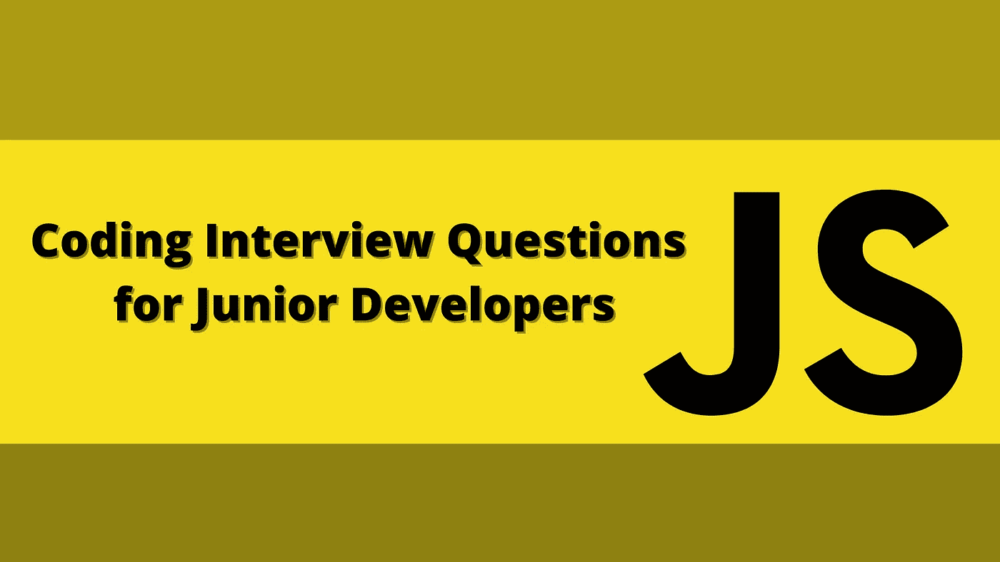
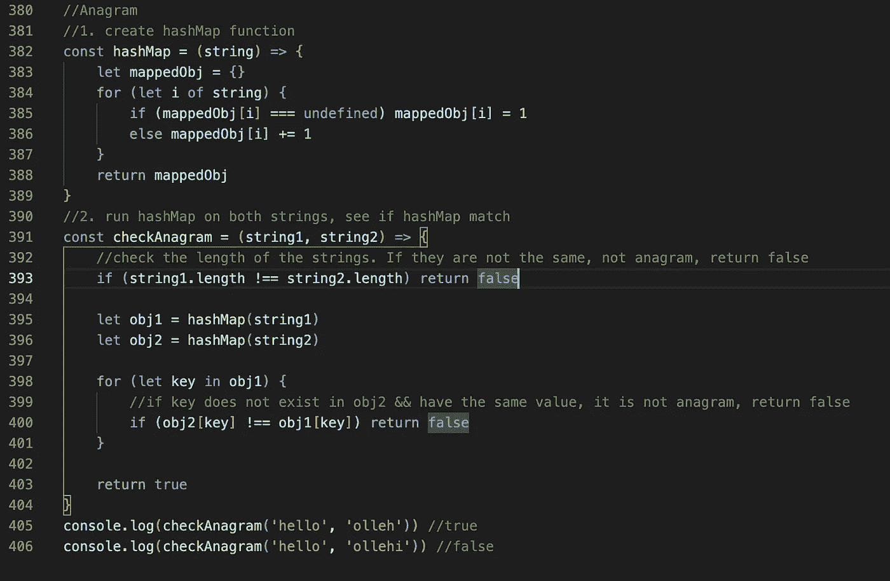
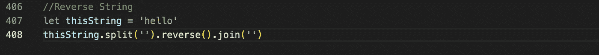
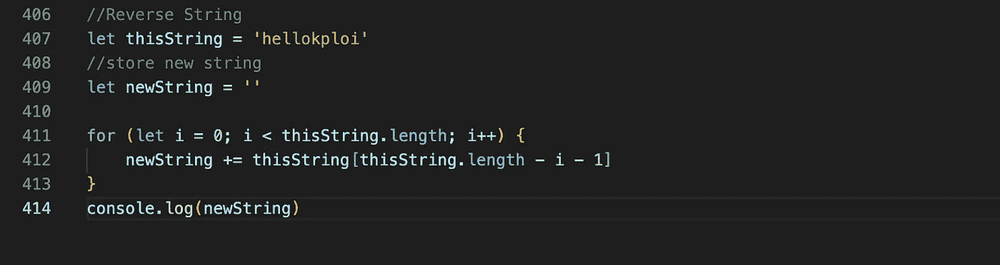
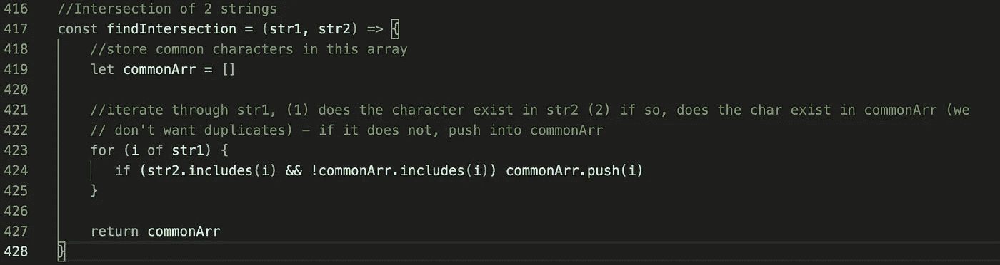
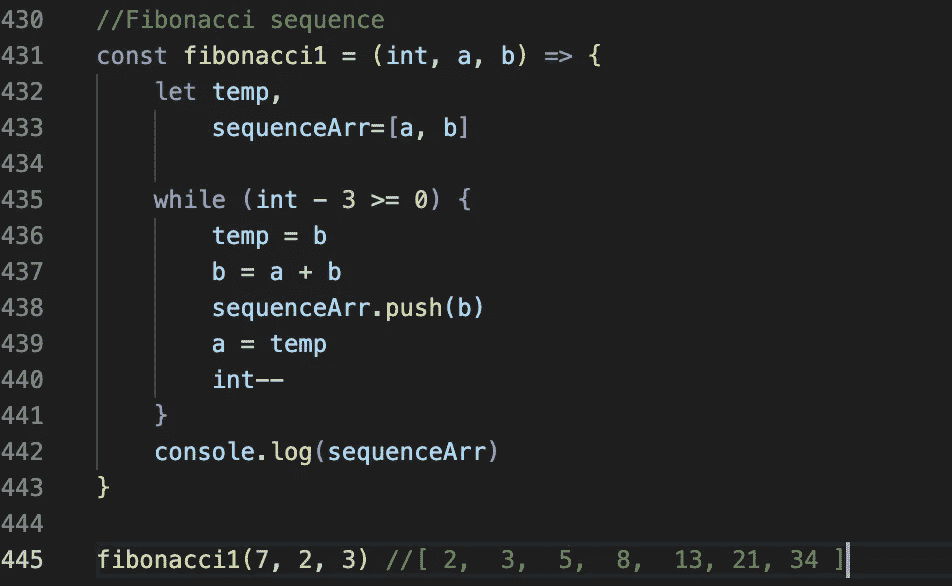

# 面向初级开发人员的 JavaScript 编码面试问题

> 原文：<https://javascript.plainenglish.io/junior-developer-coding-interview-questions-coding-problems-javascript-a4bcb3bb1cc4?source=collection_archive---------3----------------------->

## 这是我在申请初级开发人员职位时得到的问题。

# 1.字谜

我的第一个面试问题——如何判断两个单词是否互为变位词？

**解决方案:**

1.首先，创建一个 hashMap 函数，它将把字符串映射到一个对象中，其中键-值对是字符串中的字符，以及它出现的次数。

2.创建一个接受两个字符串作为参数的函数。首先，检查两个字符串的长度是否相同——如果它们不相同，则这两个字符串不是字谜。其次，在两个字符串上运行 hashMap。遍历第一个对象，检查第二个对象中是否存在键值对——如果不存在，则字符串不是变位词。

find anagram using hash map and comparing objects

# 2.反向字符串

反转给定的字符串。

有两种方法可以做到这一点:(1)在 ES6 中使用逆向方法，或者(2)for 循环

1.反向方法

由于 *reverse()* 只对数组有效，我们使用*split(')*将我们的字符串分割成一个数组，然后对新数组应用 reverse。然后，我们使用*join(')*将数组再次转换为字符串。

reverse string using reverse method

2.For 循环

我们将把新字符串存储在变量“new string”中。我们希望将这个字符串的最后一个字符连接到新字符串。

我们将通过这个字符串得到最后一个字符。我们需要'-1 '，因为数组的索引从[0]和 length 开始—所以如果你的长度是 5，最后一个索引是[4]而不是[5]。

reverse string using for loop

# **3。2 个字符串的交集**

找到两个字符串的交集，也就是找到两个字符串的共同字符，没有重复。

1.首先，创建一个空数组来存储常用字符。如果找到一个共同的字符，推入这个数组。

2.第二，遍历 1 个 str —

I .如果 str2 中存在 char，则它是一个普通 char，接下来

二。检查你的 commonArr 还没有这个字符，如果是新的字符，推入 commonArr。

intersection of 2 strings

# 4.斐波那契数列

创建一个动态数组，每个元素是前两个元素的总和。你的函数应该接受 3 个参数——(1)数组的长度，(2)第一个整数，(2)第二个整数

模式:

**b** =前一元素

**a** =前一个，前一个元素

下一个字符将是 **(a + b)**

一旦有了 **(a + b)** ，电流 **b** 就变成了 **a** ，电流( **a+b** )就变成了 **b**

fibonacci sequence

就这些，谢谢，希望你觉得这些问题对你自己的面试准备有用。

*更多内容请看*[***plain English . io***](https://plainenglish.io/)*。报名参加我们的* [***免费周报***](http://newsletter.plainenglish.io/) *。关注我们关于*[***Twitter***](https://twitter.com/inPlainEngHQ)*和*[***LinkedIn***](https://www.linkedin.com/company/inplainenglish/)*。加入我们的* [***社区不和谐***](https://discord.gg/GtDtUAvyhW) *。*