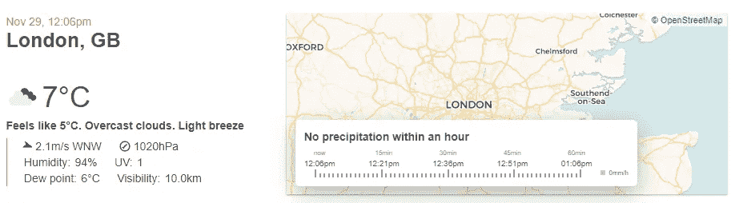
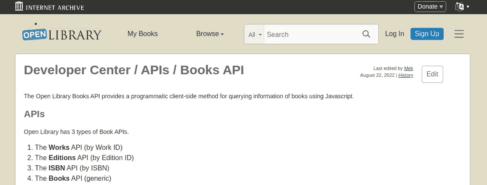
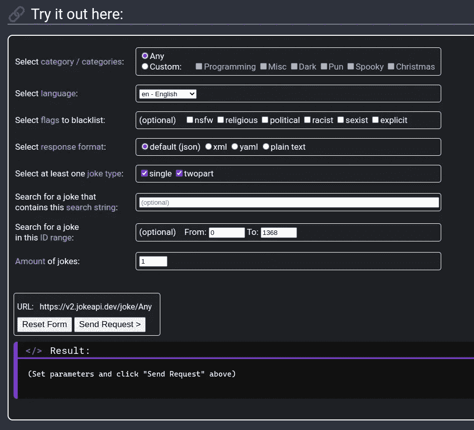
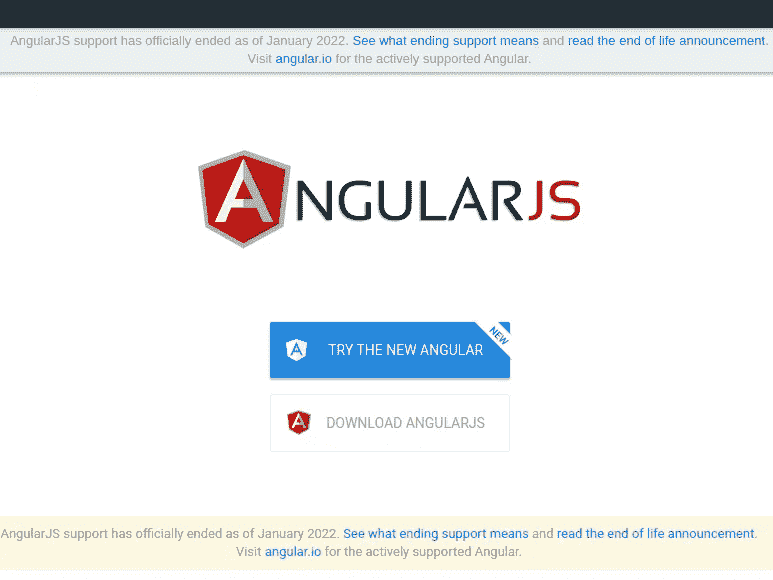

# 初级开发人员，编码任务和面试

> 原文：<https://javascript.plainenglish.io/junior-devs-coding-assignments-interviews-e3c72cfd5054?source=collection_archive---------5----------------------->

## 我个人的经历和对初级开发人员招聘过程的思考

在过去的几周里，我参与了初级前端开发人员的招聘过程。第一次“站在另一边”是一次相当不错的经历，在这里我分享一些可能对你有帮助的想法。


Photo by [Nick Fewings](https://unsplash.com/@jannerboy62?utm_source=medium&utm_medium=referral) on [Unsplash](https://unsplash.com?utm_source=medium&utm_medium=referral)

虽然一些例子使用了 Angular，但是大多数点都是与框架无关的。

如果您有更多问题，请随时联系我们或发表评论。

# 招聘过程

并非所有的招聘流程都是一样的。确保你提前知道，尤其是如果你有时间限制的话。

概括地说，招聘过程如下。

1.  **技术负责人准备职位需求**
    我和一位高级开发人员参与进来，表达我们对需求的看法。
2.  **HR 在 LinkedIn 和公司网站上发布职位空缺**
3.  **Tech Lead 过滤掉大部分候选人**
    尽管没有参与这一步，但我知道大部分候选人连这一关都过不了的一些原因。排名不分先后，我可以提到以下几点:
    -地点:公司没有提供搬迁套餐
    -技能:要么是错误的，要么与需求完全无关，没有任何所需技能
4.  **选中的候选人接受编码分配**
5.  **技术面试(包括对任务的讨论)**
    我和高级开发人员技术主管参与了这一阶段。我的反思主要是这个阶段和编码作业。
6.  **性格测试**
7.  **体能面试(包括关于性格测试的讨论)**
8.  **最终报价**

招聘信息在网上发布一周后，有四名候选人被选中。四名候选人接受了一项独立完成的编码任务。

# 编码任务

编码任务包括构建一个允许用户与 API 交互的 JavaScript 或 Angular 应用程序。用户应该能够搜索一个城市，并获得有关该城市的数据。

这不是一项非常困难的任务。但是，请记住，该职位面向初级开发人员。

此外，这些类型的练习需要一些在大多数开发工作中非常常见的东西。因此，他们是一个很好的代理，看看候选人如何工作和思考。

具体来说，在这项任务中，候选人应该:

1.  使用 Angular 或 JavaScript 创建一个简单的 UI。我们对 CSS 框架没有任何要求。
2.  添加一些元素使应用程序具有交互性，例如输入、按钮等。
3.  处理与 API 的交互，例如 HTTP 请求。
4.  根据某些要求显示数据。

如果你想练习，这里有几个你可能想考虑的 API。

## 开放天气

最流行的 API 之一是 [OpenWeather](https://openweathermap.org/) 。正如网站“*所报道的，对于地球上的每一个点，我们都通过光速 API 提供历史、当前和预测的天气数据。*



[OpenWeather](https://openweathermap.org/) website

## 开放图书馆

这个[开放图书馆](https://openlibrary.org/dev/docs/api/books)相当不错，尤其是如果你喜欢阅读的话。

" *Open Library 提供了一套 API 来帮助开发人员使用我们的数据。这包括 RESTful APIs，它使得开放库数据以 JSON、YAML 和 RDF/XML 格式可用。*”



[OpenLibrary](https://openlibrary.org/dev/docs/api/books) website

## 笑话 API

joke API*是一个 REST API，提供统一且格式良好的笑话。
无需任何 API 令牌、会员、注册或付费即可使用。*

有些笑话可能相当激烈。确保在使用之前阅读文档。

你可以在这里尝试一下。



[JokeAPI](https://v2.jokeapi.dev/#getting-started) website

# 技术面试

虽然我不会直接谈论候选人，但值得一提的是，他们在教育、技能和职业经历方面有着非常不同的背景，从实习到几年的职业经历不等。

现在，如果你认为几年的经验肯定会占上风，那么继续读下去，因为你会大吃一惊。

总的来说，所有候选人都提交了一个可用的应用程序。那么，是什么让他们与众不同呢？

让我们深入研究一下。

## 情节扭曲

最有经验的候选人使用 AngularJS 交付了一个工作应用程序…

那个人甚至懒得提醒我们这件事。我知道 [Angular](https://angular.io/) 和 [AngularJS](https://angularjs.org/) 听起来可能相似，但前者不是后者的渐进演变。因此，就此而言，候选人可以使用 Vue。



AngularJS support has officially ended as of January 2022

**第一个念头:**希望考生知道区别。

当公司向 Angular 迁移时，了解 AngularJS 可能是一个优势。然而，第一印象并不好。

此外，候选人使用了一些只有高级开发人员听说过的晦涩的包。最重要的是，这些包复制了节点功能。

**第二个想法:**为什么候选人不麻烦看一下官方的[棱角](https://angular.io/)文档？

人们有工作之外的生活。他们有朋友、家庭、爱好等等。然而，提交作业没有时间限制。我们差不多在一周内收到了它们。

这位候选人没有花一分钟来提高技能。

**第三种想法:**候选人真的在乎这个职位吗？

**关键要点:使用工作申请中要求的技术。如果你做不到，至少警告招聘人员。**

## **App 结构**

Angular 是一个固执己见的框架，支持清晰的结构。

其他框架和库没有这么严格，因此要确保遵循最佳模式。

适用于每个框架的是组件文件夹的结构。

这可能看起来微不足道，但它有助于我理解你的应用程序的结构。此外，如果在同一个“components”文件夹中有状态管理、表示组件和 API 调用，可能是时候稍微重新考虑一下结构了。

有多种方法来组织你的应用程序，例如按功能或按特性。

例如， [Angular](https://angular.io/guide/architecture-services) " *服务适用于从服务器获取数据、验证用户输入或直接登录控制台等任务。*”

因此，不要在组件中获取数据。获取服务中的数据，注入服务并从组件中使用其方法。

目前，我没有很好的资源可以分享，但是如果一些读者有，请随时让我知道并分享。不幸的是，YouTube 和其他平台上的许多视频都忽略了这些方面。

**关键要点:保持结构整洁**

## 命名

恰当地命名变量很重要。如果我要和你一起工作，让我的生活轻松点！

如果一个变量将要存储一个用户的名字，那么就用像 *userName* 这样有意义的东西来命名它！不要叫它 *u* ，或者*用户，*或者 *uName。*

如果能使用 TypeScript，那就更好了。

```
const userName = "Leyla" // ok
const userName: string = "Leyla" // ok

// Not so ok
const u = "Leyla"
const uName = "Leyla"
const usrNm = "Leyla"
```

这里的要点是，你将在一个团队中工作，在那里你将从事其他人的代码，反之亦然。

虽然这是一个最佳实践，但在团队中工作时，这一点更为重要。

这同样适用于函数等。

如果调用一个函数更新一个用户名，就叫它有意义的东西

```
const updateUserName = (newUserName) => {
  // logic
}
```

再说一次，添加 TypeScript 只能是一件好事。

> 您应该像命名第一个孩子一样小心地命名一个变量。
> 
> 詹姆斯·科普林

**关键要点:给变量命名，就像它们是你的孩子一样**

## 隐藏秘密变量

除了一个人，所有的候选人，甚至那些不太熟悉 Angular 的人，都提交了一个 Angular 应用程序。

所有四个候选人的共同反馈是更好地管理 API 密钥。

隐藏秘密 API 密钥的一种方法是使用一个`.env`文件。

在 Angular 中，可以使用 [dotenv](https://www.npmjs.com/package/dotenv) 包。

在 React 中，如果您使用 Create React App 创建一个应用程序，环境变量是开箱即用的。

在下面的文章中，我使用 DALL-E API 从一些文本中生成图像。在本文中，我使用环境变量来隐藏 API 键。

[](https://betterprogramming.pub/build-a-react-app-using-dall-e-api-bd15d5d67b31) [## 使用 DALL-E API 构建一个 React 应用程序

### 使用 DALL E OpenAI 和 React 创建独特的图像

better 编程. pub](https://betterprogramming.pub/build-a-react-app-using-dall-e-api-bd15d5d67b31) 

**关键外卖:** **不要分享你的秘密**

## 打扫

这是我所看到的各种各样的潜在改进。

1.  删除 console.log 和没有附加值的注释。一些开发人员喜欢有很多注释，但是好的命名和清晰的结构会有所帮助。
2.  关注点分离、干燥等。总是好的
3.  在 URL 字符串中硬编码变量通常不是一个好主意，除非你有令人信服的理由这样做。

**关键外卖:不留僵尸代码**

## 试验

我们没有要求单元测试或 E2E 测试，但是，除了一个候选人之外，所有人都至少编写了一些基本的测试。

人们对测试、测试的有用性，甚至对编写测试的时机都有不同的看法。然而，很难低估像护栏一样的测试的有用性。

理想情况下，我希望测试能够保护我或开发我的代码的开发人员不会得到意外的结果。

> 你写的所有软件都将被测试——如果不是由你和你的团队，那么是由最终用户——所以你最好计划一下测试。
> 
> 务实的程序员

关键要点:编写一些测试是个好主意

## 时机问题

我们有望收到 100 多份那个职位的申请。

虽然技术负责人不时会看一些新的，但很明显，在这一点上，前四名候选人中的任何一个都有更高的机会。

明星候选人可能在剩下的候选人中，但事实是我们可能看不到他们。这可能不是每个公司都如此，但我怀疑这是许多公司的真实情况。

你能做些什么呢？

如果你看中了一家公司，就在 LinkedIn 上关注他们，以及他们可能发布新职位空缺的任何地方。如果可能的话，试着提前准备好你的简历和求职信。

你能和现在的员工联系并获得推荐吗？

你能联系招聘经理吗？

**关键要点:时机很重要**

# 最终考虑

以上所有的想法都是编写更好代码的一般方向。

然而，在我看来，没有一个足以拒绝初级开发人员。

大多数候选人表现出了他们的关心。我哪里知道？GitHub 提交。

他们中的一个人完成了一个 Angular 项目，大概是为了学习或更新 Angular，就在开始做作业之前！

这很好，因为它告诉我，这个人有学习的能力和意愿，这可以说是任何初级职位中最重要的事情之一。

最后，我不指望任何一个初级开发者“什么都懂”。在我看来，说你不熟悉一些概念是完全可以的。

充分利用这一点，并随时提问。

*更多内容请看*[***plain English . io***](https://plainenglish.io/)*。报名参加我们的* [***免费周报***](http://newsletter.plainenglish.io/) *。关注我们关于*[***Twitter***](https://twitter.com/inPlainEngHQ)[***LinkedIn***](https://www.linkedin.com/company/inplainenglish/)*[***YouTube***](https://www.youtube.com/channel/UCtipWUghju290NWcn8jhyAw)*[***不和***](https://discord.gg/GtDtUAvyhW) *。对增长黑客感兴趣？检查* [***电路***](https://circuit.ooo/) *。***