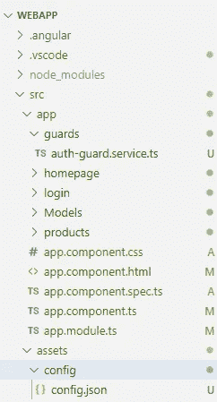
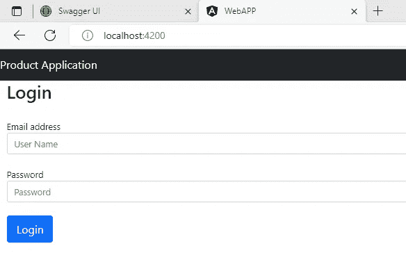
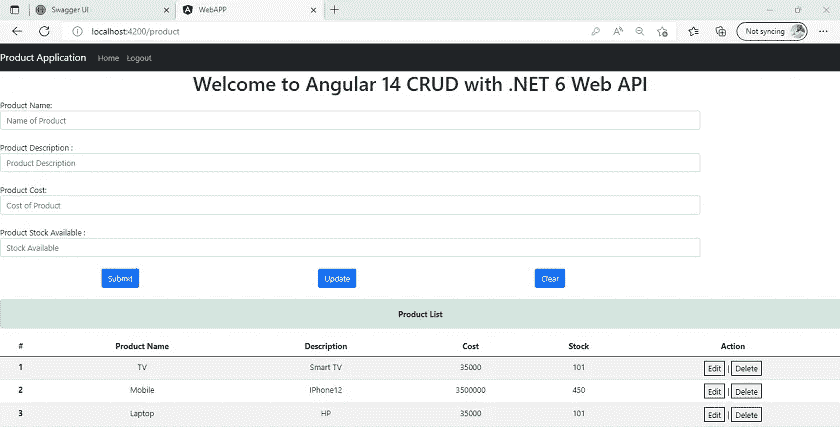

# Angular 14 和中的 JWT 令牌认证。NET Core 6 Web API

> 原文：<https://javascript.plainenglish.io/jwt-token-authentication-in-angular-14-and-net-core-6-web-api-c3237cb4204?source=collection_archive---------1----------------------->

## Angular 14 中的 JWT 认证分步指南。


Photo by [Christopher Gower](https://unsplash.com/@cgower?utm_source=medium&utm_medium=referral) on [Unsplash](https://unsplash.com?utm_source=medium&utm_medium=referral)

我们将在 Angular 14 中逐步讨论 JWT 认证。

如果你想了解 JWT 令牌的基本知识和细节，那么看看下面的网址。

[](https://medium.com/@jaydeepvpatil225/introduction-and-detail-about-the-jwt-authentication-and-authorization-5a812e6d154c) [## 关于 JWT 认证和授权的介绍和细节

### 我们将讨论使用 JWT 令牌和不同的加密算法和技术的认证和授权…

medium.com](https://medium.com/@jaydeepvpatil225/introduction-and-detail-about-the-jwt-authentication-and-authorization-5a812e6d154c) 

在那里，我已经解释了 JWT 认证和授权的基础和细节。

此外，我建议你在开始这篇文章之前阅读下面的文章，我解释了如何建立一个后端服务器应用程序 using.NET 核心 6。

[](https://medium.com/@jaydeepvpatil225/jwt-token-authentication-using-the-net-core-6-web-api-24e585ecc24a) [## 使用 JWT 令牌进行身份验证。NET Core 6 Web API

### 我们将讨论 JWT 令牌认证和实现。NET 核心 API 6。

medium.com](https://medium.com/@jaydeepvpatil225/jwt-token-authentication-using-the-net-core-6-web-api-24e585ecc24a) 

在本节中，我们将逐步讨论以下内容:

*   介绍
*   创建角度应用程序
*   添加自举和烤面包机模块
*   授权守卫
*   角度服务
*   创建角度组件

让我们一件一件地开始

## **简介**

*   JSON Web Token 是开放标准(RFC 7519)的自包含方式，它将作为 JSON 对象在不同的环境中安全地传输数据。
*   RFC(征求意见稿)是远程函数调用的简称，也是互联网工程任务组的正式文档。RFC 7519 JSON Web Token(JWT)2015 年 5 月版权声明版权所有 2015 IETF Trust 和文档作者。保留所有权利。
*   JWT 是可信的身份验证方式，因为它使用 HMAC 算法进行数字签名和保密，或者有时使用 RSA 的公钥/私钥。
*   基本上，HMAC 代表基于哈希的消息认证码，它使用一些伟大的加密哈希技术，为我们提供了很大的安全性。
*   此外，JWT 是 OAuth 和 OpenID 等强大的身份验证和授权框架的一部分，这些框架将提供安全传输数据的强大机制。

## **创建角度应用**

**第一步:**

使用以下命令创建角度应用程序

```
ng new WebAPP
```

**第二步:**

我们在这个应用中使用 bootstrap。因此，使用以下命令安装引导程序

```
npm install bootstrap
```

接下来，在脚本和样式部分的 angular.json 文件中添加引导脚本

**第三步:**

为弹出和通知安装烤面包机模块

```
npm install ngx-toastr –save
```

然后，在 angular.json 文件的 styles 部分添加烤面包机

**第四步:**

应用程序结构



**第五步:**

在 assets 中创建 config 文件夹，并在其中创建 config.json 文件，如下所示，并将后端应用程序 API URL 放入其中

```
{
    "apiServer": {
      "url": "[https://localhost:7299](https://localhost:7299/)",
      "version": "v1"
    }
}
```

**第六步:**

在守卫的文件夹中创建授权守卫

在这里，您可以看到我们从本地存储中获取 JWT 令牌，稍后检查令牌是否过期，如果令牌过期，它将重定向到登录并返回 false。

**第七步:**

打开应用程序组件文件，并在其中添加以下代码

应用程序组件

app.component.html

**第八步:**

在 app 目录中创建一个模型文件夹，并在其中创建一个产品类

**第九步:**

创建主页组件

主页.组件. ts

homepage.component.html

**第十步:**

创建登录组件

登录.组件. ts

login.component.html

**第十一步:**

创建产品组件

产品.组件. ts

products.component.html

**第十二步:**

接下来，创建一个产品服务来发送我们所有的请求，并从后端应用程序获取数据

**第十三步:**

将以下代码放入应用程序模块中

在这里，您可以看到，首先，我们放置了一些路由，并创建了一个从本地存储获取 JWT 令牌的方法，还在其中配置了 JWT 模块和授权保护。

**第 14 步:**

最后，运行您的应用程序

```
npm start
```

运行应用程序时，您将看到登录页面



登录后，您将看到产品页面



## **结论**

因此，我们在 Angular 14 中逐步讨论了所有 JWT 身份验证，以及如何在本地存储中存储令牌并在产品应用程序中使用它。

*更多内容看* [***说白了。报名参加我们的***](https://plainenglish.io/) **[***免费每周简讯***](http://newsletter.plainenglish.io/) *。关注我们* [***推特***](https://twitter.com/inPlainEngHQ) *和*[***LinkedIn***](https://www.linkedin.com/company/inplainenglish/)*。查看我们的* [***社区不和谐***](https://discord.gg/GtDtUAvyhW) *加入我们的* [***人才集体***](https://inplainenglish.pallet.com/talent/welcome) *。***