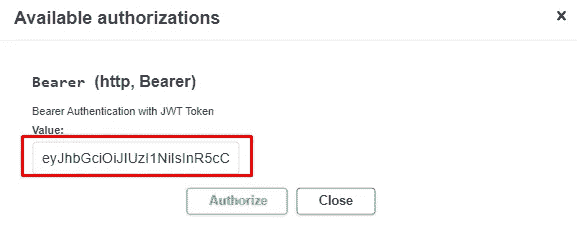
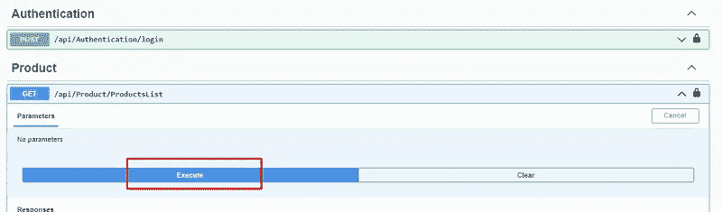

# 使用 JWT 令牌进行身份验证。NET Core 6 Web API

> 原文：<https://javascript.plainenglish.io/jwt-token-authentication-using-the-net-core-6-web-api-24e585ecc24a?source=collection_archive---------0----------------------->


我们将讨论 JWT 令牌认证和实现。NET Core API 6

在阅读这篇博客之前，请访问我的以下博客，了解 JWT 令牌身份验证和授权的基础和细节，以及使用 JWT 的工作原理。

[关于 JWT 令牌认证和授权的介绍和细节](https://medium.com/p/5a812e6d154c)

让我们开始实现。NET Core 6 Web API，

**第一步:**

创建。NET Core 6 Web API 应用程序

**第二步:**

安装下面的 NuGet 包，我们将在整个应用程序中使用它们。

**微软。AspNetCore . authentic ation . jwtbearer**

**微软。EntityFrameworkCore**

**微软。实体框架工作核心设计**

**微软。EntityFrameworkCore . SQL server**

**微软。实体框架工作核心工具**

**牛顿软件。Json**

**StackExchange。Redis**

**Swashbuckle。AspNetCore**

**第三步:**

接下来，在解决方案中创建新的文件夹模型，并在其中创建一个产品类。

**第四步:**

在用于数据库操作的数据文件夹中创建一个 DbContextClass。

**第五步:**

稍后，在 Controllers 文件夹中创建 ProductController。

**第六步:**

现在，我们将在这个应用程序中使用 Redis 缓存。如果你明白分布式 Redis 缓存是如何工作的，请查看我的博客

[Redis 缓存在。NET Core Web API](https://medium.com/p/c8276167ef0c)

**第七步:**

在解决方案中创建缓存文件夹，并为 Redis 和 Connection Helper 创建几个类。所以，首先，为 Redis 缓存创建 ICacheService 和 CacheService。

接下来，为 Redis 缓存相关的功能创建 CacheService 类。

**第八步:**

创建 ConfigurationManager 类，我们用它来配置 appsetting.json 文件

**第九步:**

接下来，在缓存文件夹中创建 ConnectionHelper 类以获取 RedisURL 并将其配置到应用程序中。

**第十步:**

现在，我们将为 JWT 身份验证部分创建登录和 JWTTokenResponse 类

此外，为令牌创建 JWTTokenResponse 类

**第十一步:**

稍后，在控制器内部创建 AuthenticationController，用于用户的身份验证。

*   正如你在上面的类中看到的，我们从用户那里获取用户名和密码，然后获取我们放在 appsettings.json 文件中的密钥
*   接下来，使用 HMAC SHA256 加密算法为编码字符串创建使用秘密密钥的签名凭证。
*   后来，我们在创建令牌时添加了一些属性，如签名凭证、到期时间、发布者、受众，以及根据我们的需要和要求添加不同类型的声明。
*   最后，使用令牌处理程序创建令牌，并以编码的形式发送给最终用户。

**第十二步:**

在 appsetting.json 文件中添加一些环境变量

**第十三步:**

接下来，在程序类中注册与 JWT 身份验证、用于身份验证的 Swagger UI、CORS 策略和缓存服务相关的所有服务器，如下所示

**第十四步:**

最后，在实体框架的包管理器控制台中执行以下命令，以进行数据迁移和数据库更新。

```
add-migration “First”update-database
```

**第十五步:**

运行应用程序，在提供凭证后创建令牌，并将其放入 swagger UI 中的 Authorize 选项卡，如下图所示



这就是 JWT 认证的全部内容。NET Core 6 Web API。

我希望你理解了这些事情，现在对事情的运作有了一个概念。

编码快乐！

*更多内容看* [***说白了。报名参加我们的***](https://plainenglish.io/) **[***免费周报***](http://newsletter.plainenglish.io/) *。关注我们关于*[***Twitter***](https://twitter.com/inPlainEngHQ)*和*[***LinkedIn***](https://www.linkedin.com/company/inplainenglish/)*。查看我们的* [***社区不和谐***](https://discord.gg/GtDtUAvyhW) *加入我们的* [***人才集体***](https://inplainenglish.pallet.com/talent/welcome) *。***