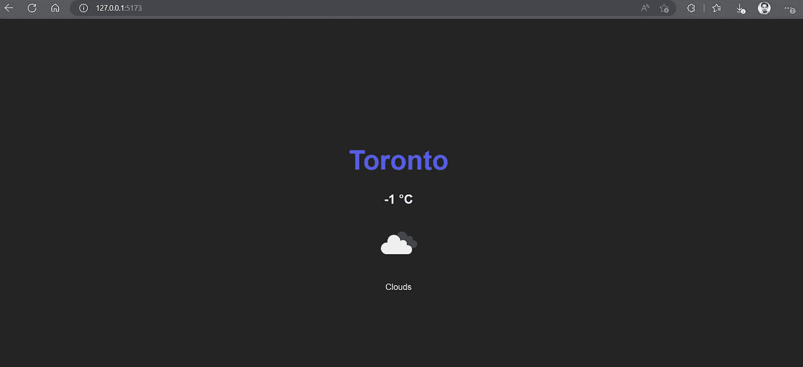

# 如何在 React 中隐藏 API 键和令牌来保护应用程序？

> 原文：<https://javascript.plainenglish.io/keep-your-application-secure-discover-how-to-hide-your-api-keys-and-tokens-in-react-364bb5a45372?source=collection_archive---------0----------------------->

## 在带有 Vite 和 nodejs 的 Reactjs 中使用环境变量


Photo by [regularguy.eth](https://unsplash.com/@moneyphotos?utm_source=medium&utm_medium=referral) on [Unsplash](https://unsplash.com?utm_source=medium&utm_medium=referral)

您是否注意到一些应用程序在其源代码中有 API 密钥、令牌或其他可见的敏感凭证？或者您自己的应用程序？

嗯，这可能很危险，会使您的服务处于危险之中。

API 密钥、令牌和其他敏感凭证用于验证和授权对服务和 API 的访问。如果这些数据在应用程序的源代码中公开，任何可以看到您的代码的人都可以访问它，并使用它来代表您执行未经授权的操作。

此外，通过公开您的凭据，您允许第三方使用它们，这可能会影响您的服务的性能或质量，甚至对它们进行攻击。

本教程将向我们展示如何隐藏您的 API 密钥、令牌和其他敏感凭证。

## 如何隐藏敏感数据？

实现这一点的一些方法有:

*   使用环境变量
*   使用代理服务器或后端平台即服务(BaaS)
*   使用安全的托管平台

通过这种方式，您可以保护服务的安全性，防止它们受到危害。

现在，我们将看到如何通过为 React 应用程序构建一个小型后端来隐藏敏感凭证。

## 在与 Vite 反应中使用环境变量

在本教程中，我们将添加一个 [OpenWeather](https://openweathermap.org/) APY 键作为环境变量。

具体来说，我们将使用[天气 API](https://openweathermap.org/current) ，这是一个提供天气数据的服务，在一定数量的请求之后，它开始对请求进行收费，所以我们不希望这个 API 密钥对公众可用。

要在 React with Vite 中配置环境变量，我们可以遵循以下步骤:

1 —使用 [Vite](https://openweathermap.org/current) 创建您的 React 应用程序。我将使用 TypeScript，但如果你愿意，你也可以使用 JavaScript。

2 —在项目的根目录下创建一个`.env`文件。这个文件应该包含您希望在应用程序中使用的环境变量。

```
API_KEY=784dc6d4eXXXXXXXXb14460d3a356565
PORT=3001
```

一旦我们创建了我们的`.env`文件，我们一定不能忘记将它附加到 git 的`.gitignore`文件，否则，我们的 API 密匙将会暴露在存储库中。

3—在 Vite 中，要访问环境变量，我们需要通过`import.meta.env`来访问它们。这将返回一个包含 Vite 已知的可用环境变量的对象。

创建的变量必须有前缀`VITE_`，或者可以是覆盖默认配置选项 [envPrefix](https://vitejs.dev/config/shared-options.html#envprefix) 的另一个前缀。

```
const API_KEY = import.meta.env.VITE_API_KEY
```

4 —现在我们将创建一个简单的应用程序，它将获取天气 API 来检索城市的温度。

```
import { useEffect, useState } from "react"
import { ResponseWeather } from "../types"

const API_KEY = import.meta.env.VITE_API_KEY

import "./App.css"

function App() {
 const [weather, setWeather] = useState<ResponseWeather | null>(null)

 useEffect(() => {
   const options = {
     method: "GET",
     url: `https://api.openweathermap.org/data/2.5/weather?lat=43.7001&lon=-79.4163&appid=${API_KEY}`)
     headers: {
      "Content-Type": "application/json",
     },
  }

  axios.request(options).then(response => {
   setWeather(response.data)
  })

 }, [])

 if (!weather) return null

 return (
  <div className='App'>
   <h1>{weather?.name}</h1>
   <h2>{Math.floor(weather?.main.temp - 273.15)} °C</h2>
   <i>
     
   </i>
   <p>{weather?.weather[0].main}</p>
  </div>
 )
}

export default App 
```



Fetch Weather API

现在我们已经用一个环境变量隐藏了我们的 API 键，并确保了`.env`文件没有上传到存储库中，我们已经完成了一半的工作。

**更新:**尽管保证应用程序安全的工作还不到一半，但这是我们在客户端能做的全部工作。确保我们没有在公开的存储库中保存项目的密钥或敏感变量。因为这将是另一个易受攻击的访问途径，所以有人可能无法访问 web 上的应用程序，但可能能够以某种方式找到项目的存储库。

我们为什么这么说呢？因为我们的 API 密钥在最终版本中仍然是公开的，如果我们在浏览器中检查我们的应用程序，我们会发现 API 密钥的值，所以完全隐藏该值的唯一方法是在服务器端创建一个后端服务。

这个后端将负责向 Openweather 服务和我们的客户端发出请求，也就是说，我们的 React 应用程序将查询这个后端。

## 创建后端服务

要创建我们的后端，我们需要设置一个服务器，我们可以向它发出请求。

1 —我们将安装以下库:

```
pnpm express cors dotenv axios
```

在我们使用 Typescript 的情况下，我们还需要

```
pnpm ts-node @types/express @types/cors @types/dotenv @types/node
```

*   [express](https://expressjs.com/) 创建服务器
*   [cors](https://github.com/expressjs/cors#readme) 实现不同域之间的资源共享。
*   [dotenv](https://github.com/motdotla/dotenv#readme) 加载环境变量。
*   [axios](https://axios-http.com/) 获取数据。

2 —我们在项目的根目录下创建一个名为`api.ts`的文件。我们还借此机会向`package.json`添加一个新命令来提升我们的服务器。

```
"scripts": {
  "server": "npx ts-node api.ts",
  ...
}
```

3 —我们创建服务器，并使我们将在 React 中使用的端点可用。

```
import express from "express"
import { Request, Response } from "express"
import * as dotenv from "dotenv"
import cors from "cors"
import axios from "axios"

dotenv.config()

const app = express()

app.use(cors())

app.get("/api/weather", (req: Request, res: Response) => {
 const options = {
  method: "GET",
  url: `https://api.openweathermap.org/data/2.5/weather?lat=43.7001&lon=-79.4163&appid=${process.env.VITE_API_KEY}`,
  headers: {
   "Content-Type": "application/json",
  },
 }

 axios
  .request(options)
  .then(response => {
   res.json(response.data)
  })
  .catch(err => {
   console.log(err)
  })
})

app.listen(process.env.VITE_PORT, () => console.log(`Server on port ${process.env.VITE_PORT || 3001}`))
```

现在我们有了后端服务，我们的 API 密钥对客户端是完全隐藏的。我们可以根据需要添加更多的安全层，例如，在 cors 中，只添加托管我们的应用程序的域，并且只有该域可以发出请求。

4 —我们使用以下命令启动服务器

```
pnpm run server
```

最后，我们只需要将 React 中请求的 URL 替换为后端中的 URL。我们不再需要在 React 中检索 API 键。

```
// Before
url: `https://api.openweathermap.org/data/2.5/weather?lat=43.7001&lon=-79.4163&appid=${API_KEY}`)

// After
 url: "http://localhost:3001/api/weather"
```

就是这样！我们的应用程序继续照常工作，只是我们不再在客户端公开 API 密钥。

[**这里回购。**](https://github.com/ljaviertovar/data-safe-react/tree/main)

## 结论

总之，隐藏敏感数据是一件相对容易的事情，只要遵循上面提到的步骤，我们就可以避免重大风险和复杂性。

我希望这将有助于你保持你的项目安全。

**阅读更多:**

[](https://blog.bitsrc.io/how-to-auth-login-with-github-and-google-in-a-react-and-backend-app-77423565b506) [## 如何在 React 和后端应用程序中使用 GitHub 和 Google 认证登录

### 实现社交登录:分步指南

blog.bitsrc.io](https://blog.bitsrc.io/how-to-auth-login-with-github-and-google-in-a-react-and-backend-app-77423565b506) [](/how-to-set-up-a-graphql-server-and-client-in-next-js-step-by-step-guide-98a18088d7c6) [## 如何在 Next.js 分步指南中设置 GraphQL 服务器和客户端

### 用 Next.js 和 GraphQL 构建简单的 Web 应用程序

javascript.plainenglish.io](/how-to-set-up-a-graphql-server-and-client-in-next-js-step-by-step-guide-98a18088d7c6) 

**想联系作者？** 喜欢在 [Twitter](https://twitter.com/ljaviertovar) 上与世界各地的朋友联系。

*更多内容看* [***说白了。报名参加我们的***](https://plainenglish.io/) **[***免费周报***](http://newsletter.plainenglish.io/) *。关注我们关于* [***推特***](https://twitter.com/inPlainEngHQ) ，[***LinkedIn***](https://www.linkedin.com/company/inplainenglish/)*，*[***YouTube***](https://www.youtube.com/channel/UCtipWUghju290NWcn8jhyAw)*，以及* [***不和***](https://discord.gg/GtDtUAvyhW) ***。*****

***有兴趣缩放你的软件启动*** *？检查出* [***电路***](https://circuit.ooo/?utm=publication-post-cta) *。*