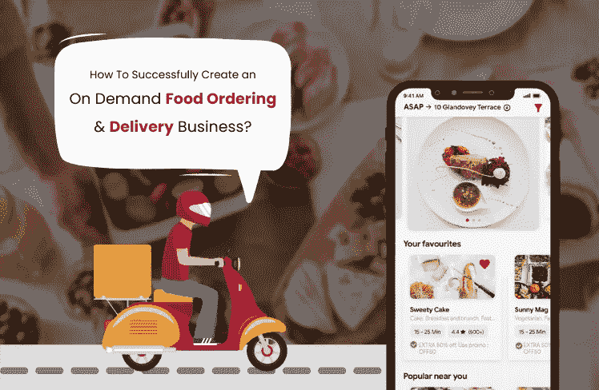

# 开发食品订购和交付应用程序时应考虑的关键属性

> 原文：<https://javascript.plainenglish.io/key-attributes-that-should-be-considered-while-developing-a-food-ordering-deliveryapp-3e54e7b2d762?source=collection_archive---------19----------------------->

## 让一款订餐 app 大获成功应该考虑的因素。

人们的生活变得越来越忙碌，尤其是在大都市地区。他们大部分时间都在工作空间，很少有时间专注于日常工作。为了管理他们忙碌的日程，他们更喜欢利用按需送餐应用程序开发服务，而不是花时间在厨房准备食物。大多数人遵循这种方法。在这篇博客中，我们将尝试了解让一款订餐应用获得巨大成功应该考虑的因素。

# 为什么网上食品订购市场是最好的选择？

一般来说，游客不喜欢访问他们所在地区的每个餐馆的网站，相反，他们更喜欢使用一个包含所有附近餐馆和咖啡馆的应用程序。

移动应用为你提供了一个庞大的客户群，你只需要说服人们使用你的应用。让我们来看看一些通过移动应用变得简单的日常业务操作。

*   订单处理得到简化。
*   用户可以在任何地方跟踪他们的订单。
*   他们甚至可以检查他们的送货代理的位置，这有助于他们确定准确的到达时间。
*   管理员可以从帮助中生成分析报告，帮助他们检查整个月的应用性能。
*   应用程序所有者也可以从应用程序中管理他们的收入。
*   通过该应用程序可以轻松管理促销交易和其他客户忠诚度计划。
*   管理员可以通过一个平台管理送货代理、餐馆老板和最终用户。

> 如果你想了解 android 和 iOS 最受欢迎的食品订购和交付应用，请点击此链接:

 [## 适用于 Android 和 IOS 的 4 款流行的食品订购和交付应用

### Ankit Patel 年 2 月 22 日 4 分钟阅读如果您打算开设食品订购和配送服务，我们已经列出了…

www.peppyocean.com](https://www.peppyocean.com/4-popular-food-ordering-and-delivery-apps-for-android-ios/) 

# 如何开始网上订餐业务？

许多人可能已经告诉你，你所需要做的就是买一个[优步的克隆应用](https://www.peppyocean.com/uber-clone-app/)，你将成为这个行业的下一个大人物。经营企业需要极大的努力和耐心。虽然有许多有利可图的前景，创业需要一些技术和商业问题的知识。要在市场上推出自己的 app，首先要确定现在的市场不足是什么，如何真正解决。

**做深入研究**

对食品行业进行深入研究，分析客户的具体要求和需求。讨论预算、应用规格、功能、营销策略、应用平台、应用类型等。讨论这些细节可以帮助你想出一个规划良好的应用模型。

**雇佣一家送餐 App 开发公司**

始终选择一家声誉良好、经验丰富的食品交付应用程序开发公司，它可以满足您的所有特定需求。谈到创业，原生移动应用至关重要。他们拥有多年的经验，非常了解所有垂直行业的最新趋势。您可以联系开发人员、项目经理和质量分析师，他们将专门负责您的项目并与您互动，让您了解应用开发流程的最新进展。

**高级功能**

这对于移动应用的成功起着至关重要的作用。你必须知道你的用户期望从应用程序中得到什么，并把这些功能添加到你的应用程序中。我们将进一步讨论可以增加你的应用价值并帮助你与对手竞争的特殊功能。

**关于开发送餐 App 的建议**

下单系统应该简单方便用户。你的应用程序的用户界面/UX 对你的应用程序的成功至关重要，所以一定要更加关注它。除此之外，建议同时开发 iOS 和 Android 应用程序，因为这将为您提供大量用户。你可以雇佣一个移动应用程序开发公司来设计一个与市场和你的目标受众相关的完美且震撼的应用程序。

**唯一性**

几乎每个领域的竞争都在加剧，所以你必须想出一些不同的、独特的东西。你必须给用户一个坚实的理由，为什么他们应该选择你的服务，而不是其他的。建议选择按需点餐 app 开发服务。你可以和他们分享你独特的想法和概念。

# 按需送餐应用程序的功能

要为您的食品业务创建一个出色的应用程序，您必须首先了解按需订购食品应用程序的基本功能。让我们来看看它的一些最重要的功能，这些功能可以增强您的用户体验

**轻松下单**

用户更喜欢简单的点餐过程。这只有在你的程序在设计时考虑到用户友好性的情况下才能实现。用户界面(UI)设计对于成功实现按需点餐应用至关重要。它是应用程序的用户界面，与应用程序通信并订购服务。如果你打算与一家[订餐应用开发公司](https://www.peppyocean.com/food-ordering-delivery-app-development/)合作，他们会以更好的方式提供帮助。建议选择 app 开发服务，效果更好。

**推送通知**

随着在线订餐的快速增长，有多个订餐应用程序是可以理解的。使用推送通知是获得可见性和保持竞争力的最佳方法。它帮助食品公司建立更好的客户关系。推送通知非常重要，因为它们用于发送有关折扣、特价、跟踪信息、订单状态和许多其他事情的信息。

另一件应该记住的事情是，你发送的信息必须给用户增加一些价值。不要向你的客户发送不相关的或仅与销售相关的通知，这会导致客户流失。尝试有效地管理推送通知，以便它们能够帮助您的业务应用程序实现可观的增长。

**交易、优惠、折扣、返现和忠诚度计划**

吸引顾客使用你的送餐应用程序的最佳方式是提供折扣和特别促销。为了保持客户的兴趣，你应该定期给予慷慨的折扣。根据研究，近 40%的用户使用这些应用程序寻找折扣和回扣，而 25%的用户使用这些应用程序只是为了获得忠诚度积分。

要赢得品牌忠诚度，吸引潜在客户比提高品牌知名度更重要。这就是为什么大企业认为忠诚度比品牌知名度更重要。

**实时跟踪**

顾客可以使用实时 GPS 跟踪他们食物的位置，这是送餐应用程序最重要的功能之一。GPS 的目标是向驾驶员和最终用户提供双向跟踪信息。管理员还可以检查食品配送代理的确切位置。一旦位置被确认，用户可以简单地跟踪递送人员的进展和移动。

顶级食品配送应用程序使用它，因为它有助于增强客户体验。谷歌地图、MapKit 和 Waze 的导航只是这一功能的几个出色的 API。最大的例子是优步，它在所有平台上都使用谷歌地图。

**简单的支付方式**

从企业主的角度来看，支付对任何企业都至关重要。尽管这是下订单过程的最后一步，但如果人们面临支付机制的任何问题，他们不会再次尝试。因此，请确保为用户添加最常用的支付选项，以便他们可以选择自己喜欢的支付方式。

人们可以通过各种支付网关和移动钱包软件(如谷歌钱包、Apple Pay、网上银行、COD、信用卡、借记卡等)进行支付。因此，管理员可以利用这个机会，在页面上推广他们的交易和折扣。

**社交媒体整合**

在过去的几年里，社交媒体已经达到了很高的水平。它为网络营销取得巨大成功做出了巨大贡献。通过检查评论，人们在选择食物时很容易做出正确的选择。这要感谢社交媒体。人们可以与他们爱的人分享他们最喜欢的食物的图像和视频。这就是为什么它是应用程序中必须具备的功能。

**评论和评级**

每个公司都重视消费者，因为他们是公司的命脉。反馈和评级有助于企业改进其服务，并增加客户非常喜欢的那些服务的存在。该功能允许您的客户根据他们列出的食物对应用程序上的其他餐厅进行排名和评论。

如果你的应用程序有很高的评分，很有可能会有很多人喜欢访问它。因此，在你的应用程序中包含一个反馈通道将允许你获得即时和简短的信息，这些信息是关于为了更好的客户体验，未来应该做出什么样的改变。

# 结论

这是开始订餐业务的好时机。随着如此多的人选择以家庭为基础的生活方式，这些企业预计将在未来几年蓬勃发展。按需点餐应用程序开发服务可以帮助您实现应用程序开发目标。

*更多内容看* [***说白了。报名参加我们的***](https://plainenglish.io/) **[***免费周报***](http://newsletter.plainenglish.io/) *。关注我们关于*[***Twitter***](https://twitter.com/inPlainEngHQ)*和*[***LinkedIn***](https://www.linkedin.com/company/inplainenglish/)*。加入我们的* [***社区***](https://discord.gg/GtDtUAvyhW) *。***