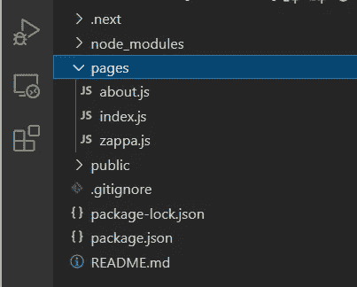

# 使用 Next.js 的要点

> 原文：<https://javascript.plainenglish.io/key-takeaways-from-using-next-js-6059a9dd5b52?source=collection_archive---------3----------------------->

## 关于 Next.js 如何工作以及使用它的利弊，我学到了一些东西。

Photo by [Nick Morrison](https://unsplash.com/@nickmorrison?utm_source=medium&utm_medium=referral) on [Unsplash](https://unsplash.com?utm_source=medium&utm_medium=referral)

Next.js 是我最近一直在使用的 React 框架。它旨在简化 React 应用程序的创建，并提供更快的页面加载速度。以下是我了解到的一些关于 Next.js 的工作方式以及使用它的一些利弊。

## 服务器端渲染

Next.js 的优势之一是页面加载速度更快。典型的 React 应用程序使用客户端呈现，这意味着服务器发送一个 JavaScript 文件，该文件组装 HTML 并使用浏览器呈现页面。这可能会导致页面的初始加载时间变慢，因为在构建之前必须先加载所有的 JavaScript。

Next.js 预先呈现页面，这意味着它在将页面发送到浏览器之前构建所有的 HTML。浏览器快速加载页面，然后运行 JavaScript 使其具有交互性。服务器端渲染的优势在于更快的初始加载时间和更好的搜索引擎优化。然而它也不是没有缺点。因为渲染是在服务器上完成的，所以它更耗费资源，因此也更昂贵。

## 按指定路线发送

React 库没有任何路由。相反，人们必须使用像 React 路由器这样的包来处理该功能。Next.js 自带基于页面的路由系统。这与 React 路由器声明路由的组件和道具系统的处理方式不同。相反，Next.js 有一个基于文件的路由系统，使用一个名为`pages`的目录。该目录中的每个文件或“页面”都是一个组件，根据文件名有自己的路径。

`pages`中的三档对应三条路线。文件`about.js`和`zappa.js`将被路由到`/about`和`/zappa`。名为`index.js`的文件将自动路由到`/`。为了链接到这些路由，Next.js 提供了一个`Link`组件。

`href`道具指向想要的路线。注意，您仍然需要在`Link`组件中使用一个`<a>`标签。

## 全局样式表

在 Next.js 中有多种处理 CSS 的方法。它可以内联完成，也可以像您在 React 中习惯的那样导入到组件中。当谈到 Next.js 中的全局样式表时，有一点需要做的工作值得一提。

Next.js 用一个全局`App`组件初始化前面提到的页面。要使用全局样式表，必须覆盖该组件。Next.js 有一种特殊的处理方式。在`pages`目录下创建一个名为`_app.js`的文件，并创建替换的`App`组件。然后可以在顶部导入全局样式表。

Next.js 将识别这个文件的存在，并使用它来代替默认的`App`组件。这里导入的样式表现在可以在应用程序的每个组件中使用。

## 利弊

根据所涉及的主题，以下是 Next.js 的优势:

*   又快又简单。开始构建应用程序所需的大多数包都已经捆绑在一起了。
*   服务器端渲染加快初始加载速度，优化搜索引擎。
*   具有内置的基于页面的路由系统，简化了流程

因为这个世界上没有什么是完美的，以下是缺点:

*   内置的路由系统可能会有局限性。React 在这里有更大的灵活性。
*   对于较大的应用程序，服务器端路由会导致更长的加载时间。

这些是我学到的关于 Next.js 的一些东西。我在这里只是触及皮毛，因为我最近才开始使用这个框架。随着我了解的更多，我会给你更新更多的印象和收获。注意安全，感谢您的阅读！

*更多内容看* [***说白了就是 io***](https://plainenglish.io/) *。报名参加我们的* [***免费周报***](http://newsletter.plainenglish.io/) *。关注我们关于*[***Twitter***](https://twitter.com/inPlainEngHQ)*和*[***LinkedIn***](https://www.linkedin.com/company/inplainenglish/)*。加入我们的* [***社区不和谐***](https://discord.gg/GtDtUAvyhW) *。*