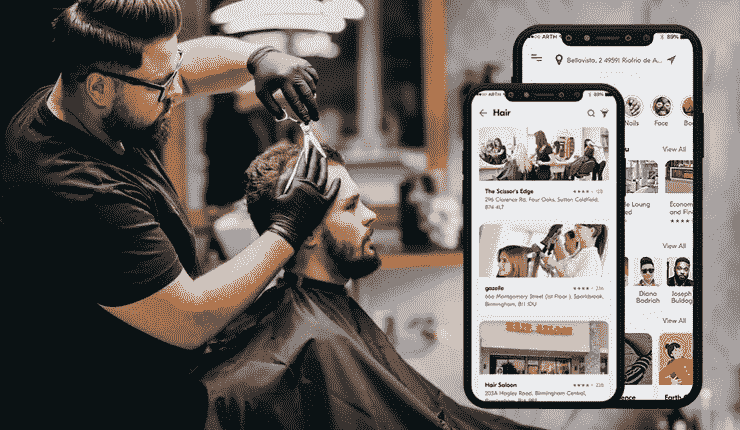
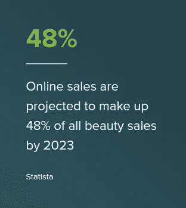
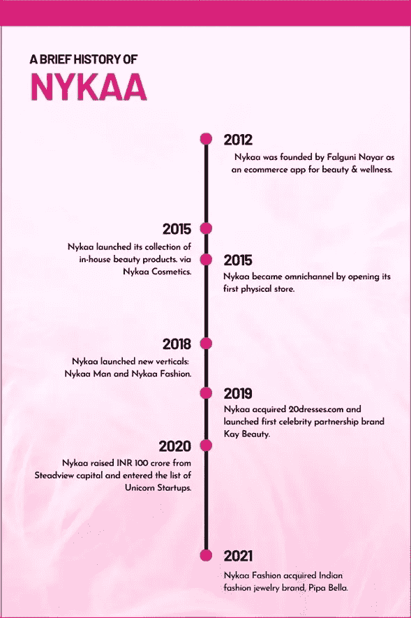
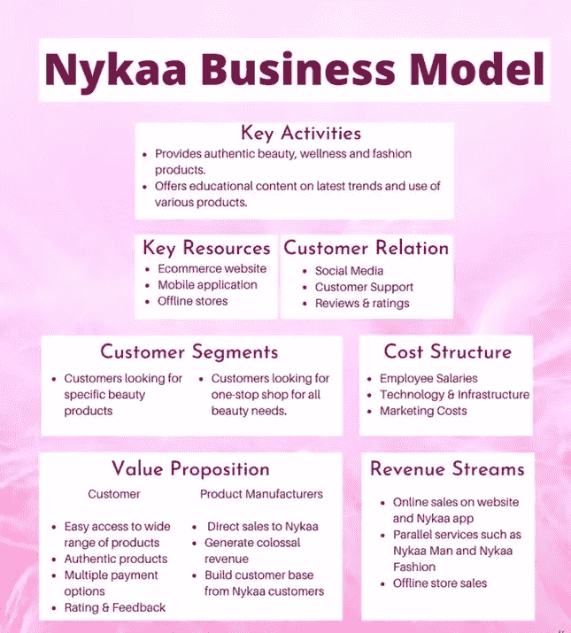

# 知道如何创建一个增加收入的沙龙应用程序

> 原文：<https://javascript.plainenglish.io/know-how-to-create-a-salon-app-that-drives-revenues-9395af7a2fed?source=collection_archive---------14----------------------->

Salon App

食品、杂货和美容是市场中最大的驱动力。虽然不是唯一的，这些可以被认为是一般人购物或下订单的地方。

然而，在本文中，我们将思考美容行业，以及按需解决方案如何在改变其运作方式方面发挥作用，总体而言，让消费者获得独特的购物和美容体验。最后，我们将列出构建美容和化妆品应用程序时非常有用的步骤，以便精简收入，最大化客户，提高投资回报率。

所以准备出发吧！我们开始吧。

## 美容应用的出现

人们去化妆品商店购买化妆品等的日子已经一去不复返了。随着疫情的到来，越来越多的人开始在网上购买这些商品。

这反过来又导致销售额大幅度上升。事实上，根据 Terokeet 的预测，到 2023 年，销售额将增长 48%左右。

看看下面这张图片，看看我们想说什么。

图片来源——terakeet.com

从这个数字可以清楚地看出，美容应用和沙龙应用已经能够抓住消费者的心，并且在未来几年也将如此。

这是由于下列因素造成的。

## 理发师和沙龙应用受欢迎的因素

> ***产品种类繁多***

沙龙应用程序的出现为用户提供了广泛的产品。这有助于他们选择他们需要或正在寻找的产品。

> ***性别友好的购物体验***

无论用户是男性还是女性，美妆应用都允许他们购买他们正在搜索的想要的物品；更加方便。换句话说，举个例子，一个顾客是男性；用户只需点击男性。这使得他们能够获得专门针对其性别的产品。这同样适用于女性。

> ***提供无与伦比的购买之旅***

barber & salon 应用程序上的搜索和过滤按钮可以让顾客获得独特的购物体验。简单地根据客户应用的过滤器，如价格范围、品牌偏好等，用户可以找到他们特别需要的产品。这确保了他们最终获得独特的购物体验。

> ***建立信任***

最后，企业通过美容应用获得的主要优势之一是信任。由于该应用程序为用户提供了退回他们可能不喜欢使用或不满意的商品的灵活性，并获得换货或退款，客户的信任水平在更大程度上得到了建立。

考虑到这些原因，很明显，拥抱[按需沙龙应用程序开发服务](https://www.peppyocean.com/)将在很大程度上提高包括他们在内的那些人的利润水平。这也将进一步增加他们的客户数量，从长远来看也能提高利润。

如今，许多美容应用程序除了帮助消费者找到他们正在寻找的化妆品外，还特别允许消费者拥有独特的购物体验。

在这里，我们将特别讨论 Nykaa 应用程序。

## 向您介绍 Nykaa 应用程序

看看下面这张图片，深入了解这个品牌的历史。它还将让你一窥自 2012 年由 Falguni Nayar 创作以来的独特历程。

Image Source: code-brew.com

妮卡于 2012 年由法尔古妮·纳亚尔(Falguni Nayar)构思，她在丝芙兰(Sephora)的一家商店目睹了员工提供个性化的产品建议和使用特定产品的技巧，多年来，她成功地在美容和健康产品领域开辟了一个利基市场

如今，该企业每个月都会收到近 13，000，000+份订单。与此同时，它还每分钟售出近 104 件产品。

看着这些数字，你可以理解妮卡打破了为顾客提供按需美容服务的束缚。

除了这些数字，还有这个品牌提供的一些服务-

# 尼卡-其服务

它为顾客提供各种美容和健康产品。这包括身体护理产品，化妆产品，等等。

*   **尼卡人**

其中，有专门针对男性的美容产品。

*   **妮卡时尚**

该服务侧重于交付品牌；和设计师时尚产品。这包括衣服、配饰等。

*   **Nykaa Pro**

Nykaa Pro 是一个会员计划，面向沙龙、美容师等。它为他们提供阅读和观看的内容，以便他们提供的沙龙服务是独特的，等等。

*   **尼卡奢华**

这项服务旨在为顾客提供高端品牌的奢侈品。

*   **尼卡时尚店**

这项服务主要提供流行品牌的化妆品和美容产品。这还包括介绍专业人士，帮助客户从应用程序中找到符合他们个性的产品。

因此，作为所有这些产品的结果，Nykaa 赢得了客户的喜爱。最重要的是，它激励了新的创业公司开发类似的应用。

## 为什么为你的美容创业公司建立一个像 Nykaa 这样的应用程序是一个好主意？

建立一个像 Nykaa 这样的美容和化妆品应用程序将允许创业公司向客户提供各种各样的美容产品，并为客户提供独特的购物体验。最后，它将有助于美容初创公司赚取健康的用户比例，并从长远来看赚到大钱。

因此，如果你是一个新的美容企业，想要在美容界做大，并获得如何开发像 Nykaa 这样的理发师和沙龙应用程序的知识，请遵循以下步骤。

 [## 像 YouCam Clone 这样的虚拟化妆应用程序:发现它的一切

### ankit Patel 2021 年 4 月 30 日 5 分钟阅读你有没有想过自己可以在几分钟内完成照片编辑？当然可以…

www.peppyocean.com](https://www.peppyocean.com/blog/everything-about-virtual-makeup-app-like-youcam-clone/) 

## 如何开发像 Nykaa 这样的理发师&沙龙 App？

当你开始构建一个像 Nykaa 这样的美容和化妆品应用程序时，你首先需要接受商业模式方面的教育。

这就是了。

请看下图。

Image Source: code-brew.com

看着这幅图，你可以对 Nykaa 关注的目标和实现目标的手段有一个基本的了解。这包括他们关注的客户群、成本结构等。此外，它还包括应用程序在提供不同产品和赚取收入等任务中的便利程度。

一旦你更好地理解了这个领域，你就可以按照这些步骤为你的新企业开发应用程序。这将帮助您无缝地为您的用户提供独特的美容服务。这也将使你的企业获得客户的高度信任。这将最终在很大程度上帮助你的企业向前发展。

## 为你的美容初创公司开发 Nykaa 这样的应用程序时要遵循的步骤

1.努力使应用程序设计尽可能具有交互性。这将允许用户在不同的产品类别和品牌之间导航。

2.让应用程序在 Android、iOS 和网站等平台上都能轻松运行

3.包括使应用程序之旅对用户来说独一无二的功能和工具。你可以添加一些像趋势产品展示，季节性书籍，愿望清单，等等。添加这些将使用户最大限度地参与到你创建的应用中。

4.客户应该是你在应用程序中的主要关注点。因此，努力增加实时聊天，以便用户可以发布问题或疑问，并获得快速帮助。

5.灌输库存和用户管理工具，帮助您的企业无缝跟踪缺货商品。此外，你将能够执行任务，如了解新的注册，奖励点，等等。

在建立过程中考虑到所有这些方面，你可以构思一个[按需沙龙应用程序](https://www.peppyocean.com/barber-salon-app-development/)，为你的新美容事业创造价值。这也将帮助你获得大量的客户，并最大限度地提高收入和投资回报率。

## 结尾词

Nykaa 在改变美容和化妆品行业向顾客提供不同服务的方式方面发挥了重要作用。从长远来看，这有助于企业赚取巨额利润，用户也是如此。

因此，今天就为你的美容初创公司开发一款类似 Nykaa 的应用吧。这将帮助您通过您的应用为用户提供独特的购物体验。它还将授权美容师提高他们提供美容服务的方式。最后，它会把你的企业带到一个前所未有的充满成功和收益的目的地。

*更多内容请看*[***plain English . io***](https://plainenglish.io/)*。报名参加我们的* [***免费周报***](http://newsletter.plainenglish.io/) *。关注我们关于*[***Twitter***](https://twitter.com/inPlainEngHQ)*和*[***LinkedIn***](https://www.linkedin.com/company/inplainenglish/)*。查看我们的* [***社区不和谐***](https://discord.gg/GtDtUAvyhW) *加入我们的* [***人才集体***](https://inplainenglish.pallet.com/talent/welcome) *。*