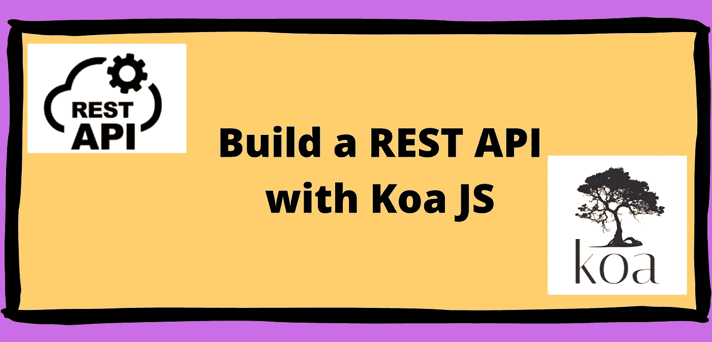
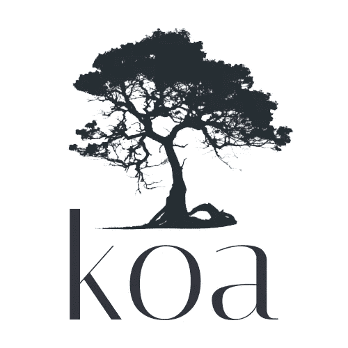
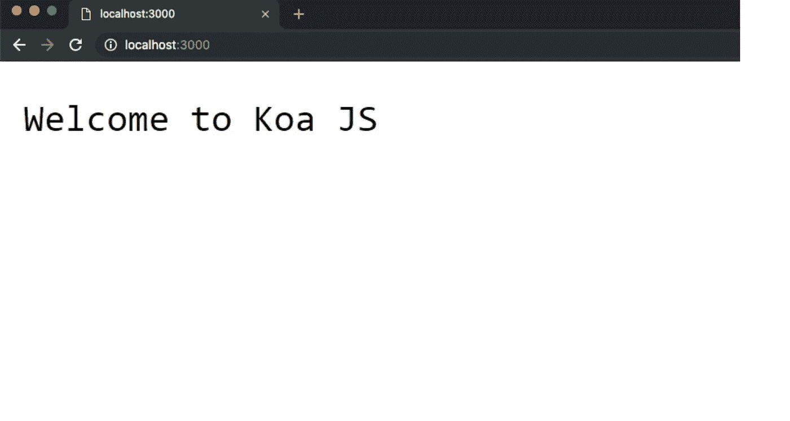
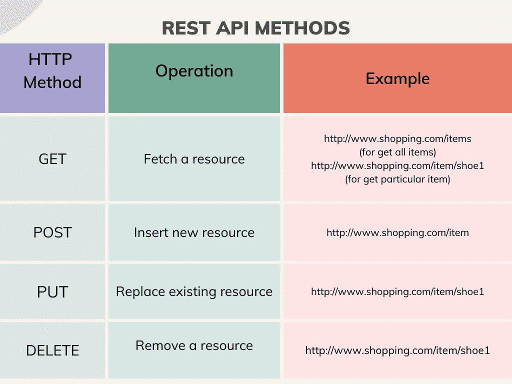
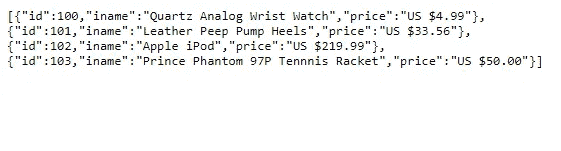
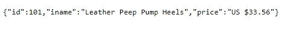
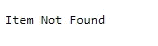
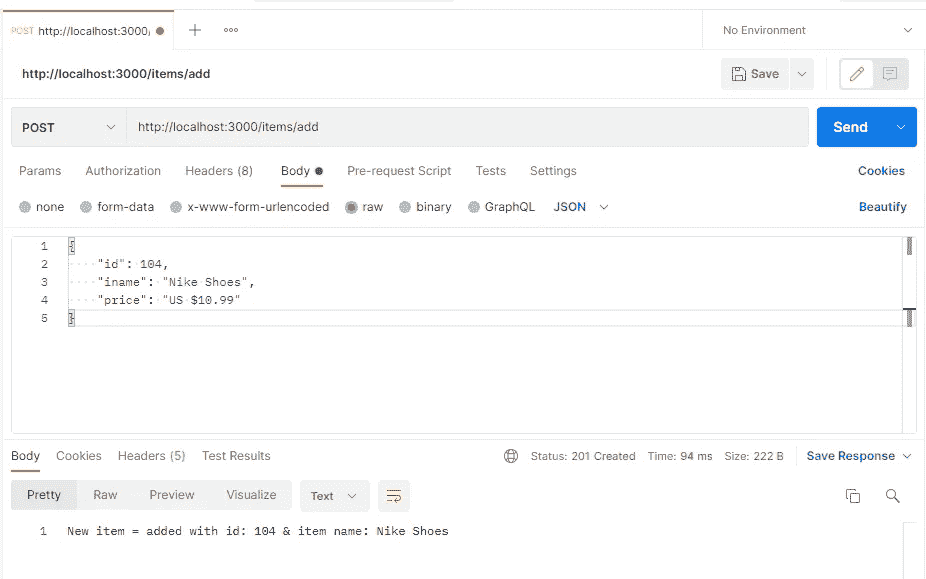
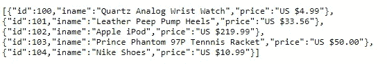

# 用 Koa 构建 REST API

> 原文：<https://javascript.plainenglish.io/koa-js-and-rest-api-cd0770fbe916?source=collection_archive---------2----------------------->

## 关于如何使用 Koa 构建 REST API 的教程。

通过阅读本文，您可以获得一些关于 Koa 和 REST API 的知识。此外，您可以了解如何使用 Koa 构建 REST API。

# Koa 简介

Koa 是一个开源的 Node.js web 应用框架。它由设计 Express 的同一个团队设计。它是为开发 web 应用程序和 web APIs 而设计的。该框架旨在为 web 应用程序和 API 提供一个更小、更具表现力和更可靠的基础。

## 构建 Koa 应用程序

让我们用 Koa 构建一个小的 web 应用程序。要构建它，首先你必须在你的设备上安装 Node.js。然后创建一个文件夹，其中将存储所有与项目相关的文件。

那么我们应该将其初始化为 Node.js 项目。为此，请在终端上输入以下命令:

`npm init`用于设置 `package.json` 文件。`-y`标志用于简单地生成一个空的`npm`项目，而无需通过问卷调查。然后你会得到一个类似于下面的`package.json`文件:

然后你应该添加`koa js`依赖项。为此，请在终端上输入以下命令:

之后，创建一个名为 app.js 的文件，并插入以下代码:

最后，在终端上输入以下命令并运行应用程序:

现在转到浏览器窗口中的`http://localhost:3000`。您应该会在浏览器窗口中看到以下内容:

恭喜你！现在您已经构建了您的第一个 Koa 应用程序。

# REST API 简介

REST 是一种架构风格，代表具象状态转移。它是由罗伊·菲尔丁在 2000 年首次提出的。REST 是基于资源的，这意味着它是围绕事物或资源构建的。这些资源是由 URIs 确定的。多个 URIs 可以引用同一个资源。JSON 或 XML 用于传递数据。它是轻量级的、可伸缩的和可维护的。

## REST API 方法

标准 HTTP 方法请求可用于创建、查看、编辑和删除资源，如下表所示:

## HTTP 代码

服务器对浏览器请求的响应是一个 HTTP 状态代码。当您访问一个网站时，您的浏览器向服务器发出请求，服务器用一个称为 HTTP 状态码的三位数代码来响应。

*   200 —好的
*   201 —已创建
*   202-已接受
*   204 —无内容
*   301 —永久移动
*   302 —发现
*   304 —未修改
*   400 —错误的请求
*   401-未经授权
*   403 —禁止
*   404 —未找到
*   405-不允许的方法
*   409 —冲突
*   412-前提条件失败
*   500 —内部服务器错误
*   502 —错误的网关
*   503-服务不可用

# 用 Koa 构建 REST API

我希望现在你对 Koa 和 REST API 有了一个基本的了解。让我们开始用 Koa 构建一个 REST API。首先，遵循上述第一个 koa 应用程序中的说明，直到您到达 install Koa 依赖项。

然后在终端上输入以下命令。Nodemon 是一个帮助开发 Node.js 应用程序的工具，当检测到目录中的文件更改时，它会自动重新启动这些应用程序。从安装 nodemon 开始，你不需要在修改的时候一次又一次的运行你的应用程序。

安装 nodemon 后，将以下内容添加到 package.json 文件的“脚本”部分:

然后还安装以下依赖项:

现在创建一个名为 app.js 的文件，并将以下代码插入其中:

然后创建另一个名为 items.js 的文件，并插入以下代码:

## 获取方法

下面是在 Koa 中处理一个`GET`请求的代码。将以下代码添加到`items.js`:

要运行这个，您必须首先在`app.js`中插入 routes 文件并调用它们:

现在您已经创建了 GET 方法。在终端上输入以下命令运行应用程序:

访问网址`[http://localhost:3000/items](http://localhost:3000/books)`。如果您可以在浏览器上看到以下内容，则您已经成功创建了 GET 方法:

在上面的例子中，我们创建了一个获取所有项目的路径。现在我们将创建一条通过`id`获取物品的路线。为此，请将以下代码插入 items.js 文件:

现在，我们可以获得特定项目的详细信息。在您的浏览器窗口中输入`http:localhost:3000/items/101`，您将得到以下结果:

如果 id 不存在或不正确，您必须发送一条 HTTP 代码为 404 的错误消息:`http:localhost:3000/items/108`

## 过帐方法

最后，我们将建立一个路由来处理 POST 方法。要构建 POST 路由，请将以下代码添加到`items.js`。

要测试这个 POST 方法是否成功，可以使用 Postman API 平台。

然后访问网址`[http://localhost:3000/items](http://localhost:3000/books)`。您可以看到这些项目以及新添加的项目。

现在您已经用 Koa 创建了一个 REST API。我希望你通过这篇文章获得了一些关于 Koa 和 REST API 的基础知识。

本文的完整代码可以在下面的 Github 资源库中找到:

 [## GitHub-shonalimeshika/KOA js-REST](https://github.com/ShonaliRomeshika/KoaJS-REST/tree/main) 

*更多内容请看*[***plain English . io***](https://plainenglish.io/)*。报名参加我们的* [***免费周报***](http://newsletter.plainenglish.io/) *。关注我们关于*[***Twitter***](https://twitter.com/inPlainEngHQ)*和*[***LinkedIn***](https://www.linkedin.com/company/inplainenglish/)*。查看我们的* [***社区不和谐***](https://discord.gg/GtDtUAvyhW) *加入我们的* [***人才集体***](https://inplainenglish.pallet.com/talent/welcome) *。*