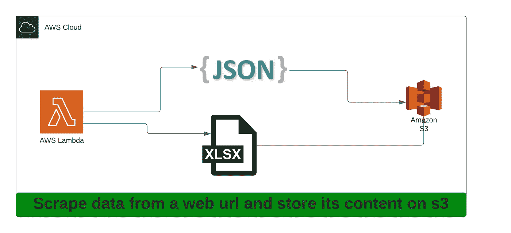

# Lambda 使用 TypeScript & Serverless 抓取数据

> 原文：<https://javascript.plainenglish.io/lambda-to-scrape-data-using-typescript-serverless-75768fa417b9?source=collection_archive---------2----------------------->

## 如何使用 TypeScript & Serverless 抓取数据的指南。

在这篇博文中，我们将做以下事情:

*   在 Node.js/TypeScript 中编写一个 Lambda 函数，从一个网站中提取以下数据集
*   页面的标题
*   页面上的任何图像
*   将提取的数据存储在自动气象站的 S3 上

我们将在这个项目中使用以下 Node.js 包:

-【无服务器】([https://www.npmjs.com/package/serverless](https://www.npmjs.com/package/serverless))(这个必须全局安装):这将帮助我们编写&部署 Lambda 函数
-【cheerio】([https://www.npmjs.com/package/cheerio](https://www.npmjs.com/package/cheerio)):这将帮助我们将网页内容解析成 jQuery 对象
-【Axios】([https://www.npmjs.com/package/axios](https://www.npmjs.com/package/axios)):基于承诺的 HTTP 客户端，用于浏览器和 node . js
-【exceljs】([https://www.npmjs.com/package/exceljs](https://www.npmjs.com/package/exceljs)):读取、操作和编写电子表格【T11

步骤 1:全局安装无服务器

步骤 2:从无服务器模板库中创建一个新的基于 TypeScript 的项目，如下所示:

步骤 3:安装 Lambda 项目所需的节点包:

步骤 4:将“无服务器-脱机”添加到无服务器. ts 中的插件列表:

步骤 5:在 serverless.ts 的环境变量中添加 S3 存储桶名称，如下所示:

步骤 6:在 serverless.ts 文件中定义函数，如下所示:

步骤 7:在 handler.ts 文件中定义您的函数来执行以下操作:

-接收 URL 以从查询字符串中抓取数据
-使用 Axios 向 URL 发出 get 请求
-使用 cheerio 解析响应数据
-从解析的响应对象中提取数据并将其存储在 JSON 文件中，并将所有图像 URL 存储在 excel 文件中
-将提取的数据上传到 S3

步骤 8:在您的环境中设置您的 aws 访问密钥和 aws 秘密密钥，如下所示:

第 9 步:你现在已经准备好在你的机器上运行这个函数了，就像这样“sls 离线 stage local”。

现在你应该可以像这样从你的机器访问你的函数[*http://localhost:3000/local/scrapeContenturl = ANY _ URL _ YOU _ WISH _ TO _ SCRAPE*](http://localhost:3000/local/scrapeContent?url=ANY_URL_YOU_WISH_TO_SCRAPE`)

步骤 10:如果你想在你的 AWS 账户上部署这个 lambda 函数，你可以这样做:

您可以从这里查看这个 Lambda 函数:

 [## GitHub-apple treeat 56/scrape-content:这个存储库将从给定的 URL 中抓取内容

### 这是一个用无服务器框架(https://www.serverless.com/)写的 lambda 函数。

github.com](https://github.com/appletreeat56/scrape-content) 

感谢您的阅读，如果您想支持我，请关注我，成为会员，支持更广泛的社区。

 [## 通过我的推荐链接加入媒体 Meta Collective

### 作为一个媒体会员，你的会员费的一部分会给你阅读的作家，你可以完全接触到每一个故事…

medium.com](https://medium.com/@metacollective/membership) 

*更多内容请看*[***plain English . io***](http://plainenglish.io/)*。报名参加我们的**[***免费周报***](http://newsletter.plainenglish.io/) *。在我们的* [***社区获得独家访问写作机会和建议***](https://discord.gg/GtDtUAvyhW) *。**