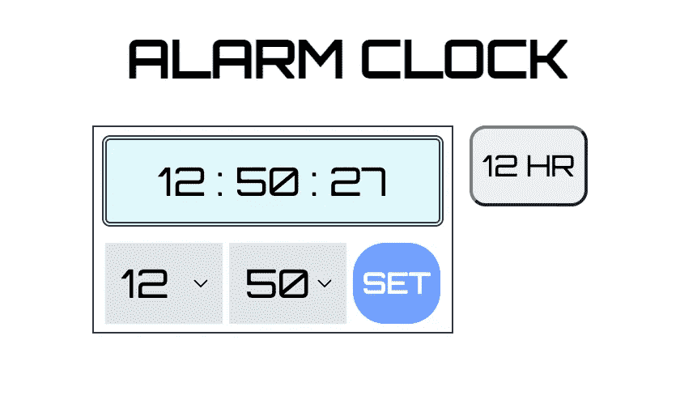
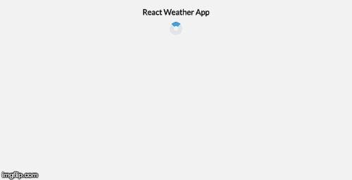
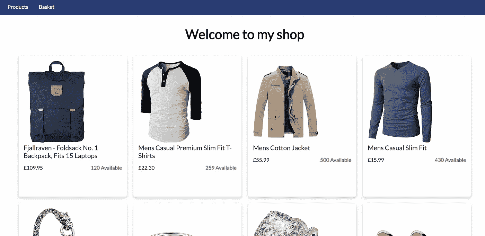

# 为了得到一份开发人员的工作，应该做些什么

> 原文：<https://javascript.plainenglish.io/land-a-developer-job-by-building-things-84fb91202319?source=collection_archive---------6----------------------->

我建立的项目让我在毫无经验的情况下找到了第一份工作

Photo by [Octavian Dan](https://unsplash.com/@octadan?utm_source=medium&utm_medium=referral) on [Unsplash](https://unsplash.com?utm_source=medium&utm_medium=referral)

曾经有一段时间，只知道 HMTL、CSS 和一些基本的 JavaScript 就足以获得一份前端开发人员的工作。我记得我的作品集网站只是一个混合了 JavaScript 和一点 JQuery 的基本页面。从那以后，我很感激能与国内和全球知名的科技公司一起工作，从他们身上我学到了很多。

从 Wayback Machine archives 查看此链接，[https://web . archive . org/web/20190201001557/http://www . maza her . co . uk/](https://web.archive.org/web/20190201001557/http://www.mazaher.co.uk/)

*现在*前端开发不仅仅是前期工作。拥有突出投资组合网站的最佳机会是不够的。

我觉得包含一系列展示不同技术的项目的 GitHub 简介是最好的方法。

因此，这里有一个简短的列表，列出了我在没有任何专业经验的情况下，作为前端开发人员，帮助我获得第一份工作的几个项目。

# 1.闹钟

**使用的技术:** *HTML5，CSS3 (scss)，香草 JavaScript*
**GitHub 链接:**[https://github.com/mazaherm/alarm](https://github.com/mazaherm/alarm)

我真的很喜欢建设这个项目。这是一个简单的时钟数字视图，根据用户的喜好分为 12 小时和 24 小时两种格式。其主要特点包括:

1.  设置闹钟时间
2.  解除警报

Photo by Author — Mazaher Muraj — Alarm clock

一旦设定的闹铃时间到了，就会有声音循环播放，直到用户解除闹铃。

我在这个项目中的主要焦点是练习我的普通 JavaScript 技能，所以我创建了一些函数，如`setAlarm`和`dismissAlarm`。

# 2.琐事游戏

**使用的技术:** *HTML5、CCS3 (scss)和 vanilla JavaScript(带有 web pack 设置)。*
**GitHub 链接:【https://github.com/mazaherm/trivia-game】**

这个项目完全是为了熟悉 API。我用的是一个比较流行的叫做 [OpenTriviaDB](https://opentdb.com/) 的。狡猾的逻辑真的让我的大脑肌肉动了起来。这很有趣，最后，在重构过程之后，它看起来并不太复杂。

在这个项目构建过程中，我学到的另一项技能是使用 web pack。我是从零开始设置的，学到了很多东西。

**提示**:我使用了 shuffle 函数，每次都以不同的顺序显示多项选择。所以答案不总是选项(c)😆。

# 3.天气应用

**使用的技术:** *React，Jest，CSS3 (scss)，CircleCI，web pack*
**GitHub 链接:**[https://github.com/mazaherm/weather-app](https://github.com/mazaherm/weather-app)

我使用 API 的另一个项目是这个天气应用程序。但是除了上一个项目，这次我用了 React。

Photo by Author — Mazaher Muraj — Weather App

我使用 create-react-app 构建了**而没有使用**，主要是因为我想了解 react 的生态系统是如何工作的。

**经验教训:**我曾经用`node-sass`来使用 sass 样式，但是现在这个包已经过时了。所以我学到的经验是，使用维护良好、每周下载量充足的软件包。

# 4.网上商店

**使用的技术:** *React，Redux，CSS3(scss)*
**GitHub 链接:**[https://github.com/mazaherm/my-redux-shop](https://github.com/mazaherm/my-redux-shop)

在这个项目中，我使用一个 API 来获取产品数据，并使用 redux 将这些商品存储在一个购物篮中。

Photo by Author — Mazaher Muraj — Redux Store

Redux 是一个可怕的怪物，在我创建这个项目之前，我回避了很长时间。最后，也没那么糟糕。所有新技能都需要时间来学习。Redux 也不例外。

从那以后，我建造了许多其他项目，仅仅是因为我喜欢建造东西。这对学习很有好处，也很有趣。

你最近建了什么项目？

如果这是有帮助的，如果你给这篇文章一个👏如果你还没有，关注一下会很好。

也请考虑通过下面我的[推荐](https://mazaher-muraj.medium.com/membership)链接订阅 Medium。这很棒，我用它来了解技术领域的最新动态，并从其他开发人员的经验中学习。

你的订阅将直接支持我和许多其他媒体作家。

 [## 通过我的推荐链接加入媒体

### 阅读 Mazaher Muraj(以及媒体上成千上万的其他作家)的每一个故事。您的会员费直接支持…

mazaher-muraj.medium.com](https://mazaher-muraj.medium.com/membership) 

*更多内容请看*[***plain English . io***](https://plainenglish.io/)*。报名参加我们的* [***免费周报***](http://newsletter.plainenglish.io/) *。关注我们关于*[***Twitter***](https://twitter.com/inPlainEngHQ)[***LinkedIn***](https://www.linkedin.com/company/inplainenglish/)*[***YouTube***](https://www.youtube.com/channel/UCtipWUghju290NWcn8jhyAw)*[***不和***](https://discord.gg/GtDtUAvyhW) *。对增长黑客感兴趣？检查* [***电路***](https://circuit.ooo/) *。***