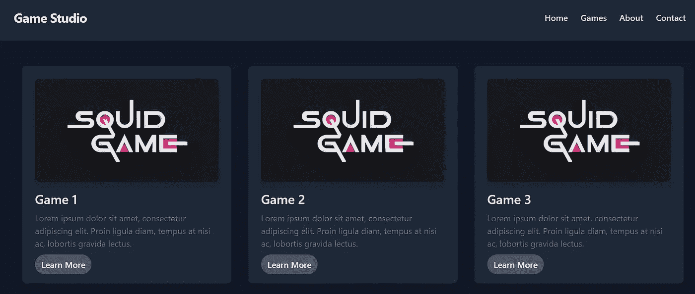
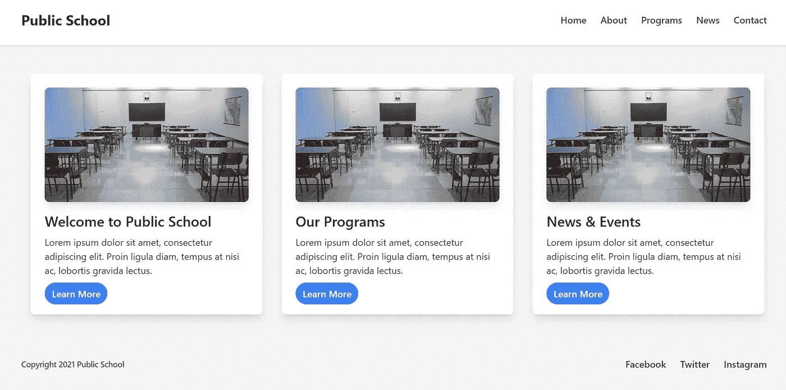
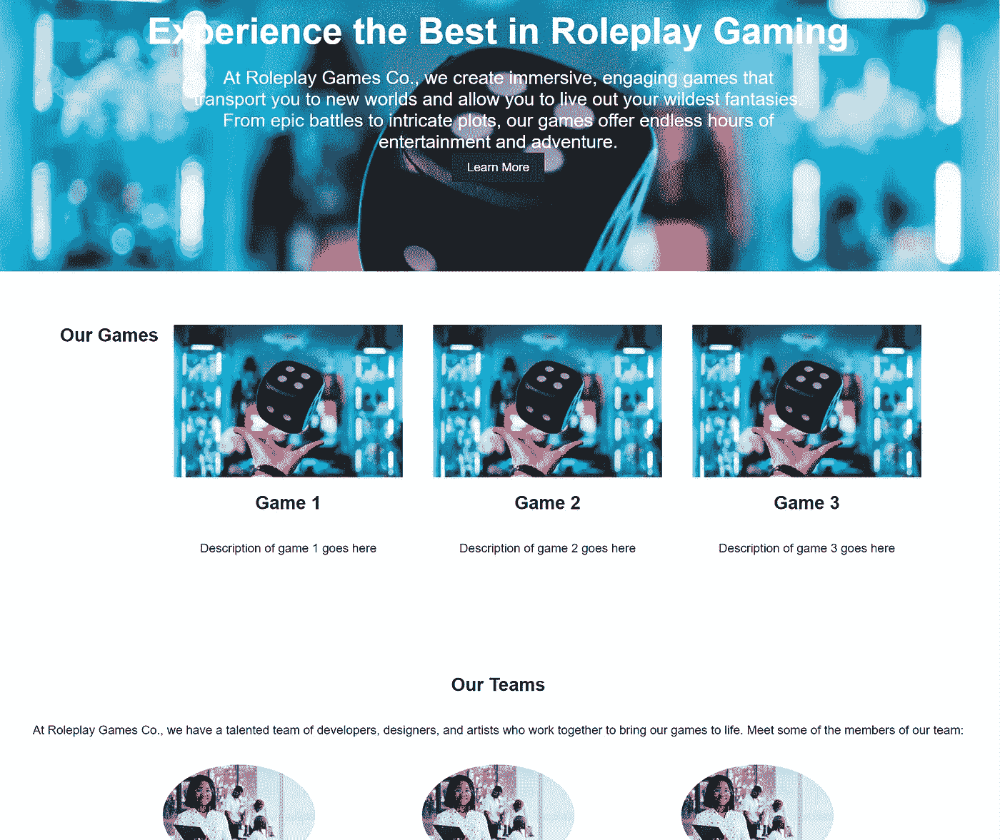
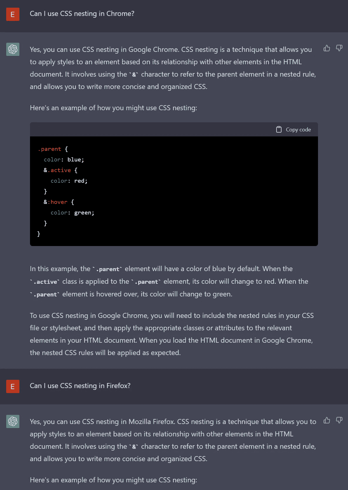
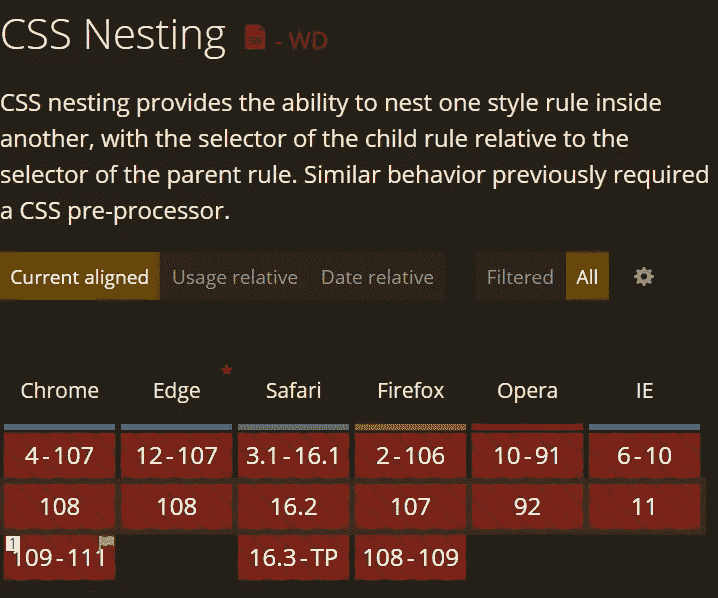

# ChatGPT 创建的登陆页面

> 原文：<https://javascript.plainenglish.io/landingpages-created-by-chatgpt-eea9c7016279?source=collection_archive---------3----------------------->

## 我已经要求 ChatGPT 创建登陆页面，下面是它的设计。



A screenshot of one of the landing pages that ChatGPT created.

## 为公立学校创建登录页面

在我的第一次尝试中，我希望 ChatGPT 为一所公立学校创建一个简单的登录页面。结果看起来是这样的；我自己添加了 Unsplash 的图片。



A simple landing page created by ChatGPT

我已经要求 ChatGPT 使用 HTML、CSS 和 Tailwind 为一所公立学校创建一个登录页面。以下是 ChatGPT 得出的一个结论:[https://jsfiddle.net/ezwrsa2k/](https://jsfiddle.net/ezwrsa2k/)

由于 ChatGPT 处理的大部分数据都是 2021 年以前的，所以它仍然使用较旧版本的 Tailwind 来创建这个例子。然而，数据集在某种程度上是可预测的，因为它为任何查询创建相同的页面。例如，我要求 ChatGPT 为一个游戏工作室创建一个登陆页面。唯一的区别是它使用了深色布局(见标题中的图片)。

这个例子也是响应式的，它使用语义标签。这并不奇怪，因为顺风公司本身还很年轻。当你要求一个使用 Tailwind 的网站时，你会期望一个有点现代的标记。

## 更多的细节会改善结果吗？

我曾希望 ChatGPT 会随机地想出一些东西，这样它就可以作为灵感的来源。但是，唉，它没有创建对他们的领域有意义的部分，例如，游戏登录页面甚至没有英雄部分。所以，我试着向 ChatGPT 提供更多的细节:

> 使用 HTML、CSS 和 Tailwind 为旅行社创建一个登录页面。它应该有一个英雄部分，提供有限的报价和预订链接，旅游目的地的画廊，以及联系方式。

这是它创造的:


Travel agency page created by ChatGPT

你可以在这个提琴里检视整页:【https://jsfiddle.net/1t4a2gh8/】T2。

令我惊讶的是，卡片没有反应。我喜欢它提出的一些占位符文本。然而，标记本身相当枯燥。所有创建的部分可能都没有用。

## 没有顺风我能取得更好的成绩吗？

我怀疑问顺风会产生更好的结果，因为它会给我一个现代的标记。于是，我试着向 ChatGPT 要了另一个网站，但这次我没有提到 Tailwind。所以，这是它得出的结论:

> 为一家使用 HTML 和 CSS 制作角色扮演类视频游戏的公司创建一个网站。该网站应该有一个标志，导航，英雄部分，游戏画廊，团队部分，和联系方式。



Gaming Company website created by ChatGPT

不出所料，如果没有库，ChatGPT 将会创建视觉效果不佳的网站。原因很简单。Tailwind 提供了一个很好的训练数据集，因为一些请求的部分是标准化的。这就是你要摆弄的小提琴:[https://jsfiddle.net/8fg01bds/](https://jsfiddle.net/8fg01bds/)(我已经添加了图片，所以这个想法是可见的)。

## 结论

我想尝试一下 ChatGPT，因为它是解决编程问题的一个很有前途的伙伴。它可能会帮助创建虚拟文本，帮助创建标准布局(如网格)，甚至传递灵感。

下面是一个更严肃的问题的例子:

> W 编写了一个有三列的 CSS 网格，并根据其元素自动创建行。

目前，ChatGPT 提出了以下标记:

```
<style>
.grid {
  display: grid;
  grid-template-columns: repeat(3, 1fr);
  grid-gap: 16px;
}
</style>

<div class="grid">
  <div class="item">Item 1</div>
  <div class="item">Item 2</div>
  <div class="item">Item 3</div>
  <div class="item">Item 4</div>
  <div class="item">Item 5</div>
  <div class="item">Item 6</div>
</div>
```

这很有效。太好了！当然，它有它的问题(例如，为间隙使用 16 像素，而不是问我是否想要间隙以及它应该具有哪个值)，但对于前端开发人员来说，这些只是微小的调整。特别是因为这一个有一个解释器，它将是初级开发人员的好伙伴。

走之前给你一点警告。虽然 ChatGPT 可以成为一个很好的伴侣，但它也传播“假新闻”。不要依赖它的答案。我问过 ChatGPT 我是否可以在 Chrome、Firefox 和 Safari 中使用 CSS 嵌套功能。它总是回答是的。然而，这目前仅在 Chrome 中可用，并且也仅在开发者标志之后。您可以在此了解更多关于新功能的信息:

[](/css-nesting-is-coming-to-chrome-f4b46184c592) [## CSS 嵌套要来 Chrome 了！

### 完美的圣诞节？一项期待已久的功能即将上线。

javascript.plainenglish.io](/css-nesting-is-coming-to-chrome-f4b46184c592) 

ChatGPT yielded the same answer for every Browser, which is wrong.



Reality.

就这些了，伙计们。感谢您的阅读！

*更多内容请看*[***plain English . io***](https://plainenglish.io/)*。报名参加我们的* [***免费周报***](http://newsletter.plainenglish.io/) *。关注我们关于*[***Twitter***](https://twitter.com/inPlainEngHQ)[***LinkedIn***](https://www.linkedin.com/company/inplainenglish/)*[***YouTube***](https://www.youtube.com/channel/UCtipWUghju290NWcn8jhyAw)*[***不和***](https://discord.gg/GtDtUAvyhW) ***。*****

*****对缩放您的软件启动感兴趣*** *？检查* [***电路***](https://circuit.ooo/?utm=publication-post-cta) *。***