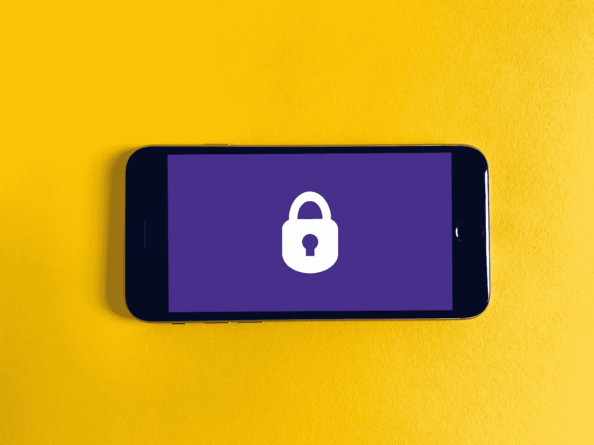
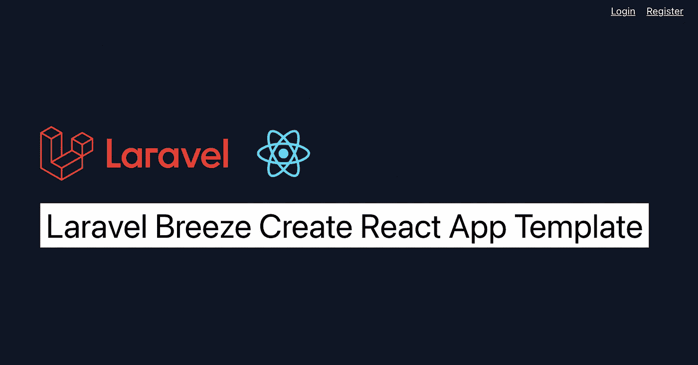

# 使用 Breeze 对 React 应用程序进行 Laravel Sanctum 身份验证

> 原文：<https://javascript.plainenglish.io/laravel-sanctum-authentication-for-react-app-using-breeze-93e2cafe450c?source=collection_archive---------2----------------------->

## 使用 Breeze API 脚手架将 Laravel Sanctum 身份验证与 React 应用程序集成的步骤。



Photo by [Franck](https://unsplash.com/@franckinjapan?utm_source=unsplash&utm_medium=referral&utm_content=creditCopyText) on [Unsplash](https://unsplash.com/s/photos/security-system?utm_source=unsplash&utm_medium=referral&utm_content=creditCopyText)

Laravel breeze 是一个用于 web 和 API 的认证脚手架。Breeze 由 Laravel Sanctum 提供认证系统，默认情况下，它包括 CSRF 保护、会话认证，因此我们不需要担心 XSS 攻击。

在本文中，我们可以看到如何使用 Breeze API 脚手架来验证 React 应用程序。让我们整合。

# Laravel 后端设置

使用以下命令创建 Laravel 应用程序并安装 Laravel breeze API 脚手架:

```
# Create a laravel application
**composer create-project laravel/laravel react-backend****cd react-backend**# Install Breeze
**composer require laravel/breeze****php artisan breeze:install api**
```

运行上述命令后，将 env 中的`FRONTEND_URL` 更新为`localhost:3000`，并使用 [Laravel Sail](https://laravel.com/docs/9.x/sail#main-content) 或`php artisan serve`命令为应用程序提供服务。

要测试应用程序，在浏览器中点击`localhost:8000`，您可以获得应用程序版本响应，如下所示:

```
**{** "Laravel": "8.77.1"
**}**
```

现在，Laravel 后端应用程序已经准备好处理来自 React 应用程序的请求。接下来，我们来设置 react 应用程序。

# React 应用程序设置

我们将使用下面的命令创建 React 应用程序来设置 React 应用程序:

```
**npx create-react-app breeze-react****cd breeze-react****yarn start**
```

## 配置 Axios

为了处理 API，我们将使用 Axios。添加全局 Axios 客户端，如下所示:

将`withCredentials`设置为 true 以启用跨站点 cookie 访问。`REACT_APP_BACKEND_URL`是`.env`文件中的`localhost:8000`，是之前创建的 Laravel 后端 app。

## CSRF 请求

Laravel breeze 使用 sanctum 进行验证，因此要验证 SPA。我们需要向`/sanctum/csrf-cookie`端点发出第一个请求。我们需要在所有未认证的路由上发出此请求。比如登录，注册忘记密码。

在`hooks/auth.js`文件中创建一个自定义钩子，并添加以下代码来处理`csrf`请求:

## 集成登录 API

在**使用权限**挂钩中增加以下登录功能:

当请求登录 API 时，首先请求 CSRF API，如果成功，则请求登录 API。同样，我们可以使用注册、忘记密码、重置密码 API。现在，我们已经将 React 应用程序与 Laravel breeze API 脚手架集成在一起。

# 拉勒维尔微风反应

[Laravel breeze react](https://github.com/Nilanth/laravel-breeze-react) 是 react 的 breeze 认证样板的实现，可在 GitHub 中获得。它使用 TailwindCSS 和 [CRA](https://create-react-app.dev/) 预配置了所有认证 API、路由和基本 UI。

## 特征

1.  使用 [Tailwind](https://tailwindcss.com/) CSS 预先构建登录、注册、忘记密码、重置密码和仪表板 UI
2.  使用[创建 React 应用程序](https://create-react-app.dev/) 5 进行构建
3.  [反应路由器](https://reactrouter.com/) 6 进行路由
4.  [SWR](https://swr.vercel.app/) 用于重新验证用户数据
5.  [ESLint](https://eslint.org/)

## 快速入门指南

克隆 [laravel-breeze-react](https://github.com/Nilanth/laravel-breeze-react) ，使用`yarn install,` 安装依赖项，然后将`.env.example`文件复制到`.env`，并添加您后端的 URL，如下所示

```
REACT_APP_BACKEND_URL=http://localhost:8000
```

运行`yarn start`，现在您将在浏览器中看到以下屏幕:



laravel-breeze-react 让您只关注业务逻辑，因为它负责验证层。

# 资源

[Laravel Breeze Docs](https://laravel.com/docs/9.x/starter-kits#breeze-and-next)

[Laravel 微风反应库](https://github.com/Nilanth/laravel-breeze-react)

[密室文件](https://laravel.com/docs/9.x/sanctum)

# 结论

Laravel Breeze 使 SPA 认证非常简单、安全，Laravel Breeze React 使 Laravel Breeze 后端应用程序与 React 应用程序快速集成。

感谢您的阅读。

*更多内容请看*[***plain English . io***](https://plainenglish.io/)*。报名参加我们的* [***免费周报***](http://newsletter.plainenglish.io/) *。关注我们关于*[***Twitter***](https://twitter.com/inPlainEngHQ)*和**[***LinkedIn***](https://www.linkedin.com/company/inplainenglish/)*。加入我们的* [***社区***](https://discord.gg/GtDtUAvyhW) *。**