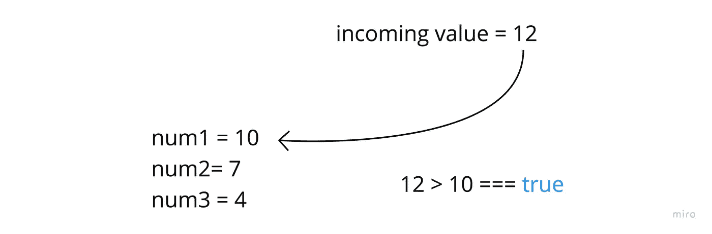
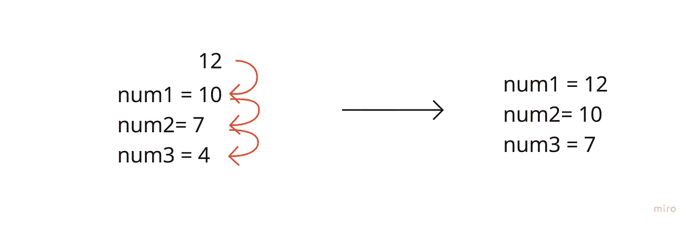

# 如何找到数组中最大的三个数字(JavaScript)

> 原文：<https://javascript.plainenglish.io/largest-three-numbers-in-array-5214f68cf679?source=collection_archive---------4----------------------->

## 我们将得到一个数组作为唯一的参数，我们需要返回一个包含最大的三个升序值的数组。

Photo by [Nick Hillier](https://unsplash.com/@nhillier?utm_source=medium&utm_medium=referral) on [Unsplash](https://unsplash.com?utm_source=medium&utm_medium=referral)

好吧，好吧…

我承认——我喜欢解决偶尔出现的简单问题。

而且那*那么*错了吗？老实说，它们让我觉得自己像个巫师。就像我举起 2.5 磅的重物一样。

但我确实认为，从长远来看，为以后更大的任务积累尽可能多的解决问题的基础知识是有帮助的。

所以，本着攀登高山的精神——让我们开始吧！

**问题……**

我们将得到一个数组作为唯一的参数，我们需要返回一个包含最大的三个升序值的数组。有趣的是，我们不能对输入数组进行排序。

**想通了**

有许多方法可以达到这个结果，但是我想尽可能坚持最基本的方法。

我需要设置一种方法来存储这三个最高值，并在遍历输入时准确地跟踪它们。

如果我们追求的是单一的最高价值，这将是一个简单的解决方案。我们只是让每个值与一个“最高值”变量进行比较，并相应地替换它。然而，我们现在有 3 个。

让我们设置函数和三个占位符:

这里我已经建立了基本框架。我定义了三个指针来存储三个最高值，设置了循环来迭代输入，然后返回最高值的排序数组。

但是现在，我需要迭代中的一些过程，可以有效地用最高值替换这些值，并且不会以重复值或缺失值结束。

**我的解决方案:**

我将维护一个包含 num1、num2 和 num3 的层次结构，并使用我认为的“涓滴”方法，这样当我评估每个数组值时，我将首先对照 num1(我的最高值)检查它

但是在这一点上，我不能简单地替换 10，因为 10 可能是我们的三个最高值之一，这就是“涓滴”为我处理的内容:

现在所需要的就是一些逻辑来检查 num2 和 num3 的数组值，并重复同样的移位。

**完整代码:**

就是这样！

你应该受到表扬

*更多内容请看*[***plain English . io***](https://plainenglish.io/)*。报名参加我们的* [***免费周报***](http://newsletter.plainenglish.io/) *。关注我们关于*[***Twitter***](https://twitter.com/inPlainEngHQ)[***LinkedIn***](https://www.linkedin.com/company/inplainenglish/)*[***YouTube***](https://www.youtube.com/channel/UCtipWUghju290NWcn8jhyAw)*[***不和***](https://discord.gg/GtDtUAvyhW) *。***