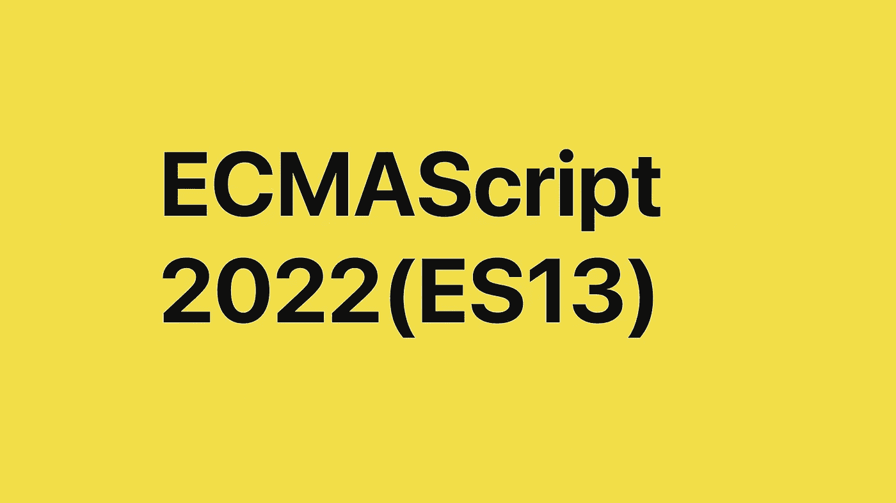

# 最新的 ES13 JavaScript 特性

> 原文：<https://javascript.plainenglish.io/latest-es13-javascript-features-24cba45c93f7?source=collection_archive---------0----------------------->

ECMAScript 2022 (ES13)是一个新的 JavaScript 标准集，将于 2022 年 6 月发布。让我们回顾一下新版本中的最后几个变化，因为它们 [**完成了提案**](https://github.com/tc39/proposals/blob/HEAD/finished-proposals.md) (那些在 [**提案流程**](https://tc39.es/process-document/) 中已经达到第 4 阶段的，因此在几个实现中实现了的，并且将在下一个实际修订中实现)。

ECMAScript 2022 包含九个已完成的提案:

*   [类字段](https://github.com/tc39/proposal-class-fields)声明
*   [人体工程学](https://github.com/tc39/proposal-private-fields-in-in)私人场地的品牌检查
*   [类静态块](https://github.com/tc39/proposal-class-static-block)
*   [正则表达式](https://github.com/tc39/proposal-regexp-match-indices)匹配索引
*   [等待顶层的](https://github.com/tc39/proposal-top-level-await)操作员
*   方法[。](https://github.com/tc39/proposal-relative-indexing-method)at()【索引】功能
*   [可访问的](https://github.com/tc39/proposal-accessible-object-hasownproperty)object . prototype . hasownproperty()
*   [错误原因](https://github.com/tc39/proposal-error-cause)
*   [从最后一个数组开始查找](https://github.com/tc39/proposal-array-find-from-last)

# 类字段声明

在 ES13 之前，我们会这样定义`constructor`中的`class`的属性:

在`constructor`中，我们定义了两个字段。正如你所看到的，其中一个在名字前面标有一个`_`，这只是一个`JavaScript`命名约定，将字段声明为`private`，意味着它只能从`class`方法内部访问。但是，这只是一个命名约定，这就是为什么当我们试图访问它时，它没有引发任何错误。

在 ES13 中，我们有一种更简单的方法来声明`public`和`private`字段。首先，我们不必在`constructor`内部定义它们。其次，我们也可以通过预先确定`#`来定义`private`字段。

与前面示例的主要区别在于，这一次，如果我们试图访问或修改类外的字段，将会引发实际的错误。

# 针对私人领域的人体工程学品牌检查

该功能帮助我们检查*对象*中是否有给定的私有槽，为此，使用了`in`运算符。

**在不同的类中使用相同的私有标识符。**两类`User`和`Person`都有一个标识为`#name`的插槽。`in`操作者正确区分:

# 类静态块

类中的静态初始化块。对于静态数据，我们有**静态字段**和**静态块**，它们在类创建时执行**。一个`class`在其类体中可以有任意数量的`static {}`初始化块。按照它们被声明的顺序，它们和任何交错的静态字段初始值一起被评估。`super.property`可在`static`块内使用，以引用超类的属性。**

**下面的示例显示了如何从类外的对象授予对类的私有对象的访问权限**

# **正则表达式匹配索引**

**这个升级将允许我们使用`d`字符来指定我们想要得到我们的正则表达式的匹配索引(开始和结束)。以前这是不可能的。您只能在字符串匹配操作过程中获取索引数据。**

**我们不知道的是字符串结束时的索引，我们现在可以添加`d`字符并查看结果。**

**新字段`indices`如您所见，它返回了[15，21]**

**我们可以使用`Regexp.exec`或`String.matchAll`来查找匹配列表，它们之间的主要区别在于`Regexp.exec`一个接一个地返回结果，而`String.matchAll`返回迭代器。**

# **顶层等待操作员**

**`await`操作符只能在`async`方法中使用，这可能是您经常遇到的错误。在 ES13 中，我们将能够在`async`方法的上下文之外使用它。**

****动态加载模块****

****如果模块加载失败，使用回退****

****使用加载最快的资源****

# **方法。at()函数用于索引**

**目前，要从可索引对象的末尾访问一个值，通常的做法是编写`arr[arr.length - N]`，其中 N 是从末尾开始的第 N 个项目(从 1 开始)。这需要命名索引两次，并为`.length`额外增加 7 个字符。**

**另一种方法避免了其中的一些缺点，但是具有其`arr.slice(-N)[0]`的一些性能缺点**

**我们可以写下:**

**以下“可转位”类型有方法`.at()`:**

*   **`string`**
*   **`Array`**
*   **所有类型化数组类:`Uint8Array`等。**

# **accessible object . prototype . hasownproperty()**

**在`JavaScript`中，我们已经有了一个`Object.prototype.hasOwnProperty`，但是，正如 MDN 文档所建议的，最好不要在原型本身之外使用`hasOwnProperty`,因为它不是一个受保护的属性，这意味着`object`可能有一个名为`hasOwnProperty`的属性，与`Object.prototype.hasOwnProperty`无关**

**另一个问题`Object.create(null)`将创建一个不从`Object.prototype`继承的对象，使得那些方法不可访问。**

**与调用`Object.hasOwnProperty`行为相同的`Object.hasOwn()`方法，将我们的`Object`作为第一个参数，将我们想要检查的属性作为第二个参数:**

# **错误原因**

**为了帮助意外行为诊断，需要用上下文信息(如错误消息)和错误实例属性来补充错误，以解释当时发生了什么，error 对象的`.cause`属性将允许我们指定哪个错误导致了另一个错误。因此，错误可以被链接起来，而不需要在条件中包装错误的不必要的和过于复杂的手续。**

# **从最后一个开始查找数组**

**在`JavaScript`中，我们已经有了`Array.prototype.find`和`Array.prototype.findIndex`。我们知道从最后一个开始查找可能会有更好的性能(数组尾部的目标元素，可以在队列或堆栈中添加`push`或`concat`，例如:时间线中最近匹配的时间点)。如果我们关心元素的顺序(数组中可能有重复的项目，例如:数字列表中的最后一个奇数)，更好的方法是使用*新方法* `Array.prototype.findLast`和`Array.prototype.findLastIndex`**

**与其为“从最后开始查找”写作:**

**我们可以写道:**

## **最终说明**

**因此，我们已经了解了可以提高效率的最新 ES13 JavaScript 特性。这些 ES13 JavaScript 功能都将在 2022 年 6 月发布。让我们等待释放。**

***更多内容见于***。*[**《T21》免费周报**](http://newsletter.plainenglish.io/) *。在*[***Twitter***](https://twitter.com/inPlainEngHQ)和[***LinkedIn***](https://www.linkedin.com/company/inplainenglish/)*上跟随我们。查看我们的* [***社区不和***](https://discord.gg/GtDtUAvyhW) *并加入我们的* [***人才集体***](https://inplainenglish.pallet.com/talent/welcome) *。****