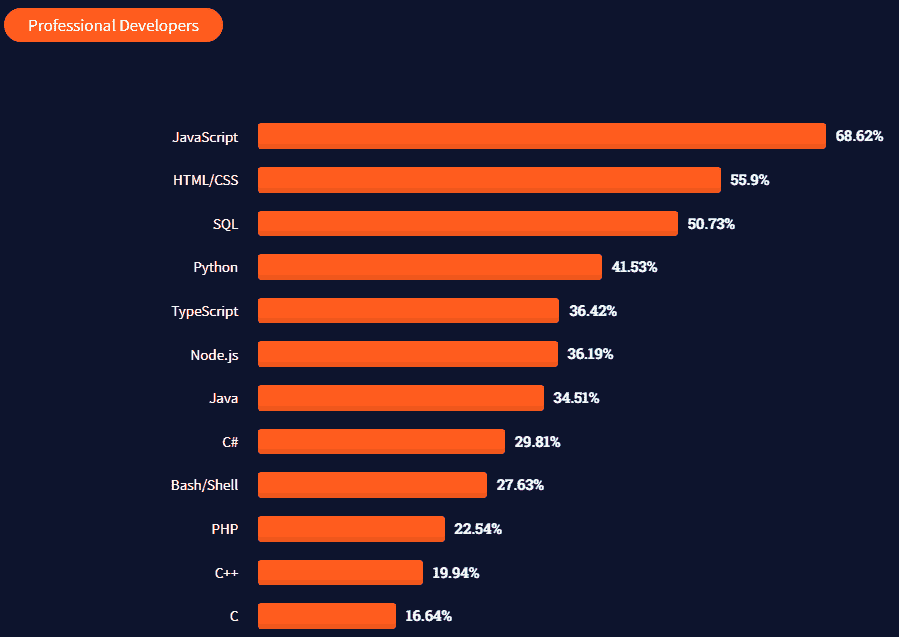
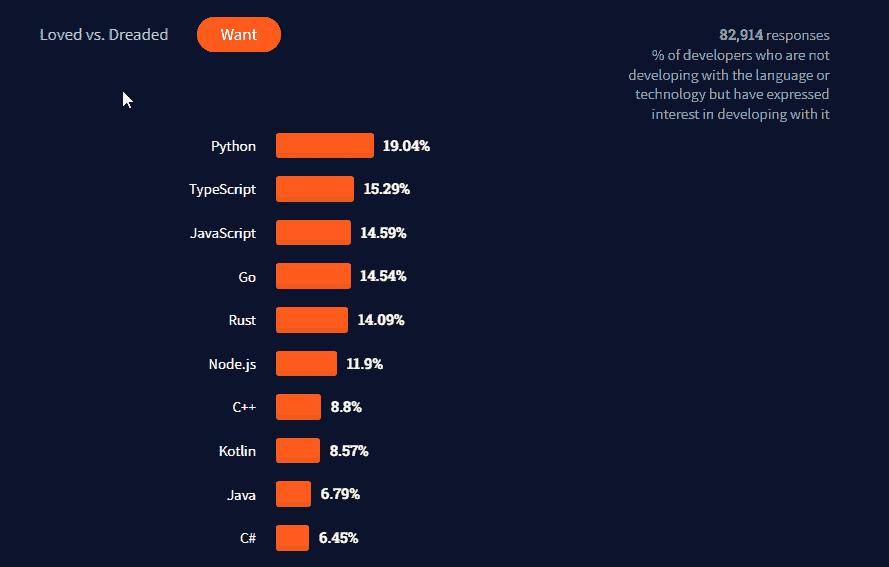
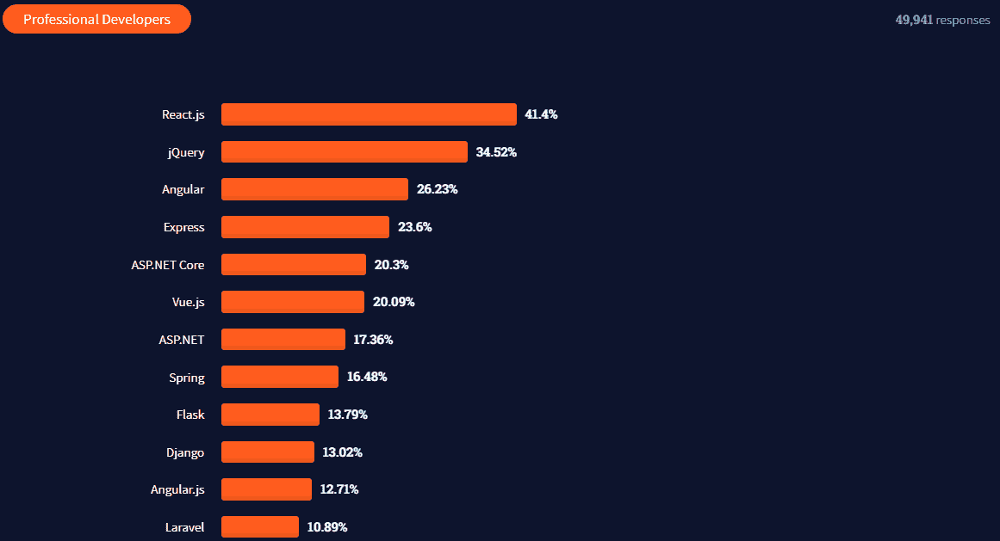
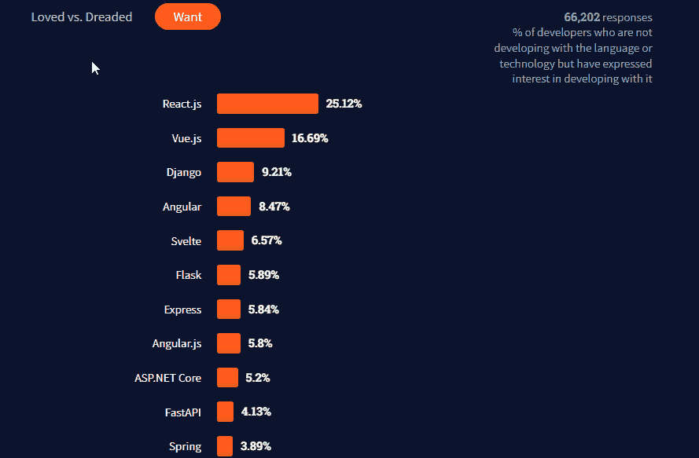
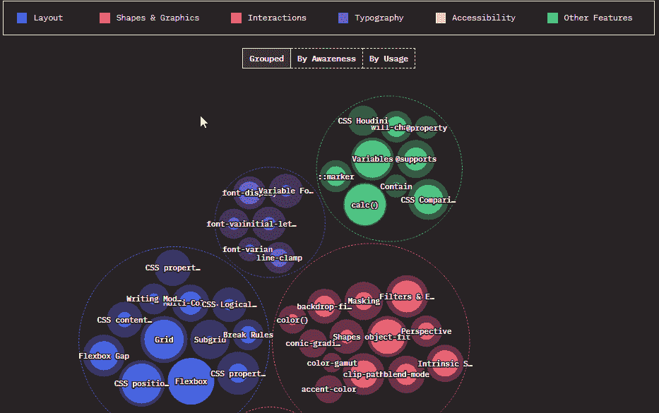
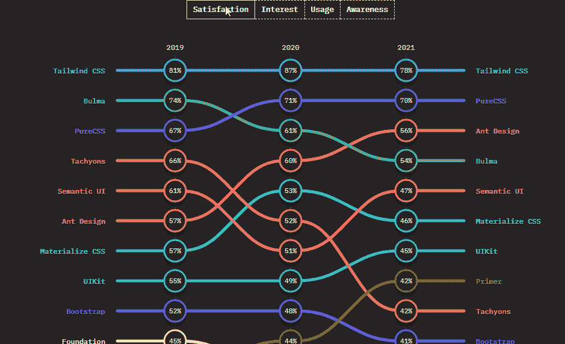
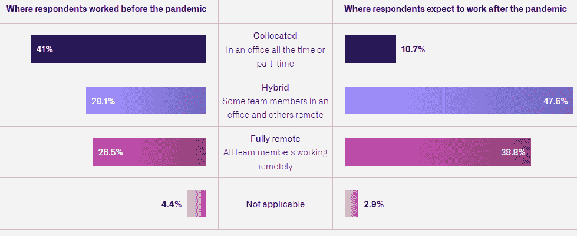
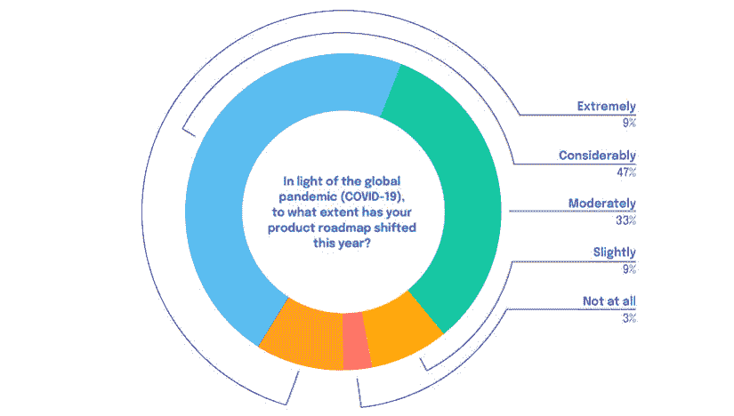
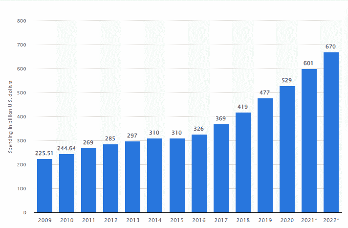

# 2022 年最新的 Web 开发和 JavaScript 趋势

> 原文：<https://javascript.plainenglish.io/latest-web-development-and-javascript-trends-to-follow-in-2022-3d7f665aa5f7?source=collection_archive---------1----------------------->

## 对网络上流行的调查和统计数据的分析，对 DHTMLX 生活中值得注意的事件的回顾，以及 2022 年的计划。

对于 DHTMLX 的我们来说，总结即将过去的一年在 web 开发领域，尤其是 JavaScript 领域的成果，并对即将到来的一年做出预测，已经成为一种良好的传统。对于专业开发人员和 web 技术的崇拜者来说，每年都会带来一些新的令人兴奋的东西，今年也不例外。

在分析了流行的调查和相关的网络统计数据后，我们准备与你分享最奇特的发现。最重要的是，我们还将为您提供 DHTMLX 历史上最值得关注的事件以及我们 2022 年的计划。

# JavaScript 仍然被广泛使用，但并不受开发人员的喜爱

由于 JavaScript 是我们最感兴趣的技术，我们应该从评估它在编程语言中的当前地位开始。为此，我们将使用 Stack Overflow 的最新[开发者调查](https://insights.stackoverflow.com/survey/2021#technology)。

*Source:* [*2021 Developer Survey*](https://insights.stackoverflow.com/survey/2021#most-popular-technologies-language-prof)

在使用方面，JavaScript 的地位很强，因为 58，031 名受访的专业开发人员中有 68%更喜欢将 JavaScript 用于他们的项目。但与此同时，我们都知道 JavaScript 在很多方面还远远不够完善，这就造成了 CoffeeScript、TypeScript 等众多编译成 JS 的语言的出现。因此，当我们看一看最受欢迎/最令人恐惧和最受欢迎的语言的排名时，情况会有所不同就不足为奇了。

在 82，914 名被要求说出他们希望在未来尝试的以前未使用的技术的开发人员中，JavaScript (14%)排在 Python (19%)和 TypeScript (15%)之后，位列第三。但在谈到最受喜爱的语言时，JavaScript (61%)仅排在第 15 位，而前三名包括 Rust (86%)、Clojure (81%)和 TypeScript (72%)。JavaScript 也被 38%的受访者称为最可怕的编程语言。

*Source:* [*2021 Developer Survey*](https://insights.stackoverflow.com/survey/2021#technology-most-loved-dreaded-and-wanted)

那么，JavaScript 是否应该被搁置起来，被对开发人员更友好的语言所取代呢？我们认为 JavaScript 是编程世界的真正巨人，其缺点在很大程度上被广泛的生态系统和巨大的社区所弥补。这就是为什么现在放弃 JavaScript 还为时过早。

# JavaScript 框架:React 巩固其领先地位，Svelte 赢得开发者的喜爱

2021 年栈溢出开发者调查也提供了关于前端框架领域事物状态的有趣信息。React 可预测地排名第一，是最常用的 web 框架(41%)，落后于 jQuery (34%)和 Angular (26%)。此外，以前使用其他框架的专业开发人员最期待尝试 React。

*Source:* [*2021 Developer Survey*](https://insights.stackoverflow.com/survey/2021#web-frameworks)

在我们之前关于 JS 趋势的文章中，我们注意到 Svelte 有潜力在 2021 年成为任何 web 开发栈的一个重要补充。堆栈溢出调查的参与者选择了 Svelte 作为最受欢迎的框架。

调查对象中最麻烦的框架是 Angular.js (76%)、Drupal (75%)和 jQuery (64)。

*Source:* [*2021 Developer Survey*](https://insights.stackoverflow.com/survey/2021#most-loved-dreaded-and-wanted-webframe-love-dread)

正如我们所看到的，web 开发人员不害怕为他们的项目试验和采用新的 JavaScript 工具，因此关注 2022 年的情况将如何变化会更有趣。

# CSS 中发生了什么

当谈到 web 开发的趋势时，也值得一提 CSS 领域的新现实。最近发布的 [2021 年 CSS 状态](https://2021.stateofcss.com/en-US/)调查通过采访全球 8714 名开发者获得了大量有趣的观察结果。

*Source:* [*2021 State of CSS*](https://2021.stateofcss.com/en-US/features)

调查显示，每年开发者越来越意识到并有兴趣采用各种布局工具，如 CSS Flexbox、Grid 和 sticky positioning。其他流行 CSS 特性有 calc()函数、级联变量的自定义属性、ARIA 属性和对象适配属性。调查参与者还认为容器查询是 CSS 中目前缺少的最受欢迎的特性。

*Source:* [*2021 State of CSS*](https://2021.stateofcss.com/en-US/technologies/css-frameworks)

关于 CSS 技术，几乎一半的调查对象说他们正在使用一个或多个 CSS-in-JS 库。使用最广泛的 CSS 前/后处理器是 Sass 和 PostCSS。在框架领域，Tailwind CSS 继续引起开发人员最大的兴趣和最高的满意度。Bootstrap 仍然是使用和认知类别的第一名，但 Tailwind CSS 正在逐年接近。

# 新冠肺炎继续影响着 Web 开发社区

新冠肺炎疫情仍然是我们大家主要关切的问题。两年来，这种疾病一直在对我们生活的各个方面进行严峻的考验。因此，了解这种全球性威胁对编程行业的影响以及采取的应对措施是很有趣的。

GitHub 的年度[octo verse](https://octoverse.github.com/)状态报告提供了关于这个主题的一些有用的发现。首先，在经历了相当长一段时间的不稳定之后，很高兴地说，发展界恢复了疫情之前的生产力水平。

由于紧张的流行病学形势，许多公司不得不引入远程工作以确保员工的安全，GitHub 表示，许多 IT 员工希望在疫情结束后有机会在家或在混合环境中工作。

*Source:* [*2021 State of the Octoverse*](https://octoverse.github.com/)

应该说，发展界积极参与了对抗冠状病毒的斗争。目前，有 [10，231 个 GitHub 公共存储库](https://github.com/topics/covid-19)专门用于进行病毒研究和提高对病毒的认识。考虑到用于交付这些项目的编程语言，JavaScript 被证明是最流行的技术。

# 移动网络发展和云技术正在蓬勃发展

随着互联网接入和移动设备对世界人口来说越来越实惠，拥有移动网络存在被认为是一种新的规范。如今，在工作和休闲中使用移动应用也很常见。

以下是 Statista 对此事的一些有趣见解:

*   去年，绝大多数互联网用户(92.6 %) [使用移动设备](https://www.statista.com/statistics/617136/digital-population-worldwide/)上网
*   2021 年期间，用于证明新冠肺炎疫苗接种和旅行护照的网络应用程序的受欢迎程度一直在上升，其下载次数达到了数千万次
*   预计 2025 年移动应用的[收入将超过 6130 亿美元](https://www.statista.com/forecasts/1262892/mobile-app-revenue-worldwide-by-segment)

考虑到不断发展的移动技术和疫情诱发的制约因素，可以肯定的是，这些增长趋势在 2022 年将具有相关性。因此，在移动设备上运行的能力已经成为现代 web 应用的主要要求之一。

在实践中有几种方法可以实现这个目标。例如，可以构建一个本地移动应用程序，应用响应性网页设计，利用快速发展的混合或跨平台技术(扑动、反应本地、Cordova 等)。)或者选择 PWA(渐进式 web 应用程序)方法，这种方法近年来引起了很大的轰动。所有这些方法都有其优点和缺点，因此程序员必须仔细评估每一种方法，为他们的 web 项目选择合适的方法。

另一个受到疾病正面影响的大领域是云计算。就像移动 web 开发一样，基于云的技术(SaaS、IaaS、PaaS 等。)在疫情期间蓬勃发展。根据美国咨询公司 Gartner 的数据，预计到 2021 年底，全球云服务支出将达到 3960 亿美元，而 2020 年为 3130 亿美元，2022 年为 4820 亿美元。

# 项目管理应用需求上升

使用项目管理应用程序已经成为各种规模的企业追求目标的常规做法。冠状病毒的爆发也成为许多项目经理在严格遵循其计划方面的严峻挑战。

*Source:* [*2021 Project Management Insight Report*](https://blog.feedbackloop.com/5-takeaways-2021-pm-insights-report)

根据最新的 PMI Insights 报告，500 名受访项目经理中只有 12%的人在产品路线图上经历了轻微或根本没有变化。这就是为什么有效的项目管理工具在实现预期的生产目标方面变得越来越重要。

尽管 COVID 19 疫情引发了危机， [Statista](https://www.statista.com/statistics/203428/total-enterprise-software-revenue-forecast/) 预测，仅在 2021 年，企业软件的总支出将达到 6010 亿美元，比 2020 年增长 13.6 %，2022 年甚至更高——6700 亿美元。

项目经理需要访问准确且相关的项目 KPI(关键绩效指标),以做出正确的规划决策。特殊的软件解决方案有助于收集必要的数据，从而有助于更有效的项目管理。

*Source:* [*Statista*](https://www.statista.com/statistics/203428/total-enterprise-software-revenue-forecast/)

对于那些计划在 2022 年开始开发项目管理应用的人来说，考虑一下 Capterra 进行的[项目管理用户调查 2021](https://www.capterra.com/project-management-software/user-research/) 中的一些要点可能会有所帮助。让我们举几个例子:

*   在使用项目管理软件的积极影响中，调查参与者强调了改进的时间表估计(60%)、有效的资源分配(55%)和增强的团队沟通(49%)
*   2021 年，影响软件购买决策的主要标准是功能(29%)、价格(18%)、易用性(17%)和客户支持(13%)
*   最想要的三个项目管理功能包括甘特图(22%)、燃尽图(21%)和自动化工作流程(20%)
*   受访者抱怨陡峭的学习曲线(43%)、大量未使用的功能(43%)、集成问题(38%)以及使用现成软件时可能出现的其他负面因素

DHTMLX 长期与程序员合作的经验证实，最后一段列出的因素往往会成为严重的障碍。这就是为什么许多公司更愿意投资开发完全符合他们要求的定制项目管理应用程序。

# DHTMLX 扩展产品组合

DHTMLX 团队一直在密切关注最近的趋势以及新冠肺炎对该行业的影响。

作为对过去 12 个月的挑战的回答，我们继续我们的课程，为项目管理提供全功能和容易定制的 JS 工具。我们发布了一个 [JavaScript 看板](https://dhtmlx.com/docs/products/dhtmlxKanban/)，旨在帮助项目经理实现工作流可视化。这个工具的伟大之处在于，它可以轻松地与 [DHTMLX Gantt](https://dhtmlx.com/docs/products/dhtmlxGantt/) 和 [Scheduler](https://dhtmlx.com/docs/products/dhtmlxScheduler/) 组件集成在一个应用程序中，以满足大多数项目管理需求。

去年，DHTMLX 图表和电子表格中引入了最重要的更新。

我们的 [JavaScript 图表组件](https://dhtmlx.com/docs/products/dhtmlxDiagram/)带有一种新的图表类型——思维导图。此外，现在 DHTMLX Diagram 允许在具有泳道的图中清晰地安排流程，根据特定标准对不同的形状进行分组，构建具有两个或更多父节点的层次结构，在组织图中指定助手，等等。

[JavaScript 电子表格组件](https://dhtmlx.com/docs/products/dhtmlxSpreadsheet/)使用 170 多个新的 Excel 数学和字符串函数，增强了处理多个表格和交叉引用的能力。其他值得注意的新增功能包括冻结列、文本和日期格式，以及对类型脚本的支持。

我们还专注于覆盖现代 web 应用程序的真实使用场景，并提供了三个现场演示:[医院管理](https://dhtmlx.com/docs/products/demoApps/dhtmlxHospital/#patients)、[在线考试](https://dhtmlx.com/docs/products/demoApps/dhtmlxExam/#exams)和 [KPI 跟踪器](https://dhtmlx.com/docs/products/demoApps/dhtmlxKPI/)。程序员可以利用这些演示作为基础，更快地创建更复杂的基于 DHTMLX 的应用程序。

得益于 DHTMLX 产品实际使用的大量正面评价，我们获得了 [GetApp](https://www.getapp.co.uk/software/146835/dhtmlx-suite) 、G2、Crozdesk、Capterra、Software Advice 等热门软件评测平台的多个奖项。

2022 年，DHTMLX 团队计划专注于改进现有的 JavaScript 组件，并用新工具扩展产品组合。当然，我们将继续为我们的客户提供高质量和及时的支持，帮助他们实施 DHTMLX 项目。

俗话说，有志者事竟成。愿你的 2022 年充满远大的目标、令人惊叹的项目和伟大的成就。DHTMLX 团队祝您好运，并祝您编码成功！

*更多内容看* [*说白了。报名参加我们的*](http://plainenglish.io/) [*免费每周简讯*](http://newsletter.plainenglish.io/) *。在我们的* [*社区*](https://discord.gg/GtDtUAvyhW) *获得独家写作机会和建议。*