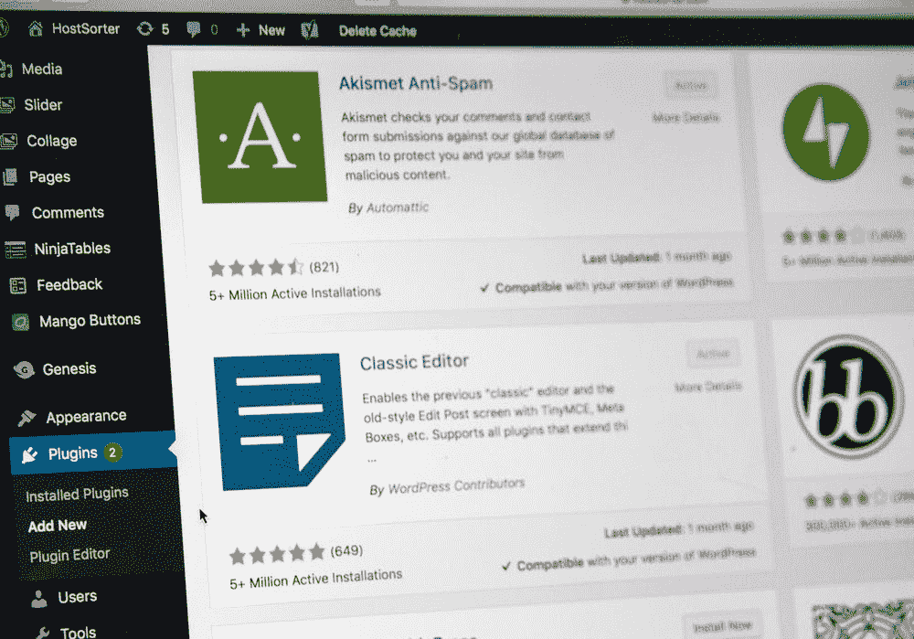

# AJAX——3 分钟学会 AJAX

> 原文：<https://javascript.plainenglish.io/learn-about-ajax-in-4-minutes-938747e4ca61?source=collection_archive---------13----------------------->

## 什么是 AJAX？为什么前端开发人员需要了解它？

Photo By [Stephen Phillips](https://unsplash.com/@hostreviews)

AJAX 是一种非常流行和常见的技术，在整个 web 中用来在浏览器和远程服务器之间交换数据。通过这种方式，web 应用程序可以利用第三方收集的数据，并使用它来增强自己的应用程序。

为了分析这是如何工作的，我们来谈谈 AJAX 代表什么。AJAX 是异步 JavaScript 和 XML 的缩写。

AJAX 中的“异步”表示从远程 web 服务器检索信息的过程是异步进行的。这意味着网页将继续正常运行，因为该信息的获取(从服务器)已经完成。一旦获取信息成功完成，web 应用程序就可以使用该信息来操作 DOM。如果你不明白“操作 DOM”是什么意思，它基本上意味着你可以更新网页而不用重新加载页面。

例如，想想你的电子邮件。当你收到一封新邮件时，它会自动显示在你收件箱的顶部。您不必刷新页面。或者想想 Facebook messenger 或 Whatsapp 之类的任何 Messenger。一旦收到新消息，屏幕会自动更新，无需刷新。但是如前所述，AJAX 在互联网上无处不在。

接下来，AJAX 中的“JavaScript”代表了这样一个事实，即 JavaScript 是这项技术的重要参与者。JavaScript 甚至提供了使用这种技术的接口。使用 JavaScript，您可以编写浏览器需要执行的指令来获取信息、处理信息，然后使用这些信息向 web 应用程序显示一些有意义的内容。

最后，AJAX 中的 XML 代表了一种可用于在客户机和服务器之间传输数据的文件格式。如今，使用 JSON 或 text 等其他文件格式传输数据也很常见。

现在你已经理解了 AJAX 的含义，让我们把我们所学的东西拼凑在一起，概括出整个过程。

# 该过程

首先，触发一个事件。用户正在与他们的 web 浏览器进行交互。也许他们正在点击一个按钮，悬停在一个特定的元素上，或者只是简单地滚动。不管他们在做什么，都会触发一个事件。

当一个事件被触发时，我们可以改变背景颜色，增加一倍的高度，或者改变文本。但是 AJAX 的全部意义在于使用来自第三方的信息，比如 PayPal，一个天气应用，或者 Spotify。使用来自这些第三方的信息，我们可以使我们的 web 应用程序更有用。

因此，当事件被触发时，我们希望检索信息。因此创建了一个 HttpRequest 对象，并通过互联网发送到服务器。

服务器通过使用互联网创建响应并将数据发送回浏览器。如前所述，数据可以通过 JSON、XML 或 text 等格式发送。

一旦这些信息返回到客户端(也就是浏览器),浏览器就可以处理这些数据，可能会根据自己的偏好对其进行操作，然后更新页面内容。

我们对 AJAX 的介绍到此结束。

如果你想了解更多关于如何在你自己的项目中实现 AJAX，这里有 4 个简单的步骤来开始使用 Fetch API 。

*更多内容看* [*说白了。报名参加我们的*](http://plainenglish.io/) [*免费每周简讯*](http://newsletter.plainenglish.io/) *。在我们的* [*社区*](https://discord.gg/GtDtUAvyhW) *获得独家写作机会和建议。*