# 5 分钟内学会 CSS Flexbox

> 原文：<https://javascript.plainenglish.io/learn-css-flexbox-within-5-minutes-189dd2dad485?source=collection_archive---------7----------------------->

## 简单而有用的指南。


Photo by [Clint Patterson](https://unsplash.com/@cbpsc1?utm_source=medium&utm_medium=referral) on [Unsplash](https://unsplash.com?utm_source=medium&utm_medium=referral)

Flexbox 是我首选的布局模型，这也是我如此频繁使用它的原因。原因可能包括提高网站响应能力和编写更少的代码。

在找到 flexbox 之前，我费尽心机创建了一个网站。另一方面，Flexbox 增强了网站设计。

现在让我用最简单的方式解释给你听。我知道这有点复杂，但是通过这篇教程，你会理解得更好。

让我们开始吧。

Flexbox 是一个 CSS 布局模型(或属性),允许您毫不费力地处理许多列和行。因此，您可以快速构建布局，使其响应迅速，并做各种其他事情。

```
display: flex;
```

您可以在其中构造一个父容器，拥有许多子容器，并使用 flex 属性根据您的需要设置许多特征。

首先，你必须提供一个方向；否则，它将只是一行。

例如，您甚至可以将方向定义为一行。

```
flex-direction: row;
```

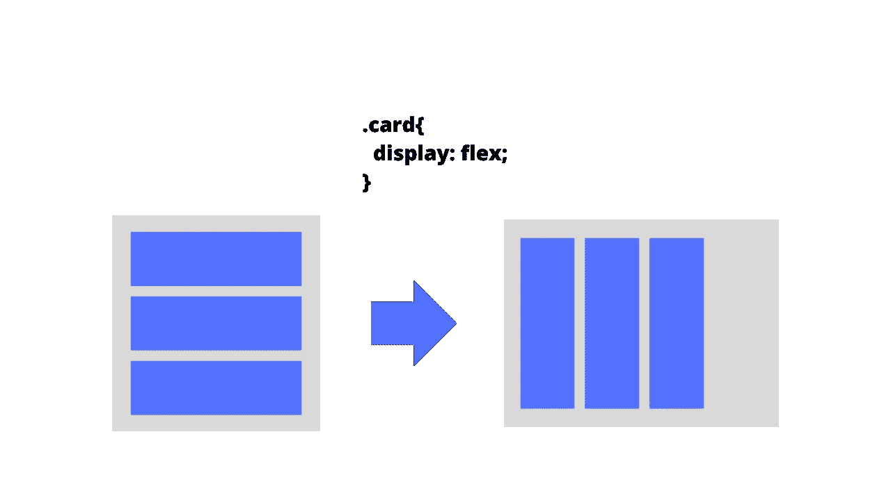

类似地，您可以将方向定义为列，即

```
flex-direction: column;
```

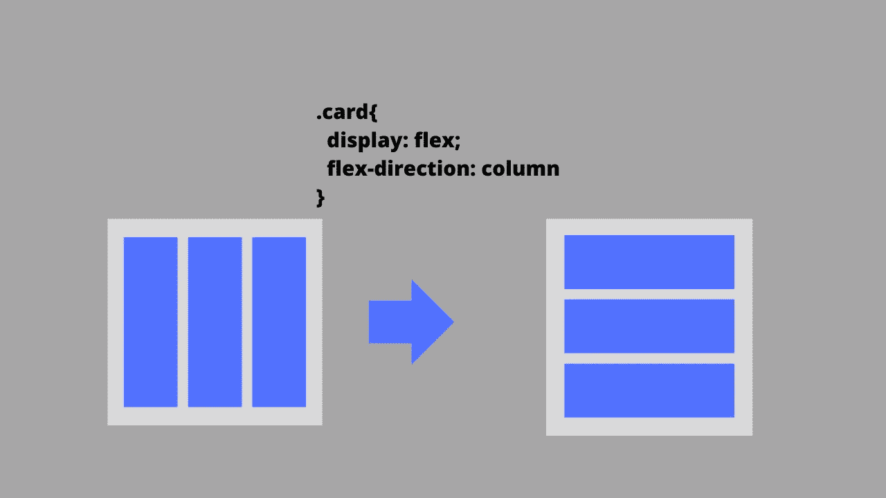

让我再举一个例子。我从 Pinterest 上分享的一个网页上抓取了一个截图。

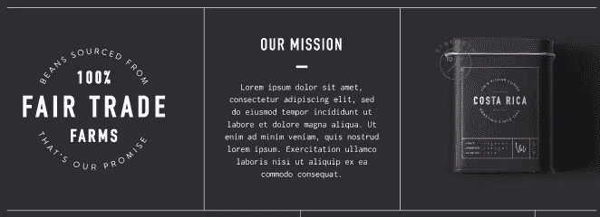

很直白吧？我们有一个单行，里面有三列。

```
<div style="display:flex;">
  <div style="display:flex;flex-direction: column;"></div>
  <div style="display:flex;flex-direction: column;"></div>
  <div style="display:flex;flex-direction: column;"></div>
</div>
```

没关系。

接下来，我们有两个更重要的属性:align-items 和 justify-content。

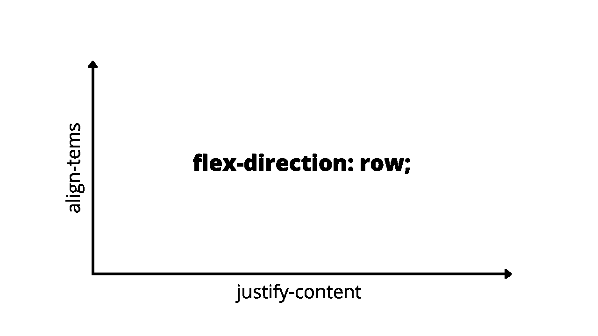

每当您将 flex-direction 指定为一行时，主轴(即 x 轴)已知为 justify-content，横轴(y 轴)已知为 align-items 属性。

如果你理解了，很好；如果没有，请允许我更轻松地教你。

justify-content 属性将水平应用，而 align-items 属性将垂直应用。

现在把弯曲方向的例子看作是柱。

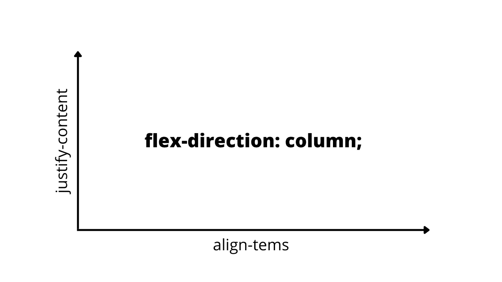

类似地，如果 flex-direction 被指定为列，x 轴将用于对齐项目，y 轴将用于对齐内容。

是的，行和列的 align-items 和 justify-content 属性正好相反。

如果你没有掌握任何东西，不要担心，因为我们会再复习一遍。

让我们更好地定义一种方式。

## 对齐项目:

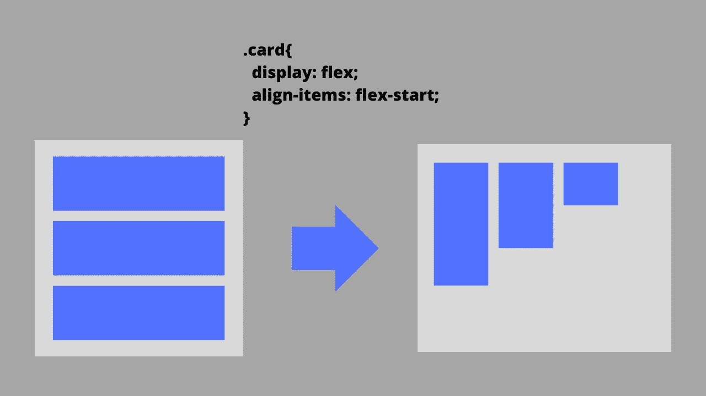

align-items: flex-start will place the items at the start.

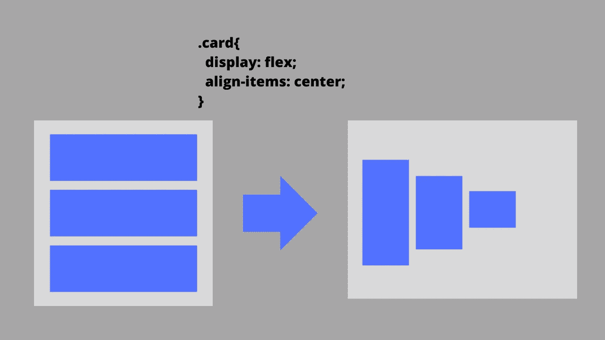

align-items: center will place the items at the center.

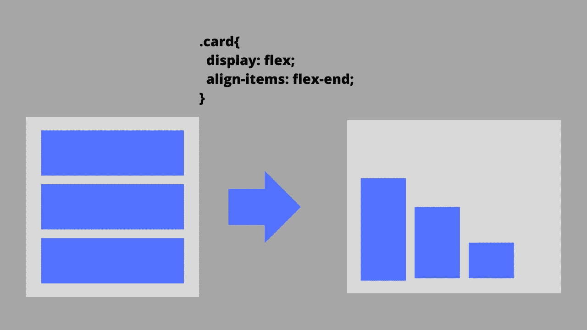

align-items: flex-start will place the items at the end.

正如我在 x 和 y 轴图表中指出的，对齐的项目将垂直对齐(在伸缩方向上作为行)。

类似地，我们可以定义 justify-content 属性。

## **justify-content:space-between**

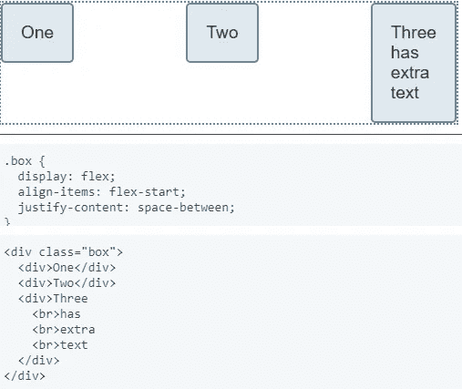

三个盒子之间有一个间隙，如你所见，即`justify-content: space-between`。

## 对齐内容:空格

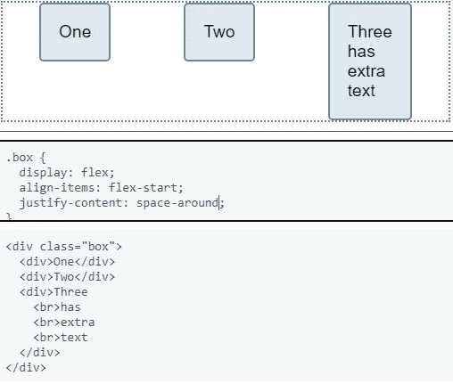

`justify-content: space-around`会使左右两边的空间(相等)。

## 对齐-内容:空间均匀

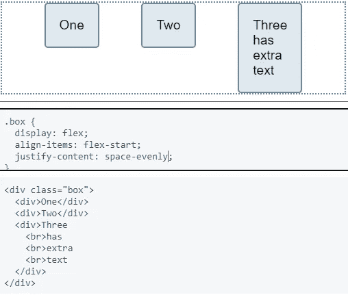

`justify-content: space-evenly`会在左右两边均匀创造空间。

## 对齐-内容:居中

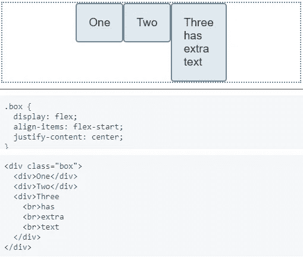

`justify-content: center`将物品放在中央。

## 弹性基础


它将根据内部内容计算宽度。当然，我们也可以指定宽度。

## 灵活增长


当 flex-grow 应用于某个项目时，它会相对于同一行中所有其他项目的平均大小进行缩放，这些大小会根据指定的值自动更改。

在本例中，该值设置为 1、2 和 7，并且它们被缩放以填充整个宽度。

## 弯曲收缩


flex-shrink 属性描述该项与同一容器中包含的其他灵活项目相比将如何收缩。

这里，第三个项目将比其余项目收缩 7 倍以上。

## 柔性包装

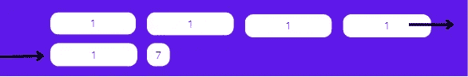

flex-wrap 属性确定灵活元素是否应该换行。

正如您所看到的，在几个项目之后，下一个项目被包装并放置在下面的行中。

这是因为 flex-wrap 属性为`flex-wrap: wrap`。

## 命令

Order 属性用于重新排列项目。

例如，如果我们这么说，

*   方框 1: `order 3`
*   方框 2: `order 1`
*   方框 3: `order 5`
*   方框 4: `order 2`
*   方框 5: `order 4`

然后将盒子放入容器中，如下所示:

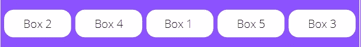

希望你觉得有用。

就这样——谢谢。

如果你愿意，你可以花 5 美元买到我的[网络开发大师](https://nitinfab.gumroad.com/l/web-development-mastery)。

[*如果你喜欢看这样的故事，并想帮助我成为一名作家，可以考虑成为一名中等会员*](https://nitinfab.medium.com/membership) *。每月花费 5 美元，你可以无限制地访问媒体内容。如果你通过我的链接注册，我会得到一点佣金。*

*更多内容请看*[***plain English . io***](https://plainenglish.io/)*。报名参加我们的* [***免费周报***](http://newsletter.plainenglish.io/) *。关注我们关于*[***Twitter***](https://twitter.com/inPlainEngHQ)*和*[***LinkedIn***](https://www.linkedin.com/company/inplainenglish/)*。查看我们的* [***社区不和谐***](https://discord.gg/GtDtUAvyhW) *加入我们的* [***人才集体***](https://inplainenglish.pallet.com/talent/welcome) *。*