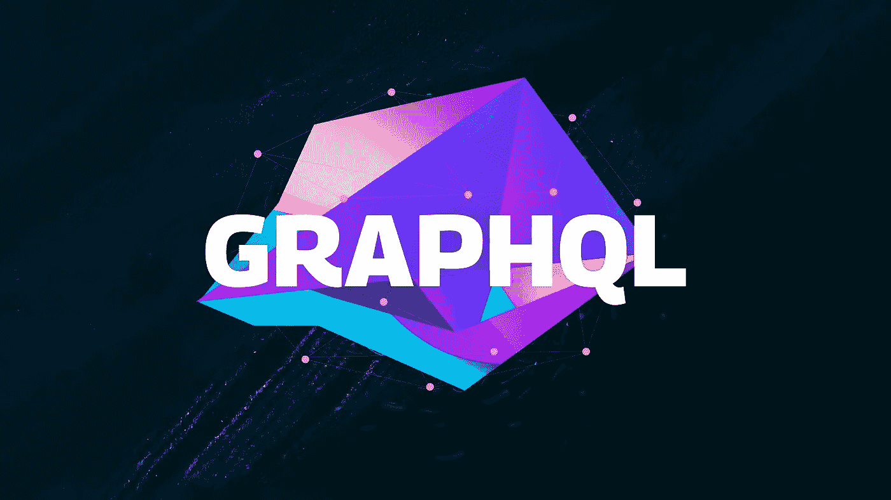
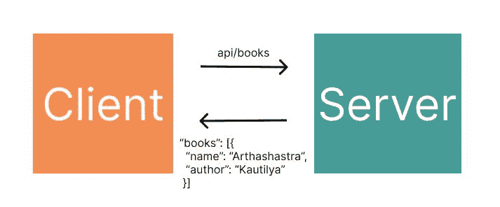
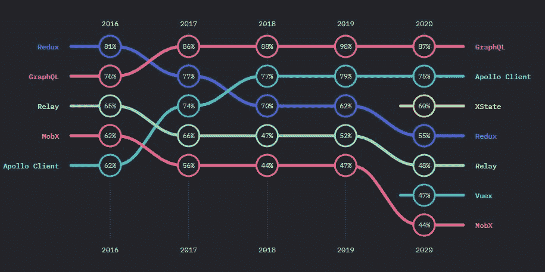
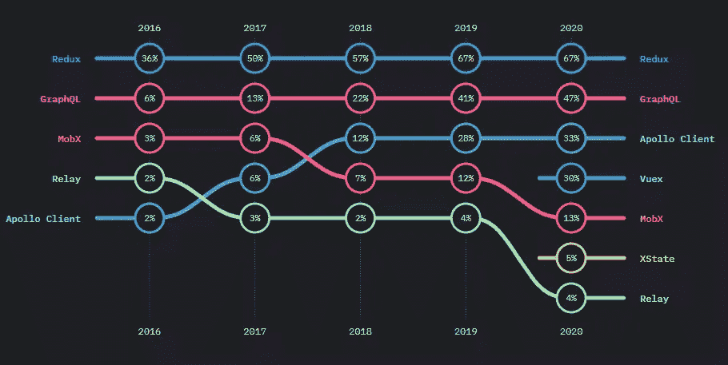
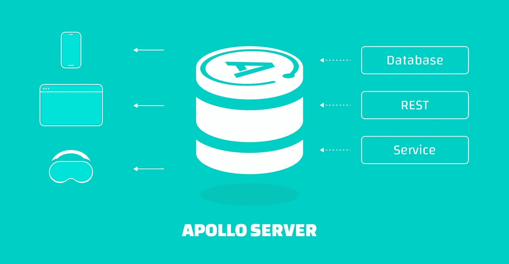

# 通过一个简单的 React 项目学习 GraphQL 和 Apollo 客户端

> 原文：<https://javascript.plainenglish.io/learn-graphql-and-apollo-client-with-a-simple-react-project-454092e5ddaa?source=collection_archive---------6----------------------->

## 在这里，我们将了解 GraphQL，它是 REST 的一个很好的替代品，以及如何使用 Apollo 客户端将它与 React 集成。



在 web 开发的早期，只有静态文件，但是从那以后，发生了很大的变化。今天的在线应用程序由多种技术驱动，包括数据库、web 套接字、实时数据、身份验证等等。

如今，将前端和后端分离是一种常见的做法&让不同的团队分别处理每一个前端和后端。这就需要创建一个接口，使它们能够顺畅地相互通信。

应用编程接口(API)是连接两者的行业标准方式。

考虑到 API 是如何工作的，我们可以说客户端发送请求，服务器处理请求，然后发送响应。

比如让我们向服务器要各种各样的书。您可以将客户端想象成一个 web 浏览器，比如 Google Chrome，而将服务器想象成一个数据仓库，可以将其中(或外部数据库中)的大量数据发送回去。

我们可以收到这样的信息:



然而，客户机的操作能力取决于它可以从 API 接收的数据&除此之外，它可能不需要从 API 服务器发送的所有数据。

在理想的情况下，前端应该能够与后端通信，并准确地获得所需的数据。这就是 GraphQL 的用武之地。

# GraphQL:构建 API 的现代方式

GraphQL 本质上是一种查询语言。它允许您自由地执行许多事情，比如设置 API、运行查询、修改数据等等。

简而言之，它为客户端(前端)提供了它所需要的确切属性。

我们举个例子来理解 GraphQL。我们将使用 REST 和 GraphQL 来获取数据，以突出它们的区别。

假设我们提出以下请求:

```
GET https://rickandmortyapi.com/api/character
```

回应如下:

```
{
  "info": {
    "count": 826,
    "pages": 42,
    "next": "https://rickandmortyapi.com/api/character?page=2",
    "prev": null
  },
  "results": [
    {
      "id": 1,
      "name": "Rick Sanchez",
      "status": "Alive",
      "species": "Human",
      "type": "",
      "gender": "Male",
      "origin": {
        "name": "Earth (C-137)",
        "url": "https://rickandmortyapi.com/api/location/1"
      },
      "location": {
        "name": "Citadel of Ricks",
        "url": "https://rickandmortyapi.com/api/location/3"
      },
      "image": "https://rickandmortyapi.com/api/character/avatar/1.jpeg",
      "episode": [
        "https://rickandmortyapi.com/api/episode/1",
        "https://rickandmortyapi.com/api/episode/2",
        // ...
      ],
      "url": "https://rickandmortyapi.com/api/character/1",
      "created": "2017-11-04T18:48:46.250Z"
    },
   // ...
 ]
}
```

这里，我们有相当数量的数据，在“/character”API 端点中有许多属性，但是如果我们只需要其中的几个属性呢？在这种情况下，GraphQL 会很有用。

现在让我们实现一个 GraphQL 示例。

**查询/输入:**

```
query {
  characters{
    info{
      count
    },
    results{
      id,
      name,
    }
  }
}
```

**响应/输出:**

```
{
  "data": {
    "characters": {
      "info": {
        "count": 826
      },
      "results": [
        {
          "id": "1",
          "name": "Rick Sanchez"
        },
        {
          "id": "2",
          "name": "Morty Smith"
        },
        {
          "id": "3",
          "name": "Summer Smith"
        },
        {
          "id": "4",
          "name": "Beth Smith"
        },
        …
      ]
    }
  }
}
```

您可以看到，我们请求了一些特定的属性，如“计数”、“id”和“名称”，它们现在是输出的一部分。

换句话说，我们在查询对象中定义特定的参数，然后根据这些参数获得响应。这就是 GraphQL 与标准 REST API 的不同之处。

# 近年来 GraphQL 的兴起

GraphQL 是一种查询语言，它通过定义查询甚至改变数据来实现客户机和服务器之间的灵活通信。

它由脸书在 2012 年创建，供内部使用。后来，它在 2015 年对公众开放。这就是它开始与 RESTful APIs 竞争的地方。

随着时间的推移，它被世界各地使用。人们甚至预言 GraphQL 将取代 REST。

甚至[JavaScript 研究现状](https://2020.stateofjs.com/en-US/technologies/datalayer/)发现，从 2017 年到 2020 年，GraphQL 是开发者最感兴趣的技术之一。



如下图所示，2016 年只有 6%的开发者在采用 GraphQL 技术；到 2020 年，这个数字上升到了 47%。



因此，从调查中可以明显看出，GraphQL 将继续存在，并将被广泛使用。

# 使用 Apollo 客户端从 React 获取 GraphQL 数据



我们都知道在开发一个网站时，客户端和服务器是必不可少的。

在这篇博客中，我们将在前端使用 React，在服务器端使用 GraphQL 服务器。

我们将使用这个特定的 GraphQL 服务器来获取 React 中的数据。你可以在这里阅读更多关于它的[。](https://rickandmortyapi.com/documentation/)

现在让我们创建一个 react 应用程序。

1.  **创建一个 React 应用**

```
npx create-react-app graphql-tut
```

您需要安装两个 npm 软件包，即 GraphQL 和 Apollo Client。

要安装 GraphQL 和 Apollo 客户端，请执行以下命令:

```
npm install @apollo/client graphql
```

React 默认不支持 GraphQL，因此它不能连接到 GraphQL 服务器并对其运行查询。这就是阿波罗客户端派上用场的地方。Apollo Client 是一个领先的状态管理库，它结合了 React 和 GraphQL，这两个工具对于创建网站和应用程序非常有用。

安装完这些包之后，您将拥有一个 GraphQL 服务器、一个 React 应用程序和必要的 npm 依赖项。现在，您可以使用 Apollo 客户端将 React 应用程序连接到 GraphQL。

在继续之前，从`src`文件夹中删除`logo.svg`、`setupTests.js`、`reportWebVitals.js`和`App.test.js`文件；我们不需要这些。

我们可以从 index.js 文件开始。

**2。修改 index.js**

```
import React from 'react';
import ReactDOM from 'react-dom/client';
import './index.css';
import App from './App';
import { ApolloClient, ApolloProvider, InMemoryCache } from '@apollo/client'

const client = new ApolloClient({
  uri: "https://rickandmortyapi.com/graphql",
  cache: new InMemoryCache(),
})

const root = ReactDOM.createRoot(document.getElementById('root'));
root.render(
  <ApolloProvider client={client}>
    <App />
  </ApolloProvider>
);
```

这里，我们创建了一个客户端并传递了一些参数。

对于 uri 属性，我们有我们的 GraphQL 服务器链接，并且我们的 GraphQL 查询结果由 Apollo 客户端保存在本地 [InMemoryCache](https://www.apollographql.com/docs/react/caching/cache-configuration/) 中。因此，Apollo 客户机可以即时响应对已经缓存的数据的请求，而无需再次执行相同的请求。

最后，我们使用 ApolloProvider 来包装 app 组件。

现在让我们查询和呈现数据。

**3。在 App.js 中呈现数据列表**

到目前为止，我们已经将我们的应用程序与 GraphQL 连接起来，现在是时候呈现数据列表了。

为此，在 App.js 文件中，我们必须从 Apollo 客户端导入`useQuery`和`gql`。

```
import { useQuery, gql } from "@apollo/client"
```

现在是时候查询我们在应用程序中需要的特定属性了。

```
const GET_LIST = gql`
query {
    characters{
        results{
            id,
            name,
        }
    }
}
`
```

这里，我们使用了`gql`模板文本来查询角色对象中的 id 和 name 属性(在 GraphQL 服务器中)。

现在让我们在 App 组件中呈现数据列表。

```
function App() {
    const { data, loading, error } = useQuery(GET_LISTS);
    if (loading) return 'Loading...';
    if (error) return `Error! ${error.message}`;
    return (
    <div>
    {
      data.characters.results.map(item => {
        return(
            <div key={item.id} style={{display: 'flex', flexDirection: 'row'}}>
                <h2>{item.id}.  </h2>
                <h2>{item.name}</h2>
            </div>    
        )
      })  
    }
    </div>
    )
}
```

这里，我们在析构和呈现数据之前使用了一个`useQuery`钩子。

现在是运行 react 应用程序的时候了:

```
npm start
```

结果如下所示:

```
Rick Sanchez

Morty Smith

Summer Smith

Beth Smith

Jerry Smith

Abadango Cluster Princess

Abradolf Lincler

Adjudicator Rick

Agency Director

Alan Rails

Albert Einstein

Alexander

Alien Googah

Alien Morty

Alien Rick

Amish Cyborg

Annie

Antenna Morty

Antenna Rick

Ants in my Eyes Johnson
```

通过更改查询，您可以对 GraphQL 进行更多的试验。

也可以将 GraphQL 与其他知名框架如 Vue 和 Angular 结合使用。甚至 Apollo 客户端和 GraphQL 都兼容 React Native。

# 每个 API 都应该使用 GraphQL 吗？

自发布以来，GraphQL 已经成为 REST 的替代产品。GraphQL 通过查询请求特定数据并拥有单一端点的能力让我们想知道是否每个 API 都应该使用 GraphQL。这给开发者提供了更多的选择&引发了关于哪一个更好的争论。

简而言之，这取决于数据及其结构。

GraphQL 可用于检索特定数据，同时避免大量请求并节省带宽和时间。相反，有些情况下，您可能需要发出多个请求、管理文件上传和启用 HTTP 状态代码，在这种情况下，REST 可能会很方便。

因此，这取决于您希望如何获取数据以及您希望使用哪些功能。这也归结到您使用的特定框架或软件是否允许 GraphQL。

您将需要使用可以接受道具(来自这些 API 的数据)并呈现它们的组件来构建应用程序。为此，您可以使用 Locofy.ai 插件快速生成接受 props 进行测试的前端代码&在像素完美的 ui 中查看这些 GraphQL APIs 的运行情况。

# 使用 Locofy 和 GraphQL 创建全栈应用

用于 Figma 和 Adobe XD 的 Locofy.ai 插件使您能够在几个小时内将您的设计转化为高质量的、可用于生产的前端代码，否则这将花费您数天的时间。你可以在 Locofy Builder 中使代码高度可扩展，你可以[将你的设计分解成组件，并为每个组件设置道具](https://guide.locofy.ai/locofy-builder-basics#:~:text=update%20the%20code.-,Make%20and%20reuse%20components,-In%20the%20Settings) &最后导出代码。

你可以从 React、Next.js、Gatsby、React Native 甚至 HTML-CSS 中选择一个框架。

这将生成代码，您可以轻松地从 API 扩展和传递数据。我们在 2022 年 9 月的一次开发者大会上介绍了如何使用 GraphQL 和 React 构建一个全栈应用程序，并在工具如 [Locofy.ai](http://locofy.ai/) 和 [Hasura](https://hasura.io/) 的帮助下，在我们的[最新指南](https://blog.locofy.ai/building-a-full-stack-app-from-a-figma-design-with-locofy.ai-hasura)中记录了这一点。

[Locofy.ai 为您提供了一个完善的代码库，您可以使用这些 API 轻松扩展，从而使您的发货速度提高 5 倍。](https://locofy.ai)

希望你喜欢。

就这样——谢谢。

[*如果你喜欢看这样的故事，并想帮助我成为一名作家，可以考虑成为一名中等会员*](https://nitinfab.medium.com/membership) *。每月花费 5 美元，你可以无限制地访问媒体内容。如果你通过我的链接注册，我会得到一点佣金。*

*原载于*[*https://blog . locofy . ai*](https://blog.locofy.ai/integrate-graphql-using-apollo)*。*

*更多内容请看*[***plain English . io***](https://plainenglish.io/)*。报名参加我们的* [***免费周报***](http://newsletter.plainenglish.io/) *。关注我们关于*[***Twitter***](https://twitter.com/inPlainEngHQ)[***LinkedIn***](https://www.linkedin.com/company/inplainenglish/)*[***YouTube***](https://www.youtube.com/channel/UCtipWUghju290NWcn8jhyAw)*[***不和***](https://discord.gg/GtDtUAvyhW) *。对增长黑客感兴趣？检查* [***电路***](https://circuit.ooo/) *。***

**[](/9-websites-that-will-help-you-learn-web-development-faster-for-free-eb81ccea1999) [## 帮助你更快学习 Web 开发的 9 个网站——免费

### 当然，大多数你都没听说过。

javascript.plainenglish.io](/9-websites-that-will-help-you-learn-web-development-faster-for-free-eb81ccea1999) [](https://medium.com/swlh/8-insanely-useful-0-tools-i-use-to-make-2-000-every-month-no-bs-a1ee29fedee4) [## 8 个非常有用的 0 美元工具，我用它们每个月赚 2000 美元——没有废话

### 更别想坎瓦、菲格玛或奎尔博特。

medium.com](https://medium.com/swlh/8-insanely-useful-0-tools-i-use-to-make-2-000-every-month-no-bs-a1ee29fedee4)**