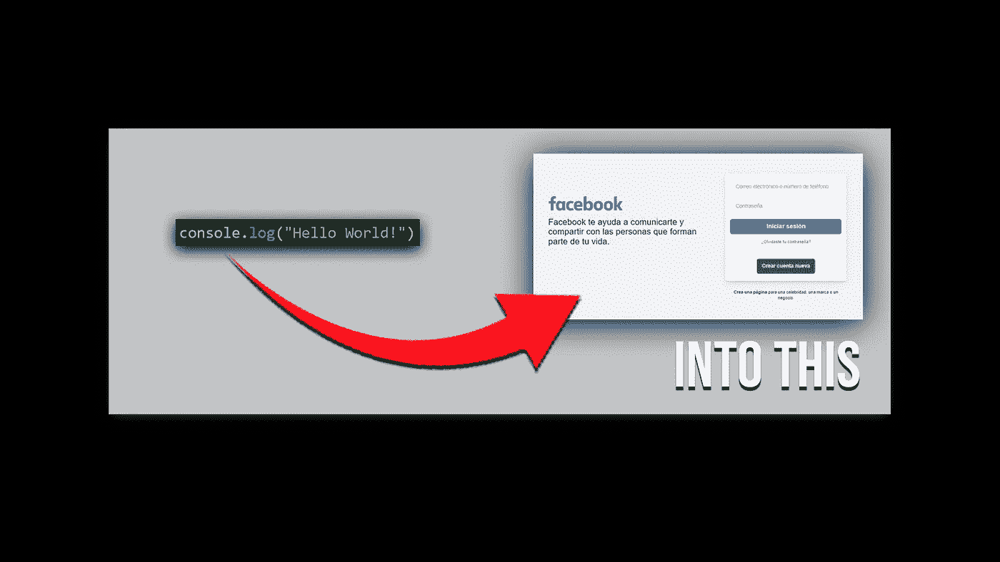
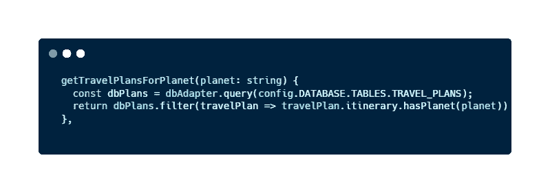
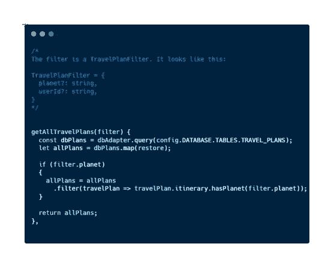

# 一个解释如何轻松扩展代码的个人故事

> 原文：<https://javascript.plainenglish.io/learn-how-to-scale-your-code-easily-with-this-curious-personal-story-c3da673293a2?source=collection_archive---------10----------------------->

## 如果你想成为一名更好的开发者，你必须编写可伸缩的代码。今天你将通过一个有趣的故事来学习如何做到这一点。

首先，我要向你道歉。这本来不是今天的文章，我本来想写关于 HTTP 请求的文章，但是我今天早上有过这样的经历，我认为这对开发人员来说是有帮助的。

我是一名**后端开发人员**，使用 **JavaScript** 和衍生品(Node.js，TS，next . js……)。今天早上，由于我的合作伙伴在一个合并请求中的评论，我正在修复我以前的代码。其中一条评论让我明白了一个概念，那就是**是完全改变人生的**。

只有重写一个函数使其可扩展，才能让我完全理解我在编码时必须如何思考，以及在编码前思考的重要性。我确信这种能力使我成为一名更好的开发人员。

你想知道我发生了什么吗？

# 一些开始的背景

我作为后端开发人员工作的第二周。为了理解应用程序的架构以及技术团队如何在我的公司做事，我正在一个*游乐场*编写代码，解决模拟现实生活的小对话。

playground 并不是一个复杂的应用程序，它只是一个没有用户界面的 API 和一个简单的 CRUD。我做过的一些任务是:创建一个端点来删除用户，添加一些需求来创建目的地，等等。

其中一项任务是创建一个端点，以获取所有以指定星球为目的地的旅行计划。乍一看，这个功能似乎很容易实现。

*“你只需要获得数据库中的所有旅行计划，并根据它是否将行星作为目的地之一进行筛选”。我敢打赌你正在想这样的事情。这很正常，我的想法和你一样。*

带着这个想法，我实现了一个简单的函数，如下所示:

My simple function is to get all travel plans giving a specified planet

非常容易，不是吗？您从数据库中获得所有旅行计划，并通过检查旅行路线是否有给定的星球来过滤数组。

太简单了，是的，而且很有用。我测试了它，功能运行良好，并通过了所有测试。然而，它不是可伸缩的，我们的代码必须是可伸缩的。为什么？

# 可伸缩性的重要性

如果我们是[独立黑客](https://www.indiehackers.com/)并且我们正在开发一个应用程序来**赚钱**，这对这个应用程序的**可扩展性**很重要。应用程序的规模越大，我们赚的钱就越多。

另一方面，如果我们**为一家**、**公司工作，可伸缩性将是我们开发的软件的基本组成部分**。因为一个公司总是希望改善和接触更多的人，而为了这个目的伟大的可伸缩性是至关重要的。

不管怎样，作为开发人员，我们必须时刻牢记我们产品的**可伸缩性**。可以有许多不同的方法来扩展我们的软件:也许我们的数据库在增长，或者我们开发了许多新的后端功能。关键的事实是，我们的应用程序将一直扩展。

[Image](https://www.pexels.com/es-es/foto/hombre-persona-escritorio-ordenador-portatil-4974915/) from [Pexels](https://www.pexels.com/es-es/foto/hombre-persona-escritorio-ordenador-portatil-4974915/)

因为…你想做一个 app/web/script 或者任何一个你能想象到的永远只有 10 个人用的软件吗？没有对吗？

> 那么可以肯定的是，你的软件是可以扩展的。

如果我们一开始开发就优先考虑这个特性，我们就可以节省资金和时间。因为如果我们不牢记在心，我们将不得不回头重做我们已经做过的事情。

如果你看不清楚这个概念，让我给你看一个真实的例子，这样你就能正确理解了。

## 之前和之后

当我不关心可伸缩性的重要性时，我开发所需函数的第一种方法(在数据库中获取以某个星球为目的地的所有旅行计划的函数)就是您以前见过的方法。

My first solution to the task

这个问题不是这个函数的错误行为。正如我之前说过的，**它工作得非常好，并且解决了问题**。然而，这是一个设计成用一个参数进行过滤的**函数。**

> "仅仅让代码工作是不够的."― **罗伯特·马丁。**

另外，**这个函数并不是单独存在于仓库文件中的**。

在这个文件中，我们有其他函数，如 *getAllTravelPlans()* ，或者*getTravelPlansForUser(userId:string)*，这是另一个函数，创建它只是为了在提供了 userId 的情况下进行过滤。

你已经意识到可伸缩性的问题了吗？

将可扩展性作为我学习过程中的一个重要部分，在我的合作伙伴的帮助下，我将它转化为:

The previous function has been refactored to be scalable

我的经理对我说:*“这个功能工作正常，但是想象一下，将来你想得到所有按到达日期、价格等过滤的旅行计划。您是否要为每种情况创建一个新函数:getTravelPlansForPrice，getTravelPlansForArrival...？不是吧？因此，您必须实现一个更通用的函数，该函数使用一个过滤器“*”。我做到了。

我创建了一个函数，**组合了**所有其他函数，它**接收一个过滤器**作为参数。过滤器将是一个**新对象，其属性将是我们想要通过**过滤的内容。

该函数的逻辑非常简单:它检查过滤器是存在还是未定义。所以，如果我们想缩放它，我们只需要写一个新的 if 和一个新的。过滤器，并不是一个全新的功能。

这只是一个例子，但是您可以通过多种方式使您的代码更具可伸缩性。

# 如何让你的代码具有可伸缩性？

我将在以后的文章中描述使我们的代码可伸缩的不同方法。然而，这里你有一些**好的实践**来实现这个目的:

*   使用**设计模式**。
*   使用**架构概念**比如 MVC 来分离你的代码。
*   保持你的**文件小**。
*   尊重**干净的代码实践**(如果你想[知道一些 JavaScript 中干净的代码实践，你可以查看这篇文章](/clean-codes-3-most-useful-practices-using-javascript-examples-e80721ad3d4))。
*   **不要**使用**魔法常数**。
*   为你的代码编写 [**单元测试**。](/an-easy-and-general-approach-to-unit-tests-using-javascript-examples-1a29ba58c948)
*   试着从一开始就让你的代码高效

当然，如果你不仅想写可伸缩的代码，还想写高质量的代码，你需要完全了解你正在使用的语言。因此，如果你想了解更多关于 JavaScript 的知识，不要忘记这些文章:

 [## JavaScript 是什么？定义这种神奇语言的 5 个基本特征

### 如果你想成为一名 JavaScript 开发者，你需要知道的 5 个基本特性。

javascript.plainenglish.io](/what-is-javascript-5-basic-features-that-define-this-amazing-language-9e12d273da8)  [## 5 个对初学者有用的 JavaScript 一行程序

### 在短短几分钟内，您将能够减少您必须编写的代码行数，并提高您的…

javascript.plainenglish.io](/5-useful-javascript-one-liners-for-totally-beginners-56e678d9a314) 

# 最后的想法

除非你想浪费时间和金钱，否则我们在开发时要考虑到可伸缩性，这是软件开发世界中的一个重要元素。

在这篇文章中，我与你分享了一个今天早上发生在我身上的个人故事。多亏了这个小故事，我可以完美地内化可伸缩性的重要性，因为它是我之前忽略的一个因素。通过转换函数来解决任务的例子，我可以很好地理解如何以正确的方式扩展我的代码。

我希望你能在这篇文章中找到**开始以可伸缩的方式**编码以及**正确理解可伸缩性**的重要性所需的信息。如果你有任何疑问，请在下面的评论中告诉我。

如何让你的代码更具伸缩性？你最看重软件开发的其他哪些方面？

# 结论👋

谢谢大家！非常感谢您阅读这篇文章。如果你想了解更多关于技术和发展的信息，别忘了**跟我来**。我很想知道你对此的看法，所以不要花花公子**写在评论**里，我会读给你听。

如果这篇文章已经帮助你记住了，你可以**为它鼓掌**并与你的战友分享。

# 关于作者🤓

嗨！很高兴见到你！我是赫苏斯·拉加雷斯。目前，我是一名后端软件工程师，正在加的斯大学完成我的计算机科学学位。

我的两大爱好是**技术**和**交流**，所以我会抓住一切机会谈论或撰写关于技术的文章。我喜欢把复杂的概念转换成每个人都能理解的简单概念。

# 想要连接吗？📲

📸[**Instagram**](https://instagram.com/jesuslagares_)**|**💼[**LinkedIn**](https://www.linkedin.com/in/jesus-lagares/)**|**📹[YoutubeT34)|🐦](https://www.youtube.com/c/Jes%C3%BAsLagares) [**推特**](https://twitter.com/jesuslagares_)

📩**jesuslagaresgalan@gmail.com**

谢谢！❣️

*更多内容请看*[***plain English . io***](https://plainenglish.io/)*。报名参加我们的* [***免费周报***](http://newsletter.plainenglish.io/) *。关注我们关于*[***Twitter***](https://twitter.com/inPlainEngHQ)[***LinkedIn***](https://www.linkedin.com/company/inplainenglish/)*[***YouTube***](https://www.youtube.com/channel/UCtipWUghju290NWcn8jhyAw)*[***不和***](https://discord.gg/GtDtUAvyhW) *。对增长黑客感兴趣？检查* [***电路***](https://circuit.ooo/) *。***