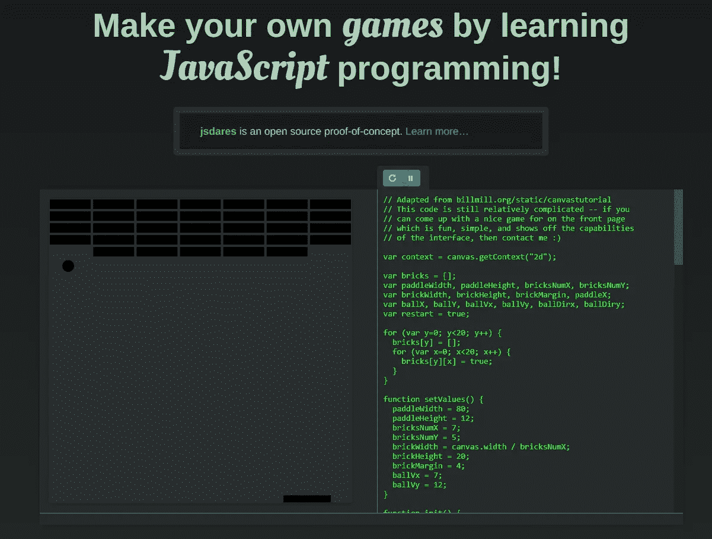

# 玩游戏的同时学习 JavaScript 让学习游戏化

> 原文：<https://javascript.plainenglish.io/learn-javascript-while-playing-games-gamify-your-learning-9f41d4d3dad9?source=collection_archive---------3----------------------->

## 每个人都可以学习编码！

## *用游戏化放大你的软件开发技能，学习 JavaScript。*

[Technology vector created by pikisuperstar — www.freepik.com](https://www.freepik.com/vectors/technology)

在这篇文章中，我想展示你可以在玩游戏的时候用来学习 JavaScript 的不同网站。这种方法被称为游戏化，是当今众所周知的技术。

# 介绍

通常，如果你学习一门新技术或语言，你可能会失去动力。这是由似乎永无止境的技术数量造成的。学习特别复杂的技术会变得很困难，学习也会停滞不前。

游戏化很好的解决了这个问题。它使用一个简单的战略尝试来激励和吸引用户，同时学习新的东西。这是一种从游戏中添加典型设计元素以增强学习过程的技术。这是通过利用人们对社交、学习、掌握、竞争、成就、地位或自我表达的自然欲望来实现的。游戏化的早期实现在玩家完成任务后使用简单的奖励系统来吸引他们。奖励包括积分、成就徽章或虚拟货币。

游戏化的另一种方法是在游戏中改变任务本身。这是通过包含一个有意义的选择、入职辅导或添加一个叙述来实现的。

在下一章中，我将展示不同的网站，它们都可以用来通过玩游戏或解谜来学习 JavaScript。

# 切克奥

CheckiO 是一个教授编程的网站，它为在线游戏世界提供了许多游戏化功能，如积分、排行榜或社交。它帮助你提高你的编码技能。此外，它还包含许多面向初学者和高级程序员的编码游戏。您可以使用 Python 或 TypeScript 完成涵盖各种主题的练习，包括字符串、循环、对象、类、异常和问题解决。完成挑战后，你将获得点数，解锁新游戏，并进入更高的级别。此外，还有一个评论区和一个论坛，你可以在那里查阅帮助或查看其他用户是如何解决这个难题的。

CheckiO — we make coding fun on YouTube

以下是该网站的链接:

 [## CheckiO -编码游戏和初学者和高级编程挑战

### 在 CheckiO 上，我们正在为程序员创造游戏。我们让 py.checkio.org 和 js.checkio.org 成为你可以提高的地方…

checkio.org](https://checkio.org/) 

# 协同作战

CodeCombat 是一个黑客和斜线幻想游戏，可以用来学习编码基础知识。CodeCombat 让玩家投入战斗，并使用编程来帮助你在地牢或战场中生存。你将通过每一个挑战来控制你个人的屏幕角色。

它包含数百个不同级别的课程，包括计算机科学、游戏开发和网页开发。

在游戏中，你有能力控制你个人创造的角色，让他跑下走廊，通过编程嘲讽一个食人魔。

每一关都像一个谜题，只有输入正确的代码片段才能解开。此外，在你输入一个代码片段后，游戏将被执行，你将直接看到结果。

CodeCombat Game Trailer on YouTube

以下是该网站的链接:

 [## CodeCombat -编写游戏来学习 Python 和 JavaScript

### 用一个适合初学者的多人在线编码策略游戏学习编程。一边打败一边学 Python 或者 JavaScript

codecombat.com](https://codecombat.com/) 

# TwilioQuest

在 TwilioQuest 中，你将带领你无畏的船员执行一项到云端的任务。这是一款免费的 PC 角色扮演游戏，灵感来自 16 位时代的经典作品。

此外，这是一个教育游戏，旨在向新开发人员教授 JavaScript 或 Python 编程。该游戏将通过帮助您配置本地开发环境和解释专业程序员使用的工具，为您解决现实世界的问题做准备。

您将学习如何使用您的终端，学习如何用 Python 或 JavaScript 编码，并为开源项目做出贡献。如果你玩 TwilioQuest，所有这些实用的软件工程技能都会被涵盖

TwilioQuest 3.2 Opening Cinematic on YouTube

以下是该网站的链接:

 [## twilio quest:Mac、PC 和 Linux 版免费下载

### 什么是 TwilioQuest？TwilioQuest 是一款教育视频游戏，旨在教导新一代开发人员如何…

www.twilio.com](https://www.twilio.com/quest) 

# 电梯传奇

*这是一个编程的游戏！你的任务是通过用****JavaScript****编写一个程序，对电梯的运动进行编程。*

电梯传奇是一个游戏，你必须使用 JavaScript 以高效的方式用电梯运送人。在经历不同的阶段时，你必须完成更困难的挑战。

只有高效的程序才能完成所有的挑战。

Elevator Saga #16 by Sylvain Zimmer

以下是该网站的链接:

 [## 电梯传奇-电梯编程游戏

### 编辑描述

play.elevatorsaga.com](https://play.elevatorsaga.com/) 

# jsdares

在 jsdares.com，你将通过完成***【dares】来学习 JavaScript 编程。这些挑战是一些简短的谜题，在这些谜题中，你可以最大限度地减少完成任务所需的函数数量。它们在开始时非常简单，但随着你的进步会变得越来越难。***

目前 jsdares 只提供了少量的 dares，但是他们正在着手开发一个更大的集合。同样，你也有机会创造和分享你自己的勇气。

Screenshot of jsdares.com taken by the author

以下是该网站的链接:

 [## jsdares

### 实验教育编程环境。学习 Javascript 并创建自己的 dares！

jsdares.com](http://jsdares.com/) 

# WarriorJS

*传说讲述了一把传说中的剑，被遗忘在一座废弃的塔的废墟中。成千上万的战士已经出发去寻找这把剑，它的持有者将会在 JavaScript 语言方面变得开明。*

WarriorJS 是一个 JavaScript 的学习平台，在你玩角色扮演游戏的时候教你 JavaScript。这个游戏是为新的或高级的 JavaScript 程序员设计的，将考验你的技能！

Screenshot of WarrioJs.com taken by the author

以下是该网站的链接:

 [## WarriorJS

### 通过地牢编码你的方式，证明你的技能，并获得聘用。根据…筛选玩家来寻找人才

warriorjs.com](https://warriorjs.com/) 

# JSRobot

JSRobot 是一个游戏，你将控制一个机器人收集硬币，并应达到一个水平的结束。所有编程都是用 JavaScript 完成的，每个挑战都包含了完成挑战所需的所有 JavaScript 函数的信息。

不幸的是，这是一个非常简单的游戏，没有花哨的用户界面和演示。但是它仍然可以用来练习你的编码技能。

Screenshot of jsrobot website taken by the author

以下是该网站的链接:

 [## JSRobot

### 通过玩一个平台游戏来学习 JavaScript:控制一个机器人收集硬币，避免障碍并在…

实验室 real . me](https://lab.reaal.me/jsrobot/) 

# 结束语

如果你尝试这些游戏，它们可以帮助你开始学习 JavaScript 并成为一名 JavaScript 开发者。他们鼓励有趣，并提供了很多。除此之外，你将接触到编程，并将获得关于语法、算法和编程中其他重要概念的更深入的知识。

我个人会推荐使用 CheckiO、TwilioQuest、CodeCombat、WarriorJS。它们对想从事开发工作的人特别有帮助。

JSRobot、ElevatorSage 和 jsdares 是练习一些基本功能的好方法，不应该避免，但我不建议从这些游戏开始。

我希望你能测试一下这些网站，会发现它们和我一样有用。如果是这样，我很想听听你的想法。另外，如果你有任何问题、想法或建议，请写在下面。如果可能的话，我试着回答他们。

*✍️写的*

***保罗·克努斯*** *丈夫，两个孩子的父亲，极客，终身学习者，科技爱好者&软件工程师*

*本文最初发表在我的博客上*[*https://www . paulsblog . dev/learn-JavaScript-while-playing-games-gamify-your-learning/*](https://www.paulsblog.dev/learn-javascript-while-playing-games-gamify-your-learning/)

***问好*** *🙌***:*[*推特*](https://www.twitter.com/paulknulst) *，*[*LinkedIn*](https://www.linkedin.com/in/paulknulst/)*，* [*GitHub*](https://github.com/paulknulst)*

**更多内容请看*[***plain English . io***](http://plainenglish.io/)*。报名参加我们的* [***免费周报***](http://newsletter.plainenglish.io/) *。在我们的* [***社区***](https://discord.gg/GtDtUAvyhW) *获得独家获得写作机会和建议。**