# 学编程只是为了理解笑话

> 原文：<https://javascript.plainenglish.io/learn-programming-just-to-understand-jokes-1bb9caa681c3?source=collection_archive---------24----------------------->

## 这值得吗？

Taken by [SHVETS production](https://www.pexels.com/sk-sk/@shvets-production?utm_content=attributionCopyText&utm_medium=referral&utm_source=pexels) on [Pexels](https://www.pexels.com/sk-sk/fotka/vyraz-na-zvislo-portret-pohlad-6974936/?utm_content=attributionCopyText&utm_medium=referral&utm_source=pexels)

每天，越来越多的人开始他们的编码之旅。他们想学习一项新技能，找到一份更好的工作——改善他们的生活。

信不信由你，那并不是人们做这件事的唯一原因。

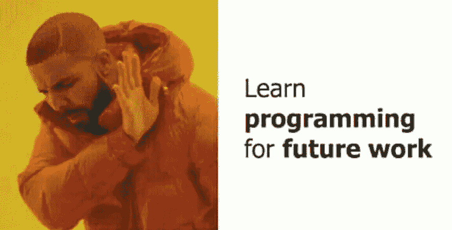

如果你想知道另一个原因。可能会让你大吃一惊。我知道这让我很不爽。

这不是为了改善他们的工作生活。当然也不是为了开始一条新的职业道路。这是完全不同的东西。

**有些人学习编程的原因是为了理解笑话。**

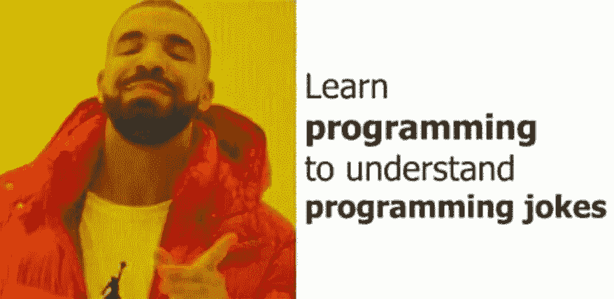

在我看来，这不是个坏主意。我马上会告诉你为什么。

# 值得吗？

**当你开始思考时，这听起来可能很疯狂。但事实并非如此。**

我非常喜欢幽默，我相信开怀大笑对我们的幸福至关重要。我喜欢好笑话！但特别是，我非常喜欢一个好的编程笑话。

有些笑话很简单。他们能被每个人理解。看看这个精心制作的 404 页面就知道了。我相信它会让每个人发笑，或者至少咯咯地笑。

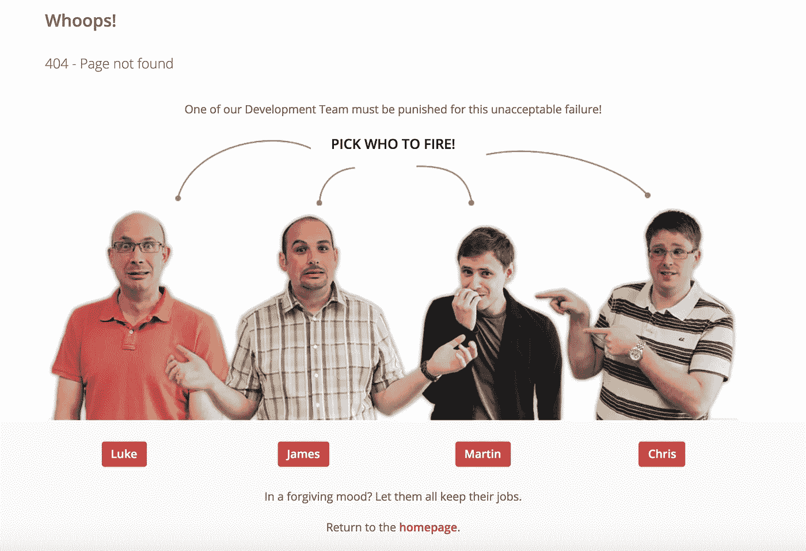

[Original Image](https://i.redd.it/mnghlm1xbc411.png)

现在你明白我的意思了。但为了更清楚起见，这里有一个证据 b。

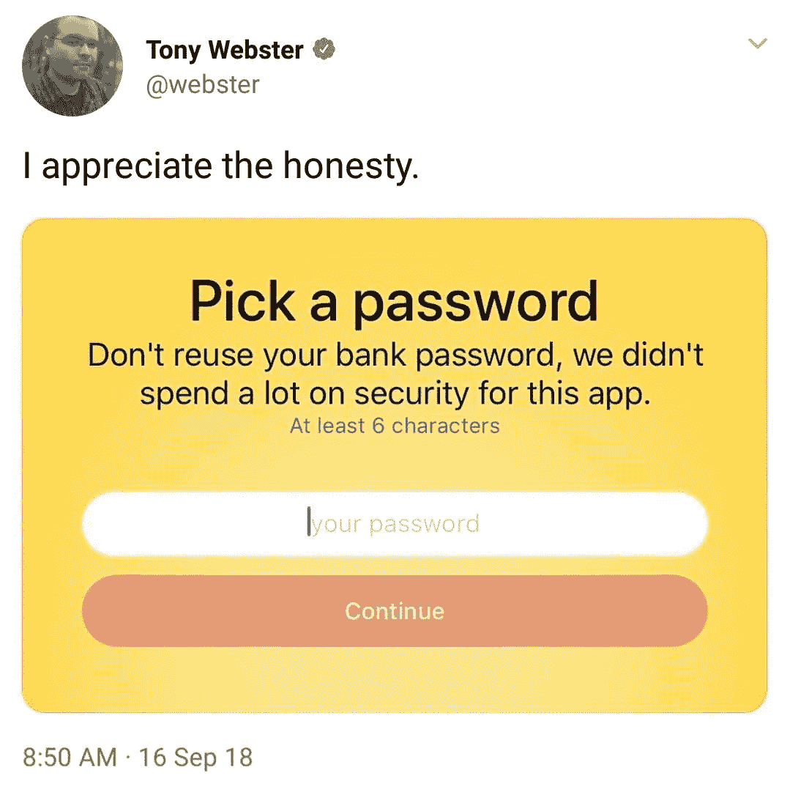

[Original Image](https://i.redd.it/qsbkmaqnplm11.jpg)

如果你仍然不相信，让我最后一次尝试。

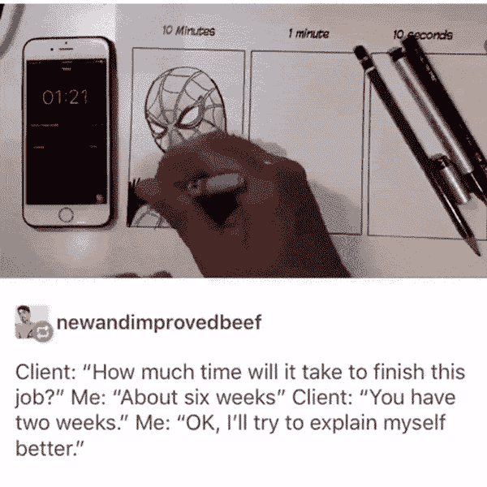

[Original Image](https://i.imgur.com/oZFie9f.gifv)

从上面的例子可以看出，你不需要编程知识就能理解。但是大部分的编程段子(尤其是好段子)都需要一定的知识。

为了得到它们，你需要学习编码——或者至少从编码开始。

# 很难吗？

你不需要成为一个专业的程序员。你只需要开始学习。你想学什么技术并不重要。手机 app 开发，网页开发，游戏开发，都无所谓。

你需要做的就是学习编程的基础知识。

随着你越来越擅长编码，你对编程笑话发笑的能力也会提高。

现在你开始理解更复杂的了。

当你知道如何打印出“Hello World”时。你可以和你的朋友分享你的成功。但是更好的是，你可以把它写进你的简历。

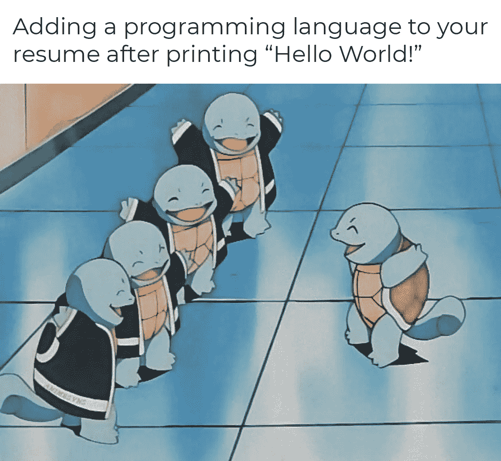

如你所见，你不需要太多的编程知识就能理解这些笑话。你真的不需要学那么多。你只花了几个小时学习。

但是即使在那几个小时里，你也经历了一些有趣的事情。

你经历了程序员每天都需要面对的事情！它是当事情不像它应该的那样工作时的沮丧。

这可能一开始听起来很消极，但实际上，这对你有好处。

现在，你可以理解更多的迷因。大多是令人沮丧的。

[Original Image](https://preview.redd.it/2o2iq7pxia981.gif?format=mp4&s=0e7e3d534e257152b1929d3cd146b55d8232b02c)

当我们谈到挫折和痛苦时，调试必须是每个开发人员的头等大事。

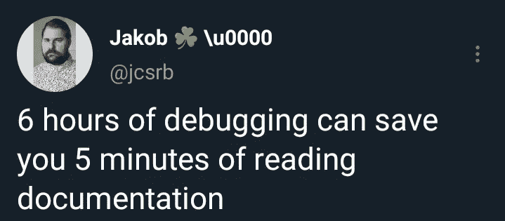

[Original Image](https://i.imgur.com/EWQ3mPq.jpg)

你可能也有幸遇到了那个烦人的 bug。你也知道忘掉它有多难。

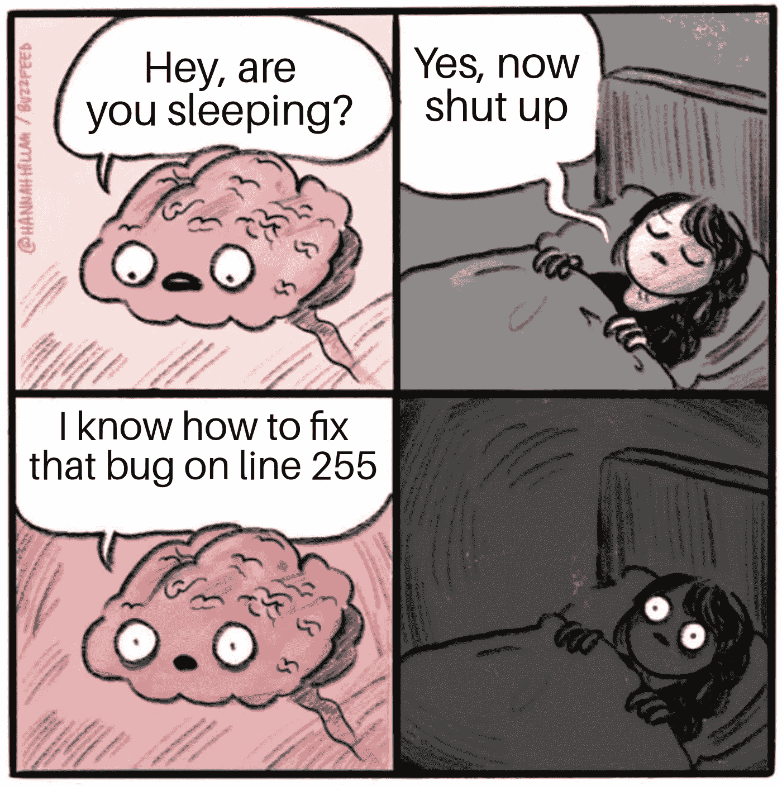

[Original Image](https://i.redd.it/mdjsol1eiad11.jpg)

你已经上瘾了，你想要更多。但是唯一的办法就是多学习。

这就是你要做的！

# 越来越擅长编程

你开始更频繁地编写代码，浏览论坛，观看视频。但最重要的是，**你正在学习最佳实践。**

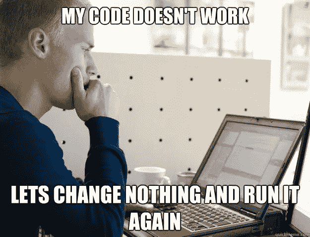

[Original Image](https://i.redd.it/ytitd72wz2b11.jpg)

有时你会面临一个不容易解决的问题。你需要寻求帮助。这时你会很快意识到编程的很大一部分只是在谷歌上搜索。

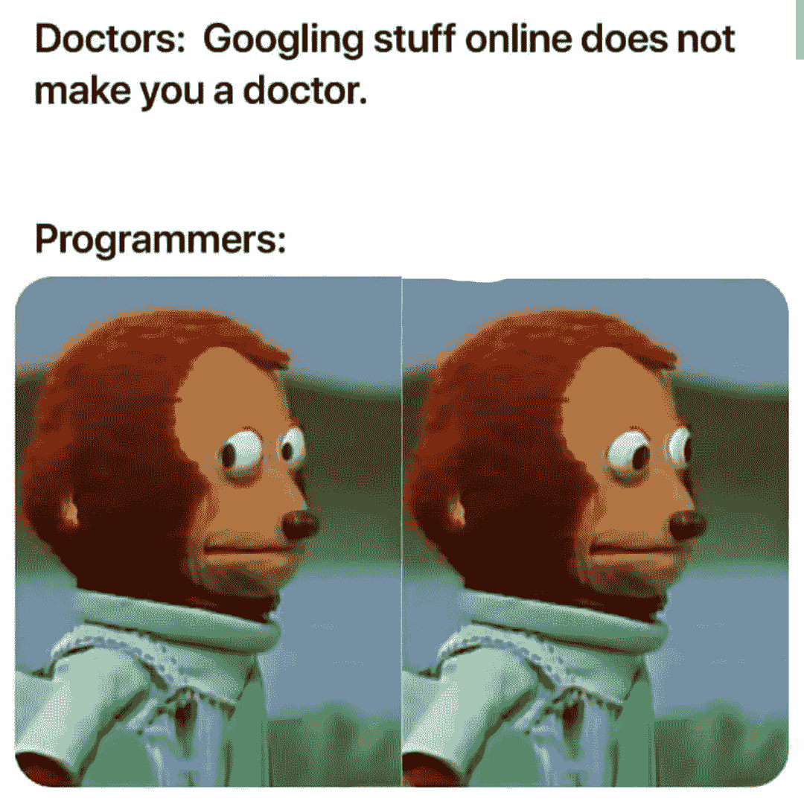

[Original Image](https://i.redd.it/jd25yqv8xsf31.jpg)

至此，您实际上已经知道了开发人员是如何操作的。但是通常情况下，你也会看到等式的另一面——用户。

你看，作为一个开发者，创造一个产品是你的工作。但是用户将决定你做得好不好。

老实说，**他们并不总是做我们希望他们做的事情。**

[Original Image](https://www.reddit.com/r/ProgrammerHumor/comments/rsbq8p/human_error/)

当开发任何类型的应用程序时。我们通常面对两个共同的敌人。**是用户，是我们自己。**

[Original Image](https://i.redd.it/dcuj4sradth51.jpg)

如果你认为事情不会变得更好，那就再想想吧！

# 加入软件公司

有一类迷因需要的不仅仅是学习。这需要很多时间，但作为回报，你会得到金钱上的补偿。

如果你还想知道那是什么，那就是加入一家软件公司。

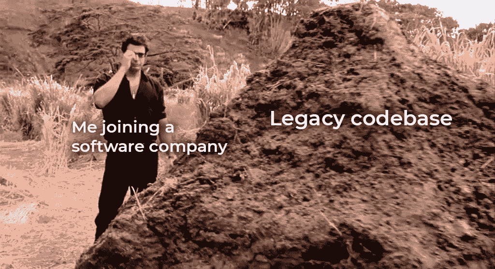

这是你了解企业文化的时候。你会亲眼看到大多数开发人员是如何度过他们的日子的。说到编程笑话，企业文化就是冰山一角。

当你加入一家软件公司时。你不再独自工作了。你是团队的一部分，你是团队的一员。

[Original Image](https://i.redd.it/pkcsunr302m61.jpg)

你还在使用一个不完全是你写的代码库。所以你不太了解它。

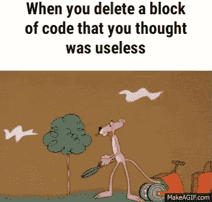

成为团队的一员通常意味着一件事——代码审查。通常没什么意思。

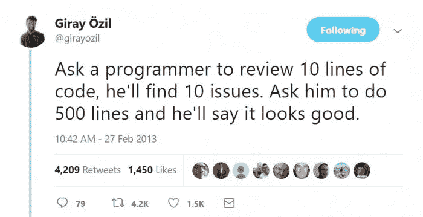

[Original Image](https://i.redd.it/pkcsunr302m61.jpg)

我想没有人喜欢回顾几百个变化。但是如果你想让你的项目保持有序，你就必须这样做。

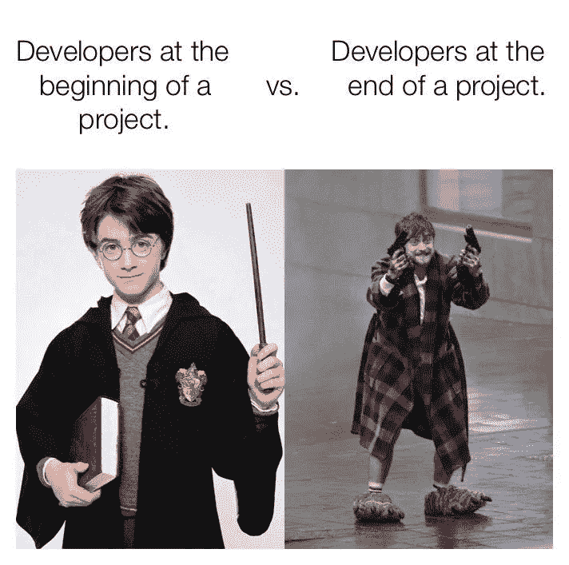

[Original Image](https://external-preview.redd.it/1l05jfSHZdO2J38-zSuTuDFG9QZyUGN6R-PlyjyExFc.jpg?auto=webp&s=4e94d85b2d27a50ea74ab785e4e93c260345a78e)

这基本上就是你旅程的终点。现在，您可以一窥开发人员生活的方方面面。你经历了天堂和地狱。但是作为回报，你理解了所有的编程迷因。

问题是，这值得吗？

*更多内容请看*[***plain English . io***](http://plainenglish.io/)*。报名参加我们的* [***免费周报***](http://newsletter.plainenglish.io/) *。在我们的* [***社区***](https://discord.gg/GtDtUAvyhW) *获得独家获得写作机会和建议。*