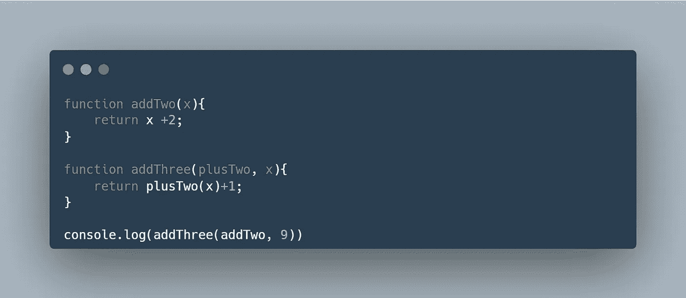
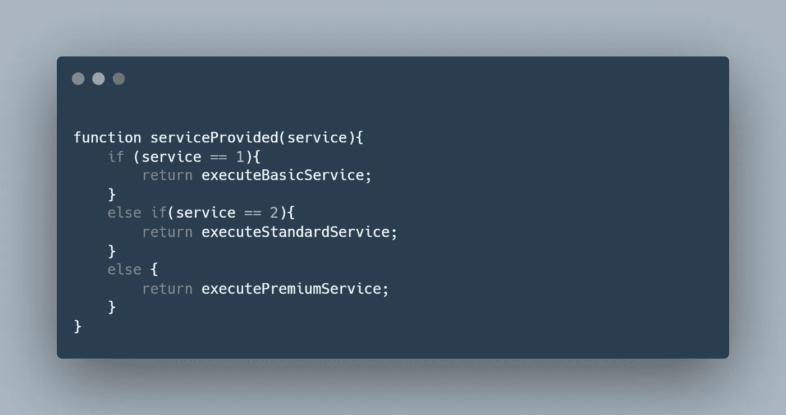
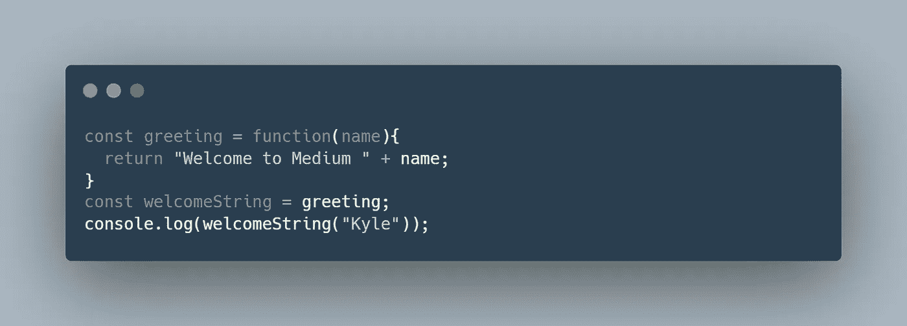

# 一级函数和高阶函数的区别

> 原文：<https://javascript.plainenglish.io/learn-the-difference-between-first-class-functions-and-higher-order-functions-eea0c507263e?source=collection_archive---------2----------------------->

## 跟我学技术术语，让我们听起来像专家


嘿朋友们，

不到一个月，我就要开始一份新工作，我想在工作中处于领先地位。如果我的同事在谈论什么，我希望至少在 90%的时间里能够完全理解他们的技术谈话。肯定的，我会提问；但是我真的不想问那些我可能已经知道的细节问题。

所以今天我们来复习两个我们可能已经知道的概念:**一级函数**和**高阶函数**。后一个术语绝对是我在大学里多次碰到的一个术语。我在准备材料里也碰到过这个术语。第一学期？没有那么多。

大家说说吧。

# 一流的功能

一级函数是可以像对待普通变量一样对待的函数。无论你能对一个变量做什么，你都可以对一级函数做。

根据 MDN 官方文档:

*【一级函数】可以作为参数传递给其他函数，可以由另一个函数返回，可以作为值赋给变量。*

*-*-[-*一级功能，MDN Web Docs*-](https://developer.mozilla.org/en-US/docs/Glossary/First-class_Function)

下面是**例 1** :



在最后一行，我们将函数`addTwo`作为函数`addThree`的第一个参数进行传递。尝试使用 [Programiz](https://www.programiz.com/javascript/online-compiler/) 进行编译，看看会发生什么。

`addTwo`是一个一级函数的例子。

下面是**例二**:



这里我们有一个从名为`serviceProvided`的函数返回一个函数的例子。返回的函数是一级函数的例子。其中包括:`executeBasicService`、`executeStandardService`、`executePremiumService`。

下面是**例 3:**



在本例中，我们重点关注该行:

```
const welcomeString = greeting;
```

注意我们是如何设置变量`welcomeString`等于函数`greeting`的。尝试使用 [Programiz](https://www.programiz.com/javascript/online-compiler/) 进行编译，看看会发生什么。

`greeting`也是一级函数。

同样，一级函数本质上是以类似于变量的方式执行的函数。

*【第一类函数】可以作为参数传递给其他函数，可以由另一个函数返回，也可以作为值赋给变量*

有关更多信息，请查看 [MDN 文档](https://developer.mozilla.org/en-US/docs/Glossary/First-class_Function)。

# 高阶函数

注意在上面的例子中，总是涉及到两个或更多的函数。为了使一级函数存在，高阶函数也必须存在。反之亦然。没有一级函数，高阶函数就不可能存在。

前面我们说过，一级函数可以作为参数传递给其他函数。“其他函数”是指高阶函数。

这是之前的例子:


我们说`addTwo`是一个一级函数，因为——在最后一行——它被用作函数`addThree`的参数。`addThree`是高阶函数。

根据 [Geeks4Geeks](https://www.geeksforgeeks.org/difference-between-first-class-and-higher-order-functions-in-javascript/) :

*【高阶函数是接收另一个函数作为自变量的函数】*

…但那根本不是！

*【高阶函数是返回新函数的函数*

让我们来看另一个例子:


我们说以下函数是一级函数:`executeBasicService`、`executeStandardService`、`executePremiumService`。基本原理是这些函数正在被返回。

促进这一过程并执行返回函数的动作的高阶函数是`serviceProvided`函数。

总体上，高阶函数是返回函数和/或使用函数作为参数的函数；相比之下，一级函数是被返回、被用作另一个函数的参数或被赋给变量的函数。

谢谢你和我一起学习。

在不久的将来，我们将学习更多关于函数的知识。我们将涉及更多的 React 和 TypeScript。我将于 7 月初在硅谷开始工作，所以请跟随我，跟上我的旅程，和我一起学习。

还有，也许可以看看我的 [GitHub](https://github.com/kyledeguzmanx) 。

干杯，朋友们。

*更多内容请看*[***plain English . io***](https://plainenglish.io/)*。报名参加我们的* [***免费周报***](http://newsletter.plainenglish.io/) *。关注我们关于*[***Twitter***](https://twitter.com/inPlainEngHQ)*和*[***LinkedIn***](https://www.linkedin.com/company/inplainenglish/)*。查看我们的* [***社区不和谐***](https://discord.gg/GtDtUAvyhW) *加入我们的* [***人才集体***](https://inplainenglish.pallet.com/talent/welcome) *。*