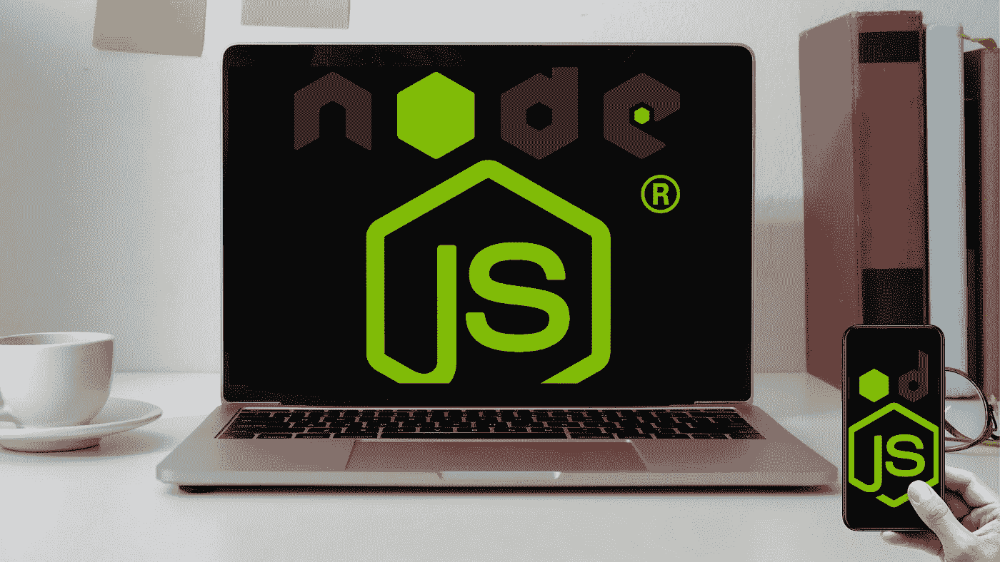
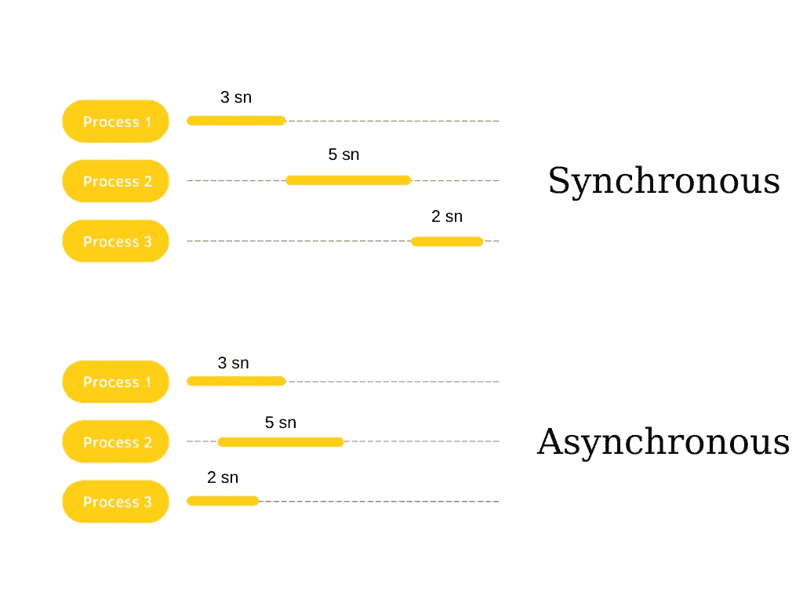

# 3 分钟学会最基础的 Node.js

> 原文：<https://javascript.plainenglish.io/learn-the-most-basic-node-js-in-3-minutes-7e0190c42f99?source=collection_archive---------27----------------------->

## 让您开始使用 Node.js 的一些简短说明



我开始学习 Node.js 已经有一段时间了，在这个过程中我做了非常简短的笔记。如果你开始学习 Node.js，我想这些笔记可能对你有用。

## **Node . js 或者 Node 是什么？**

Node.js 或 Node 是一个开源的跨平台运行时环境。它用于执行 JavaScript 代码，即使没有浏览器。

*   Node.js 很容易上手
*   非常适合敏捷开发
*   我们可以创建高度可扩展的服务
*   Node.js 有一个很大的社区
*   事实上，我们可以说它是运行在服务器端的 JavaScript
*   Node.js 最重要的特性是它异步工作并且是非阻塞的
*   如果你是一名前端开发人员，并且在开始学习 Node.js 时可以使用 JavaScript，那么你就可以成为一名全栈开发人员

考虑到有许多请求到达服务器，服务器将处理这些请求。不是按顺序处理，而是不等一个请求完成，就处理另一个请求。传输第一个完成的请求的响应。这就是所谓的异步工作逻辑。由于事务之间互不影响，它就变成了非阻塞的。



正如您在图中看到的，同步操作的总处理时间为 10 秒，而异步操作的总处理时间为 5 秒。

Node.js 应用程序是高度可伸缩的，Node.js 不应该用于 CPU 密集型应用程序(视频编码等)。)

用于下载 Node.js 的最新[版本。下载后，您可以运行:](https://nodejs.org/en/download/)

`node --version`

## **第一个使用 Node.js 的应用**

创建一个名为 app.js 的文件夹

```
function firstApp(app) { console.log(“Hello”, app);}firstApp(“app”)// running in terminal with ===> node app.js
```

**在 Node.js 中，我们没有** `**window**` **一个对象。代替窗口，我们有** `**global**` **对象。**

```
var person = '';console.log(global.person);// in terminal, solution will be "undefined". So try this code line;var person = '';console.log(person);
```

贝卡。变量，它不是添加的全局对象。我只限定了这个 app.js 文件的范围，所以它在这个 app.js 文件之外是不可用的。

在浏览器中，全局范围是窗口对象，在 Node.js 中，模块的全局范围是模块本身，因此当您在 Node.js 模块的全局范围中定义变量时，它将是该模块的局部变量

了解[全局对象](https://nodejs.org/api/globals.html#globals_global_objects)的更多内容。

## **使用模块**

为了便于理解，我们创建了两个文件，分别名为 lang.js 和 module.js。

在 lang.js 文件中:

```
const lang = [‘JavaScript’, ‘Node.js’];const years = [2, 1];console.log(“langs: “, lang, “years: “, years);module.exports = { lang, years}
```

运行 Node.js lang.js 时；

```
langs: [ ‘JavaScript’, ‘Node.js’ ] years: [ 2, 1 ]
```

在 module.js 文件中，我们用`require()`调用 lang.js 文件；

```
const { lang, years } = require(‘./lang’);console.log(“lang in module: “, lang);console.log(“year in module: “, years);
```

运行 node module.js 文件时；

```
langs: [ ‘JavaScript’, ‘Node.js’ ] years: [ 2, 1 ]
lang in module: [ ‘JavaScript’, ‘Node.js’ ]
year in module: [ 2, 1 ]
```

[](https://bestte.medium.com/membership) [## 通过我的推荐链接加入 Medium—Beste

### 作为一个媒体会员，你的会员费的一部分会给你阅读的作家，你可以完全接触到每一个故事…

bestte.medium.com](https://bestte.medium.com/membership) [](/5-top-rated-q-a-for-angular-on-stack-overflow-bed610bf1c50) [## 5 堆栈上角溢出的顶级问答

### “这个项目从堆栈溢出开始”是开发人员如何开始她的故事。

javascript.plainenglish.io](/5-top-rated-q-a-for-angular-on-stack-overflow-bed610bf1c50) [](/how-to-work-with-the-angular-nebular-ui-library-and-use-a-simple-splash-screen-3dd0d1790478) [## 如何使用 Angular Nebular UI 库并使用简单的闪屏

### 闪屏在某些情况下是必要的，所以我想用一种非常简单的方式来展示它，我将谈谈…

javascript.plainenglish.io](/how-to-work-with-the-angular-nebular-ui-library-and-use-a-simple-splash-screen-3dd0d1790478) [](/how-to-use-sass-and-enjoy-css-with-dynamic-structure-900ea2adddf7) [## 如何使用 Sass，享受动态结构的 CSS

### 由于 CSS 是一个静态结构，我们必须不断重复代码。我们给 CSS 代码带来了动态结构…

javascript.plainenglish.io](/how-to-use-sass-and-enjoy-css-with-dynamic-structure-900ea2adddf7) [](/how-to-use-the-composition-api-to-get-data-from-service-with-vue-js-4da1eca19ad6) [## 如何使用组合 API 通过 Vue.js 从服务中获取数据

### 通过使用组合 API 而不是选项 API，可以使服务结构更加可用。

javascript.plainenglish.io](/how-to-use-the-composition-api-to-get-data-from-service-with-vue-js-4da1eca19ad6) 

*更多内容请看*[***plain English . io***](http://plainenglish.io/)*。报名参加我们的* [***免费周报***](http://newsletter.plainenglish.io/) *。在我们的* [***社区***](https://discord.gg/GtDtUAvyhW) *获得独家获得写作机会和建议。*