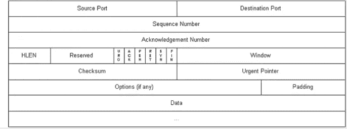

# 学习 TCP/IP 协议族和 TCP 三握手

> 原文：<https://javascript.plainenglish.io/learn-the-tcp-ip-protocol-suite-and-tcp-three-handshakes-a4a0f56deb9c?source=collection_archive---------5----------------------->

# TCP/IP 协议族

## TCP/IP 协议族的定义

TCP/IP 是 IP 协议通信过程中使用的协议族的总称。换句话说，就是计算机与网络设备之间的通信协议规则。

计算机和网络设备必须以相同的方式相互通信。比如如何找到另一个通信设备，双方中哪一方发起通信，使用哪种语言进行通信等都要约定。否则就像两个人在不同的地方用不同的语言交流。双方都不知道对方的存在；即使他们明白，他们也不明白对方想表达什么。

## TCP/IP 协议族的分层管理

TCP/IP 协议族分为四层:应用层、传输层、网络层和数据链路层。

值得一提的是，IP 互联网协议属于网络层，占据了 TCP/IP 的半壁江山，重要性可见一斑。IP 协议的作用是获取分配的 IP 地址和 MAC 地址(网卡的固定地址)等。，并向另一方发送各种数据包。一般来说，通信传输只能通过多台计算机和网络设备的中转来连接，中转需要使用下一站中转设备的 MAC 地址来搜索下一个传输目标。只要拨公司总机号码到前台，前台会把电话转到分机号码。

使用 TCP/IP 协议族进行通信时，发送端会先从应用层向下移动到网络层，到达接收端后再从网络层移动到应用层，如下图所示。图中的箭头是双向的，表示发送方可以是客户端也可以是服务器，接收方也可以使用相同的原理。

在 TCP/IP 协议通信过程中，发送端从应用层到链路层的每一层，都会在把上层当作数据的基础上，封装上一层当前层的头信息。相反，在接收端从链路层到应用层的每一层都会解析当前层的报头，得到下一层的信息，并消除当前层的报头。这种数据信息封装方法称为封装。如下图所示:

TCP 协议属于传输层。在 HTTP 连接中，TCP 协议的功能是提供可靠的字节流服务(将大块数据分成消息段的包管理)。也就是说，TCP 协议会对大数据进行分段，以便于传输，并保证数据准确可靠地发送给对方。

TCP 如何确保数据从发送方准确传输到接收方？这里我们使用众所周知的 TCP 三重握手策略。

# TCP 三握手四浪

## 了解 TCP 连接

要理解 TCP 三次握手过程，首先需要理解 TCP 报头结构。下图显示了 TCP 报头的结构:

在 TCP 报头的结构图中，每行代表一个字节，每个字节有 32 位。

*   第一个字节包含源端口号和目的端口号，每个端口号占用 16 位；
*   第二个字节代表由计算机随机生成的数字，用于唯一标识消息的当前序列号(Seq );
*   第三个字节 32 确认序列号(ack)是对收到的 TCP 报文的确认，表示接收方期望从发送方收到的下一个报文段的第一个字节数据的编号，其值为收到的 TCP 报文段序列号值加 1；
*   第四个字节由 4 位报头长度、6 位保留位和 6 位标志位组成。我们使用的 ACK、SYN、FIN 标志位分别占用 1 位，其值为二进制 1 或 0，分别表示是或否。ack 标志表示序列号是否有效(注意区分大写 ACK 和小写 ACK)，SYN 标志表示是否发起新的连接，FIN 标志表示是否结束一个 TCP 连接。
*   校验和提供额外的可靠性，紧急指针标记紧急数据在数据字段中的位置，等等。

## TCP 三次握手

TCP 是全双工的。发送方和服务器相互发送信息。当客户端想要发起一个新的连接时，需要向服务器发送一个 SYN 标志位为 1 的请求，称为三次握手，如下图所示:

三次 TCP 握手的过程:

1.  第一次握手:客户端向服务器发送一个小的 TCP 数据包。数据包中 TCP 报头的 SYN 标志位为 1，它有一个随机生成的序列号。这里，假设序列号是 10000，表示从服务器请求新的 TCP 连接。
2.  第二次握手:如果服务器接受连接请求，它将用一个 TCP 包回复客户端。在这个数据包中，TCP 报头的 SYN 标志位为 1，ACK 标志位为 1，表示同步确认。那么服务器也会生成自己的序列号。假设序列号是 20000，服务器也会加一个确认号，在客户端发来的序列号的基础上加 1，也就是 10001。
3.  第三次握手:客户端收到对方回复后，可以根据收到的确认号减 1 得到的值判断是否是自己发送的 TCP 报文。但此时服务器并不知道自己发送的 SYN+ACK 报文是否被客户端接受，所以客户端需要向服务器发送一个 TCP 报文，其中 ACK 位为 1，确认号根据从服务器收到的报文序列号加 1，即 20001，连接正式建立。

## TCP 的四次浪潮

当客户端或服务器要断开连接时，会向对方发送断开连接请求。有四个过程，叫做四波。

如上图所示，TCP 挥舞四次的过程如下:

1.  第一波:当客户端想要关闭连接时，它向服务器发送一个 TCP 消息段。报头中的 FIN 标志位的值是 1。这里 FIN 的意思是完成，产生一个随机的序列号。假设序列号是 26000。
2.  第二波:服务器收到客户端的 FIN 请求时，会发送 ACK 标志值为 1 的消息段进行确认，自己的序列号会使用对方的确认号，而自己的确认号会使用对方的序列号加 1。
3.  第三波:此时客户端不知道服务器是否还会有未发送的数据，所以客户端需要等到服务器发送完所有数据后，再向客户端发送 FIN+ACK，并生成自己的序列号。假设这里是 10930，说明确认后可以平仓。
4.  第四波:最后，客户端收到服务器发来的 FIN 消息后，会发送一个 ACK 标志位为 1 的 TCP 消息段进行确认。消息段的序列号就是对方的确认号。确认号是对方的序列号加 1，也就是 10931。此时，TCP 完成四次挥手，连接关闭。

*更多内容请看*[***plain English . io***](https://plainenglish.io/)*。报名参加我们的* [***免费周报***](http://newsletter.plainenglish.io/) *。关注我们关于*[***Twitter***](https://twitter.com/inPlainEngHQ)[***LinkedIn***](https://www.linkedin.com/company/inplainenglish/)*[***YouTube***](https://www.youtube.com/channel/UCtipWUghju290NWcn8jhyAw)***，以及****[***不和***](https://discord.gg/GtDtUAvyhW) *对成长黑客感兴趣？检查* [***电路***](https://circuit.ooo/) ***。*****