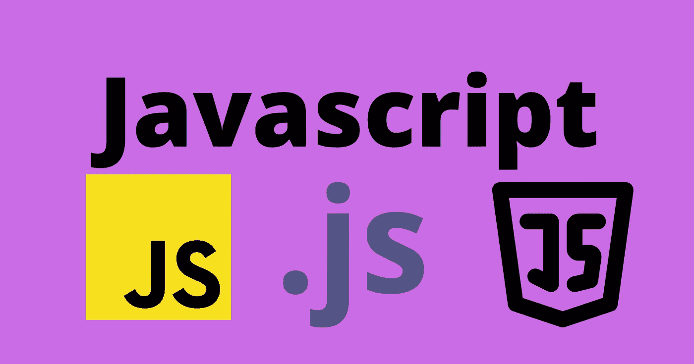
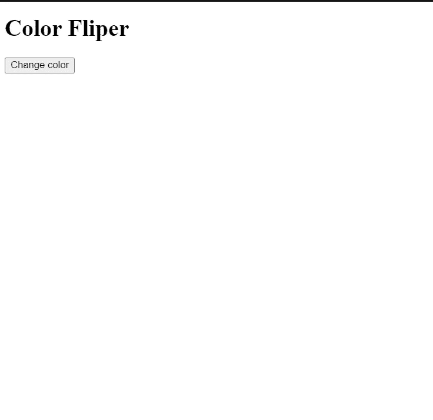
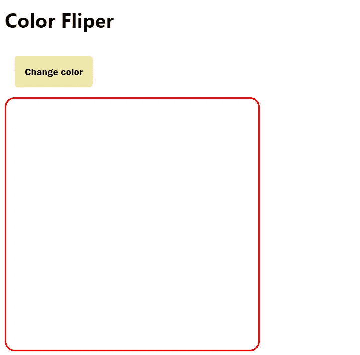
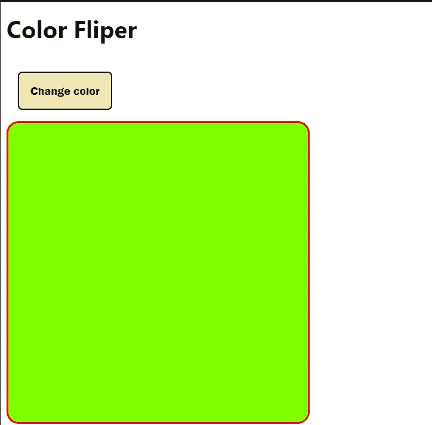

# 学习在短短 5 分钟内建立一个背景转换器

> 原文：<https://javascript.plainenglish.io/learn-to-build-a-background-changer-in-just-5-mins-38377bd5d0f5?source=collection_archive---------6----------------------->



# 介绍

在这篇文章中，我们将看到如何用最简单的方法来创建一个背景颜色改变器。这篇文章是初学者友好的，所以不需要任何先决条件。

# 该结构

每个 web app 或网站都有一个结构，就像人体有骨架一样，但在 web 开发中，我们使用 HTML 来设计结构。我们需要一个`div`元素来显示背景颜色的变化，还需要一个`button`来触发改变背景的功能。

```
<!DOCTYPE html>
<html lang="en">
  <head>
    <meta charset="UTF-8" />
    <meta name="viewport" content="width=device-width, initial-scale=1.0" />
    <meta http-equiv="X-UA-Compatible" content="ie=edge" />
    <title>Static Template</title>
  </head>
 <body>
    <h1>
      Color Fliper
    </h1>
    <button class="btn" onclick="changeColor()">Change color</button>
    <div id="app"></div>
  </body>
</html>
```



在这里，我定义了一个带有`id=app`的`div`元素和一个带有`class=btn`的按钮，它们将用于添加样式。

# 添加样式

我们使用内联 CSS，这意味着所有的 CSS 代码都在一个`<style>`标签中。让我们确保我们的 div 看起来像一个盒子，这样每个人都可以看到颜色的变化。

```
<style>
    body {
      font-family: "Segoe UI", Tahoma, Geneva, Verdana, sans-serif;
    }
    #app {
      height: 400px;
      width: 400px;
      border: 3px solid red;
      border-radius: 1rem;
    }
    .btn {
      padding: 1rem;
      margin: 1rem;
      border: none;
      border-radius: 5px;
      background-color: palegoldenrod;
      font-family: "Franklin Gothic Medium", "Arial Narrow", Arial, sans-serif;
      font-weight: bold;
      font-size: 1rem;
      color: black;
    }
  </style>
```



现在我们可以看到，添加 CSS 后，看起来很漂亮。对于按钮，我使用 padding 属性添加了一些元素内空间和一些边距来分隔`div`和`button`。我还添加了一些字体样式和字体粗细，让按钮看起来很酷。

同样，对于颜色将要改变的 div 元素，我给了它 400px 的高度和宽度，加上 5px 的边框半径，在四个角上添加了曲线。

# 变色功能

现在，让我们添加一个改变颜色的函数。同样，我们将使用内联 JavaScript，这意味着 JavaScript 代码将位于`script`标签内。

```
<script>
      function changeColor() {
        var color = Math.floor(Math.random() * 360 + 1);
        document.getElementById(
          "app"
        ).style.backgroundColor = `hsl(${color}, 100%, 50%)`;
      }
    </script>
```

首先，我们用 ID 应用程序获取 div 元素。那么我们只是使用 0 到 365 之间的随机数动态地改变它的`hsl`属性。你可以在这里了解更多关于 hsl [的信息。](https://developer.mozilla.org/en-US/docs/Web/CSS/color_value/hsl)

# 把它们放在一起

codesandboxio



# 结论

这篇文章将有助于让您的 JavaScript 之旅变得轻而易举，最重要的是一致性，因为最终，一致性帮助我们成功地赢得比赛。

请随意与您的同行分享我的文章，不要犹豫做出反应。一切都是免费的，这有助于我的网页成长。

# 连接

[LinkedIn](https://www.linkedin.com/in/kumar009/)[Twitter](https://twitter.com/kumarkalyan_)

*更多内容请看*[***plain English . io***](https://plainenglish.io/)*。报名参加我们的* [***免费周报***](http://newsletter.plainenglish.io/) *。关注我们关于*[***Twitter***](https://twitter.com/inPlainEngHQ)*和*[***LinkedIn***](https://www.linkedin.com/company/inplainenglish/)*。查看我们的* [***社区不和谐***](https://discord.gg/GtDtUAvyhW) *加入我们的* [***人才集体***](https://inplainenglish.pallet.com/talent/welcome) *。*