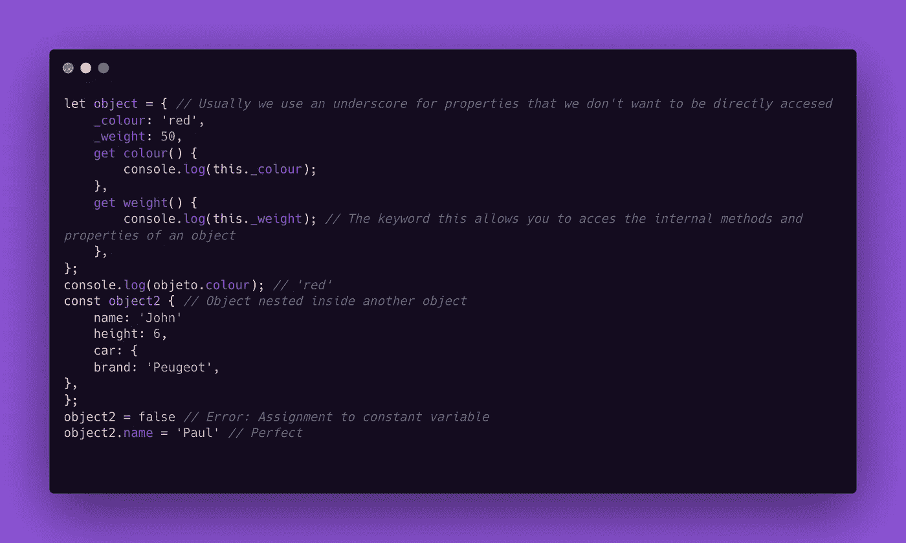
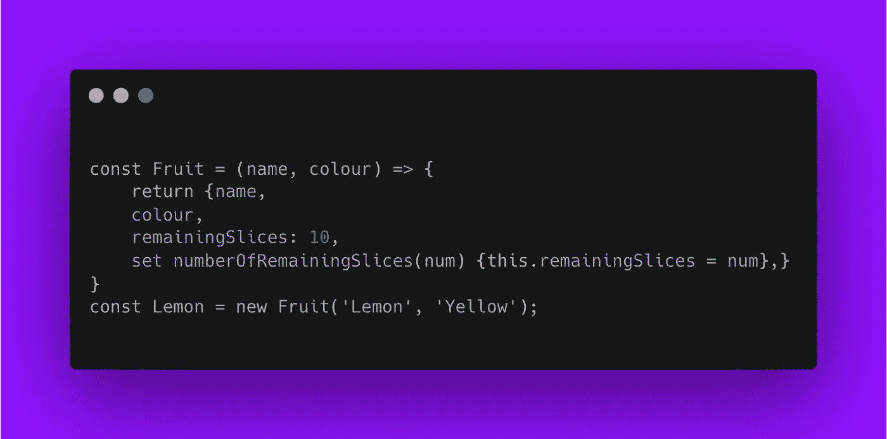
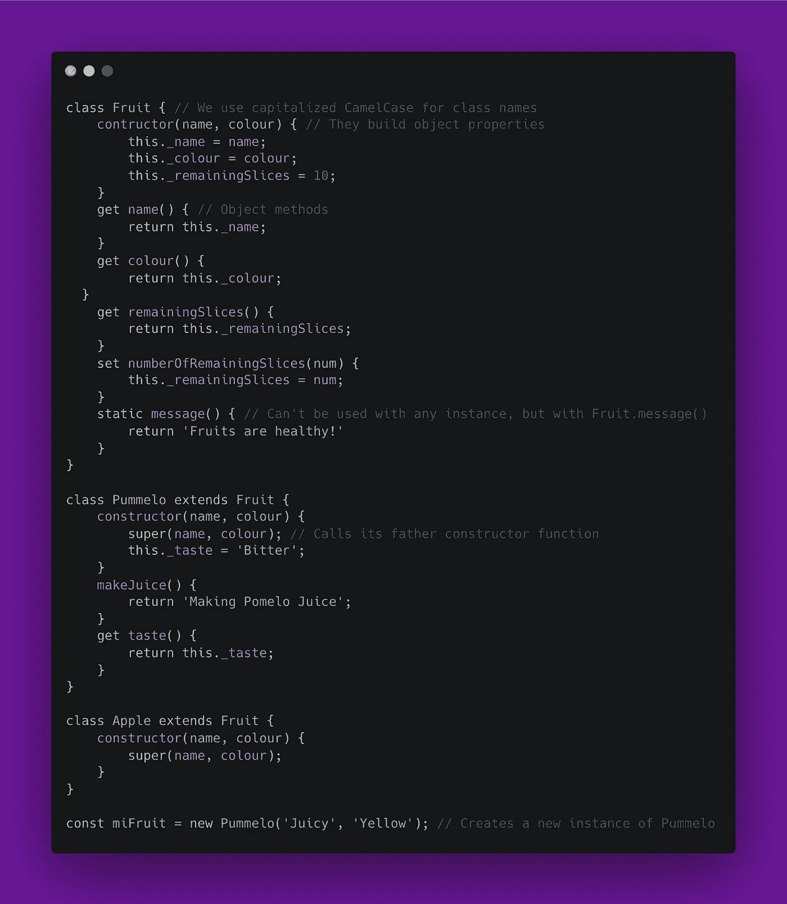
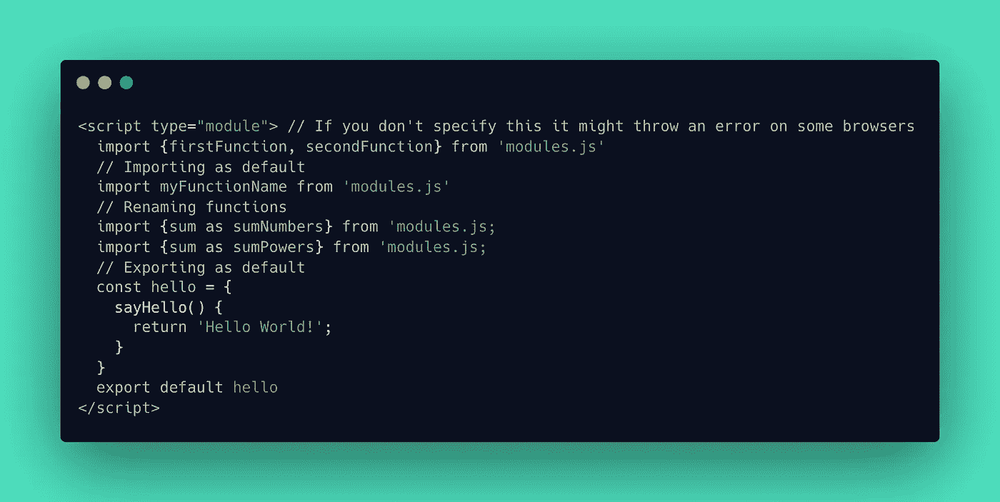

# JavaScript:类和对象

> 原文：<https://javascript.plainenglish.io/learn-to-use-classes-and-objects-in-js-be97505ed4f3?source=collection_archive---------15----------------------->

## 了解如何实现 JavaScript 的两个最流行的面向对象特性。

Photo by [Oskar Yildiz](https://unsplash.com/@oskaryil?utm_source=medium&utm_medium=referral) on [Unsplash](https://unsplash.com?utm_source=medium&utm_medium=referral)

## 什么是对象？

JavaScript 中的对象类似于我们世界中的对象，它们有可以保存不同值的属性(键):从数字到数组甚至其他对象。对象用花括号{}声明，为了给属性赋值，冒号和逗号一起用来分隔属性。const 声明变量的行为与数组相同，它们的属性可以更改，但不能重新分配给另一个对象或数据类型。要访问对象的属性，可以使用句点(`.`)及其键或括号["key"]。

对象使用的其他一些关键字是`delete`来删除一个属性；`get`创建获取对象值且不需要参数的函数，以及`set`创建修改对象值的函数，这样做是为了防止键值被意外修改，这些通常由名字前的连字符(_)表示。

如果访问一个不存在或已删除的属性，该值将是未定义的，直到它保存一个值。

## 工厂功能

创建共享相似特性而不重复代码的多个对象的一种方法是工厂函数。它们可以带(也可以不带)参数，并且总是返回一个直接设置了属性和方法的对象。他们用大写的驼色来命名。为了创建一个对象的新实例，我们使用 new 关键字和对函数的调用。

## 类和继承

与工厂函数一样，类可以用来创建同一类型对象的多个实例。它们通常使用 CamelCase(大写)来命名，要创建一个新的实例，只需用 new 关键字和参数调用该类。类对象的属性是使用一个名为 constructor()的方法设置的，该方法可以在`this`关键字的帮助下将参数设置为属性。对象方法支持 getters 和 setters，编写时不用逗号分隔，跟在 constructor()后面。如果我们想要一个类的独占方法(不被实例使用)，我们使用 static 关键字。

类的一个最重要的优点，如果我们使用关键字 extends +我们的父类的名字，新类将继承它的所有方法(除了静态的)，来调用我们使用的父类的 constructor()函数 super()和参数，如果有的话。

让我们用类来重构我们的旧代码，并实现继承:

## 如何使用模块

正如许多人已经注意到的，Javascript 和其他编程语言中的类经常会导致许多问题，尤其是可读性和样板代码。解决这个问题的一个办法是将我们的类分成模块，我们将在下面看到。

基于关注点分离的原则，JavaScript 允许我们从其他文件中导入代码作为函数，以便能够在我们自己的文件中使用它，这允许我们，除了别的以外:

*   通过具有更好的可读性和更有组织的代码来简化调试。
*   避免名称空间污染。
*   更快地编写代码。

让我们来看一个代码示例:

这就是我们要的。我希望你已经发现这是有用的。感谢您的阅读😄

*更多内容看* [***说白了。报名参加我们的***](https://plainenglish.io/) **[***免费周报***](http://newsletter.plainenglish.io/) *。关注我们关于*[***Twitter***](https://twitter.com/inPlainEngHQ)[***LinkedIn***](https://www.linkedin.com/company/inplainenglish/)*[***YouTube***](https://www.youtube.com/channel/UCtipWUghju290NWcn8jhyAw)***，以及****[***不和***](https://discord.gg/GtDtUAvyhW)**** ***对成长黑客感兴趣？检查出* [***电路***](https://circuit.ooo/) ***。*****