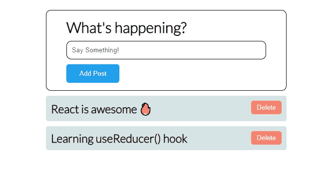

# 学习 useReducer()钩子和管理复杂状态

> 原文：<https://javascript.plainenglish.io/learn-usereducer-hook-and-manage-complex-states-a-complete-guide-2f91c789abb8?source=collection_archive---------7----------------------->

## 关于 useReducer()钩子和管理复杂状态的完整指南。


在这篇博客中，我们将详细讨论 react 中的 useReducer()钩子。我们会明白它的必要性，何时使用它，以及如何使用它。

# react 组件中的状态管理

有两个钩子来管理 react 组件中的状态，它们是:

1.  使用状态和
2.  用户教育

# 使用状态钩子及其问题

如果我们谈论 react 功能组件中的处理状态，那么我们马上会想到 useState()钩子。我们使用 useState()钩子来存储数据，等待某个动作的触发，基于该动作，状态数据得到更新，并触发一个组件的呈现，通过该组件，新的变化反映在 web 页面上。这就是 useState()钩子的工作方式。

useState()钩子允许你存储一个数据单元，不管它是一个布尔值、字符串、数组还是对象。当您需要在一个组件中存储多个数据单元时，真正的挑战就出现了，这意味着要创建多个 useState()钩子。所有这些多重的 useState()钩子会使你的代码可读性更差，更难管理，这反过来会影响代码质量。

# 用 useReducer()钩子集中组件数据

如上所述，在一个组件中拥有多个使用状态会影响代码质量。那么，如果我们将所有组件数据集中在一个地方，并从那里进行操作，会怎么样呢？

听起来很酷，对吧？

到目前为止，您可能已经猜到了，是的，useReducer() hook 就是将所有组件数据集中到一个地方，并从那里进行管理。它类似于 Redux，但与 Redux 不同，它很容易实现。

```
const INIT_STATE = {
    todo: [{id: 1, title: 'Go to gym'}]
}
function todoReducer(state, action) {}
const [state, dispatch] = useReducer(todoReducer, INIT_STATE);
```

useReducer()挂钩接受两个参数:

1.  **初始状态:**初始状态(INIT_STATE)是用某个值初始化的组件的状态。
2.  **Reducer 函数:**Reducer 是一个纯函数，接受两个参数:当前状态和一个动作对象。根据动作对象，reducer 函数必须以不可变的方式更新状态，并返回新的状态。

```
function todoReducer(state, action) {
  switch (action.type) {
    case 'ADD_TODO':
      return {...state, todo: action.payload};
    default:
      return {...state};
  }
}
```

然后，useReducer()钩子返回一个包含两个项目的数组:当前状态和调度函数。

**Dispatch 函数:**Dispatch()函数在您想要更新状态时使用，就像调用 setState()一样。您只需调用 dispatch()函数并传递适当的操作对象。

```
dispatch({
   type: 'ADD_TODO', 
   payload: [...state.todo, {id: 123, title: 'Learn React hooks'}]
});
```

# useReducer()钩子的工作过程

基于完成的某些事件或动作，组件调用分派函数，该函数将动作对象发送给 Reducer 函数。然后，基于动作类型的 reducer 函数返回一个新的状态，该状态反映在网页上。

看看下面这个实现了 useReducer()钩子的迷你项目。该项目是一个小型的社会媒体类型的项目，让你张贴随机的东西。

> **App.js**

```
import './App.css';
import BetterMicroBlog from './BetterMicroBlog';

function App() {
  return (
    <div className="parent-component">
    <BetterMicroBlog />
    </div>
  );
}

export default App;
```

> **BetterMicroBlog.js**

```
import { useReducer, useRef } from "react";
import "./MicroBlog.css";

const BetterMicroBlog = () => {

    const postInput = useRef();

    const INIT_STATE = {
        data: [{id: Date.now(), content: "React is awesome 🔥"}],
        emptyMsg: false
    }

    function blogReducer(state, action) {
        switch(action.type) {
            case "ADD_POST":
                return {...state, data: action.payload, emptyMsg: false};
            case "DELETE_POST":
                return {...state, data: action.payload, emptyMsg: false};
            case "EMPTY_MSG":
                return {...state, emptyMsg: action.payload}
            default:
                return {...state};
        }
    }

    const [state, dispatch] = useReducer(blogReducer, INIT_STATE);

    function addPost() {
        const inputValue = postInput.current.value;
        if (inputValue !== "") {
            dispatch({
                type: "ADD_POST", 
                payload: [...state.data, {id: Date.now(), content: inputValue}]
            });
            postInput.current.value = "";
            return;
        }
        dispatch({
            type: "EMPTY_MSG",
            payload: true
        })
    }

    function deletePost(postId) {
        dispatch({
            type: "DELETE_POST", 
            payload: [...state.data.filter(post => post.id !== postId)]
        });
    }

    return (
    <div className="micro-blog">
    {
        state.emptyMsg ? 
        <div className="empty-msg">Please write something!</div>
        : null
    }
        <div className="micro-blog-head">
            <h2>What's happening?</h2>
            <input
             type="text" 
             className="blog-input"
             placeholder="Say Something!" 
             ref={postInput}
            />
            <button onClick={addPost} className="post-btn">
            Add Post
            </button>
        </div>
        <div>
        {
            state.data.map(post => (
                <div key={post.id} className="post-content">
                    <p>{post.content}</p>
                    <div>
                    <button
                     onClick={() => deletePost(post.id)} 
                     className="delete-btn">
                     Delete
                     </button>
                    </div>
                </div>
            ))
        }
        </div>
    </div>
  )
}

export default BetterMicroBlog;
```

> **输出**



Output

**谢谢你读到这里。我希望现在您已经理解了 react 中的 useReducer()钩子及其重要性。**

# 如果你想要更多这样的内容，请在媒体上关注我，订阅我的 YouTube 频道。

# 有疑问吗？通过推特[联系我](https://twitter.com/izrajesh)。

*更多内容看* [***说白了。报名参加我们的***](https://plainenglish.io/) **[***免费周报***](http://newsletter.plainenglish.io/) *。关注我们关于* [***推特***](https://twitter.com/inPlainEngHQ) ，[***LinkedIn***](https://www.linkedin.com/company/inplainenglish/)*，*[***YouTube***](https://www.youtube.com/channel/UCtipWUghju290NWcn8jhyAw)*，以及* [***不和***](https://discord.gg/GtDtUAvyhW) *。对增长黑客感兴趣？检查* [***电路***](https://circuit.ooo/) *。***