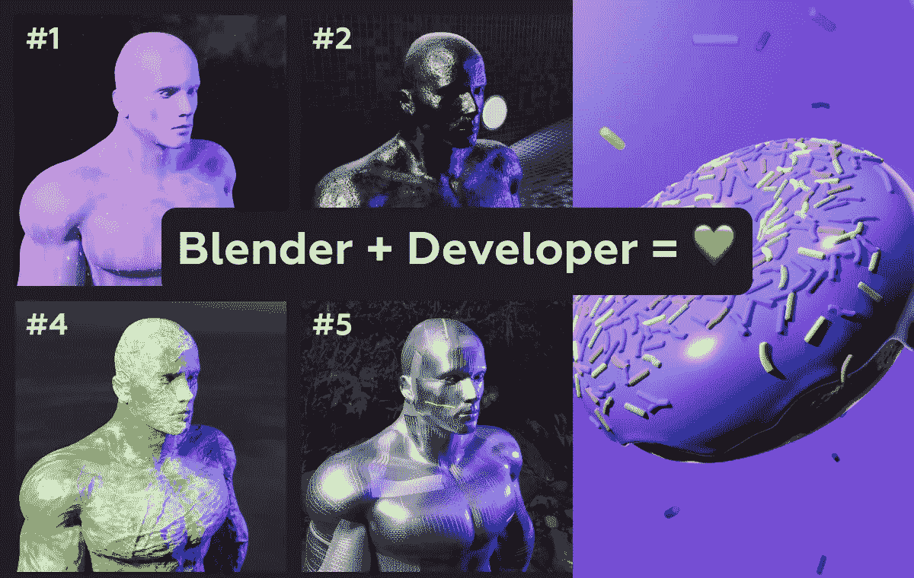

# 学习 Blender 让我成为一名更好的软件开发人员

> 原文：<https://javascript.plainenglish.io/learning-blender-made-me-a-better-software-developer-c61a62be24ba?source=collection_archive---------9----------------------->

## Blender 的界面乍一看很吓人，但其实不应该

# 介绍

那是我在 2017 年第一次听说它的时候，因为我想用 [Unity](https://unity.com/) 创造一个游戏，我想创造定制的 3D 模型。Blender 是最受欢迎的免费 3D 软件，或者至少这是谷歌给我的第一个结果。

我还在上大学，我的整体编程语言还不够广泛，所以我放弃了那个项目，继续我的生活，就像 Blender 从未存在过一样。

最后我主要和[React](https://reactjs.org/)&[next . js](https://nextjs.org/)一起做前端开发，我完全爱上了 UI 设计的美和 UX 的重要性。我想通过所有的阶段从头开始打造产品，从线框图和设计到编码、发布和营销。

2020 年底，我发现了 3D 网络动画的奇妙世界，它将我引入了一个全新的空间。那天，我发现 [Awwwards](https://www.awwwards.com/) ，那一刻，**我知道我什么都不知道。**

Awwwards Homepage

流畅、令人惊叹的动画、3D 模型、微小的交互是困扰我的一些事情。作为软件开发人员，我们经常太专注于功能而忘记了表达，但是当创建一个产品时，两者都是必不可少的。

我真的不知道大多数网站是如何建立的，所以我研究了一下，好家伙，这是一个多么好的研究啊！我很自豪我终于可以说我至少有一些想法😅。

# 如何在 Web 中实现 3D？

一些非常聪明的人创建了 WebGL，这是一个浏览器自带的低级 3D API，使用 HTML 画布并通过 JS 提供访问。不幸的是，这很难，因为它需要学习 GLSL 一种类似于 C 语言的直接在 GPU 上执行的语言，除此之外，你还需要知道**数学。**

是的，你没听错，要得到那个值得惊叹的动画，你需要数学。

Three.js 来拯救我们了。Web 开发人员喜欢他们的 NPM 软件包，因为这里有一个适用于任何东西的软件包，这也适用于 3D。

Three.js 是现有 WebGL API 的包装器，提供了一种更简单、更面向 js 的方法来创建 3D 场景，所需的数学运算更少。

让我给出一些示例网站，并讨论开发方面可能涉及的工具。

## 1. [Github](https://github.com/)

Github Landing Page

你可能不知道 Github 在他们的登陆页面中使用了三个 j，他们呈现实时打开的提交/问题/PRs 的方式是疯狂的。

工具:React &[GSAP](https://greensock.com/gsap/)&three . js(仅限本登陆页面)

## **2。** [**涌浪画廊**](https://gallery.swell.ripple.com/)

Swell Gallery Homepage

看起来像一个展示 Ripple 策划的 NFT 的 3D 画廊，结合了平滑过渡和渲染 3D 模型和动画。

极简主义的界面非常强调展示的艺术，使用背景音乐来创造一种舒缓的气氛。

工装:next . js &[GSAP](https://greensock.com/gsap/)&three . js(或 [react-three-fiber](https://github.com/pmndrs/react-three-fiber) )

## 3. [Three.js 旅程](https://threejs-journey.com/)

ThreeJS Journey Presentation Page

布鲁诺·西蒙制作了一个关于 Three.js 和 3D 的伟大课程，故事讲述和演示非常有创意，非常精彩。

使用定制的 3D 模型以非常互动的方式展示课程的一章，从激光到无人机和传送带。

工装:香草 JS &[GSAP](https://greensock.com/gsap/)three . JS

> 既然我们更熟悉 3D 网络开发的前景，那么 Blender 在所有这些内在的 3D 觉醒中扮演什么角色呢？

除了流畅的体验，让这些网站如此独特的是大部分时间由 3D 模型组成的内容。内容是**王**。Blender 对于从雕刻到动画和合成的任何 3D 相关的东西都非常强大，最棒的是它是免费的。

# 如何搅拌？

两个字。教程和耐心。

如果你不知道从哪里开始，我强烈推荐看[搅拌机大师](https://www.youtube.com/c/BlenderGuruOfficial)的初学者甜甜圈教程，他最近更新了最新的搅拌机版本。这本书很有深度，而且很容易理解，应该可以教会你 Blender 的大部分基本功能。

完成教程后制作自己的项目非常重要，因为接下来的教程可能会产生很棒的渲染，但创作过程也非常重要。

Blender Guru’s Donut 3.0 Tutorial

我已经学了大约 5 个月的 3D，平衡了我的另一份兼职和一份全职的前端开发工作，但是要达到我想要的目标还有很多工作要做。

学习 Blender 本身并没有让我成为一个更好的程序员，而是理解并看到了它与其他软件的相似之处。

多功能性对于开发人员来说是一个重要的特质，能够快速适应新的软件，无论是库、API 还是成熟的应用程序。

Blender 的神奇之处在于，它不仅免费而且[开源](https://github.com/blender/blender)，它还提供了一个 API，通过 [**Python** 脚本](https://docs.blender.org/api/current/index.html)与软件进行交互！

有趣的是，我用 Blender 做的第一个项目涉及一个 Python 脚本，它通过混合 3d 模型、灯光、材质和背景 HDRIs 来自动生成 NFT。是的，那是一口，而且也很难吃。

Sample Outputs of the Generator

请记住，Python API 在 Blender 的每个新版本中都有更新——我当时使用的是 2.9 版本。检查这里的代码，它远非完美或优化，但它发挥了它的作用。

脚本还要求在运行前设置场景，我只是找不到只用 Python 来做的方法。像代码中展示的准备材料、添加模型以混合和匹配之类的事情。

如果有人想尝试一下，请告诉我，我会附加。混合文件到回购。希望你喜欢这篇关于 Web Dev 和 Blender showcase 的文章👏并关注更多技术内容💜。

*更多内容看* [***说白了。报名参加我们的***](http://plainenglish.io/) **[***免费周报***](http://newsletter.plainenglish.io/) *。在我们的* [***社区不和谐***](https://discord.gg/GtDtUAvyhW) *获得独家获取写作机会和建议。***