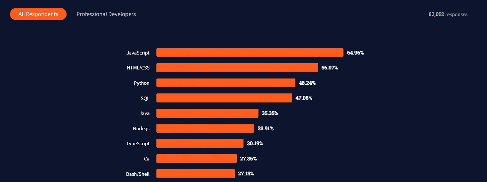
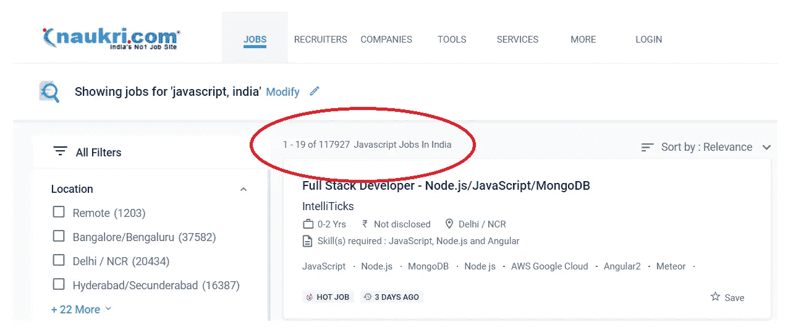

# 2022 年学 JavaScript

> 原文：<https://javascript.plainenglish.io/learning-javascript-in-2022-bbe29f309cc1?source=collection_archive---------15----------------------->

## 需要学习和理解的重要 JavaScript 概念

根据 2021 年的技术调查，JavaScript 拥有庞大的粉丝群，许多开发人员正在关注 JavaScript 相关技术。

[https://insights.stackoverflow.com/survey/2021#technology-most-popular-technologies](https://insights.stackoverflow.com/survey/2021#technology-most-popular-technologies)

如今，您可以在每个领域中找到 JavaScript 实现和依赖关系。JavaScript 可用于:

1.  Web 开发框架:React，Angular，Vue.js 等。
2.  服务器端开发: [Node.js](https://nodejs.dev/)
3.  JavaScript 中的机器学习: [TensorFlow.js](https://www.tensorflow.org/js)
4.  没有 SQL 数据库: [MongoDB](https://www.mongodb.com/)

# 2022 年学 JavaScript 的好处

1.  JavaScript 很容易学。
2.  JavaScript 开发者的巨大市场需求
3.  用于每个领域
4.  使用 JavaScript 技术学习云计算
5.  使用多种 web 框架轻松构建网站
6.  有很多在线学习资料。

下面是 JavaScript 开发人员在印度的工作机会。

Job Availability in JavaScript for Developers

# 面向初学者的 JavaScript 概念

1.  JavaScript 的单线程执行模型
2.  JavaScript 模式:模块和原型模式
3.  JavaScript 闭包和范围
4.  JavaScript 中的链接
5.  原型链接的概念
6.  功能和可变提升
7.  JavaScript 中的不变性
8.  高阶函数
9.  函数式编程及其优势
10.  生活和单身

上面给出的是为了有效地开始 JavaScript 开发应该关注的核心概念和主题。有很多概念需要学习，但是在进一步学习任何前端或后端语言或框架之前，您应该确保您已经深入了解了这些主题。

*更多内容请看*[*plain English . io*](http://plainenglish.io/)*。报名参加我们的* [*免费周报*](http://newsletter.plainenglish.io/) *。在我们的* [*社区获得独家写作机会和建议*](https://discord.gg/GtDtUAvyhW) *。*