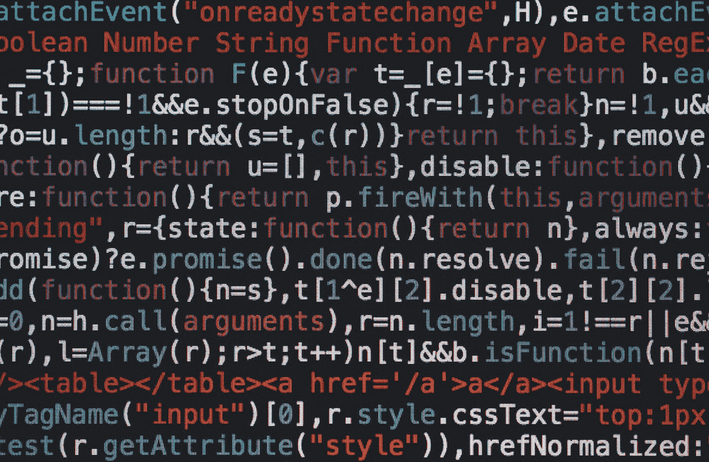

# LeetCode 399:评估除法

> 原文：<https://javascript.plainenglish.io/leetcode-399-evaluate-division-706f98344422?source=collection_archive---------9----------------------->

给我和大家的算法笔记

Photo by [Markus Spiske](https://unsplash.com/@markusspiske?utm_source=medium&utm_medium=referral) on [Unsplash](https://unsplash.com?utm_source=medium&utm_medium=referral)

这是我在一次重要的面试中没能回答的问题。老实说，这不是一个很难的问题，但是，我记得我真的很紧张，不知道为什么在面试的时候不知道该怎么回答。即使面试后马上意识到是 DFS(深度优先搜索)问题，但已经来不及了。

顺便说一下，我最初被问到的问题是关于不同货币之间的转换，所以要注意这个问题可以有各种形式。但本质上，它们都是关于同一个\_(ツ)_/的故事。那么，让我们来看看它是如何工作的。

*更多内容请看*[***plain English . io***](https://plainenglish.io/)*。报名参加我们的* [***免费周报***](http://newsletter.plainenglish.io/) *。关注我们关于* [***推特***](https://twitter.com/inPlainEngHQ)[***领英***](https://www.linkedin.com/company/inplainenglish/)**和* [***不和***](https://discord.gg/GtDtUAvyhW) ***。****