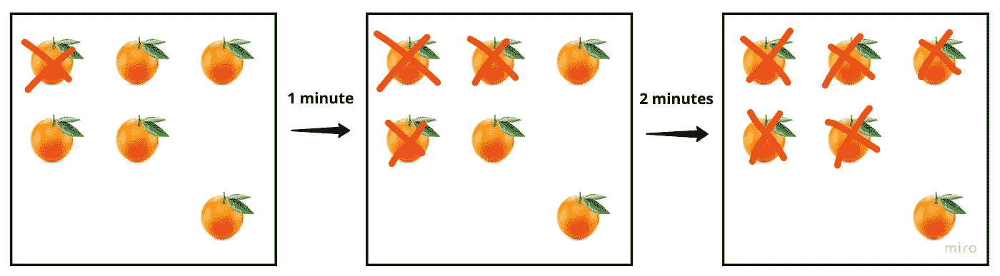

# LeetCode #994:腐烂的橘子问题

> 原文：<https://javascript.plainenglish.io/leetcode-994-rotting-oranges-problem-9596d4f8e923?source=collection_archive---------16----------------------->

## 用 JavaScript 解决腐烂的橘子问题。

[LeetCode #994 腐烂的橙子](https://leetcode.com/problems/rotting-oranges/)是一个非常有趣的问题，需要坐下来好好研究一下。

基本思想是这样的——我们收到一个网格作为我们的输入，每个值是 0、1 或 2。

1 是新鲜的橙子，2 是腐烂的橙子，0 是空白的。

果园里每过一分钟，任何水平或垂直靠近腐烂橘子的橘子也会腐烂。我们会在没有新鲜橙子之前最短时间内返回。

所以让我们用它来得到 O-马绪真…

**输出**:细胞中没有新鲜橙子之前必须经过的最小分钟数。

**输入**:我们的果园(网格)

**约束条件**:

*   m ==网格.长度
*   n ==网格[i]。长度
*   1 ≤ m，n ≤ 10(最后，来自 Leetcode 的合理大小的输入！)

**边缘情况**:因为我们确信至少有一个维度的网格，所以我现在说不适用

下面是这一进展的一个简单例子

[0，0]处的橙色已损坏。一分钟过去了，它旁边的橘子也变坏了。再过一分钟，所有能够腐坏的橙子*都被变质了。*

**快速注意-在这个特殊的例子中，我们实际上会返回-1，因为还有一个新鲜的橙子剩余。如果[2，2]处的橙色不存在，2 将是答案。*

****思考问题****

*至少有几种方法可以解决这个问题。这是我的-*

*我想有一种方法来控制果园，模拟一分钟内发生的腐败。然后，我想重复地运行这个循环，直到没有相邻的橘子可以糟蹋。对我来说，最干净的解决方案似乎是递归的*

**有一些助手函数当前未在摘要中显示(I 副本、邻接、邻接符号和 emptyOrchard)。我会把它们包含在最终的解决方案中。*

*在调用之后，cycleOranges 将加速我们的橙子通过腐败循环，同时增加秒表。这将告诉我们多少分钟过去之前，所有的橙子能够破坏，变质。*

*在那之后，(第 30 行)，我检查以确保我们的秒表确实记录了时间，并且果园是“空的”，这意味着所有在场的橙子都已经变质了。不管我们的秒表时间如何，如果网格中的任何地方仍然有新鲜的橙子，就会返回-1。*

*以下是完整的解决方案:*

***总结***

*这当然是冗长的一面，但对于一个初始解决方案来说，创建助手并以长形式完成是很棒的。将代码分解并变得更详细有助于我理解为什么我要做我正在做的事情。*

*先蛮力，后精细。*

**更多内容请看*[***plain English . io***](https://plainenglish.io/)*。报名参加我们的* [***免费周报***](http://newsletter.plainenglish.io/) *。关注我们关于*[***Twitter***](https://twitter.com/inPlainEngHQ)*和*[***LinkedIn***](https://www.linkedin.com/company/inplainenglish/)*。加入我们的* [***社区不和谐***](https://discord.gg/GtDtUAvyhW) *。**