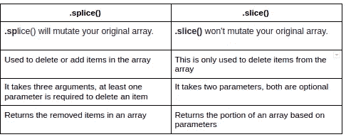

# 让我们澄清一下困惑:JavaScript 中的 splice()与 slice()数组方法

> 原文：<https://javascript.plainenglish.io/lets-clear-the-confusion-splice-vs-slice-array-methods-in-javascript-f946f91d1613?source=collection_archive---------16----------------------->


JavaScript 有很多内置方法，`.splice()`和`slice()`是我们最有用的数组方法之一，记住哪个是哪个并不容易。所以，这就是为什么我认为让我们澄清这两者之间的混淆。

`.splice()`和`.slice()`几乎相同，但它们之间也有一些差异，但在直接跳到差异之前，让我们先了解一下什么是`.splice()`和 `.slice()`。

# 。拼接()

`.splice()`方法用于通过删除现有元素和/或添加新元素来改变数组的内容。此方法修改原始数组，并返回包含已删除元素的数组。

通过使用`splice()`，我们可以**删除**、**添加**或者**替换一个数组中的**个元素。
这个方法有三个参数**，**第一个，一个是必需的，第二个，第三个是可选的。

**语法**—
array . splice(startIndex，deleteCount(可选)，items1，items2，…(可选)

## 如何使用 splice()移除数组元素？

`.splice()`方法需要至少一个参数来从数组中移除一个元素。
当只提供一个参数时，从数组中删除所提供的起始索引之后的所有项。如果你想从数组的末尾开始，你也可以传入一个负值。


.splice() using one argument

第二个参数**(可选)**是要从数组中移除的项数。如果设置为 0 或负值，则不会删除任何项目。
例如，要仅删除一个元素，可以将第二个参数设置为“1”，如下所示


.splice() with two arguments

这是从数组中移除元素的两种方法。当您省略第二个参数时，从起始索引开始的所有元素都将被删除。

## 如何使用 splice()移除和添加数组元素？

接下来是第三个参数，可以传入任意数量的附加参数，并将它们添加到数组中。这些元素将直接插入起始索引之前(同样，这是作为第一个参数传递的值)。


.splice() with three arguments

上面的例子表明，在索引 2 处，一个元素`‘Delhi’`将被删除，而`‘Chennai’`、`‘Indore’`将被添加到起始索引之前。这就是你如何在数组中删除和添加新元素的方法。

## 如何使用 splice()在不删除任何元素的情况下添加新的数组元素？

当您只想添加新元素而不删除任何元素时，您必须将 **deleteCount** 参数设置为“0”。当没有元素被移除时，`splice`方法将返回一个空数组。


.splice() used to only add new element

在上面的例子中，您看到`‘Chennai’`将被添加到索引 2，而不删除任何元素，因为第二个参数( **deleteCount** )是 0。

# 。切片()

`.slice()`方法用于从原始数组中分割出一个数组，与`.splice()`不同的是，它不修改原始数组，而是基于参数返回数组的一部分。

通过使用`slice()`，我们只能从数组中移除元素。该方法有两个参数，start 和 end( **排除**)，两者都是**可选的。如果两个参数都不存在，那么它返回一个原始数组。(原始数组的副本)**

**语法—**
Array.slice(开始，结束)

下面是一些用于从数组中移除元素的`.slice()`的例子


Without argument, no element removed

如果有一个参数，它将返回从起始索引到数组末尾的部分。如果你想从数组的末尾开始，你也可以传入一个负值。


With one argument it behaves similar to .slice()

最后，这里有一个提供了两个参数的示例:


.slice() with two arguments

# **结论:-**

让我们总结一下这篇文章

这两种方法都用于从数组中移除元素，但是我们也可以通过使用`.splice()`在数组中添加新元素。在`.slice()`和`.splice()`之间的选择将取决于您的用例。



Major difference between .splice() vs .slice()

如果你打算给原始数组添加一些元素，你可以使用`.splice()`它们，因为它会**改变**原始数组。但是如果你不想触及你的原始数组，想删除一些项，你可以使用`.slice()`方法。

```
Apart from this, they both are similar.
Note:- slice is **immutable** and splice **mutates** the array.
```

> 这就是这篇文章的全部内容，感谢您的阅读，如果您知道更多不同之处或发现任何错误，请在评论区分享您的观点。我希望你了解一下`.splice()`和`.slice()`，这将会消除他们之间的混淆。
> 查看我的其他文章日期—[**https://medium.com/@aayushtibra1997**](https://medium.com/@aayushtibra1997)

*更多内容请看*[***plain English . io***](http://plainenglish.io/)*。报名参加我们的* [***免费周报***](http://newsletter.plainenglish.io/) *。在我们的* [***社区***](https://discord.gg/GtDtUAvyhW) *获得独家获得写作机会和建议。*