# 创建一个 Chrome 扩展来管理其他扩展

> 原文：<https://javascript.plainenglish.io/lets-create-a-chrome-extension-to-manage-other-extensions-942bcd0f0af3?source=collection_archive---------23----------------------->

## 一个关于如何创建一个 Chrome 扩展来管理其他扩展的代码的详细指南。

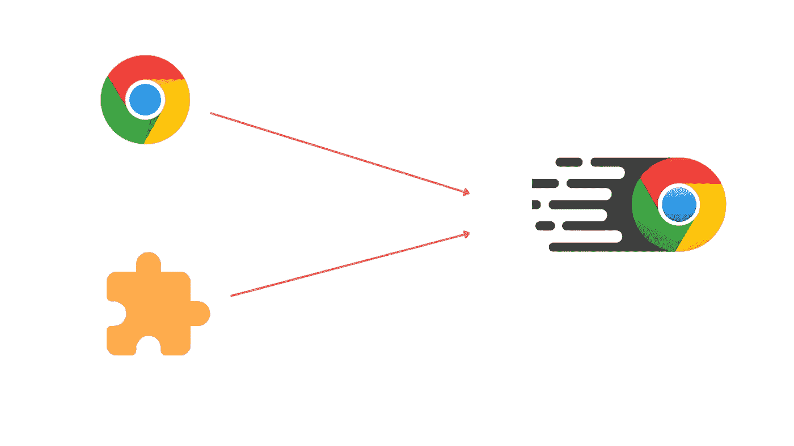

将近 90%的用户使用 Chrome 扩展。Chrome 扩展已经成为我们日常生活中不可或缺的一部分。然而，问题出现了，“我们实际上一直在使用所有这些扩展吗？”答案是响亮的“不”。我们并不是每次使用 Chrome 或其他浏览器都使用这些插件。

即使我们不使用它们，它们也会继续在后台运行，导致不必要的副作用并占用大量内存。通过按“shift +esc”，你可以在 Chrome 的任务管理器中检查扩展的内存使用情况。在这里，你可以看到扩展从系统中挪用了 Chrome 消耗的大部分内存。

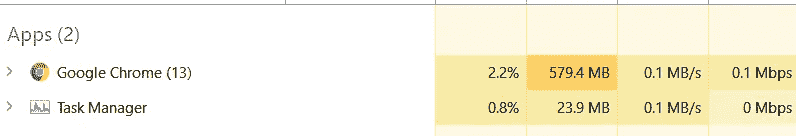

你可以看到 Chrome 已经使用了大约 600 MB 的内存，但可悲的是，大部分内存都被扩展(服务人员)使用了。

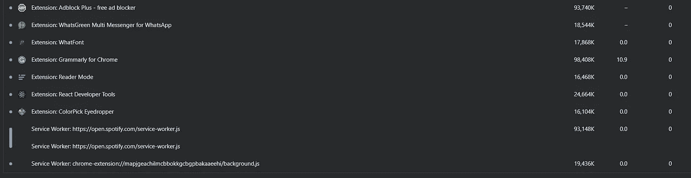

因此，我们将创建一个 Chrome 扩展，允许我们在需要时启用扩展，无需任何重新加载或复杂的过程，并且还将节省大量 RAM。在停用所有扩展之后，很明显内存使用率已经降低了大约 200MB。

我们的最终输出将是这样的，列出了扩展以及一个切换开关，以便随时启用和禁用它们。

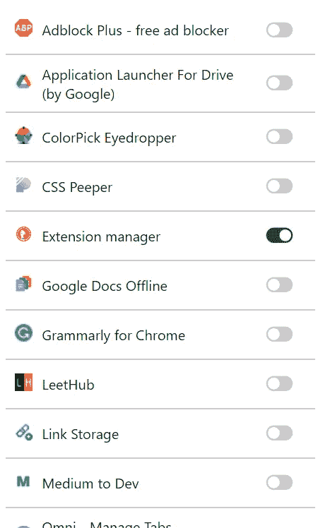

# **开发扩展**

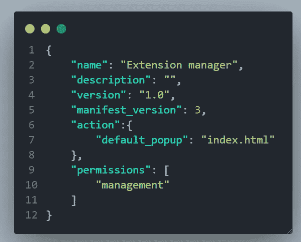

创建一个 manifest.json 文件，该文件包含浏览器所需的元数据，其中应包含名称、版本、描述、manifest_version(有关清单版本的更多详细信息，请访问 https://developer.chrome.com/docs/extensions/mv3/manifest/)。default_popup 表示单击扩展时可见的 HTML 文件，权限表示扩展所需的权限。

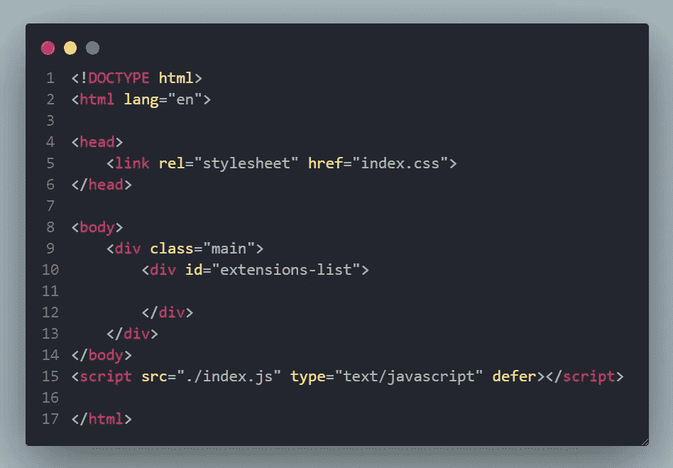

然后，我们将在 index.css 文件中创建一个带有一些样式的基本 HTML 模板，并将它们链接起来，最后是基本部分。js 文件。它还与脚本标签相链接。

安装在 Chrome 上的扩展和应用程序可以通过使用 Chrome 的管理 API 来访问。在这种情况下，我们只需要扩展，所以我们通过省略应用程序来获得扩展。

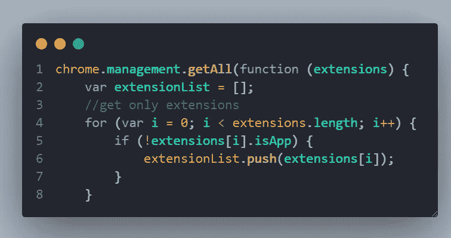

一旦扩展完成，我们就可以通过创建项目节点并遍历数组来在 HTML 中列出它们。

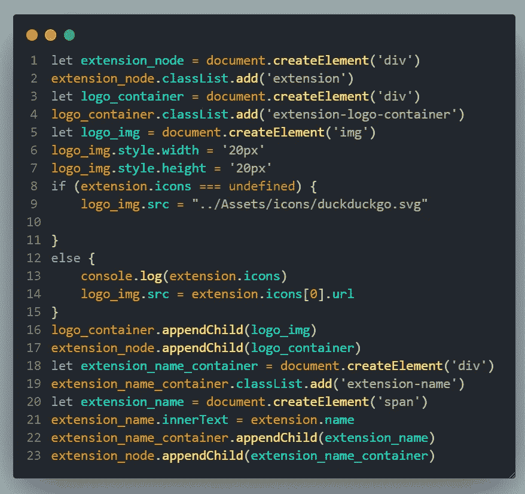

最后，我们将创建一个切换按钮来启用和禁用扩展。

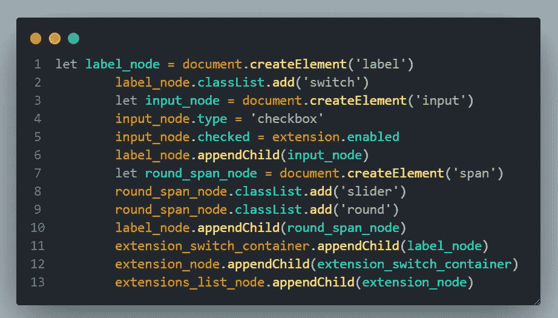

一切都已完成，最后是启用和禁用过程。setEnabled 方法使用 params 应用程序 id 和一个标志来切换它。一旦这个过程完成了，一个回调函数被调用，我们正在重新加载这个位置，它给出了想要的结果，而不需要刷新所有的扩展。

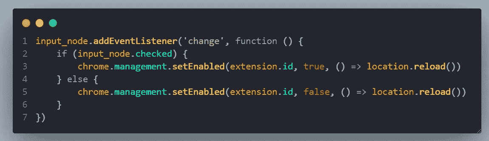

开发过程已经完成。现在是时候测试我们的扩展了，我们可以通过在浏览器扩展页面中启用开发者模式来加载扩展，然后单击“load unpacked”，然后选择包含代码的文件夹。然后，您可以看到该扩展将被加载并准备好使用。

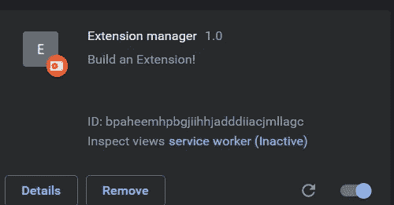

**编码快乐！**

您可以从这里获得源代码:

 [## GitHub-NaveenkumarMD/扩展处理程序

### 此时您不能执行该操作。您已使用另一个标签页或窗口登录。您已在另一个选项卡中注销，或者…

github.com](https://github.com/NaveenkumarMD/Extension-handler) 

*如果对此有任何疑问，你可以给我打电话+91 8870499146*

*更多内容看* [***说白了就是***](http://plainenglish.io/) *。报名参加我们的* [***免费周报***](http://newsletter.plainenglish.io/) *。在我们的* [***社区获得独家访问写作机会和建议***](https://discord.gg/GtDtUAvyhW) *。*