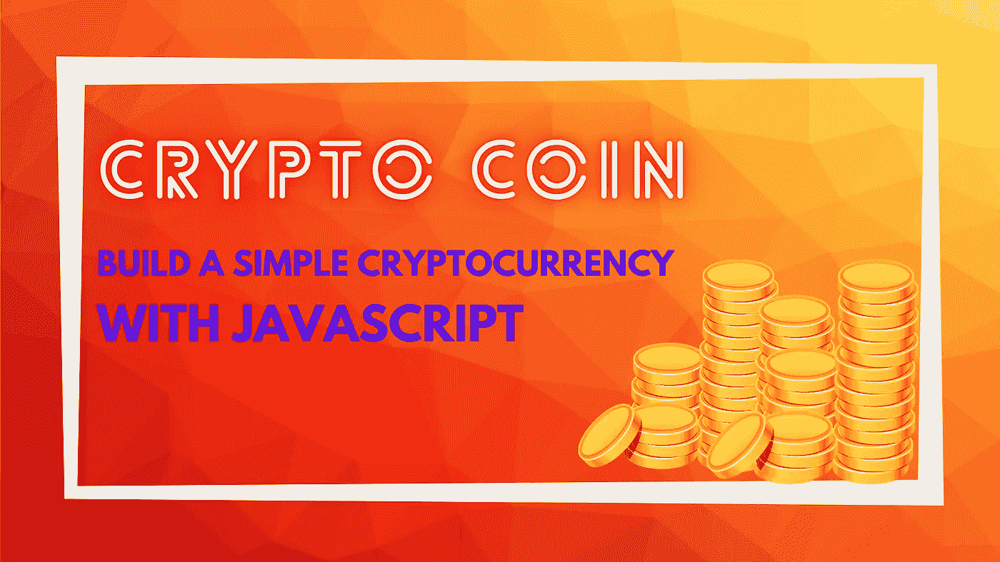
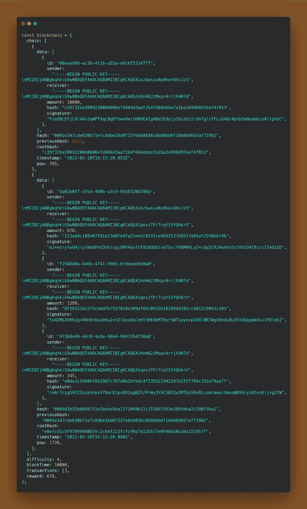

# 让我们用 JavaScript 创建一种有趣的加密货币

> 原文：<https://javascript.plainenglish.io/lets-create-a-cryptocurrency-for-fun-using-javascript-42894b50e44c?source=collection_archive---------3----------------------->

## 如何使用 JavaScript 制作简单的加密货币

今天，我们将使用我们之前创建的[*区块链*](https://levelup.gitconnected.com/learn-blockchain-by-building-it-f2f8ccc54892) 来构建一种加密货币。如果你还没有读过，我会快速重述一下，稍加修改，但是你应该先读一下[以前的文章](https://levelup.gitconnected.com/learn-blockchain-by-building-it-f2f8ccc54892)。

# 什么是加密货币，它们是如何工作的？

加密货币是在区块链网络和其他 web 3.0 应用程序上进行交易的基本货币形式。根据 [*Satoshi 的《比特币白皮书》*](https://bitcoin.org/bitcoin.pdf) 的说法，一个电子币只是一串数字签名。它的主要特征是分散的，因此不可能有政府或外界的影响。加密货币的另一个好处是匿名性，也就是说，你无法跟踪一个人的交易，因为任何人都可以在没有 KYC 的情况下加入网络！

一枚硬币被从一个人转移到另一个人，使用的是他们钱包里的公钥。并且该交易由发送者的私钥数字签名，使得任何人都可以使用发送者的公钥来验证该交易。

每当启动一个事务，它就被临时存储在区块链网络上的一个池中。当网络池中收集了足够数量的事务时，所有事务都将永久存储在一个新的块中(启动挖掘过程),并从池中删除。

## 加密货币是如何产生的，由谁产生？

加密货币的产生被称为铸造。货币由区块链网络铸造，作为对通过解决密码难题成功挖掘新区块的矿工节点的奖励(激励)。

## 如果用户没有帐户，硬币会存放在哪里？

钱包中显示的硬币余额只是在任何交易中没有花费的剩余硬币。我们只需要根据用户的公钥计算未用完硬币的数量，就可以找到他们的硬币余额。

# 先决条件

要学习和理解本教程，您应该熟悉以下内容:

*   JavaScript 中的类和其他 ES6 特性的工作知识。
*   机器上安装了节点。

# 让我们快速回顾一下区块链

从[上一篇文章](https://ankan101.medium.com/learn-blockchain-by-building-it-f2f8ccc54892)中，我们了解到区块链只是一串积木。所以让我们先实现 Block 类:

在上面的代码中，我们只是在块中添加了一个根哈希属性。这个根散列是通过从事务列表创建 Merkle 树来生成的。数据属性将包含事务列表。

`getMerkleRoot`使用了我们在本文的 [***中实现的 Merkle 树类。***](https://enlear.academy/merkle-tree-the-root-of-bitcoin-5a9062394fbf)Merkle 树实现在[这个 GitHub gist](https://bit.ly/34UxH1x) 中有。让我们看看`getMerkleRoot`和`calculateHash`是如何实现的:

现在实现区块链类:

我们已经通过删除包含空数据的 genesis 块更新了区块链类。这是因为我们想要铸造第一个加密货币，如果我们传递空数据，这是不可能的。我们将向第一个用户发起 10000 个硬币的交易，这些硬币将存储在创世纪区块中。

# 加密货币入门

我们将通过网络交易创造加密货币。硬币只是交易中的一个数字。除此之外他们不存在。事务类需要以下属性:

*   发送方和接收方的公钥
*   要转移的金额
*   交易的 id
*   内容的哈希——发送者和接收者的公钥，金额& id(验证时不要弄乱顺序很重要，否则哈希不匹配——发生在我身上；p)

## 定义事务处理分类

我们已经使用了来自 npm 的`uuid`包来生成我们唯一的事务 id。要安装，只需从终端执行`npm i uuid`。

## 更新区块链类

现在我们需要在 Blockchain 类中添加一个`transactions`属性来存储网络上所有待处理的事务。还有一个`reward`属性，它包含给予 miner 节点的奖励金额。接下来，我们将向区块链添加一个`addTransaction`方法，该方法通过确保池中不存在给定的事务，将一个事务和它放入挂起的事务池中。

我们还需要一种方法来检查用户的余额。正如我们前面讨论的，余额只是给定公钥的未转移金额(用户的身份由他的公钥表示)。因此，我们需要检查存储在所有块中的所有交易的金额。

## 获取平衡方法

在`getBalance`方法中，我们检查了所有的块和块中的所有事务。如果事务包含给定的公钥，我们检查公钥是发送方还是接收方。如果密钥与发送者匹配，我们从余额中扣除金额，否则我们将金额添加到余额中。

# 继续说钱包

钱包将包含用户的必要信息。所有用户都将通过他们的钱包进行互动和发起交易。Wallet 类将拥有给定用户的私钥和公钥对。

## 定义钱包类

这里，我们使用了加密库的`generateKeyPairSync`方法。我们的实现使用 RSA 密钥，但比特币和以太坊在 secp256k1 曲线上使用 ECDSA。不幸的是，加密不完全支持这种格式，所以我们使用 RSA。

现在我们需要 Wallet 类中的一个 send 方法，它将为用户创建一个事务。send 方法将接受一个金额和金额将被转移到的接收者的地址(公钥)。

但是在我们实现 send 方法之前，我们需要对事务进行数字签名。否则，交易将无法核实。因此，首先我们在事务类中实现 sign 方法。

## 签署交易

既然 sign 方法已经在事务上实现了，我们可以把注意力放在 send 方法上。

## 发送方法

到目前为止，我们正在实施所有这些方法，但有一个致命的问题需要解决。您可能已经注意到，我们已经实现的事务还没有经过验证。让我们现在解决这个问题。

# 确认

我们将在事务类中添加一个`isValid`方法来验证事务。交易应该包含有效的发送方、接收方、金额，发送方的余额应该大于转账的金额，交易的哈希应该相等，签名应该经过验证。

## 验证单个交易

还记得我们一直在区块链的交易池中添加交易，而没有验证区块链吗？我们需要在将每个事务推到池中之前对其进行验证。我们将在 Blockchain 类的`addTransaction`方法中添加下面一行来代替 if 条件。

> `if(!isDuplicate && transaction.isValid(this))`

## 验证块中的所有事务

现在，我们需要验证一个块中的所有事务。我们可以通过循环所有事务并验证每一个事务来实现。我们将使用`every`方法，这是 JS 中的一个高阶函数，它让我们检查一个数组中的所有元素的条件，如果其中任何一个元素返回 false，则返回 false。

## 挖掘交易

最后，我们需要挖掘事务，即挖掘一个包含所有未决事务的块。我们将在 Blockchain 类中实现一个 mine-transaction 方法来挖掘一个块。将所有事务添加到新块后，我们将清空 pending transactions 列表。

# 还有一个问题需要解决

我们说了会给矿块固定奖励，还没落实。在区块链的`mineTransaction`方法中，我们需要创建另一个将奖励转移到矿工地址的事务。但问题是——在这种情况下，谁是发送者？

## 奖励矿工

我们需要为区块链网络创建一个所有方法和类都可以访问的钱包。我们还需要为网络钱包的交易类中的`isValid`方法创建一个例外，因为网络钱包没有任何余额，但是能够创造新的硬币。然后，我们将在`mineTransaction`方法中添加一个奖励交易。

# 释放最初的几枚硬币

我们将用第一个用户的一些硬币的初始交易来启动区块链实例。转帐将从网络钱包中进行，否则由于先前不存在硬币，转帐将不会生效。我们将铸造第一枚硬币，并将其转移到第一个用户的钱包中。

## 更新区块链创建方法

在上面的方法中，我们首先创建了从*网络 _ 钱包*到第一个用户地址的交易。然后，我们使用第一个事务挖掘一个新块，并将其添加到区块链中。这将是区块链的第一个区块，所以我们可以称之为创世区块。

# 斗牛中的最后一剑

所有必要的代码都已实现，现在是测试的时候了。首先，我们需要为两个用户创建钱包，以便在他们之间进行交易。出于显而易见的原因，让我们称他们为爱丽丝和鲍勃；现在我们将通过向第一个用户爱丽丝赠送第一枚硬币来实例化区块链网络。然后，我们将从 Alice 向 Bob 转移一些硬币，并检查两个用户的余额，并在所有交易后检查区块链是否有效。

执行完文件后，我们应该得到 Alice 的余额为 8356，Bob 的余额为 2322。而下一行应该是—“*区块链有效*”。区块链的快照应该类似于下图。

# 结论

今天我们学习了加密货币是如何工作的，以及如何使用 JavaScript 创建一个简单的加密货币。我们利用了 [*我们之前从这篇文章*](https://levelup.gitconnected.com/learn-blockchain-by-building-it-f2f8ccc54892) 中学到的区块链。源代码可以在 [***这个 Github 仓库***](https://bit.ly/3JLrN1z) 中找到，文件是用 TypeScript 编写的，TypeScript 是 JavaScript 的超集。自述文件中提供了相关说明。

 [## GitHub-ankan gab 101/加密硬币

### 此时您不能执行该操作。您已使用另一个标签页或窗口登录。您已在另一个选项卡中注销，或者…

bit.ly](https://bit.ly/3JLrN1z) 

**接下来的**:我们将为硬币的交易实现一个 ***对等网络*** 。邮件很快就会投递。因此，如果可能的话，不要忘记关注我，订阅电子邮件更新。

## 黑客快乐！

*更多内容请看* [***说白了就是***](https://plainenglish.io/) *。报名参加我们的* [***免费每周简讯***](http://newsletter.plainenglish.io/) *。关注我们*[***Twitter***](https://twitter.com/inPlainEngHQ)*和*[***LinkedIn***](https://www.linkedin.com/company/inplainenglish/)*。加入我们的* [***社区不和谐***](https://discord.gg/GtDtUAvyhW) *。*