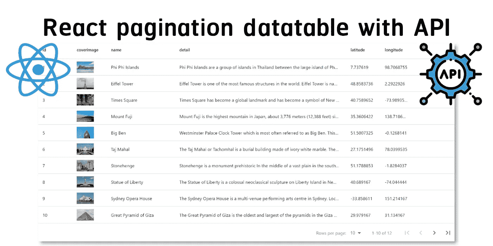
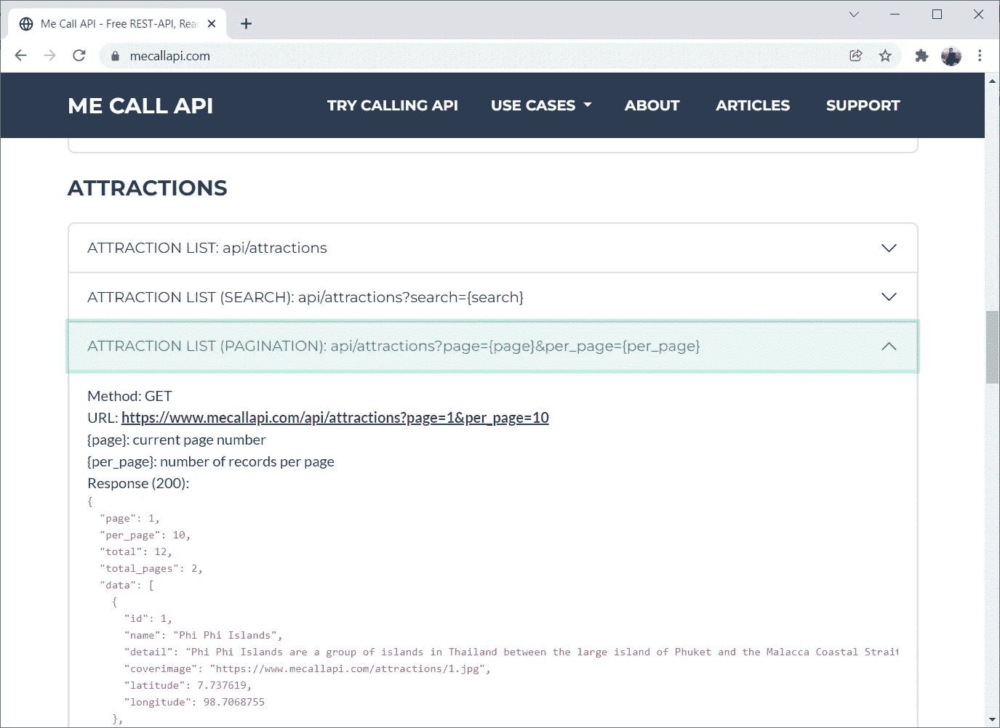
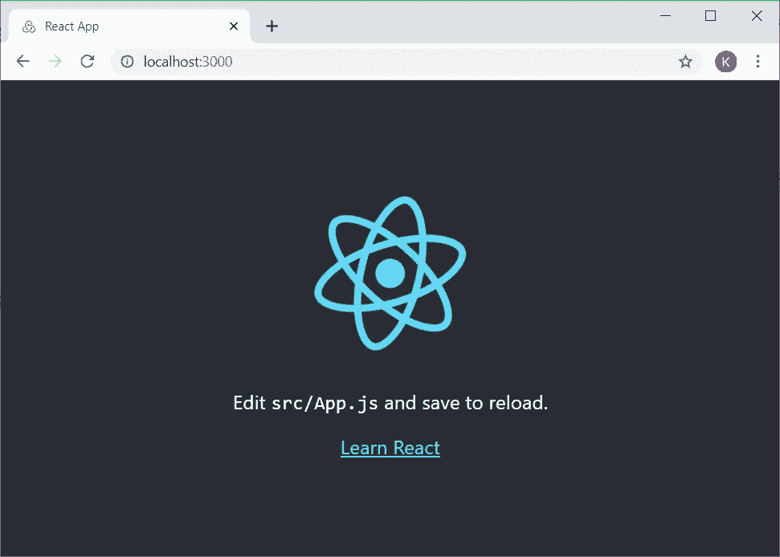
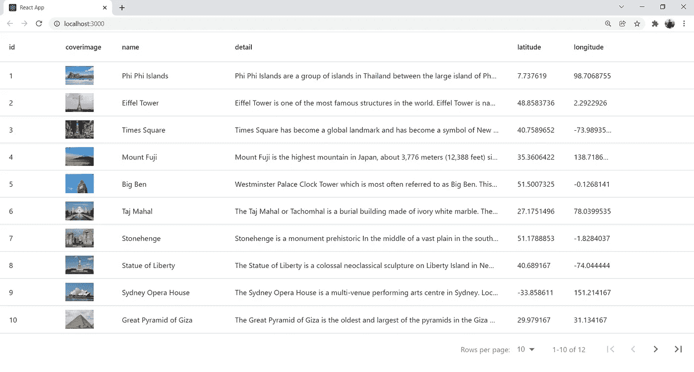

# 让我们用 React 和外部 API 创建一个分页数据表

> 原文：<https://javascript.plainenglish.io/lets-create-a-pagination-datatable-with-react-and-an-external-api-61b69f0af674?source=collection_archive---------2----------------------->



在本教程中，我们将演示如何使用[React-data-table-component](https://github.com/jbetancur/react-data-table-component)和来自[MeCallAPI.com](https://www.mecallapi.com/)的外部 **API** 用 React 创建分页数据表。



[MeCallAPI.com](https://www.mecallapi.com/)

你可以通过简单地从 URL 请求来尝试调用一个 API:[https://www.mecallapi.com/api/attractions?page=1&per _ page = 10](https://www.mecallapi.com/api/attractions?page=1&per_page=10)

# 软件安装

*   **node . js**https://nodejs.org

# 我们开始吧！

创建一个初始**反应**项目:

```
npx create-react-app react-datatable
cd react-datatable
```

安装[反应数据表组件](https://github.com/jbetancur/react-data-table-component):

```
npm install react-data-table-component
```

启动**反应** app:

```
npm start
```

在网络浏览器上访问 http://localhost:3000 以查看结果:



[http://localhost:3000](http://localhost:3000/)

编辑 App.js

让我解释一下代码:

*   **列**(第 4–36 行)是定义为数据表列的数组。
*   定义**状态**(第 42 行)**项**和一个用于给**项**设置值的函数 **setItems** 。我们将调用一个 API 并将响应数据存储在**项**中。
*   定义**状态**(第 43 和 44 行) **totalRows** 来存储来自 API 的行数/数据，定义 **perPage** 来存储每页显示的行数。
*   将函数 **useEffect** (第 46–48 行)定义为 [**效果钩子**](https://reactjs.org/docs/hooks-effect.html) 在组件加载时调用。我们还将 **perPage** 作为 React Hook **useEffect** 的依赖项，当 **perPage** 值改变时，将调用该函数。在我们的例子中，函数 **fetchData** 将被调用。
*   定义函数 **fetchData** (第 50–64 行)调用 API，例如:【https://www.mecallapi.com/api/attractions?page=1】&per _ page = 10 在 React 中检索 **items State** 中存储的景点列表。
*   定义数据表中页面改变时要执行的函数 **handlePageChange** (第 66–68 行)。
*   定义当数据表中每页的行数改变时要执行的函数 **handlePerRowsChange** (第 70–72 行)。
*   组件**数据表**呈现在第 80–89 行，带有启用远程分页的选项(**分页服务器**)。

结果是:



Pagination datatable

# 结论

就是这样。希望它能帮助你理解 **React** 的基础知识以及如何在 API 中使用数据表。下篇见！

*朗西特大学数字创新技术学院博士 Karn Yongsiriwit 的文章*

*更多内容请看* [***说白了就是***](http://plainenglish.io/) *。报名参加我们的* [***免费每周简讯***](http://newsletter.plainenglish.io/) *。在我们的* [***社区***](https://discord.gg/GtDtUAvyhW) *获得独家获得写作机会和建议。*