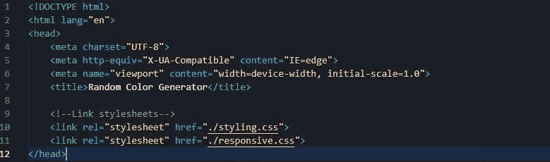
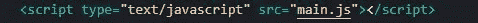
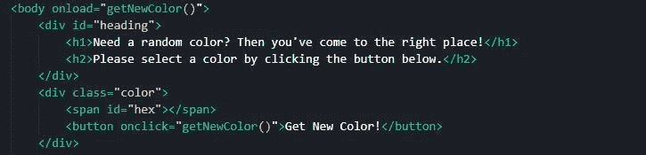
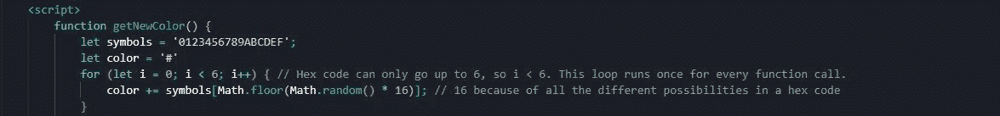
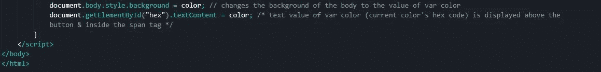
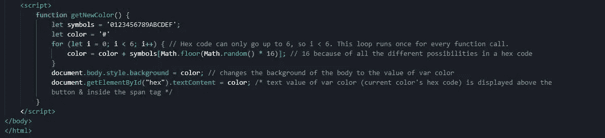
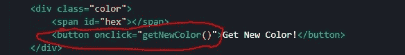
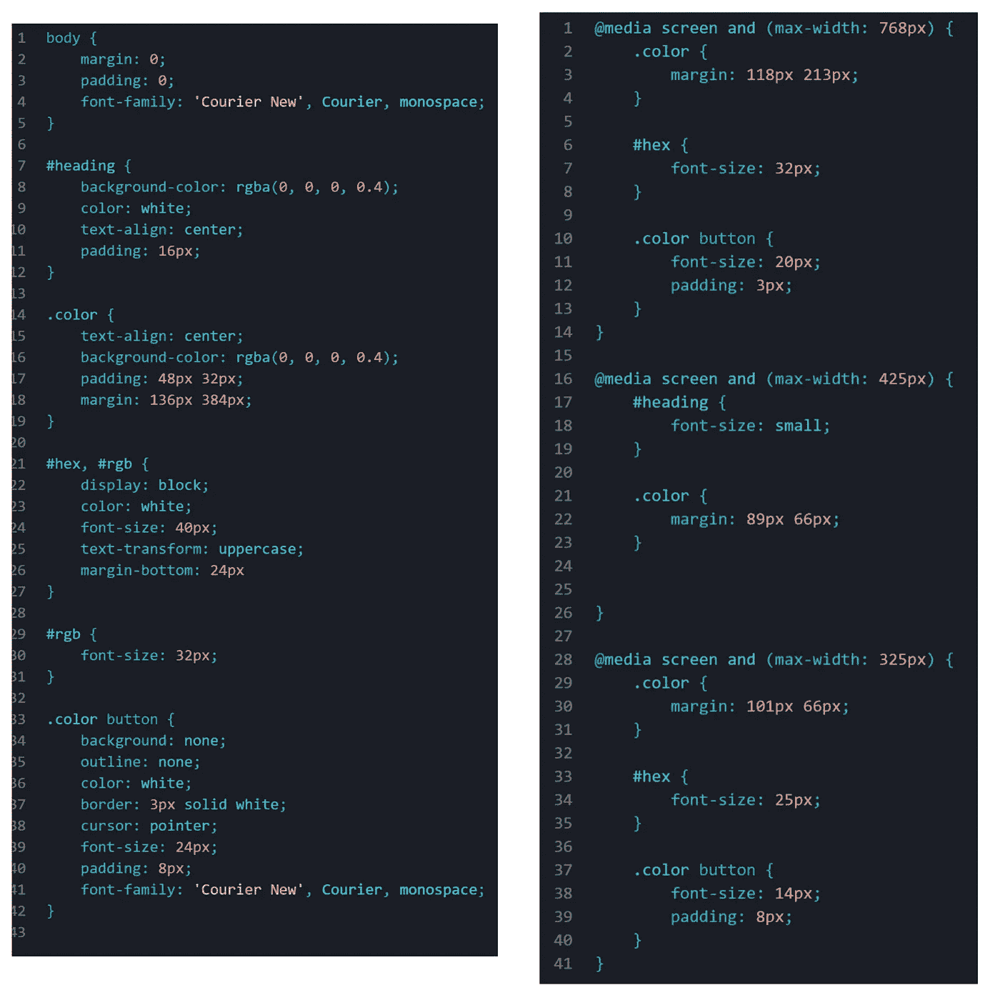

# 让我们创建一个随机颜色生成器！

> 原文：<https://javascript.plainenglish.io/lets-create-a-random-color-generator-221faf96d71?source=collection_archive---------11----------------------->

## 使用 JavaScript 创建随机颜色生成器的分步指南。

Image by [Felix Dubois-Robert](https://unsplash.com/@007felix?utm_source=unsplash&utm_medium=referral&utm_content=creditCopyText) on [Unsplash](https://unsplash.com/es/s/fotos/color-explosion?utm_source=unsplash&utm_medium=referral&utm_content=creditCopyText)

如果您是 JavaScript 新手，您可能已经了解了很多关于数据类型、逻辑、函数等的知识。工作。这很好；为了将来在更复杂的项目中使用 JS，您需要从基础开始。然而，根据你的注意力持续时间，你可能很快就会强烈地想要把你的 JS 技能运用到一个实际的网站上。这样做可能有点复杂(但不像正则表达式那样复杂，amirite)，但是您可以从一个更简单的工具开始，您猜对了，它是一个随机颜色生成器。在本文中，我将带您了解我自己构建一个的步骤。

# 1.添加样本 HTML

Boilerplate HTML, link stylesheets

如果你使用的是 VS 代码，你可以输入**！**到空的 HTML 文档中，然后按**回车**来添加这个部分(不确定其他文本编辑器)，如果你还不知道的话。在样板文件下面，我添加了我在这个项目中使用的 CSS 文档的链接。我建议将你的 CSS 保存在一个单独的文件中，这样你的 HTML 文件就不会变得太大太复杂。由于我们将要编写的 JavaScript 并不长，我将把它直接添加到 HTML 文件的`<script>`标签中，这将在第 3 步中看到。如果你想让一个单独的 JS 文件&链接到你的 HTML 文件，你可以这样做:

Link a separate JS file, main.js

# 2.构建 HTML“框架”

Build the HTML ‘skeleton’

既然我们已经添加了样板 HTML 并在`<head>`中链接了我们的 CSS 文档，那么让我们添加主体&来构建我们的 HTML。如您所见，每当页面加载时，`getNewColor()`函数就会运行。在接下来的步骤中会详细介绍这个函数。

在上图中，我添加了一个`
`，它包含了几个标题，让用户知道他们在哪里&做什么。然后我添加了另一个`
`，它包含一个``标签，这个标签最终将被一个十六进制代码填充，并在页面上显示为文本。接下来，我插入一个按钮，用户单击它可以生成一个新的十六进制代码。这是由`getNewColor()`函数完成的，我很快会解释。

# 3.加 JavaScript！

现在我们正处于真正的奇迹开始发生的时刻。你兴奋吗？我看得出来。你可以这样做:

Add JS to the HTML document

对于像这样一个相对简单的程序，我们只需要一个函数就可以完成我们需要的，就是前面提到的`getNewColor()`函数。对于这个生成器，让我们使用十六进制代码来确定颜色，但使用 RGB 值也是可能的。

让我们首先将所有可能的十六进制字符(整数 0–9 &字母 A-F)以字符串的形式放入一个名为`symbols`的变量中。

然后，让我们用一个字符串形式的散列标记初始化`color`变量。这个变量将在下面描述的循环中变异。

现在让我们做一个运行 6 次的循环，因为在一个十六进制代码中有 6 个值。对于每次循环迭代，来自`symbols`字符串的单个随机值被添加到变量`color`中，如果您记得的话，变量以字符串形式从 **#** 开始。此时，无论何时我们调用`getNewColor()`，我们都会得到一个新的十六进制代码。现在，让我们将代码应用到我们的 HTML 页面。

*根据我的经验，最好将* `*<script>*` *标签放在* `*<body>*` *标签的末尾。有些人可能会激烈反对，他们可能有自己的观点，但我不打算在本文中讨论这一点。如果你想的话，请在下面的评论区进行一场键盘大战，因为这有利于参与。*

# 4.将 JS 应用于 HTML 文件

酷，我们现在有一个函数，给我们一个随机的十六进制代码。然而，这是没有用的，除非我们把它应用到我们的 HTML 中。在这种情况下，最好更改整个页面的背景，这样用户就可以预览随机颜色，并将十六进制代码转换成文本格式，这样他们就可以复制它。我们首先需要在我们的函数中定义这些行为:

Define behaviors in function

仍然在`getNewColor()`函数中操作，我们可以用上面照片中看到的第一行代码访问`background`样式属性。我们也可以使用`backgroundColor`，顺便说一下，它在 CSS 中被翻译成`background-color`。在这一步中，我们将变量`color`设置为页面的背景颜色，这个变量是我们在循环中随机定义的。

在第二行代码中，我们通过 id“hex”访问先前定义的``标记。要以文本形式添加变量`color`，我们可以使用我在这里使用的方法`.textContent`，或者使用`.innerHTML`方法，将`color`附加到``标签上。请参阅本文末尾的链接，了解更多关于这两者之间的区别。按照我们上面布局 HTML 的方式，这个文本将直接出现在按钮上方，这样用户就可以看到显示的确切颜色&如果他们愿意，可以复制它。

总之，我们的 JS 看起来像这样:

# 5.告诉程序何时运行该函数

如果我们从来不运行一个函数，那么创建它就没有意义，所以现在让我们告诉我们的程序什么时候应该调用我们的`getNewColor()`函数。在这种情况下，让我们运行`getNewColor()`每当页面加载&时，当“获取新颜色！”按钮被单击。我们是这样做的:

Run function upon loading of page

Run function upon clicking of button

# 6.添加样式

您可以按照自己的意愿完成这一部分，也可以根本不做，但这是我在这个项目中使用的样式，左边是 styling.css，右边是 responsive.css:

# 7.让我们来测试一下！

如果您正确执行了上述步骤，当您在浏览器中打开文件时，应该会出现这种情况:

感谢您读到这里！希望对你有帮助。记住，有时阅读文章和跟随教程是可以的，但是你应该只是为了学习概念才这样做。一旦你认为你已经完全掌握了这些概念，试着自己编写程序。不，你可能不会第一次就把所有事情都做对，但是遇到问题&用你学到的概念自己找出解决问题的方法，是成为更好的程序员的途径。

如果你觉得这篇文章很有帮助，我会很感激一个好的评论或一些掌声，这样我就可以知道人们认为什么内容是有用的，这样我就可以在将来专注于写那些内容。

一如既往，编码快乐！

[查看该项目的运行情况](https://egroene.github.io/Random-Color-Generator/)

[链接到该项目的 GitHub 回购](https://github.com/EGROENE/Random-Color-Generator)

[链接至关于之间差异的文章。innerHTML &。文本内容](https://www.geeksforgeeks.org/difference-between-textcontent-and-innerhtml/)

*更多内容请看*[***plain English . io***](https://plainenglish.io/)*。报名参加我们的* [***免费周报***](http://newsletter.plainenglish.io/) *。关注我们关于*[***Twitter***](https://twitter.com/inPlainEngHQ)[***LinkedIn***](https://www.linkedin.com/company/inplainenglish/)*[***YouTube***](https://www.youtube.com/channel/UCtipWUghju290NWcn8jhyAw)*[***不和***](https://discord.gg/GtDtUAvyhW) *。***