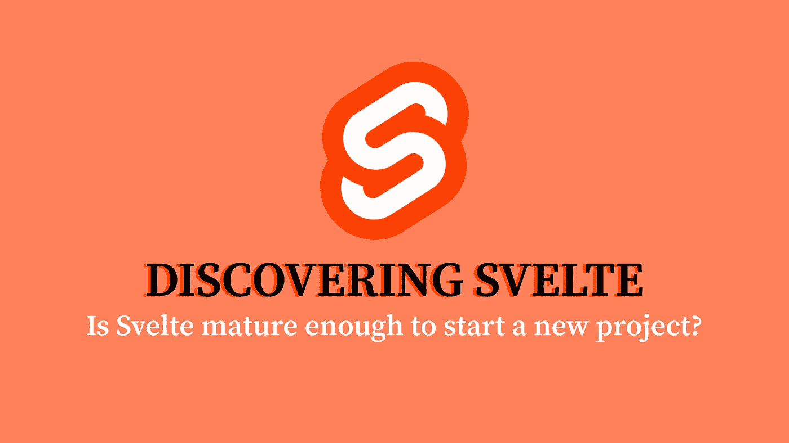
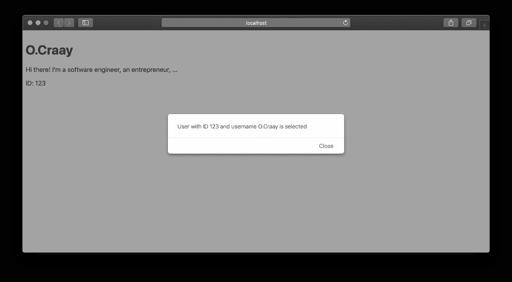
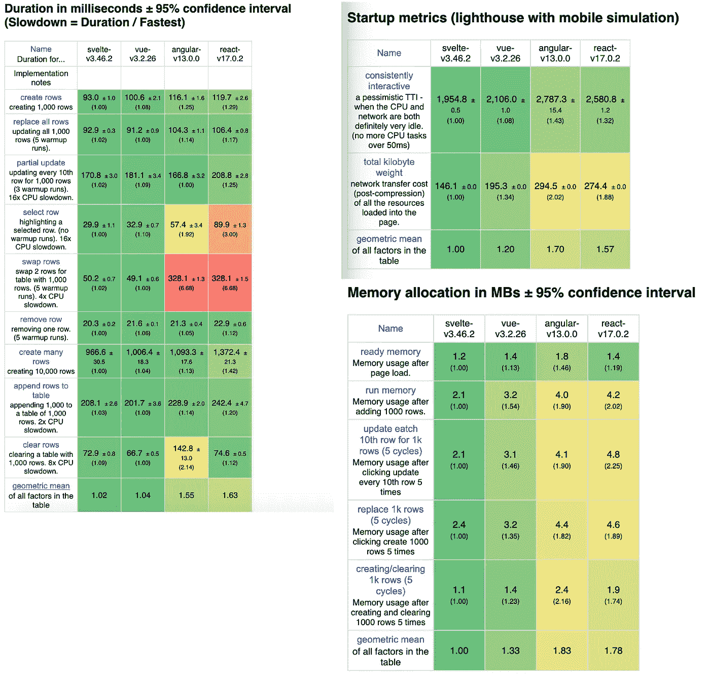

# 让我们发现苗条:一个全面的初学者友好的介绍

> 原文：<https://javascript.plainenglish.io/lets-discover-svelte-a-comprehensive-beginner-friendly-introduction-67eb57f36127?source=collection_archive---------15----------------------->

## Svelte 是否足够成熟，可以开始一个新的项目？



你可能已经听说过这个新的前端框架——另一个？！—它开始为自己命名，并被证明与竞争对手一样有前途，它被命名为: **Svelte** 。如果你还没听说过，现在是时候澄清事实了。但是别担心，我会一直保护你的！

# 但事实上，什么是苗条呢？

**纤薄**是前端技术领域逐渐形成的新趋势。它以其*“编写更少的代码”*的概念而闻名，这一概念包括编写更少的代码以获得同样高效的结果。这是其创造者 [Rich Harris](https://twitter.com/rich_harris) 的承诺之一，他是《纽约时报》的平面编辑，也是 [*Ractive.js*](https://ractive.js.org/) 的作者。

在我写这篇文章的时候，Svelte 已经是第 3 版了。是的，自 2016 年发布以来，这个很少受到关注的框架取得了巨大的成功，并成功应对了我们今天都知道的市场巨兽。它在 GitHub 上有近 57000 颗星。自己看: [Svelte 的 GitHub](https://github.com/sveltejs/svelte) 。

# 好吧！但是为什么要苗条呢？

G[iphy](https://media.giphy.com/media/QmDgpAv8JKrxXtrnmR/giphy.gif)

接下来是存在主义问题:“*当其他人做得很好的时候，我为什么要费心学习一个新的框架呢？*“正如我之前提到的，**从一个非常简单的想法开始:编写更少的代码——但这不是它提供的唯一好处。**

**在构建阶段，将你的组件编译成命令式代码，换句话说，编译成你的网络浏览器可以理解的代码。这允许您在页面中加载单个 bundle . js——顺便也加载 bundle.css 以便浏览器只负责呈现您的应用程序。这不需要在运行时加载框架，甚至不需要虚拟 DOM，因为后者被认为太慢了。**

# **在用法上，它是什么样子的？**

## **初学者友好的语法**

**谁说代码越少，维护的样板文件就越少，语法就越容易使用。系好你的安全带，我们一起去看。如果你从未见过用 Svelte 编写的组件，这里有一个非常基本的例子。**

****身材苗条**对吧？如果我们与 React 进行比较，您可能应该写:**

**并带有棱角:**

**结果是没有上诉！分别计算 125、207 和 240 个字符的苗条、反应和角度。如你所见，用 Svelte:我们直奔主题。使用熟悉的**

**一个组件纯粹是由 **HTML** 、 **CSS** 和 **JavaScript** 组成。请注意，您在 ***<脚本>*** 标签中定义的所有内容都可以从您的 HTML 模板中访问，并且组件中包含的 CSS 被封装。**

**换句话说，您不可能影响其他组件。指定每个组件的声明必须使用`.svelte`扩展名是很重要的。**

# **输入/输出管理**

**Svelte 是一个面向组件的框架。与大多数同行一样，有一些反复出现的概念，如组件之间的交互和确保通信。让我们从创建一个`User.svelte`组件开始:**

**这里，export 关键字用于指示要评估的属性，以便与我们的组件进行交互。这是您声明组件输入的唯一方式。一旦它被创建，从我们的`App.svelte`你只需要像这样导入它:**

```
<script>
import User from ‘./User.svelte’;
</script>
```

**您可能已经注意到，我们的组件的定义不包含任何命名的概念，并且出于很好的原因，**您的组件的命名仅使用 import 关键字**来完成。所以它们可以像普通的 HTML 元素一样使用。现在让我们继续下一步，这包括用所需的值来评估 id、用户名和个人信息属性:`<User {...user} />`。**

**然而，这一评级应持保留态度。滥用它会极大地降低对代码的理解。特别是因为不建议分解，因为很难优化苗条。
这一切中的输出是什么？！从 DOM 或组件订阅事件是通过使用 **on，**指令来完成的。然而，发出一个事件意味着它之前已经使用 **createEventDispatcher** 方法定义过了:**

**允许您创建事件调度程序的 **createEventDispatcher** 方法是带有两个参数的函数:一个名称和一个有效负载。在上面的例子中，已经创建了**选择的**事件，剩下的就是从我们的`App.svelte`订阅它，如下所示:**

**需要注意的是，传输的有效载荷实现了 JavaScript API 的 **CustomEvent** 接口。所以当它发出时，我们的 ***id*** 和 ***用户名*** 数据可以通过我们的事件对象的详细属性来访问。最后，当我们单击我们的用户组件时，我们会得到以下结果:**

****

# ****$:像命运运算符****

**如果现在，我跟你谈谈**命运操作员**！这让你想起什么了吗？下面的例子应该有助于你更清楚地看到这一点:**

```
var x = 5;
var y <= x + 1;
 x = 10;
Assert.AreEqual(11, y);
```

**总是一无所获？！上面的例子可以翻译成 JavaScript，如下所示:**

```
var x = 5;
var y = x + 1;
x = 10;
y = x + 1;
Assert.AreEqual(11, y);
```

**那应该更清楚一点吧！事实上，第一个例子说明了**命运概念**运算符。这表示变量不需要在每次它所依赖的值改变时被重新分配。**

**但是和苗条有什么关系呢？Svelte 建立在这一概念的基础上，并结合了所谓的“**反应式报告**”。因此，对于 Svelte，通过在指令前面加上 **$:** 这样的前缀，指令就变得具有反应性了:**

```
let x = 5;
$: y = x + 1;
x = 10;
Assert.AreEqual(11, y);
```

**然而，使用 **$:** 前缀有一些限制，这是有充分理由的:语句响应只由赋值触发。让我们仔细看看！这一次，让我们处理一组**用户。****

**让我们再举一个例子，声明“反应”变量`usernames`，它包含一个姓名列表并显示所有这些漂亮的人:**

**当按钮被单击时，我们不会得到预期的效果，原因很简单:pop、shift、unshift 和 splice 等数组对象方法不会导致自动更新，因为对象引用保持不变。这就是为什么我们在添加新元素时必须重新分配 **users** 变量:**

```
<script>
[…]function addUser() {
[…]users = users;
}
</script>
```

**更简洁的语法是使用分解并只进行一次赋值:**

```
<script>
[…]function addUser() {
[…] users = [
   …users,
   newUser
 ];
}
</script>
```

# **这一切的表现在哪里？**

**造物主做出的另一个承诺与性能直接相关。谁说命令式代码，谁说直接操纵 DOM 的低级代码，所有这些都没有技巧。证明就是，下面是 Svelte，Vue.js，React，Angular 的对比。**

> **我将使用这个[网站](https://krausest.github.io/js-framework-benchmark/2022/table_chrome_98.0.4758.80.html)来比较所有框架的性能。**

****

# **所以，最后呢？**

**总之，你应该已经明白: **Svelte** 是自给自足的，不需要框架或第三方库来工作。随着前端领域中存在过多的技术，下面的问题必然会被提出:“*Svelte 是否足够成熟来启动一个新项目？*“我会回答你，框架的第 3 版是一个相当重要的可靠性指标，而不是无关紧要的指标。**

**特别要记住，Svelte 也有一个很棒的社区。锦上添花，苗条还兼容 [***Jest***](https://github.com/rspieker/jest-transform-svelte) 和[***story book***](https://storybook.js.org/tutorials/intro-to-storybook/svelte/en/get-started/)，分别运行你的单元测试和构建你的组件库。有趣的是，它与[***web pack***](https://github.com/sveltejs/template-webpack)进行了简单的集成，以便于应用程序的开发和部署。**

**这最终表明，苗条引起了用户的很大兴趣。此外，创建者表现出想要去除其他框架经常遇到的令人畏惧的任务，比如初始化一个新项目。**

**这样一来，学习时间就大大减少了。我建议你一件事:你自己试试，你会被争取过来的。**

***更多内容看* [***说白了就是***](https://plainenglish.io/) *。报名参加我们的* [***免费每周简讯***](http://newsletter.plainenglish.io/) *。关注我们* [***推特***](https://twitter.com/inPlainEngHQ) *和*[***LinkedIn***](https://www.linkedin.com/company/inplainenglish/)*。加入我们的* [***社区不和谐***](https://discord.gg/GtDtUAvyhW) *。***