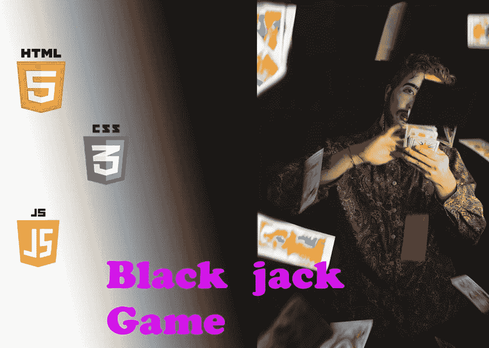

# 如何使用 HTML、CSS 和 JavaScript 制作一个简单的纸牌游戏

> 原文：<https://javascript.plainenglish.io/lets-make-a-simple-card-game-ac56c36d773b?source=collection_archive---------5----------------------->

## 一个只使用 HTML、CSS 和 JS 制作纸牌游戏的教程。

编码很容易理解，

但是要做到只使用 HTML、CSS 和 JS 就可以完成所有的数学运算，这有点困难。

所以今天我将解释如何开发一个二十一点游戏，只有 HTML，CSS 和 JS 被使用。

我们走吧！😎

# 步骤 01

首先，制作一个 index.html 文件，并将代码放在下面:

第一个超文本标记语言文件👇

第二个超文本标记语言文件

第一个 HTML 文件是这两个文件中最重要的。

# 步骤 02

请制作一个 CSS 文件，并将代码放在下面:

# 步骤 03

请创建一个 JS 文件，并将代码放在下面:

按照上面所述准备相关文件，并将相关的 13 幅图像添加到一个文件中，并对其进行编号。

我的游戏👇

 [## 黑杰克游戏](https://lnkd.in/gpBrxKtw) 

# 结论

*希望你能建造这个项目。请在评论中发布你的游戏项目。*

*如果您在实施过程中遇到任何困难或需要任何帮助，请一定联系我。*😍

*更多内容见于***。报名参加我们的* [***免费周报***](http://newsletter.plainenglish.io/) *。* [***推特***](https://twitter.com/inPlainEngHQ)[***领英***](https://www.linkedin.com/company/inplainenglish/)*[***YouTube***](https://www.youtube.com/channel/UCtipWUghju290NWcn8jhyAw)T42，以及[**T46***上追随我们。对增长黑客感兴趣？查看*](https://discord.gg/GtDtUAvyhW) [***电路***](https://circuit.ooo/) *。***