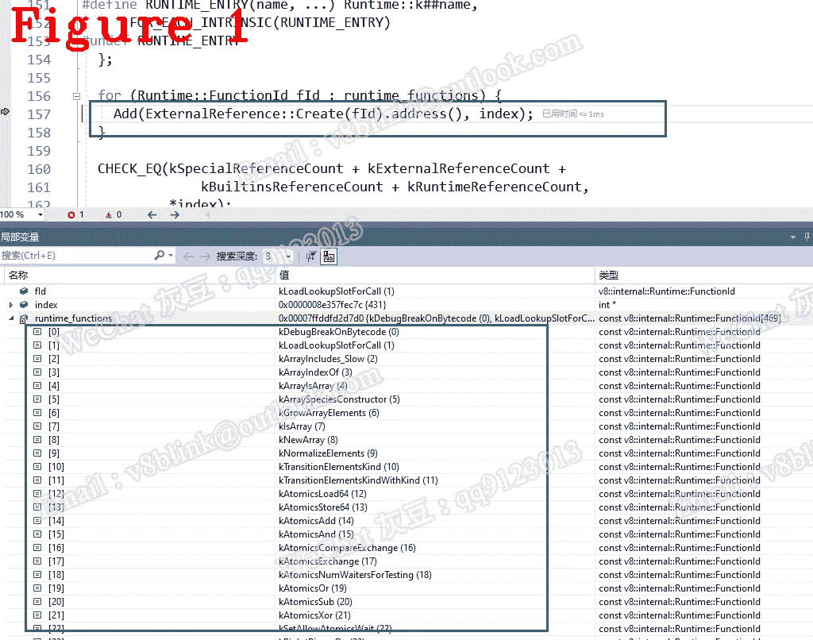
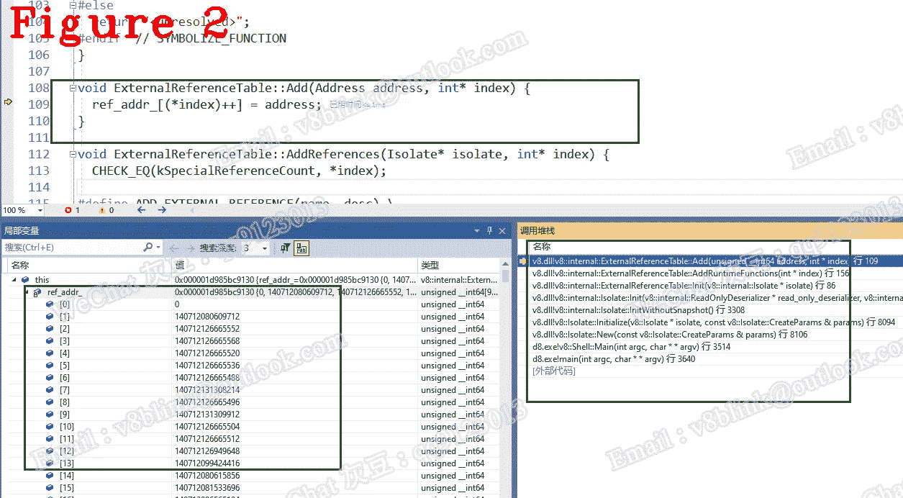

# 让我们来了解一下 Chrome V8——第十六章:什么是运行时？为什么重要？

> 原文：<https://javascript.plainenglish.io/lets-understand-chrome-v8-chapter-16-what-is-runtime-why-is-it-important-8c808e58843d?source=collection_archive---------9----------------------->

## 运行时的初始化和调用教程。

*欢迎阅读* [*其他章节让我们来了解一下 Chrome V8*](https://medium.com/@huidou)

从实现的角度来看:内置是通过 Runtime、Torque (CodeStubAssembler)、JavaScript、ASM 实现的。以下是 V8 的官方描述:

*V8 的内置功能可以用许多不同的方法来实现(每种方法都有不同的权衡):*

*依赖于平台的汇编语言:可以很高效，但是需要手动移植到所有平台，并且很难维护。*

C++:在风格上与运行时函数非常相似，可以使用 V8 强大的运行时功能，但通常不适合性能敏感的领域。

*JavaScript:简洁可读的代码，可以访问快速的内部函数，但频繁使用缓慢的运行时调用，由于类型污染而受到不可预测的性能影响，以及围绕(复杂且不明显的)JS 语义的微妙问题。*

*CodeStubAssembler:提供高效的低级功能，非常接近汇编语言，同时保持平台无关性和可读性。*

什么是运行时？这是一种实现 V8 内置的方法。

为什么重要？如果你懂了，就意味着你知道了四分之一内置的设计和实现。

在这篇文章中，我将谈论运行时的初始化和调用。通过学习它们，我们将对运行时的工作流程有一个全面的了解。

# **1。初始化**

运行时是 V8 的基础组件，它在 V8 启动期间初始化，并由 ExternalReferenceTable 管理，ExternalReferenceTable 是一个用于保存外部资源的指针数组。下面的 Init()负责 ExternalReferenceTable 的初始化。

在上面的代码中，第 10~20 行包含了很多基础组件的初始化，比如解释器和 compiler_dispatcher。第 31 行是保存运行时的 ExternalReferenceTable，见下文。

在上面的代码中，第 7 行是运行时 AddRuntimeFunctions 的初始化，下面是。

AddRuntimeFunctions 有一个参数索引。在我的 V8 中，有 468 个运行时函数，第一个函数在 ExternalReferenceTable[index = 430]，最后一个在 ExternalReferenceTable[430+468–1]。

如上所述，ExternalReferenceTable 是一个指针数组，它不仅保存运行时，还保存其他内容。我们将在以后讨论这些东西。

图 1 将运行时函数添加到 ExternalReferenceTable 中，并让您有机会在局部变量窗口中观察 runtime_functions。

第 11 行 Create()根据运行时 ID 创建一个条目，并最终将其存储到 ExternalReferenceTable 中，见下文。

Create()调用 FunctionForId()返回 kIntrinsicFunctions，该函数在下面的中定义。

什么是 kIntrinsicFunctions？实际上，它是一个数组，其中每个元素都是一个 6 元组。在下面的 6 元组中，第一个是唯一的枚举 ID，第三个是帮助不大的助记符，第四个是函数地址，最后两个是参数计数器和返回计数器。如你所见，它正在添加运行时 DebugPrint，即初始化。

让我们看看 ExternalReferenceTable。

第 7–17 行定义了由 ExternalReferenceTable 管理的所有内置，即所有运行时。第 25–35 行定义了 ExternalReferenceTable 的所有私有方法。看一下第 35 行，它是保存运行时地址的数组。地址为“使用地址= uintptr_t”。

图 2 给出了三个要点，首先是函数 Add()；第二，帮助你观察变量 ref _ addr _ 最后是调用栈，可以帮助你调试这段代码。

# **2。调用运行时**

在上一篇文章中，我写了一个运行时函数—myruntimefunction，并描述了运行时的定义。

在这里，我将讨论字节码中常见的 CallRuntime，它可以帮助您理解字节码和运行时之间的交互。

在第 2 行，第一个参数是 FunctionID，它是上面提到的枚举 ID；第二个是将来要解释的当前语境；最后一个是传递给特定运行时函数的参数列表。

在 CallRuntimeImpl 中，第 11 行取出 kIntrinsicFunctions 中存储的结果大小；第 14 行调用 CallRuntimeWithCEntryImpl。

在 CallRuntimeWithCEntryImpl 中，第 26 行对参数进行计数；第 28–31 行将参数和上下文添加到输入数组中；第 33 行调用特定的运行时。

**注:**要想完全理解 CallRuntimeImpl 的原理，节点海是必备知识。

调试 CallRuntimeImpl 只能在汇编环境下完成，我有一些经验和技巧但是很枯燥和复杂，如果你想知道，请联系我。

*好了，这部分就到此为止了。下次再见，保重！*

我的博客是 cncyclops.com 的。如果你有任何问题，请联系我。

**微信** : qq9123013 **邮箱**:v8blink@outlook.com

*更多内容请看*[***plain English . io***](https://plainenglish.io/)*。报名参加我们的* [***免费周报***](http://newsletter.plainenglish.io/) *。关注我们关于*[***Twitter***](https://twitter.com/inPlainEngHQ)[***LinkedIn***](https://www.linkedin.com/company/inplainenglish/)*，以及* [***不和***](https://discord.gg/GtDtUAvyhW) *。*